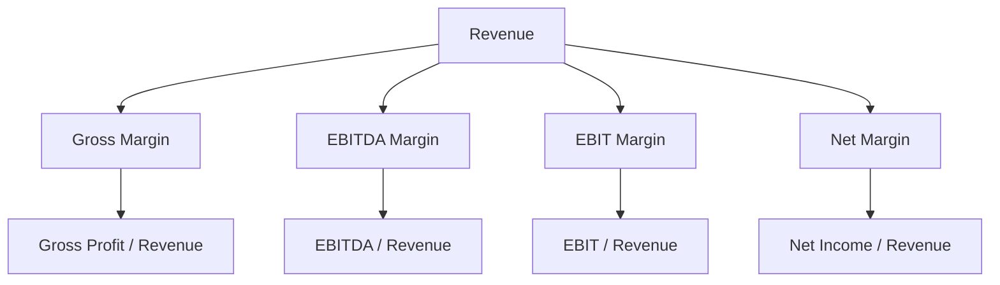
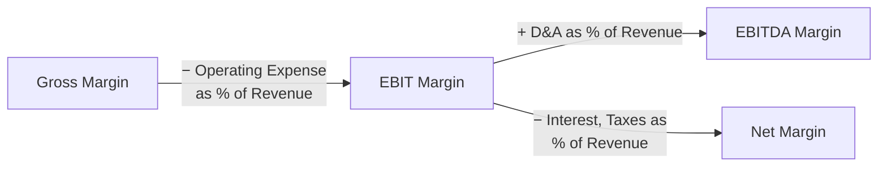

## Margin and Profitability Ratio Analysis

### Overview

Margin and profitability ratios translate absolute dollar figures from the income statement into standardized percentages, enabling comparison across time periods, company sizes, and peer groups regardless of scale. This analysis forms the analytical bridge between historical financial statement review and forward-looking DCF forecast assumptions — margin trends observed historically directly inform the margin trajectory projected in the explicit forecast period and embedded in Terminal Value.

### Core Margin Ratios

| Margin | Formula | What It Measures |
| --- | --- | --- |
| **Gross Margin** | Gross Profit / Revenue | Pricing power and direct cost efficiency, before operating overhead |
| **EBITDA Margin** | EBITDA / Revenue | Operating cash-generative efficiency before financing, tax, and capital structure effects |
| **EBIT Margin (Operating Margin)** | EBIT / Revenue | Full operating profitability including depreciation and amortization |
| **Net Margin** | Net Income / Revenue | Bottom-line profitability after all financing costs and taxes |

### Gross Margin Analysis

$$\text{Gross Margin} = \frac{\text{Revenue} - COGS}{\text{Revenue}}$$

**Key Points**

- Gross margin trends reveal pricing power, input cost sensitivity, and product/service mix shifts — a company with stable or expanding gross margin over time typically demonstrates pricing power or favorable scale economics in direct costs.
- Gross margin comparisons across companies require careful attention to what each company classifies within COGS versus operating expenses, since classification conventions can vary meaningfully by company and industry, distorting apparent comparability. [Inference: the degree of classification variation and its materiality depends on the specific companies and industry being compared.]
- Declining gross margin alongside rising revenue can indicate the company is sacrificing pricing/profitability to sustain top-line growth — a pattern worth flagging when assessing the sustainability of historical growth rates for DCF forecasting purposes.

### EBITDA Margin Analysis

$$\text{EBITDA Margin} = \frac{EBITDA}{\text{Revenue}}$$

**Key Points**

- EBITDA margin is the most widely used profitability benchmark in comparable company analysis, since it is capital-structure and tax-jurisdiction neutral, making it more directly comparable across companies with different financing and depreciation policies.
- As discussed in EBITDA normalization, this ratio should be calculated using normalized (adjusted) EBITDA rather than raw reported figures, to avoid distortion from one-time items.
- EBITDA margin trends are a primary input to Terminal Value assumptions — analysts typically assess whether a company's margin trajectory suggests continued expansion (supporting a higher terminal margin assumption), stabilization at current levels, or reversion toward an industry-average "steady state" margin as growth matures and competitive dynamics normalize.

### Operating Margin (EBIT Margin) Analysis

$$\text{EBIT Margin} = \frac{EBIT}{\text{Revenue}}$$

EBIT margin captures full operating profitability, including the effect of a company's D&A/capital intensity — making it more useful than EBITDA margin when comparing companies with meaningfully different capex requirements or asset bases, since it doesn't ignore the ongoing cost of maintaining productive capacity.

### Net Margin Analysis

$$\text{Net Margin} = \frac{\text{Net Income}}{\text{Revenue}}$$

**Key Points**

- Net margin incorporates the effects of capital structure (interest expense) and tax jurisdiction/rate, making it the least capital-structure-neutral of the standard margins and therefore less directly useful for EV-based multiple comparisons, but directly relevant for P/E-based equity valuation and dividend/payout capacity analysis.
- Net margin can be distorted by non-operating items below the EBIT line (interest income/expense, one-time tax adjustments, discontinued operations) that have nothing to do with core operating performance — normalization considerations apply here as much as at the EBITDA level.

### The Margin Bridge: Connecting Gross to Net

Decomposing the margin waterfall (gross → EBITDA → EBIT → net) by identifying which specific cost layer is driving a change in overall profitability is often more analytically useful than examining net margin in isolation, since it pinpoints whether a profitability change originates from direct costs, operating overhead, capital intensity, or financing/tax effects.

### Margin Trend Analysis: Time-Series Perspective

**Key Points**

- Multi-year margin trend analysis (typically 3-5 years minimum) is more valuable than a single-period snapshot, since it reveals whether margin levels are structurally stable, expanding due to genuine operating leverage/scale benefits, or deteriorating due to competitive pressure, rising input costs, or business mix shifts.
- **Operating leverage** — the degree to which margin expands as revenue grows, due to fixed costs being spread over a larger revenue base — is a key structural driver worth explicitly identifying, since it has direct implications for how margins should be projected at different growth rates in a DCF forecast.
- Seasonality can distort quarter-over-quarter margin comparisons; trailing-twelve-month (TTM) analysis or same-quarter-prior-year comparisons are generally more reliable than sequential-quarter comparisons for businesses with material seasonal patterns.

### Cross-Sectional (Peer Comparison) Margin Analysis

**Key Points**

- Comparing a subject company's margins against a peer set validates whether historical margins — and, critically, projected forecast margins — are reasonable relative to what similar businesses actually achieve, providing an important sanity check against overly optimistic DCF assumptions.
- Margin differentials versus peers should prompt investigation into their source: superior margins may reflect a genuine competitive advantage (brand, scale, proprietary technology, cost structure) that could persist, or may reflect a temporary or unsustainable factor (favorable input cost timing, a one-time customer contract) that shouldn't be extrapolated into perpetuity.
- When a company's margins are meaningfully above peer averages, the DCF Terminal Value calculation should consider whether such margin superiority is durable and defensible long-term, or whether some degree of margin reversion toward peer/industry norms is a more realistic long-run assumption. [Inference: the appropriate degree of margin fade or persistence is a matter of qualitative business judgment about competitive moat durability, not a formulaic calculation.]

### Worked Example: Margin Waterfall Analysis

| Metric | Year 1 | Year 2 | Year 3 | Trend |
| --- | --- | --- | --- | --- |
| Revenue ($M) | 500 | 560 | 630 | +12% CAGR |
| Gross Margin | 45.0% | 46.2% | 47.5% | Expanding |
| EBITDA Margin | 22.0% | 23.5% | 25.0% | Expanding |
| EBIT Margin | 17.0% | 18.2% | 19.5% | Expanding |
| Net Margin | 10.5% | 11.8% | 13.0% | Expanding |

This pattern — consistent, broad-based margin expansion across every level of the income statement alongside healthy revenue growth — suggests genuine operating leverage and/or improving cost efficiency, supporting a reasonable case for continued (though likely moderating) margin expansion in the near-term DCF forecast, tempered by an assumption of eventual stabilization as the business matures.

### DuPont Decomposition and Return-Based Extensions

Margin analysis connects directly to return-based metrics through the DuPont framework, which decomposes Return on Equity into margin, efficiency, and leverage components:

$$ROE = \text{Net Margin} \times \text{Asset Turnover} \times \text{Financial Leverage}$$

This decomposition helps identify whether a company's overall profitability (ROE) is being driven primarily by margin strength, asset efficiency, or financial leverage — each of which carries different implications and risk profiles for a going-forward valuation.

### Common Pitfalls

- Comparing margins across companies without adjusting for differing accounting classifications (what's included in COGS vs. opex) or differing normalization conventions for one-time items and SBC.
- Extrapolating a short-term margin expansion trend (1-2 years) into a long-term Terminal Value assumption without validating its structural sustainability against peer benchmarks and competitive dynamics.
- Using sequential-quarter margin comparisons for a seasonal business without adjusting for or acknowledging the seasonal pattern, leading to spurious trend conclusions.
- Ignoring the margin waterfall decomposition and analyzing net margin changes in isolation, missing which specific cost layer is actually driving the profitability trend.
- Assuming margin superiority versus peers is permanent and durable without investigating whether it stems from a genuine, defensible competitive advantage or a temporary/non-recurring factor.

**Related Topics**

- Operating Leverage and Its Impact on Margin Forecasting
- DuPont Decomposition: ROE Drivers and Analysis
- EBITDA Reconciliation and Normalization Methodology
- Terminal Value Margin Assumptions and Long-Run Fade Analysis
- Comparable Company Analysis: Peer Benchmarking Techniques
- Revenue Recognition and Its Valuation Implications
- Cost Structure Analysis: Fixed vs. Variable Cost Decomposition