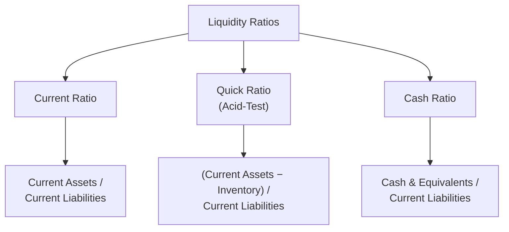
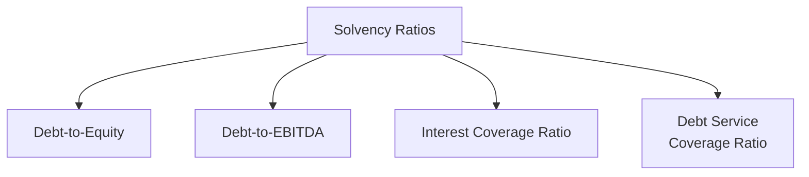

## Liquidity and Solvency Ratio Analysis

<syllabot_broad_topic/>

### Overview

Liquidity and solvency ratios assess a company's ability to meet its short-term obligations (liquidity) and its long-term debt obligations and overall financial stability (solvency). While margin analysis addresses profitability, these ratios address financial risk — a dimension directly relevant to valuation through its impact on discount rate selection, going-concern assessment, and the credibility of long-term cash flow projections underlying a DCF.

### Liquidity Ratios

Liquidity ratios measure a company's capacity to meet short-term (typically within one year) obligations using its most readily available assets.

**Current Ratio:**

$$\text{Current Ratio} = \frac{\text{Current Assets}}{\text{Current Liabilities}}$$

**Quick Ratio (Acid-Test Ratio):**

$$\text{Quick Ratio} = \frac{\text{Current Assets} - \text{Inventory}}{\text{Current Liabilities}}$$

**Cash Ratio:**

$$\text{Cash Ratio} = \frac{\text{Cash and Cash Equivalents}}{\text{Current Liabilities}}$$

**Key Points**

- The Quick Ratio excludes inventory from current assets because inventory is generally the least liquid current asset and may not convert to cash quickly or at full book value in a stress scenario, making the Quick Ratio a more conservative liquidity measure than the Current Ratio.
- A ratio below 1.0x for any of these measures indicates current liabilities exceed the corresponding liquid asset base, which is not automatically a crisis signal (many well-run businesses, particularly those with fast inventory turnover or strong supplier terms, operate comfortably with a Current Ratio near or below 1.0x) but does warrant further investigation into working capital management and near-term liquidity access. [Inference: the appropriate benchmark ratio level varies substantially by industry and business model, and there is no universal threshold that applies across all sectors.]
- Declining liquidity ratios over successive periods, particularly alongside deteriorating cash conversion (from Quality of Earnings analysis), can signal building financial stress that may warrant a higher discount rate or more conservative near-term cash flow assumptions in a DCF.

### Solvency (Leverage) Ratios

Solvency ratios assess a company's long-term debt burden and capacity to service that debt from ongoing operations — directly relevant to Cost of Debt estimation and overall capital structure risk assessment feeding into WACC.

**Debt-to-Equity Ratio:**

$$\text{Debt-to-Equity} = \frac{\text{Total Debt}}{\text{Total Shareholders' Equity}}$$

**Debt-to-EBITDA (Leverage Ratio):**

$$\text{Debt-to-EBITDA} = \frac{\text{Total Debt}}{EBITDA}$$

**Interest Coverage Ratio:**

$$\text{Interest Coverage} = \frac{EBIT}{\text{Interest Expense}}$$

**Debt Service Coverage Ratio (DSCR):**

$$DSCR = \frac{\text{Cash Flow Available for Debt Service}}{\text{Total Debt Service (Principal + Interest)}}$$

**Key Points**

- **Debt-to-EBITDA** is the most widely used leverage benchmark in credit analysis and lender covenants, since it directly relates the debt burden to the operating cash generation capacity available to service it, using a capital-structure-neutral earnings measure.
- **Interest Coverage Ratio** measures the cushion between operating earnings and required interest payments — a ratio below approximately 1.5x–2.0x is commonly viewed as indicating elevated financial risk, though the appropriate threshold varies meaningfully by industry stability and earnings volatility. [Inference: specific threshold levels considered "safe" vary by industry, credit rating methodology, and macroeconomic conditions, and should not be treated as fixed universal cutoffs.]
- Rising leverage ratios over time, without a corresponding improvement in coverage ratios, can signal deteriorating creditworthiness — directly relevant when estimating a company-specific Cost of Debt or assessing whether a proposed capital structure in a leveraged transaction is sustainable.

### The Solvency-Valuation Connection

**Key Points**

- Leverage and solvency metrics feed directly into the **capital structure weights** ($D/V$ and $E/V$) used in WACC calculation — both the current, observed capital structure and any target/optimal capital structure assumption used for a normalized WACC.
- Elevated leverage, evidenced by weak coverage ratios, typically translates into a higher Cost of Debt (wider credit spread) and can also increase the Cost of Equity via a higher levered beta, since equity holders bear amplified risk when a larger proportion of the capital structure consists of fixed, senior-priority debt claims.
- In distressed or highly leveraged situations, solvency analysis may prompt consideration of whether a going-concern DCF is even the appropriate valuation framework, or whether a liquidation value / distressed valuation approach better reflects the company's actual risk profile and likely outcome.

### Altman Z-Score and Composite Solvency Measures

Some practitioners use composite bankruptcy-risk scoring models that combine multiple liquidity, solvency, and profitability ratios into a single predictive score, most notably the Altman Z-Score for manufacturing/industrial companies (with variant formulations for private companies and non-manufacturers).

**Key Points**

- Composite scores like the Z-Score are generally used as a supplementary screening tool to flag elevated distress risk warranting further investigation, rather than as a standalone determinant of valuation approach or discount rate. [Unverified: the predictive accuracy of any specific composite scoring model varies by industry, time period, and company size, and practitioners should treat such scores as one input among several rather than a definitive diagnosis.]

### Working Capital Efficiency and Its Liquidity Connection

Liquidity ratios connect directly to the working capital efficiency metrics (DSO, DPO, DIO) discussed in Quality of Earnings analysis — a company can show an adequate Current Ratio on paper while masking underlying liquidity stress if receivables are aging significantly or inventory is building due to slowing sales, reinforcing the importance of examining the components of current assets and liabilities, not just the aggregate ratio.

### Worked Example: Liquidity and Solvency Snapshot

| Metric | Value | Interpretation |
| --- | --- | --- |
| Current Ratio | 1.8x | Current assets comfortably exceed current liabilities |
| Quick Ratio | 1.1x | Still adequate excluding inventory |
| Debt-to-EBITDA | 2.5x | Moderate leverage, typical for many stable industries |
| Interest Coverage | 6.2x | Strong cushion; earnings comfortably cover interest obligations |
| DSCR | 1.4x | Positive coverage margin over total debt service |

Taken together, this profile suggests a financially stable company with manageable leverage — supporting the use of a standard going-concern DCF with a WACC reflecting current capital structure, rather than requiring elevated risk premia or a distressed valuation framework.

### Common Pitfalls

- Applying a single "rule of thumb" liquidity or leverage benchmark (e.g., "Current Ratio should be above 2.0x") uniformly across industries without recognizing that normal ranges vary substantially by business model and sector.
- Focusing only on point-in-time ratio snapshots rather than multi-period trends, which can miss a gradual deterioration (or improvement) in financial health that a single period doesn't reveal.
- Ignoring the composition of current assets/liabilities behind an aggregate ratio — a healthy-looking Current Ratio can mask deteriorating receivables quality or slow-moving, potentially obsolete inventory.
- Failing to connect solvency findings back to WACC construction — leverage and coverage analysis should directly inform capital structure weights and Cost of Debt assumptions, not remain a standalone diagnostic disconnected from the valuation model.
- Treating a low liquidity or coverage ratio as an automatic red flag without industry context, when certain business models (e.g., fast-inventory-turnover retail, subscription businesses with negative working capital) can operate healthily at ratio levels that would be concerning in other sectors.

**Related Topics**

- Working Capital Analysis: DSO, DPO, and DIO Trends
- Weighted Average Cost of Capital (WACC) Construction
- Cost of Debt Estimation and Credit Spread Analysis
- Capital Structure Weights and Target Leverage Assumptions
- Distressed Company Valuation and Liquidation Value Approaches
- Quality of Earnings Analysis
- Covenant Analysis and Debt Capacity Assessment in Leveraged Transactions