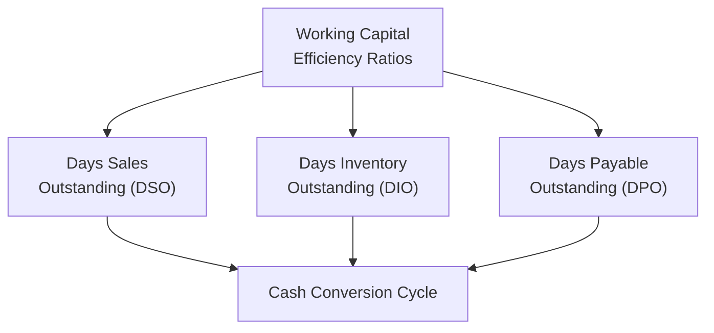
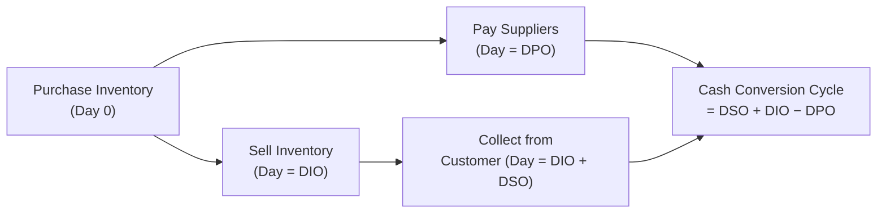
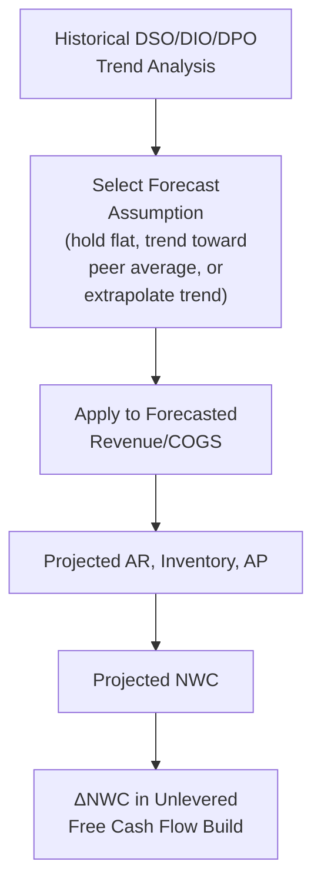

## Efficiency and Working Capital Ratio Analysis

<syllabot_broad_topic/>

### Overview

Efficiency ratios measure how effectively a company converts its assets and working capital into revenue and cash flow. For valuation purposes, these ratios are not merely descriptive metrics — they are the direct analytical basis for projecting the working capital assumptions (DSO, DPO, DIO) embedded in a DCF's free cash flow build, and they serve as a critical Quality of Earnings diagnostic for identifying deteriorating operational performance that may not yet be visible in headline revenue or margin figures.

### Core Working Capital Efficiency Ratios

**Days Sales Outstanding (DSO):**

$$DSO = \frac{\text{Accounts Receivable}}{\text{Revenue}} \times 365$$

Measures the average number of days it takes to collect payment after a sale is made.

**Days Inventory Outstanding (DIO):**

$$DIO = \frac{\text{Inventory}}{COGS} \times 365$$

Measures the average number of days inventory sits before being sold.

**Days Payable Outstanding (DPO):**

$$DPO = \frac{\text{Accounts Payable}}{COGS} \times 365$$

Measures the average number of days a company takes to pay its own suppliers.

### The Cash Conversion Cycle (CCC)

The Cash Conversion Cycle synthesizes these three metrics into a single measure of how long cash is tied up in the operating cycle, from paying for inputs to collecting cash from customers.

$$CCC = DSO + DIO - DPO$$

**Key Points**

- A **shorter (or negative) CCC** indicates the company collects cash from customers faster than it must pay its own suppliers, effectively financing operations with supplier credit rather than tying up its own capital — a structurally favorable working capital position common in certain retail and subscription business models.
- A **longer CCC** indicates capital is tied up for an extended period in the operating cycle, requiring more working capital investment to support a given level of revenue — directly relevant to the $\Delta NWC$ term in the DCF free cash flow build.
- Trends in CCC over time reveal whether a company's working capital efficiency is improving (shortening cycle, less capital tied up per dollar of revenue) or deteriorating (lengthening cycle, more capital required), which should directly inform forward-looking working capital assumptions in the forecast.

### Asset Turnover Ratios

Beyond working capital-specific metrics, broader asset efficiency ratios assess how effectively total or fixed assets generate revenue:

**Total Asset Turnover:**

$$\text{Asset Turnover} = \frac{\text{Revenue}}{\text{Total Assets}}$$

**Fixed Asset Turnover:**

$$\text{Fixed Asset Turnover} = \frac{\text{Revenue}}{\text{Net PP\&E}}$$

**Key Points**

- Asset Turnover is a core component of the DuPont decomposition of ROE, and separately provides useful context on capital intensity when interpreting EV/Revenue or EV/EBITDA multiples across companies with different asset bases.
- A declining Fixed Asset Turnover ratio over time (revenue growing slower than the fixed asset base) can signal overinvestment in capacity relative to demand, or aging/underutilized assets — both relevant considerations when assessing whether historical capex levels are a reasonable proxy for future maintenance capex requirements in Terminal Value.

### Using Efficiency Ratios to Build DCF Working Capital Assumptions

This is the most direct and consequential application of efficiency ratio analysis in valuation practice. Rather than projecting AR, Inventory, and AP as independent absolute dollar figures, practitioners typically project them as a function of forecasted revenue/COGS using historical DSO/DIO/DPO trends:

$$\text{Projected AR} = \frac{\text{Forecasted DSO}}{365} \times \text{Forecasted Revenue}$$

$$\text{Projected Inventory} = \frac{\text{Forecasted DIO}}{365} \times \text{Forecasted COGS}$$

$$\text{Projected AP} = \frac{\text{Forecasted DPO}}{365} \times \text{Forecasted COGS}$$

**Key Points**

- The most common forecasting convention is to hold historical average DSO/DIO/DPO levels constant throughout the explicit forecast period, absent a specific identified reason (business model shift, disclosed management initiative) to assume meaningful improvement or deterioration.
- Where a company's efficiency metrics diverge meaningfully from peer benchmarks, analysts should consider whether convergence toward peer-average efficiency over the forecast period is a reasonable assumption, rather than assuming either permanent outperformance or permanent underperformance without justification. [Inference: the appropriate pace and degree of any assumed convergence is a matter of analytical judgment specific to the company and industry context, not a formulaic calculation.]

### Efficiency Ratios as a Quality of Earnings Signal

**Key Points**

- Deteriorating efficiency ratios (rising DSO, rising DIO, artificially extended DPO) are among the most reliable early warning indicators examined in Quality of Earnings analysis, often surfacing operational stress before it becomes visible in headline revenue or margin trends.
- A rising DSO alongside flat or growing revenue can indicate loosening credit terms to sustain sales volume, customer collection difficulties, or — in more concerning cases — aggressive revenue recognition ahead of genuine cash collection.
- Extending DPO can provide a genuine, sustainable cash flow benefit if achieved through improved supplier negotiation, but an artificially and unsustainably stretched DPO (delaying payments beyond normal terms to manage near-term cash) represents a one-time cash flow benefit that should not be extrapolated into perpetual forecast assumptions, since it cannot continue indefinitely without damaging supplier relationships.

### Worked Example: Efficiency Ratio Trend and CCC

| Metric | Year 1 | Year 2 | Year 3 | Trend |
| --- | --- | --- | --- | --- |
| DSO (days) | 42 | 47 | 53 | Rising (concerning) |
| DIO (days) | 60 | 58 | 55 | Improving |
| DPO (days) | 35 | 35 | 34 | Stable |
| **Cash Conversion Cycle** | **67** | **70** | **74** | **Lengthening** |

Despite improving inventory management (declining DIO), the rising DSO is driving an overall lengthening Cash Conversion Cycle — meaning the company requires progressively more working capital investment to support each dollar of revenue. This trend warrants investigation into the cause of slowing collections before extrapolating recent revenue growth rates forward without a corresponding working capital cash flow drag in the DCF.

### Industry Variation in Efficiency Benchmarks

**Key Points**

- Normal DSO, DIO, and DPO levels vary enormously by industry and business model — a software/subscription business may have near-zero inventory and low DSO (if billing is largely prepaid), while a heavy manufacturing or wholesale distribution business may carry substantial inventory and longer customer payment terms as standard industry practice. [Inference: specific "normal" ranges are industry- and business-model-dependent and should be benchmarked against genuinely comparable peers rather than generic cross-industry standards.]
- Efficiency ratio comparisons are most meaningful within a tightly defined peer group sharing similar business models, distribution channels, and customer bases, rather than across broad industry classifications that may span meaningfully different working capital dynamics.

### Common Pitfalls

- Projecting working capital as a flat percentage of revenue without decomposing into DSO/DIO/DPO components, which can obscure offsetting trends (e.g., improving inventory management masking deteriorating collections) visible in the worked example above.
- Extrapolating an artificially extended DPO (achieved through delayed supplier payments) as a sustainable, permanent working capital benefit in the DCF forecast.
- Comparing efficiency ratios across companies with different revenue recognition policies or fiscal year-end timing without adjusting for seasonality effects on point-in-time balance sheet figures.
- Ignoring efficiency ratio deterioration as merely a balance sheet technicality, rather than recognizing it as a potential leading indicator of broader earnings quality or operational issues warranting deeper investigation.
- Applying industry-wide "typical" DSO/DIO/DPO benchmarks without adjusting for the specific business model nuances (payment terms, channel structure, customer mix) of the subject company and its true comparable peer set.

**Related Topics**

- Working Capital Schedule Construction in DCF Modeling
- Quality of Earnings Analysis
- Net Working Capital and the Unlevered Free Cash Flow Build
- DuPont Decomposition: ROE Drivers and Analysis
- Liquidity and Solvency Ratio Analysis
- Peer Benchmarking and Comparable Company Selection Criteria
- Maintenance vs. Growth Capex in Terminal Value Assumptions