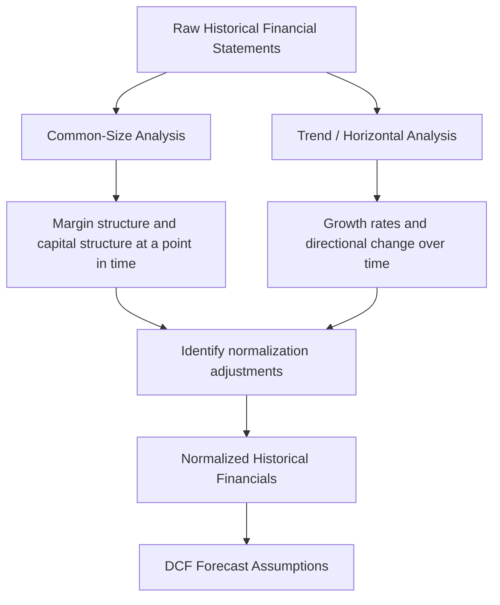

## Historical Trend and Common-Size Analysis

### Overview and Purpose

Historical trend and common-size analysis are the two foundational techniques for interpreting a company's financial statements before any forecasting or valuation work begins. Both methods transform raw financial statement line items into comparable, standardized formats that reveal patterns, inflection points, and structural characteristics that absolute dollar figures obscure.

**Trend analysis** (also called horizontal analysis) expresses each line item relative to a base-period value, showing growth or decline over time. **Common-size analysis** (also called vertical analysis) expresses each line item as a percentage of a base figure within the same period — typically revenue for the income statement and total assets for the balance sheet.

Together, these techniques form the analytical bridge between raw historical data and the normalized financial statements used to build a DCF model. Analysts use them to identify margin trends, capital structure shifts, working capital behavior, and anomalies that require adjustment before projecting future performance.

### Trend Analysis (Horizontal Analysis)

#### Mechanics

Trend analysis calculates period-over-period or base-year-over-time changes for each line item. Two common presentations exist:

1. **Year-over-year (YoY) percentage change**: compares each period to the immediately preceding period
2. **Indexed trend (base-year = 100)**: compares every period to a fixed base year, useful for viewing multi-year trajectories at a glance

The YoY growth rate for any line item is:

$$g_t = \frac{X_t - X_{t-1}}{X_{t-1}}$$

where $X_t$ is the line item value in period $t$.

The indexed value relative to a base year $t_0$ is:

$$I_t = \frac{X_t}{X_{t_0}} \times 100$$

#### Worked Example

Consider a company's revenue over five years (in $ millions):

| Year | Revenue | YoY Growth | Indexed (Year 1 = 100) |
| --- | --- | --- | --- |
| Year 1 | $500 | — | 100.0 |
| Year 2 | $540 | 8.0% | 108.0 |
| Year 3 | $610 | 13.0% | 122.0 |
| Year 4 | $598 | -2.0% | 119.6 |
| Year 5 | $670 | 12.0% | 134.0 |

The YoY column highlights the Year 4 contraction that the indexed column also shows as a dip in the trajectory. A CAGR calculation smooths this into a single growth rate:

$$CAGR = \left(\frac{X_n}{X_0}\right)^{\frac{1}{n}} - 1 = \left(\frac{670}{500}\right)^{\frac{1}{4}} - 1 \approx 7.6\%$$

**Key Points**

- YoY growth isolates single-period shocks (Year 4's decline) that a CAGR would mask
- CAGR is appropriate for long-run trend assumptions in a DCF terminal growth build-up, but should never be used alone to characterize volatile historical performance
- Indexed trends are especially useful for comparing growth trajectories of two companies of different absolute size (e.g., benchmarking a target against a peer)

#### What Trend Analysis Reveals for DCF Purposes

- **Revenue growth deceleration or acceleration**, informing the explicit forecast period growth path
- **Operating leverage**: if operating income grows faster than revenue, cost structure has fixed-cost characteristics; if slower, variable-cost or margin-pressure dynamics dominate
- **Non-recurring items**: a spike in a specific expense line (e.g., a one-time litigation charge) is far easier to spot as a trend outlier than by reading absolute figures alone
- **Working capital drift**: trending accounts receivable, inventory, and payables against revenue growth flags deteriorating collections or building inventory risk before it appears in cash flow

### Common-Size Analysis (Vertical Analysis)

#### Mechanics

Common-size analysis restates each line item as a percentage of a chosen base metric within the same period:

- **Income statement**: every line as a percentage of total revenue
- **Balance sheet**: every line as a percentage of total assets (with liabilities and equity also as a percentage of total assets, since total assets = total liabilities + equity)
- **Cash flow statement**: less standardized, but often expressed as a percentage of revenue or of net income

$$CS_i = \frac{X_i}{\text{Base Metric}}$$

#### Worked Example: Common-Size Income Statement

| Line Item | Year 1 ($M) | % of Revenue | Year 5 ($M) | % of Revenue |
| --- | --- | --- | --- | --- |
| Revenue | 500 | 100.0% | 670 | 100.0% |
| COGS | 300 | 60.0% | 388 | 57.9% |
| Gross Profit | 200 | 40.0% | 282 | 42.1% |
| SG&A | 120 | 24.0% | 174 | 26.0% |
| EBIT | 80 | 16.0% | 108 | 16.1% |
| Interest Expense | 10 | 2.0% | 15 | 2.2% |
| Pretax Income | 70 | 14.0% | 93 | 13.9% |
| Taxes (25%) | 17.5 | 3.5% | 23.3 | 3.5% |
| Net Income | 52.5 | 10.5% | 69.7 | 10.4% |

This restatement shows that despite a 34% increase in absolute revenue, gross margin improved (60.0% → 57.9% COGS ratio) while SG&A leverage deteriorated (24.0% → 26.0%), largely offsetting each other and leaving EBIT margin roughly flat. **This is a finding that absolute figures alone would not surface as cleanly.**

#### Worked Example: Common-Size Balance Sheet

| Line Item | % of Total Assets (Year 1) | % of Total Assets (Year 5) |
| --- | --- | --- |
| Cash & Equivalents | 8% | 14% |
| Accounts Receivable | 15% | 18% |
| Inventory | 20% | 17% |
| PP&E, net | 45% | 40% |
| Other Assets | 12% | 11% |
| **Total Assets** | **100%** | **100%** |
| Accounts Payable | 12% | 13% |
| Short-Term Debt | 8% | 5% |
| Long-Term Debt | 30% | 22% |
| Total Liabilities | 50% | 40% |
| Total Equity | 50% | 60% |

This view shows a shift toward a less leveraged capital structure (total liabilities falling from 50% to 40% of assets) and improving liquidity (cash rising from 8% to 14%), both of which have direct implications for the discount rate (WACC capital structure weights) and terminal-year normalization assumptions.

**Key Points**

- Common-size analysis on the balance sheet is the standard method for identifying the target/normalized capital structure used in WACC calculations
- Persistent common-size ratios (e.g., stable inventory as % of revenue) support using ratio-driven forecasting methods; volatile ratios suggest a need for driver-based buildup instead

### Combining Trend and Common-Size Analysis

The two techniques are complementary rather than substitutes. A robust historical financials review layers them:

For example, a common-size income statement might show SG&A stable at ~15% of revenue for four years, then jumping to 22% in the most recent year. Trend analysis on the SG&A dollar figure would show the same jump as an unusual YoY spike. Cross-referencing both confirms this is likely a one-time event (e.g., restructuring charge, acquisition integration cost) warranting a normalization adjustment before it is used to set the forecast SG&A ratio.

### Practical Analytical Workflow

1. **Build the common-size statements** for at least 3–5 historical years (income statement, balance sheet, and where useful, cash flow statement)
2. **Build the trend statements** in parallel, both YoY and indexed
3. **Flag outliers**: any ratio or growth rate that deviates more than ~2–3 percentage points (or a chosen materiality threshold) from the historical average warrants investigation
4. **Cross-reference with disclosures**: MD&A, footnotes, and earnings call transcripts to determine whether an outlier is one-time, cyclical, or a genuine structural shift
5. **Adjust and normalize**: strip out non-recurring items identified through this process (see also normalization adjustments for one-time items, discontinued operations, and non-operating income)
6. **Anchor forecast assumptions**: use the stabilized common-size ratios and trend growth rates as the starting point for explicit-period projections

**Example**

A retail company shows the following common-size gross margin trend: 38%, 39%, 37%, 41%, 33%. The Year 5 drop coincides with a disclosed inventory write-down in the 10-K footnotes. An analyst would:

- Add back the write-down to normalize Year 5 COGS
- Recompute the normalized common-size gross margin (likely ~38–39%, consistent with the historical band)
- Use the normalized ~38% margin, not the reported 33%, as the base case starting point for the forecast

### Limitations and Considerations

- **Common-size analysis can mask absolute scale changes.** A stable 10% net margin over five years alongside declining absolute revenue is a materially different story than the same margin with growing revenue; common-size ratios alone don't convey this — always view alongside trend analysis
- **Denominator changes distort ratios.** A common-size balance sheet built on total assets will show apparent shifts in every line if a large one-time asset write-up or write-down changes the denominator itself, even when other line items didn't change materially
- **Accounting policy changes** (e.g., adoption of a new lease accounting standard, revenue recognition standard) can create trend breaks that are purely definitional rather than economic, and require restatement or footnote-based reconciliation before being treated as a real trend
- **Peer comparisons using common-size statements** are most meaningful when companies share similar accounting policies, fiscal year-ends, and business models; cross-industry common-size comparisons are of limited use given structurally different cost bases

[Inference] Materiality thresholds (e.g., "2–3 percentage points") for flagging outliers vary by analyst, industry, and firm policy; the figures above represent a common convention rather than a universal standard.

### Illustrative Diagram: Common-Size Statement Construction

<svg xmlns="http://www.w3.org/2000/svg" viewBox="0 0 720 260" font-family="Arial, sans-serif">
<text x="360" y="24" text-anchor="middle" font-size="15" font-weight="bold" fill="#1a1a1a">Common-Size Income Statement Construction (svg_diagram)</text>
<rect x="30" y="50" width="180" height="160" fill="#e8f0fe" stroke="#4285f4" stroke-width="1.5" />
<text x="120" y="70" text-anchor="middle" font-size="12" font-weight="bold" fill="#1a1a1a">Raw Statement ($)</text>
<text x="45" y="95" font-size="11" fill="#333">Revenue: 670</text>
<text x="45" y="115" font-size="11" fill="#333">COGS: 388</text>
<text x="45" y="135" font-size="11" fill="#333">Gross Profit: 282</text>
<text x="45" y="155" font-size="11" fill="#333">SG&amp;A: 174</text>
<text x="45" y="175" font-size="11" fill="#333">EBIT: 108</text>
<line x1="220" y1="130" x2="270" y2="130" stroke="#666" stroke-width="2" marker-end="url(#arrow)" />
<text x="245" y="120" text-anchor="middle" font-size="10" fill="#666">÷ Revenue</text>
<rect x="280" y="50" width="200" height="160" fill="#fef7e0" stroke="#f9a825" stroke-width="1.5" />
<text x="380" y="70" text-anchor="middle" font-size="12" font-weight="bold" fill="#1a1a1a">Common-Size (%)</text>
<text x="295" y="95" font-size="11" fill="#333">Revenue: 100.0%</text>
<text x="295" y="115" font-size="11" fill="#333">COGS: 57.9%</text>
<text x="295" y="135" font-size="11" fill="#333">Gross Profit: 42.1%</text>
<text x="295" y="155" font-size="11" fill="#333">SG&amp;A: 26.0%</text>
<text x="295" y="175" font-size="11" fill="#333">EBIT: 16.1%</text>
<line x1="490" y1="130" x2="540" y2="130" stroke="#666" stroke-width="2" marker-end="url(#arrow)" />
<text x="515" y="120" text-anchor="middle" font-size="10" fill="#666">compare</text>
<rect x="550" y="50" width="150" height="160" fill="#e6f4ea" stroke="#34a853" stroke-width="1.5" />
<text x="625" y="70" text-anchor="middle" font-size="12" font-weight="bold" fill="#1a1a1a">Cross-Period /</text>
<text x="625" y="86" text-anchor="middle" font-size="12" font-weight="bold" fill="#1a1a1a">Cross-Peer</text>
<text x="565" y="110" font-size="11" fill="#333">Margin trend</text>
<text x="565" y="130" font-size="11" fill="#333">Cost structure</text>
<text x="565" y="150" font-size="11" fill="#333">shift</text>
<text x="565" y="170" font-size="11" fill="#333">Peer benchmark</text>
</svg>

**Related Topics**

- Normalization Adjustments for Non-Recurring Items
- Identifying and Adjusting for Non-Operating Income and Expenses
- Ratio-Driven vs. Driver-Based Forecasting Methods
- Working Capital Trend Analysis and Cash Conversion Cycle
- Peer Benchmarking Using Common-Size Statements
- Reconciling Trend Breaks from Accounting Standard Changes (e.g., ASC 842, ASC 606)
- Constructing the Normalized EBITDA Bridge