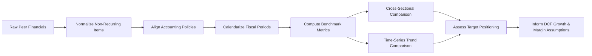

## Peer Benchmarking of Historical Performance

### Overview

Peer benchmarking is the process of comparing a target company's normalized historical financial performance against a set of comparable companies (peers) to contextualize growth, profitability, efficiency, and capital structure metrics. It is a diagnostic step performed after historical normalization and before building projections in a DCF, since peer-relative context informs both the reasonableness of forecast assumptions and the selection of terminal multiples or discount rate inputs.

### Purpose in the DCF Workflow

**Key Points**

- Validates whether the target's historical margins, growth, and returns are structurally consistent with its industry or are anomalies requiring further normalization.
- Provides an empirical basis for long-term margin and growth assumptions used in the explicit forecast and terminal value.
- Surfaces outliers that may indicate mispricing, competitive advantage, or data/accounting distortions.
- Supports triangulation: DCF output is often cross-checked against peer trading multiples (a market-based sanity check).

### Selecting the Peer Set

#### Screening Criteria

1. **Industry/sector classification** — GICS, SIC, or NAICS codes as a starting filter.
2. **Business model similarity** — revenue drivers, customer type (B2B vs. B2C), asset intensity.
3. **Size** — revenue, market capitalization, or enterprise value within a reasonable band (commonly 0.3x–3x the target).
4. **Geography** — similar end markets, given differing growth rates, regulatory regimes, and currency exposure.
5. **Growth stage** — mature vs. high-growth peers behave differently on margin trajectory.
6. **Capital structure comparability** — relevant when comparing levered metrics (e.g., ROE) versus unlevered metrics (e.g., ROIC, EBIT margin).

**Example**

For a mid-cap industrial pump manufacturer, an appropriate peer set might include 6–10 companies in flow control/industrial equipment with revenue between $500M and $5B, excluding highly diversified conglomerates where the segment is not separately disclosed.

#### Common Pitfalls

- [Inference] Overly broad SIC-code-based screens often include peers with materially different business models; manual review is typically required to refine the list.
- Too few peers (fewer than 4–5) reduces statistical reliability; too many dilutes comparability.
- Failing to adjust for differing fiscal year-ends, which can distort period-over-period comparisons.

### Core Benchmarking Metrics

#### Growth Metrics

$$\text{Revenue CAGR} = \left(\frac{\text{Revenue}_{n}}{\text{Revenue}_{0}}\right)^{\frac{1}{n}} - 1$$

- Historical revenue CAGR (3-year, 5-year)
- Organic vs. inorganic growth decomposition (where disclosed)

#### Profitability Metrics

| Metric | Formula | Use |
| --- | --- | --- |
| Gross Margin | Gross Profit / Revenue | Pricing power, input cost structure |
| EBITDA Margin | EBITDA / Revenue | Core operating profitability, capital-structure-neutral |
| EBIT Margin | EBIT / Revenue | Includes D&A burden, useful for capital-intensive comparisons |
| Net Margin | Net Income / Revenue | Bottom-line profitability, affected by capital structure and tax |

#### Efficiency and Returns Metrics

$$\text{ROIC} = \frac{\text{NOPAT}}{\text{Invested Capital}}$$

- Asset turnover: Revenue / Total Assets
- Working capital efficiency: Cash Conversion Cycle (DSO + DIO − DPO)
- Capex intensity: Capex / Revenue

#### Leverage and Coverage Metrics

- Net Debt / EBITDA
- EBITDA / Interest Expense (interest coverage)
- Total Debt / Total Capital

### Data Normalization for Comparability

Before benchmarking, each peer's financials should undergo the same normalization treatment applied to the target company:

1. **Non-recurring item removal** — restructuring charges, impairments, litigation settlements, gains/losses on asset sales.
2. **Accounting policy alignment** — inventory costing (FIFO vs. LIFO), lease treatment (post-ASC 842/IFRS 16 capitalization is now largely standardized, but legacy comparisons may still require adjustment), R&D capitalization vs. expensing.
3. **Segment consistency** — isolating comparable business segments from diversified peers where feasible using disclosed segment data.
4. **Currency and inflation adjustment** — converting to a common currency and, if spanning high-inflation periods, considering real vs. nominal comparisons.
5. **Calendarization** — aligning peers with different fiscal year-ends to a common calendar period via interpolation or weighted-quarter blending.

**Example**

If Peer A reports fiscal year ending March and the target's fiscal year ends December, Peer A's "FY2024" figures should be recalculated as a calendarized trailing-twelve-month (TTM) figure ending December 2024 by blending quarterly data.

### Benchmarking Techniques

#### Cross-Sectional Comparison

Comparing the target and peers at a single point in time (e.g., most recent fiscal year or TTM) across the metric set above, typically displayed as a ranked table with the target highlighted.

#### Time-Series Trend Comparison

Plotting a metric (e.g., EBITDA margin) for the target and each peer over a 3–5 year window to assess:

- Convergence or divergence in profitability
- Cyclicality relative to peers
- Structural shifts (e.g., margin step-changes from M&A or restructuring)

#### Statistical Summary Measures

- **Median** preferred over mean for peer sets, since it is less sensitive to outliers.
- **Interquartile range (IQR)** to express a reasonable band rather than a single point estimate.
- **Percentile ranking** of the target within the peer distribution.

$$\text{Percentile Rank} = \frac{\text{Number of peers below target}}{\text{Total number of peers}} \times 100$$

### Visualizing Relative Positioning

A margin-vs-growth scatter plot is a standard way to visualize peer positioning:

<svg xmlns="http://www.w3.org/2000/svg" viewBox="0 0 500 360" font-family="Arial, sans-serif">
<title>Peer Benchmarking: Growth vs. Margin (svg_diagram)</title>
<rect x="0" y="0" width="500" height="360" fill="#ffffff" />
<line x1="60" y1="300" x2="460" y2="300" stroke="#333" stroke-width="1.5" />
<line x1="60" y1="20" x2="60" y2="300" stroke="#333" stroke-width="1.5" />
<text x="260" y="335" text-anchor="middle" font-size="13" fill="#333">Revenue CAGR (%)</text>
<text x="20" y="160" text-anchor="middle" font-size="13" fill="#333" transform="rotate(-90 20,160)">EBITDA Margin (%)</text>
<circle cx="150" cy="220" r="6" fill="#888" />
<text x="158" y="218" font-size="11" fill="#555">Peer A</text>
<circle cx="220" cy="180" r="6" fill="#888" />
<text x="228" y="178" font-size="11" fill="#555">Peer B</text>
<circle cx="300" cy="150" r="6" fill="#888" />
<text x="308" y="148" font-size="11" fill="#555">Peer C</text>
<circle cx="180" cy="120" r="6" fill="#888" />
<text x="188" y="118" font-size="11" fill="#555">Peer D</text>
<circle cx="360" cy="90" r="6" fill="#888" />
<text x="368" y="88" font-size="11" fill="#555">Peer E</text>
<circle cx="260" cy="140" r="8" fill="#1a5276" />
<text x="270" y="138" font-size="12" font-weight="bold" fill="#1a5276">Target</text>
<line x1="60" y1="160" x2="460" y2="160" stroke="#bbb" stroke-dasharray="4,3" />
<text x="410" y="155" font-size="10" fill="#888">Peer median margin</text>
</svg>

### Interpreting Benchmarking Results for DCF Inputs

#### Margin Convergence Assumption

**Key Points**

- If the target's margin sits materially above or below the peer median with no structural justification, DCF forecasts commonly assume gradual convergence ("margin fade" or "margin ramp") toward the peer median over the explicit forecast period.
- If a durable competitive advantage (patents, network effects, cost structure) explains the gap, a persistent premium/discount to peer margins may be justified — this should be labeled [Inference] when not directly evidenced by disclosed data.

#### Growth Rate Calibration

- Peer growth rates inform whether the target's projected growth is aggressive or conservative relative to the addressable market's demonstrated growth capacity.
- Terminal growth rate assumptions should generally not exceed long-run peer/industry or GDP-linked growth rates without explicit justification.

#### Capital Efficiency Calibration

- ROIC benchmarking relative to peers and the cost of capital (WACC) helps assess whether the company is a value creator (ROIC > WACC) consistent with, above, or below peer norms — informing reinvestment rate and capex assumptions in the forecast.

### Worked Example

**Example**

Target Company EBITDA margin: 18.2% (TTM)

Peer set (5 companies) EBITDA margins: 14.1%, 15.8%, 17.0%, 19.5%, 22.3%

- Peer median: 17.0%
- Peer IQR: 15.8%–19.5%
- Target percentile rank: 60th percentile (above median, within IQR)

Interpretation: The target's profitability is modestly above the peer median but within the normal dispersion of the set, suggesting the current margin level is a reasonable anchor for near-term forecasts without requiring aggressive convergence adjustments. [Inference — assumes no material non-recurring distortion remains after normalization]

### Common Data Sources

- Company 10-Ks/10-Qs, annual reports (primary, most reliable)
- S&P Capital IQ, Bloomberg, FactSet (aggregated, faster but requires verification against filings)
- Industry associations and trade publications for niche sectors

### Limitations and Caveats

- [Unverified] Third-party aggregated financial databases may apply their own normalization conventions that differ from the analyst's methodology; line items should be reconciled to source filings for material peers.
- Peer sets can shift over the forecast horizon (M&A, delisting), so the benchmarking exercise should be revisited periodically rather than treated as static.
- Small peer sets are sensitive to single-company idiosyncrasies; disclosing peer count and composition alongside conclusions supports transparency.

**Next Steps**

- Normalizing Non-Recurring and Non-Operating Items
- Constructing a Comparable Companies (Trading Comps) Analysis
- Deriving WACC Inputs from Peer Betas
- Forecasting Revenue Growth Using Peer-Informed Assumptions
- Margin Convergence Modeling in Explicit Forecast Periods
- Terminal Value Estimation and Peer-Based Exit Multiples