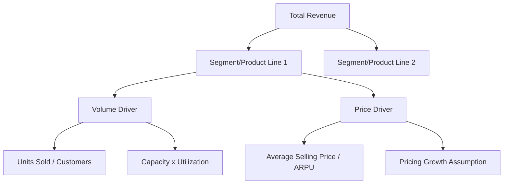

## Top-Down versus Bottom-Up Revenue Forecasting

<syllabot_broad_topic/>

### Overview

Top-down and bottom-up are the two principal methodological approaches to forecasting revenue in a DCF model. Top-down forecasting starts from macro-level or industry-level metrics (total addressable market, GDP growth, industry growth rates) and derives company revenue via assumed market share. Bottom-up forecasting builds revenue from granular operational drivers (units sold, price per unit, customer counts, capacity utilization) aggregated upward. Most rigorous models use both approaches in combination — one as the primary build, the other as a sanity check.

### Top-Down Forecasting

#### Methodology

1. Estimate the total addressable market (TAM) or relevant industry revenue pool.
2. Apply an industry/market growth rate (from macro data, industry reports, or analyst consensus).
3. Estimate the company's current and projected market share.
4. Derive company revenue as:

$$\text{Revenue}_t = \text{TAM}_t \times \text{Market Share}_t$$

**Key Points**

- Market share trajectory should be justified explicitly (share gain, share loss, or stable share) rather than left as a plug.
- Industry growth inputs are commonly sourced from trade associations, government statistics (e.g., census/bureau of economic analysis data), or paid research (Gartner, IDC, Euromonitor).

#### When Top-Down Is Appropriate

- Early-stage or high-growth companies where unit-level operational data is unavailable or unreliable.
- Industries with well-defined, published market-size data (e.g., semiconductors, pharmaceuticals, telecom subscribers).
- Cross-checking a bottom-up build for macro plausibility (i.e., "does the implied market share make sense?").

#### Limitations

- [Inference] Top-down forecasts can understate company-specific execution risk or competitive dynamics since they rely on an assumed, often smoothly extrapolated, share trajectory.
- TAM estimates from third-party sources vary widely in methodology and can be stale or vendor-biased.
- Provides limited insight into which specific operational levers drive the forecast, making it harder to stress-test.

### Bottom-Up Forecasting

#### Methodology

Bottom-up forecasting decomposes revenue into its structural drivers, which vary by business model:

| Business Model | Typical Drivers |
| --- | --- |
| Retail / Consumer | Store count × sales per store; or units sold × average selling price |
| SaaS / Subscription | Beginning customers + new bookings − churn, × ARPU |
| Manufacturing | Production capacity × utilization rate × price per unit |
| Services | Billable headcount × utilization rate × billing rate |
| Financial Services | Loan book × yield; or AUM × fee rate |

**Example (SaaS)**

$$\text{Ending Customers}_t = \text{Beginning Customers}_t + \text{New Bookings}_t - \text{Churned Customers}_t$$

$$\text{Revenue}_t = \text{Average Customers}_t \times \text{ARPU}_t$$

#### Building the Driver Tree

#### When Bottom-Up Is Appropriate

- Mature companies with disclosed operational KPIs (unit volumes, store counts, subscriber counts).
- Businesses where management guidance or historical trends provide reliable driver-level data.
- Situations requiring granular scenario analysis (e.g., "what if churn increases by 200bps?").

#### Limitations

- Requires significantly more granular data, which may not be disclosed for all companies (particularly diversified or private companies).
- Can create false precision — a model with many inputs is not inherently more accurate if individual driver assumptions are weakly supported.
- [Inference] Aggregation errors across many segments/products can compound, particularly when driver assumptions are not independently validated against a top-down check.

### Comparative Framework

| Dimension | Top-Down | Bottom-Up |
| --- | --- | --- |
| Starting point | Macro/industry data | Operational unit economics |
| Data intensity | Lower | Higher |
| Best suited for | Early-stage, data-scarce, macro-driven businesses | Mature, operationally transparent businesses |
| Risk of error | Market share assumption is a black box | Driver assumptions may not aggregate to a plausible macro outcome |
| Granularity for scenario testing | Low | High |
| Typical use in practice | Sanity check / cross-validation | Primary build for detailed forecasts |

### Reconciling the Two Approaches

**Key Points**

- A well-constructed model builds bottom-up as the primary forecast engine, then cross-checks the implied market share and growth rate against top-down industry data.
- Material divergence between the two approaches should trigger a re-examination of assumptions on both sides rather than automatic reliance on one method.
- For multi-segment businesses, applying bottom-up to core, well-understood segments and top-down to smaller or less-transparent segments is a common hybrid practice.

**Example**

A bottom-up build projects the target's revenue growing at 12% CAGR, implying a rise in market share from 8% to 11% over five years within a TAM growing at 6% CAGR. If historical share gains have never exceeded 1 point per year, this trajectory may be flagged as aggressive and warrant either driver-assumption revision or explicit competitive justification (e.g., new product launch, capacity expansion already funded).

### Sensitivity and Scenario Design

Both approaches should support scenario flexing:

- **Top-down**: flex TAM growth rate and market share trajectory independently to isolate which variable drives forecast sensitivity.
- **Bottom-up**: flex individual drivers (price, volume, churn) to identify the highest-elasticity variables, often visualized via a tornado/sensitivity chart in later modeling stages.

$$\frac{\partial \text{Revenue}}{\partial \text{Price}} \quad \text{vs.} \quad \frac{\partial \text{Revenue}}{\partial \text{Volume}}$$

### Practical Implementation Notes

- Document data sources and vintage for every macro or industry input used in a top-down build, since these inputs can become stale quickly.
- For bottom-up models, tie driver assumptions explicitly to historical trend lines (e.g., 3-year average unit growth) established during the historical normalization phase, rather than introducing unsupported step-changes.
- Maintain a single "switchboard" of key assumptions (growth rate, share, price, volume) so both methodologies can be toggled and compared without restructuring the model.

### Common Pitfalls

- Using top-down TAM figures without adjusting for the portion of the market actually addressable by the company's current product/geographic footprint (serviceable addressable market, or SAM).
- Bottom-up models that omit a top-down sanity check, resulting in implausible long-run market share outcomes (e.g., exceeding 50% share in a fragmented industry without justification).
- Blending stale historical growth rates into forward assumptions without adjusting for known structural shifts (new competitors, regulatory change, technology disruption).

**Next Steps**

- Building Segment-Level Revenue Driver Models
- Sensitivity Analysis and Tornado Charts for Revenue Assumptions
- Forecasting Operating Margins and Cost Structure
- Scenario Analysis: Base, Upside, and Downside Cases
- Linking Revenue Forecasts to Working Capital Assumptions