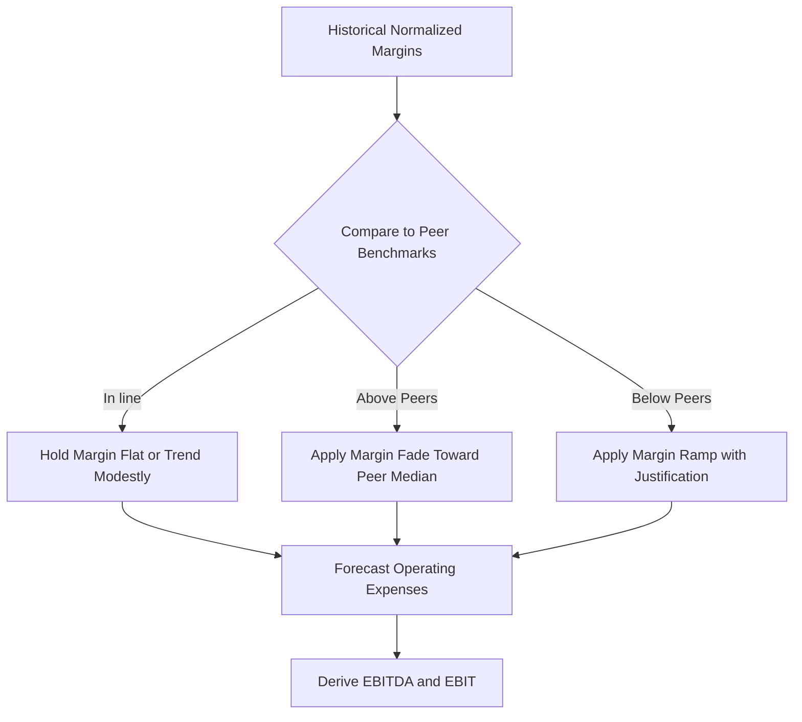

## Operating Expense and Margin Forecasting

### Overview

Operating expense and margin forecasting translates projected revenue into a full projected income statement by modeling the cost structure of the business. This step determines forecasted EBITDA, EBIT, and ultimately unlevered free cash flow in a DCF. The core analytical task is distinguishing fixed versus variable cost behavior, projecting each major expense line with an appropriate driver, and reconciling the resulting margins against historical and peer benchmarks.

### Cost Structure Classification

#### Fixed vs. Variable Costs

**Key Points**

- **Variable costs** scale directly with revenue or volume (e.g., cost of goods sold, sales commissions, shipping).
- **Fixed costs** remain relatively stable regardless of volume within a relevant range (e.g., corporate overhead, base salaries, rent under existing leases).
- **Semi-variable (mixed) costs** contain both components (e.g., utilities with a base charge plus usage-based component; labor with base staffing plus overtime).

$$\text{Total Cost}_t = \text{Fixed Cost} + (\text{Variable Cost per Unit} \times \text{Volume}_t)$$

#### Operating Leverage

Operating leverage describes how fixed costs cause profit to grow faster (or shrink faster) than revenue:

$$\text{Degree of Operating Leverage} = \frac{\% \, \Delta \, \text{EBIT}}{\% \, \Delta \, \text{Revenue}}$$

**Example**

A company with high fixed costs (e.g., a software company with large R&D and low incremental delivery cost) will show EBIT margin expansion at a faster rate than revenue growth as it scales — a dynamic that should be explicitly modeled rather than assuming constant margins.

### Forecasting Approaches by Expense Line

#### Cost of Goods Sold (COGS)

- Typically forecast as a percentage of revenue, informed by historical trend and peer gross margin benchmarking.
- For manufacturers, may be built bottom-up: direct materials + direct labor + manufacturing overhead per unit × volume.

$$\text{COGS}_t = \text{Revenue}_t \times (1 - \text{Gross Margin}_t)$$

#### Selling, General & Administrative (SG&A)

- Often split into its variable component (sales commissions, marketing tied to revenue) and fixed component (corporate salaries, admin overhead), each forecast separately.
- Marketing/advertising spend is sometimes modeled as a percentage of revenue reflecting a target customer acquisition strategy, particularly for growth-stage companies.

#### Research & Development (R&D)

- Frequently forecast as a percentage of revenue based on company strategy and industry norms (e.g., technology and pharmaceutical companies typically maintain R&D as a stable or growing percentage of revenue to sustain competitive position).
- [Inference] Some analysts treat a portion of R&D as quasi-capital investment given its long-term payoff profile, though standard GAAP/IFRS treatment expenses it as incurred.

#### Depreciation & Amortization (D&A)

- Forecast based on the capex schedule and existing asset base rather than as a simple percentage of revenue, since D&A is a function of the fixed asset roll-forward.

$$\text{D\&A}_t = \text{D\&A}_{t-1} + \left(\frac{\text{New Capex}_t}{\text{Useful Life}}\right) - \text{Fully Depreciated Asset Runoff}$$

- This is typically built alongside the PP&E schedule (covered in capital expenditure forecasting) rather than in isolation.

### Margin Forecasting Methodologies

#### Percentage-of-Revenue Method

The simplest approach: hold each expense line as a constant, or gradually trending, percentage of revenue based on historical averages.

**Example**

If SG&A has averaged 22% of revenue over the past three years with a declining trend (24%, 23%, 21%), a forecast might assume continued modest declines toward 19–20% over the explicit forecast period, reflecting operating leverage, capped at a level consistent with peer benchmarks.

#### Driver-Based (Bottom-Up) Method

Building each cost line from underlying operational drivers rather than a revenue ratio:

| Expense Line | Driver-Based Build |
| --- | --- |
| Labor cost | Headcount × average compensation × benefits load |
| Rent/facilities | Square footage × cost per square foot |
| Marketing | Customer acquisition target × cost per acquisition |
| Logistics | Units shipped × cost per shipment |

#### Margin Convergence / Fade Method

Used when the target's current margin is materially above or below peer benchmarks or sustainable long-run levels (informed by the peer benchmarking step):

$$\text{Margin}_t = \text{Margin}_{t-1} + \frac{(\text{Target Margin} - \text{Margin}_{t-1})}{\text{Remaining Fade Years}}$$

### Building the Full Margin Bridge

A margin forecast should reconcile from gross margin down to EBIT margin, with each step's drivers explicit:

1. **Revenue** (from top-down/bottom-up forecast)
2. Less: **COGS** → **Gross Profit / Gross Margin**
3. Less: **SG&A** → **EBITDA / EBITDA Margin**
4. Less: **D&A** → **EBIT / EBIT Margin**

$$\text{EBIT Margin}_t = \text{Gross Margin}_t - \left(\frac{\text{SG\&A}_t}{\text{Revenue}_t}\right) - \left(\frac{\text{D\&A}_t}{\text{Revenue}_t}\right)$$

### Scale Economies and Non-Linear Cost Behavior

**Key Points**

- Step-cost functions should be modeled where a fixed cost base must "jump" at a certain volume threshold (e.g., adding a new manufacturing facility once capacity utilization exceeds ~85%).
- Learning-curve effects (unit costs declining with cumulative production experience) are relevant in manufacturing-intensive forecasts.
- Inflationary cost pressure on inputs (labor, raw materials) should be modeled explicitly rather than assumed away, particularly over longer forecast horizons.

### Cross-Checking Margin Forecasts

- **Historical trend consistency**: forecasted margin trajectory should connect smoothly to the normalized historical margin trend without unexplained discontinuities.
- **Peer benchmark consistency**: terminal-year forecasted margins should fall within a defensible range relative to the peer set (see peer benchmarking framework).
- **Management guidance**: publicly disclosed long-term margin targets provide a useful anchor, though should be treated as management's aspirational case and stress-tested. [Inference] Guidance may embed optimism bias and is not a guaranteed outcome.
- **Unit economics sanity check**: for driver-based builds, confirm implied per-unit or per-customer economics remain plausible at scale (e.g., contribution margin per customer does not need to double for the model to work).

### Common Pitfalls

- Forecasting margin expansion indefinitely without an explicit floor/ceiling or a structural driver (operating leverage, mix shift, cost program) to justify it.
- Applying a single blended margin assumption to a multi-segment business with structurally different segment economics.
- Ignoring one-time cost programs (restructuring, cost-cutting initiatives) that may not be sustainable or repeatable in later forecast years.
- Double-counting synergy or efficiency assumptions already embedded in both revenue and cost line forecasts.

### Sensitivity Considerations

Margin assumptions are typically among the highest-impact drivers of DCF valuation and should be explicitly flexed in sensitivity/scenario analysis:

$$\frac{\partial \text{Enterprise Value}}{\partial \text{EBITDA Margin}}$$

**Example**

A 100bps change in terminal-year EBITDA margin, held constant across the explicit forecast, can materially shift enterprise value — this sensitivity should be quantified via a data table or tornado chart in the finalized model.

**Next Steps**

- Capital Expenditure and Depreciation Scheduling
- Working Capital Forecasting and Cash Conversion Cycle Modeling
- Building the Full Pro Forma Income Statement
- Scenario Analysis: Base, Upside, and Downside Cases
- Sensitivity Analysis and Tornado Charts for Margin Assumptions
- Terminal Value Estimation Using Normalized Terminal-Year Margins