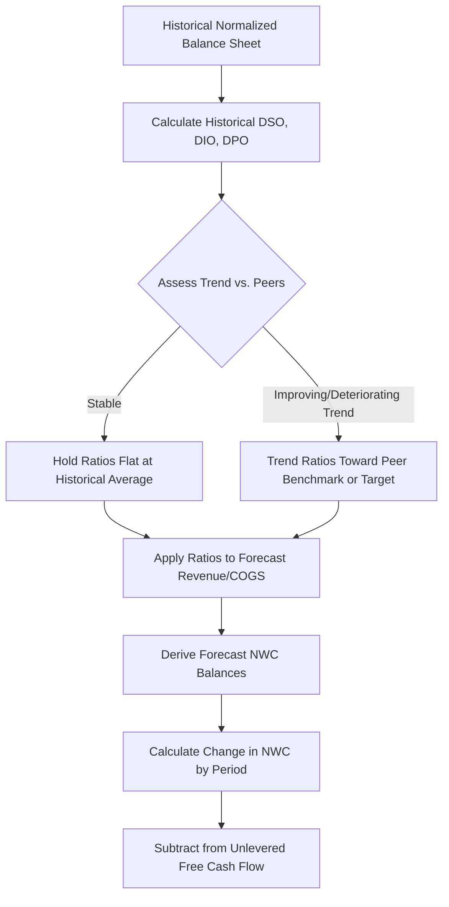

## Working Capital Forecasting Methods

### Overview

Working capital forecasting projects the operating assets and liabilities required to run the business day-to-day — primarily receivables, inventory, and payables — and translates changes in these balances into cash flow impacts within the DCF. Since unlevered free cash flow is derived after subtracting increases in net working capital, accurate working capital forecasting directly affects valuation, particularly for businesses with long cash conversion cycles or high revenue growth.

### Defining Working Capital for DCF Purposes

#### Net Working Capital (Operating Definition)

For valuation purposes, working capital is typically restricted to **operating** items, excluding cash, short-term debt, and short-term investments (which are financing/capital-structure items handled elsewhere in the DCF):

$$\text{Net Working Capital} = (\text{Operating Current Assets}) - (\text{Operating Current Liabilities})$$

**Key Points**

- Operating current assets typically include: accounts receivable, inventory, prepaid expenses.
- Operating current liabilities typically include: accounts payable, accrued expenses, deferred revenue.
- Cash and cash equivalents, short-term debt, and current portion of long-term debt are excluded, since these are financing items, not operating items.

#### Change in Net Working Capital and Free Cash Flow Impact

$$\Delta \text{NWC}_t = \text{NWC}_t - \text{NWC}_{t-1}$$

$$\text{Unlevered FCF}_t = \text{NOPAT}_t + \text{D\&A}_t - \text{Capex}_t - \Delta \text{NWC}_t$$

An **increase** in NWC is a cash outflow (cash tied up in operations); a **decrease** in NWC is a cash inflow (cash released from operations).

### Core Forecasting Methods

#### Days-Based Ratio Method (Most Common)

Each working capital component is forecast using an efficiency ratio expressed in days, applied to a relevant income statement driver.

$$\text{DSO (Days Sales Outstanding)} = \frac{\text{Accounts Receivable}}{\text{Revenue}} \times 365$$

$$\text{DIO (Days Inventory Outstanding)} = \frac{\text{Inventory}}{\text{COGS}} \times 365$$

$$\text{DPO (Days Payable Outstanding)} = \frac{\text{Accounts Payable}}{\text{COGS}} \times 365$$

To forecast forward balances, the historical ratio (typically a 3–5 year average or trended assumption) is applied in reverse:

$$\text{Accounts Receivable}_t = \frac{\text{DSO}_t}{365} \times \text{Revenue}_t$$

$$\text{Inventory}_t = \frac{\text{DIO}_t}{365} \times \text{COGS}_t$$

$$\text{Accounts Payable}_t = \frac{\text{DPO}_t}{365} \times \text{COGS}_t$$

#### Cash Conversion Cycle (CCC)

$$\text{CCC} = \text{DSO} + \text{DIO} - \text{DPO}$$

**Example**

A company with DSO of 45 days, DIO of 60 days, and DPO of 30 days has a CCC of 75 days — meaning cash is tied up in operations for 75 days between paying suppliers and collecting from customers. A forecast that assumes CCC compression (e.g., through faster collections or extended payment terms) should be explicitly justified by a stated operational initiative rather than assumed by default.

#### Percentage-of-Revenue Method

A simpler alternative: forecast each working capital line item as a direct percentage of revenue (or COGS for inventory/payables), rather than converting through days. Mechanically equivalent to the days-based method but less granular for diagnostic purposes.

$$\text{NWC}_t = \text{Revenue}_t \times \text{NWC \% of Revenue (historical average)}$$

#### Driver-Based Method

For businesses with disclosed operational metrics, working capital can be built from underlying operational drivers rather than blended ratios:

| Line Item | Driver-Based Build |
| --- | --- |
| Inventory | Units of forward demand coverage × unit cost |
| Receivables | Contractual payment terms by customer segment × segment revenue mix |
| Payables | Negotiated supplier terms × purchase volume |
| Deferred revenue | Billings schedule vs. revenue recognition schedule (relevant for SaaS/subscription) |

### Forecasting Workflow

### Special Considerations by Business Model

**Key Points**

- **SaaS/subscription businesses**: deferred revenue is often a significant working capital source (negative working capital), since customers frequently prepay; this can make NWC a net cash inflow driver rather than a use of cash.
- **Retailers**: inventory is typically the dominant working capital component; seasonality can cause significant intra-year swings that should be smoothed when using annual DCF periods.
- **Project-based/construction businesses**: work-in-progress and billings-in-excess-of-costs (or costs-in-excess-of-billings) require specialized treatment tied to percentage-of-completion accounting.
- **High-growth companies**: rapid revenue growth mechanically increases working capital investment even with constant ratios, since larger revenue bases require proportionally larger receivable and inventory balances.

### Seasonality and Period Selection

- Using **year-end balances** for ratio calculations can be distorted by seasonal working capital patterns (e.g., retailers with elevated inventory ahead of holiday sales).
- Using **average balances** (beginning + ending / 2) or **trailing-twelve-month averages** mitigates point-in-time distortion.
- For businesses with pronounced seasonality, quarterly working capital modeling may be warranted even within an annual DCF framework, particularly for near-term liquidity analysis.

### Normalization Adjustments

Before establishing baseline ratios, historical working capital balances should be reviewed for:

- One-time inventory write-downs or receivable write-offs distorting the base-year ratio.
- Factoring or receivables securitization programs that artificially reduce reported receivables (add back for a normalized comparison, or maintain consistent treatment if the program is expected to continue).
- Supply chain financing arrangements that extend reported payables beyond standard trade terms.
- M&A-driven balance sheet step-ups or one-time integration-related inventory adjustments.

### Cross-Checking the Forecast

- **Historical consistency**: forecasted DSO/DIO/DPO should not show abrupt discontinuities from the historical trend without explicit justification.
- **Peer benchmarking**: comparing forecasted working capital ratios against the peer set (established in the peer benchmarking step) tests whether assumed efficiency gains or deteriorations are plausible.
- **Cash flow statement reconciliation**: ΔNWC calculated from the balance sheet forecast should tie precisely to the working capital line in the cash flow statement.

### Common Pitfalls

- Applying a single blended DSO/DIO/DPO to a multi-segment company with materially different payment terms across segments.
- Forecasting working capital ratios that improve indefinitely without a stated operational driver (e.g., new ERP system, renegotiated supplier terms).
- Excluding deferred revenue or accrued liabilities from the NWC definition, which understates available operating financing, particularly relevant for subscription-based models.
- [Inference] Using a simple average of historical ratios without adjusting for a known structural shift (e.g., a recent change in payment terms with a major customer) may misstate the appropriate forward-looking base ratio.
- Failing to model working capital scaling with revenue growth, resulting in an understatement of cash needs during high-growth forecast periods.

### Sensitivity Analysis

$$\frac{\partial \text{Unlevered FCF}}{\partial \text{CCC}}$$

**Example**

Extending DSO by 10 days on a company with $500M in projected revenue increases receivables by approximately $13.7M ($500M × 10/365), representing a one-time cash outflow in the period the extension occurs — a sensitivity worth isolating when testing collection-policy or customer-mix assumptions.

**Next Steps**

- Capital Expenditure and Depreciation Scheduling
- Building the Full Pro Forma Balance Sheet
- Deriving Unlevered Free Cash Flow
- Scenario Analysis: Base, Upside, and Downside Cases
- Cash Flow Statement Construction and Reconciliation