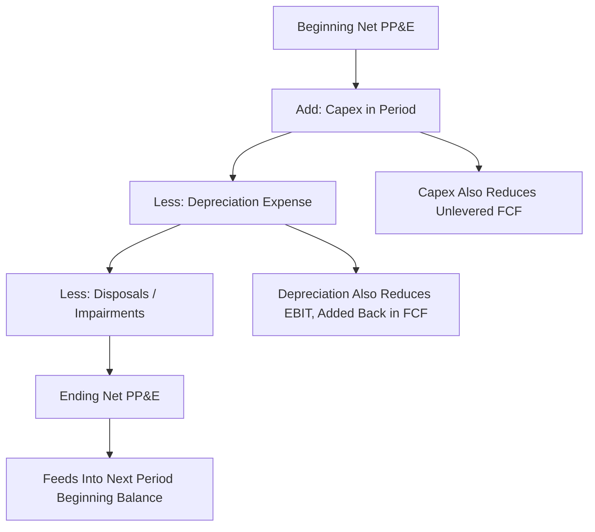

## Capital Expenditure and Depreciation Schedules

<syllabot_broad_topic/>

### Overview

Capital expenditure (capex) and depreciation scheduling models the acquisition, consumption, and replacement of a company's fixed asset base over the forecast period. This schedule links directly to three components of the DCF: capex is a direct subtraction in unlevered free cash flow, depreciation flows through EBIT and taxes on the income statement, and the resulting net PP&E balance rolls forward on the balance sheet. Because capex and depreciation move independently in the near term (capex reflects current investment decisions; depreciation reflects the amortization of past investment), they must be modeled as separate but linked schedules rather than assumed equal.

### Capital Expenditure Classification

#### Maintenance vs. Growth Capex

**Key Points**

- **Maintenance capex** replaces or sustains existing productive capacity — required simply to keep the business operating at its current scale.
- **Growth capex** expands capacity, adds new locations, or funds new product lines — discretionary and tied to the growth forecast.
- This distinction matters because maintenance capex should track existing asset base/depreciation, while growth capex should scale with the revenue growth forecast.

$$\text{Total Capex}_t = \text{Maintenance Capex}_t + \text{Growth Capex}_t$$

- [Inference] Companies rarely disclose this split explicitly; analysts typically approximate maintenance capex as roughly equal to depreciation in a mature, steady-state business, adjusting for inflation in replacement asset costs.

### Forecasting Methods for Capex

#### Percentage-of-Revenue Method

The most common approach for high-level DCF models: capex is forecast as a historical average or trended percentage of revenue.

$$\text{Capex}_t = \text{Revenue}_t \times \text{Capex \% of Revenue}$$

**Example**

If capex has averaged 4.5% of revenue over the past five years with a stable trend, and no major capacity expansion is planned, a forecast might hold this ratio constant, adjusting only if disclosed guidance indicates a step-change (e.g., a new facility announcement).

#### Capex-to-Depreciation Ratio Method

Useful for approximating steady-state reinvestment behavior, particularly in terminal value construction:

$$\text{Capex}_t = \text{D\&A}_t \times \text{Capex/D\&A Ratio}$$

- In a mature, non-growing business, this ratio should approach 1.0x (capex ≈ depreciation) reflecting steady-state replacement investment.
- In a growing business, this ratio is typically greater than 1.0x, since incremental capacity investment is needed beyond simple replacement.
- **Terminal value convention**: capex is commonly set equal to depreciation (ratio = 1.0x) in perpetuity-based terminal value calculations, consistent with the assumption of stable, non-growing (or GDP-growth-only) operations.

#### Driver-Based / Project-Level Method

For capital-intensive industries, capex may be built bottom-up from specific planned projects:

| Component | Build Approach |
| --- | --- |
| Maintenance capex | Existing asset base × replacement rate, adjusted for inflation |
| Expansion capex | Disclosed capital projects (new plants, facilities) with specific spend schedules |
| Technology/IT capex | Fixed annual budget or percentage of revenue, often less cyclical |

This method relies heavily on company guidance, capex budgets disclosed in investor presentations, or industry-specific capacity planning norms.

### Depreciation Scheduling

#### Depreciation Methods

$$\text{Straight-Line Depreciation} = \frac{\text{Asset Cost} - \text{Salvage Value}}{\text{Useful Life}}$$

- **Straight-line** is the standard convention used in most financial forecasting models due to its simplicity and predictability, even where a company uses accelerated methods for tax purposes.
- **Declining balance / accelerated methods** may be used for tax depreciation schedules (relevant to the cash tax calculation) but are less commonly used for book depreciation in the projected income statement.
- Where tax depreciation diverges materially from book depreciation, a deferred tax schedule may be warranted to reconcile cash taxes paid versus book tax expense.

#### The Rollforward Schedule (PP&E Continuity)

The standard approach models gross PP&E, accumulated depreciation, and net PP&E as a continuity schedule:

$$\text{Net PP\&E}_t = \text{Net PP\&E}_{t-1} + \text{Capex}_t - \text{D\&A}_t - \text{Disposals}_t$$

#### Vintage-Based Depreciation Modeling (Detailed Method)

For more granular models, depreciation is tracked by "vintage" — each year's capex is depreciated separately over its useful life, and total depreciation in any forecast year is the sum of depreciation from all still-active vintages.

$$\text{D\&A}_t = \sum_{i=0}^{n} \frac{\text{Capex}_{t-i}}{\text{Useful Life}_i} \quad \text{(for vintages not yet fully depreciated)}$$

**Example**

A capex tranche of $10M in Year 1 with a 10-year useful life contributes $1M of depreciation per year for 10 years. A separate $12M tranche in Year 2 with the same useful life contributes an additional $1.2M per year starting in Year 2. Total Year 2 depreciation = $1M (Year 1 vintage) + $1.2M (Year 2 vintage) = $2.2M. This method is more precise than a blended ratio approach but requires tracking multiple vintage schedules simultaneously.

#### Useful Life Assumptions

| Asset Category | Typical Useful Life Range |
| --- | --- |
| Buildings | 20–40 years |
| Machinery & Equipment | 5–15 years |
| Vehicles | 3–7 years |
| Computer/IT Equipment | 3–5 years |
| Leasehold Improvements | Lease term or useful life, whichever is shorter |

[Unverified] Specific useful lives vary by company policy and industry practice; source useful life assumptions from the company's disclosed accounting policy notes (typically in the PP&E footnote) rather than generic industry averages when precision is required.

### Convergence to Steady State for Terminal Value

**Key Points**

- In the explicit forecast period, capex often exceeds depreciation to fund growth-supporting investment.
- As the forecast approaches the terminal year, the capex-to-depreciation ratio is typically tapered toward 1.0x (or toward a modest premium reflecting perpetual GDP-linked growth) to reflect a mature, steady-state reinvestment rate consistent with the terminal growth assumption.
- Failing to converge capex toward depreciation in the terminal year is a common modeling error that can materially overstate or understate terminal free cash flow.

$$\text{Terminal Year Capex} \approx \text{Terminal Year D\&A} \times \left(1 + g\right)$$

where $g$ is the terminal growth rate, reflecting minimal incremental net investment consistent with perpetual growth.

### Cross-Checking the Schedule

- **Depreciation-to-Net-PP&E ratio**: verify implied average remaining useful life is reasonable given the asset mix.
- **Capex-to-Revenue trend**: compare forecasted capex intensity against historical levels and peer benchmarks (from the peer benchmarking framework) to confirm plausibility.
- **Reconciliation to cash flow statement**: capex in the model should tie to "purchases of property, plant, and equipment" in the historical cash flow statement, adjusted for any normalization items (e.g., capitalized leases, asset acquisitions via M&A which are typically excluded from organic capex).

### Common Pitfalls

- Setting capex equal to depreciation throughout the entire explicit forecast period regardless of the company's growth stage, which understates investment needs for a growing business.
- Ignoring lumpy, large one-time capex projects (new facility, major system implementation) by smoothing them into an average annual percentage, which can distort near-term free cash flow timing.
- Using a blended useful life assumption for a business with a highly heterogeneous asset base (e.g., mixing long-lived real estate with short-lived technology equipment).
- Failing to taper the capex/D&A ratio toward steady state before calculating terminal value, resulting in an internally inconsistent terminal free cash flow.
- Omitting capitalized software development costs or capitalized leases from the capex/depreciation schedule where material to the business model.

### Sensitivity Analysis

$$\frac{\partial \text{Unlevered FCF}}{\partial \text{Capex \% of Revenue}}$$

**Example**

Reducing assumed capex intensity from 5.0% to 4.5% of revenue on a company with $1B in projected terminal-year revenue increases unlevered free cash flow by $5M in that year alone, with a compounding effect on terminal value given the perpetuity treatment — underscoring why capex assumptions warrant explicit sensitivity testing.

**Next Steps**

- Working Capital Forecasting Methods
- Building the Full Pro Forma Balance Sheet
- Deriving Unlevered Free Cash Flow
- Terminal Value Estimation Using the Gordon Growth Model
- Scenario Analysis: Base, Upside, and Downside Cases