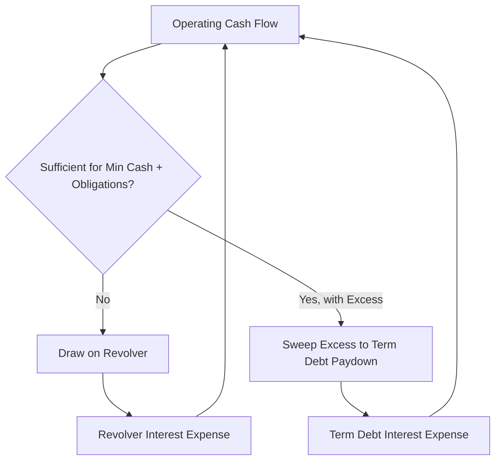

## Debt Schedules and Circular Interest Expense

### Overview

Debt scheduling models the roll-forward of a company's outstanding debt balances, mandatory amortization, and interest expense across the forecast period. In a full three-statement model, this schedule introduces a distinctive modeling challenge known as **circularity**: interest expense depends on the debt balance, which depends on the cash flow available for debt paydown (or draw), which depends on net income, which depends on interest expense. While an unlevered DCF (used to derive enterprise value) does not require solving this circularity, it becomes necessary in levered free cash flow models, in models with a revolving credit facility ("cash flow sweep"), and when bridging enterprise value to equity value requires a fully integrated three-statement build.

### Why Circularity Arises

#### The Circular Loop

**Key Points**

- Interest expense is typically calculated on the **average** debt balance during the period (beginning + ending / 2) to approximate the timing of paydowns/draws within the year.
- Because the ending balance depends on cash flow available after interest and taxes, and interest depends on the ending balance, the calculation references itself — a circular reference in spreadsheet terms.
- This circularity is distinct from, and in addition to, the general complexity of linking the three financial statements.

$$\text{Interest Expense}_t = \text{Interest Rate} \times \frac{\text{Debt}_{t-1} + \text{Debt}_t}{2}$$

$$\text{Debt}_t = \text{Debt}_{t-1} - \text{Cash Available for Paydown}_t(\text{Interest Expense}_t)$$

### Structuring the Debt Schedule

#### Core Components

1. **Beginning debt balance** by tranche (term loan, revolver, senior notes, subordinated debt).
2. **Scheduled mandatory amortization** per credit agreement terms.
3. **Voluntary prepayments / cash flow sweep** (optional paydown from excess cash).
4. **Revolver draws** (if cash flow is insufficient to cover obligations).
5. **Ending debt balance** by tranche.
6. **Interest expense** by tranche, using tranche-specific rates.

#### Multi-Tranche Schedule Example Structure

| Tranche | Beginning Balance | Mandatory Amort. | Cash Sweep | Ending Balance | Interest Rate | Interest Expense |
| --- | --- | --- | --- | --- | --- | --- |
| Revolver | $0 | — | Draw/(Paydown) | Varies | SOFR + spread | On average balance |
| Term Loan A | $X | Fixed % per credit agreement | Excess cash | $X − Amort. − Sweep | Fixed/Floating | On average balance |
| Senior Notes | $Y | Bullet at maturity | None typically | $Y (unchanged until maturity) | Fixed coupon | Coupon × face value |

### Resolving Circularity: Modeling Approaches

#### Approach 1: Iterative Calculation (Circular Reference Enabled)

Allowing the spreadsheet to iteratively calculate the circular loop until values converge, using the software's iterative calculation setting.

**Key Points**

- Requires enabling iterative calculation in the spreadsheet application (e.g., Excel: File → Options → Formulas → Enable iterative calculation).
- Risk: circular references can cause the model to break (display errors, "#REF!" propagation, or corrupt values) if a formula is altered incorrectly, or if the file is opened by a user without iterative calculation enabled, and can trigger #DIV/0! or runaway values in edge cases.
- A common practice is to build a "circularity breaker" — a switch (typically a single cell toggle) that sets interest expense to zero or a fixed prior-period value, allowing the analyst to break the circular loop deliberately for debugging or error-checking.

#### Approach 2: Copy-Paste-Values (Manual Iteration)

Manually calculating interest on the beginning-of-period balance only (avoiding the average-balance convention), which eliminates circularity at the cost of some precision, since it ignores the impact of in-period paydowns on interest cost.

$$\text{Interest Expense}_t = \text{Interest Rate} \times \text{Debt}_{t-1} \quad \text{(beginning balance only — non-circular)}$$

- [Inference] This simplification is commonly used in high-level DCF models where the debt schedule is not the primary valuation driver, since the resulting interest expense difference versus average-balance methods is typically immaterial for enterprise-value-focused analysis.

#### Approach 3: Macro-Based Iteration (VBA/Script-Based)

Using a macro to "solve" the circularity by iterating the calculation a fixed number of times and then converting formulas to hardcoded values, avoiding reliance on the spreadsheet's native iterative settings.

- More robust against accidental circular-reference breakage but requires macro-enabled files and more sophisticated model construction/maintenance.

#### Approach 4: Avoiding Circularity Entirely (Common in Unlevered DCF)

**Key Points**

- Since **unlevered free cash flow** (the standard DCF input) excludes interest expense and financing cash flows by construction, an enterprise-value DCF does not require solving the circular debt schedule at all.
- The debt schedule and circularity become relevant only when: (a) bridging from enterprise value to equity value requires a forward-looking net debt projection, (b) building a levered free cash flow model, or (c) modeling a business with a revolving credit facility whose draws depend on cash flow performance (common in LBO analysis).
- For a standard corporate DCF focused on enterprise value, many practitioners avoid the circularity issue by using a static, current-balance-sheet view of net debt rather than a fully dynamic forecast debt schedule.

### The Cash Flow Sweep Mechanism

For debt with a mandatory cash flow sweep (common in leveraged structures), excess cash after mandatory obligations is used to pay down debt:

$$\text{Cash Available for Sweep}_t = \text{FCF Before Debt Service}_t - \text{Mandatory Amortization}_t - \text{Minimum Cash Requirement}$$

$$\text{Voluntary Prepayment}_t = \min(\text{Cash Available for Sweep}_t, \text{Outstanding Balance}_t)$$

**Example**

If free cash flow before debt service is $50M, mandatory amortization is $10M, and the company maintains a $5M minimum cash balance, $35M is available for optional prepayment against the term loan (assuming the term loan balance exceeds $35M), directly reducing the following period's interest expense — which is the source of the circular dependency.

### Practical Circularity-Breaking Technique

A widely used structural solution is a **toggle switch cell**:

$$\text{Interest Expense}_t = \text{IF}(\text{Circularity Switch} = 1, \text{Circular Calculation}, 0)$$

**Key Points**

- Setting the switch to 0 breaks the circular loop, allowing the analyst to isolate and fix errors elsewhere in the model without the spreadsheet returning circular-reference errors.
- Once errors are resolved, the switch is set back to 1 to re-enable the full circular calculation.
- This is considered a modeling best practice for any model containing intentional circularity, since it provides a controlled way to audit the model.

### Interaction with Revolver Sizing and Minimum Cash

- Revolver draws are typically modeled as a "plug" that ensures a minimum cash balance is maintained if operating cash flow is insufficient to cover fixed obligations.
- This revolver plug is itself circular with interest expense (revolver draws generate revolver interest, which affects cash available, which affects the draw needed) — often called a "double circularity" in models with both term debt sweeps and revolver plugs.

### Relevance to Enterprise-Value DCF vs. Levered Analysis

| Model Type | Debt Schedule Required? | Circularity Present? |
| --- | --- | --- |
| Standard Enterprise-Value DCF (Unlevered FCF) | Only for net debt bridge at valuation date | Generally no |
| Levered FCF / Equity DCF | Yes, full schedule | Yes |
| LBO Model | Yes, full schedule with sweep/revolver | Yes, often multiple layers |
| Credit Analysis / Covenant Modeling | Yes, full schedule | Yes |

### Common Pitfalls

- Enabling circular references without a circularity-breaker switch, making the model fragile and difficult to debug when errors appear.
- Mixing average-balance and beginning-balance interest conventions inconsistently across tranches within the same model.
- Failing to cap voluntary prepayment at the outstanding balance, which can produce a negative debt balance in scenarios with very high free cash flow.
- Ignoring mandatory minimum cash requirements when sizing the revolver draw, understating financing needs in downside scenarios.
- [Unverified] Applying a single blended interest rate across all debt tranches rather than tranche-specific rates can materially misstate interest expense where the capital structure includes both fixed and floating-rate instruments.

**Next Steps**

- Deriving Unlevered versus Levered Free Cash Flow
- Building the Enterprise-Value-to-Equity-Value Bridge
- Weighted Average Cost of Capital (WACC) Estimation
- Three-Statement Model Integration
- Scenario Analysis Under Different Capital Structure Assumptions