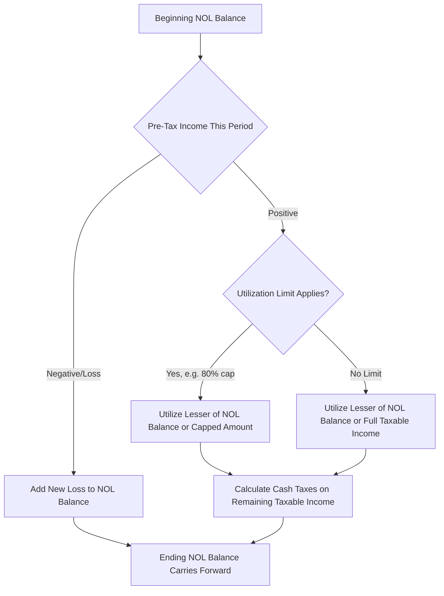

## Modeling Net Operating Loss Carryforwards and Cash Taxes

### Overview

Net operating loss (NOL) carryforwards and cash tax modeling reconcile a company's book tax expense with its actual cash tax payments, which is essential for accurately projecting unlevered free cash flow in a DCF. Book tax expense (reported on the income statement) and cash taxes actually paid frequently diverge due to timing differences, NOL utilization, and other deferred tax items. Since DCF valuation is built on cash flow, not accounting earnings, cash taxes — not book tax expense — are the relevant figure for the free cash flow build.

### Why Book Tax Expense and Cash Taxes Diverge

**Key Points**

- **Book tax expense** reflects GAAP/IFRS accounting rules and includes both current and deferred tax components.
- **Cash taxes paid** reflect what is actually remitted to tax authorities in the period, which can be lower (or higher) than book tax expense due to timing differences.
- The primary sources of divergence include: NOL carryforward utilization, accelerated tax depreciation versus straight-line book depreciation, stock-based compensation timing differences, and other temporary differences that reverse over time.

$$\text{Cash Taxes Paid}_t = \text{Book Tax Expense}_t - \Delta \text{Deferred Tax Liability}_t + \Delta \text{Deferred Tax Asset}_t$$

### Net Operating Loss (NOL) Carryforwards

#### Mechanics of NOL Utilization

An NOL arises when a company's tax-deductible expenses exceed its taxable income in a given year, creating a loss that can offset taxable income in future (or, under some regimes, prior) periods, reducing cash taxes payable.

$$\text{Taxable Income}_t = \max(0, \, \text{Pre-Tax Income}_t - \text{NOL Utilized}_t)$$

$$\text{Cash Taxes}_t = \text{Taxable Income}_t \times \text{Tax Rate}_t$$

#### NOL Rollforward Schedule

$$\text{Ending NOL Balance}_t = \text{Beginning NOL Balance}_t + \text{New NOL Generated}_t - \text{NOL Utilized}_t$$

| Period | Beginning NOL | New NOL Generated | NOL Utilized | Ending NOL |
| --- | --- | --- | --- | --- |
| Year 1 | $50M | $0 | $20M (limited by taxable income) | $30M |
| Year 2 | $30M | $0 | $30M | $0 |
| Year 3 | $0 | $0 | $0 | $0 |

**Example**

A company has $50M of NOL carryforwards entering the forecast period and generates $20M of pre-tax income in Year 1. Assuming full utilization is permitted (no percentage-of-taxable-income limitation), the $20M of pre-tax income is fully offset by NOLs, resulting in $0 cash taxes for Year 1, while book tax expense (calculated on the full $20M at the statutory rate) is still recognized on the income statement, with the difference recorded as a reduction in the deferred tax asset.

#### Jurisdiction-Specific Utilization Limitations

**Key Points**

- [Unverified] Tax regimes impose varying rules on NOL usage — some jurisdictions cap the percentage of taxable income that can be offset by NOLs in a given year (e.g., U.S. federal rules under the Tax Cuts and Jobs Act limit NOL usage generated after 2017 to 80% of taxable income in the year of utilization, though rules can change and should be verified against current tax code at the time of modeling), while others impose expiration periods (e.g., a fixed number of years before NOLs lapse) or restrict use following a change in ownership (e.g., Section 382 limitations in the U.S., which cap the annual usable NOL amount following a greater-than-50% ownership change).
- Because these rules are jurisdiction- and fact-specific and subject to legislative change, analysts should verify current statutory limitations for the specific jurisdiction and ownership history rather than relying on generic assumptions, and treat any applied limitation as [Unverified] unless confirmed against current tax code or a tax advisor's guidance.

### Deferred Tax Assets and Liabilities

#### Deferred Tax Asset (DTA)

Arises when a company has paid or will pay more tax than its book expense implies, or holds future tax benefits (such as NOLs) not yet realized in cash.

$$\text{DTA (NOL-related)} = \text{NOL Balance} \times \text{Applicable Tax Rate}$$

**Key Points**

- A **valuation allowance** may be recorded against a DTA if it is not "more likely than not" that the company will generate sufficient future taxable income to realize the benefit — this reduces the net DTA on the balance sheet and can signal that historical or near-term NOL utilization assumptions should be treated cautiously in the model.

#### Deferred Tax Liability (DTL)

Commonly arises from accelerated tax depreciation exceeding straight-line book depreciation, deferring cash tax payment relative to book tax expense.

$$\text{DTL (Depreciation-related)} = (\text{Tax Depreciation} - \text{Book Depreciation}) \times \text{Tax Rate}$$

### Building the Cash Tax Bridge

#### Step-by-Step Cash Tax Calculation

1. Start with **EBIT** (or pre-tax income, adjusted for the DCF's unlevered convention which typically taxes EBIT directly rather than pre-tax income including interest).
2. Apply the **statutory or effective tax rate** to derive book/unlevered tax expense.
3. Adjust for **NOL utilization** available in the period (subject to jurisdictional limitations).
4. Adjust for other significant **temporary differences** (accelerated depreciation, stock compensation timing) if material and separately modeled.
5. Arrive at **cash taxes**, the figure used in the unlevered free cash flow build.

$$\text{Unlevered Cash Taxes}_t = (\text{EBIT}_t - \text{NOL Utilized}_t) \times \text{Tax Rate}_t$$

$$\text{NOPAT}_t = \text{EBIT}_t \times (1 - \text{Effective Tax Rate}_t) \quad \text{(if NOLs not separately modeled)}$$

**Key Points**

- In a standard unlevered DCF, taxes are calculated on **EBIT** (not pre-tax income including interest expense), since unlevered free cash flow is meant to represent cash flow available to all capital providers before financing effects — this is often referred to as "unlevered taxes" or "taxes on EBIT."
- Where NOLs are material, they should be applied against this unlevered tax base directly rather than against a levered pre-tax income figure, to remain internally consistent with the unlevered FCF framework.

### Effective Tax Rate vs. Statutory Tax Rate

| Concept | Definition | Use in Modeling |
| --- | --- | --- |
| Statutory Tax Rate | The legally prescribed rate for the relevant jurisdiction(s) | Used for terminal value and long-run cash tax projections once NOLs are exhausted and temporary items normalize |
| Effective Tax Rate | Actual book tax expense divided by pre-tax income, reflecting credits, deductions, and multi-jurisdictional blending | Used for near-term book tax expense projection, informed by historical trend |
| Cash Tax Rate | Actual cash taxes paid divided by pre-tax income | The most relevant rate for free cash flow purposes, particularly while NOLs are being utilized |

**Example**

A company with a 25% statutory tax rate but $100M of NOLs and $40M of annual pre-tax income would show a cash tax rate near 0% for approximately 2.5 years (until NOLs are exhausted, subject to any utilization cap), before converging toward the statutory or effective rate once carryforwards are used up — this convergence should be modeled explicitly rather than applying a flat effective tax rate across the entire forecast period.

### Convergence to Terminal Value

**Key Points**

- Since NOLs are a finite, depleting resource, the DCF forecast should show cash taxes converging to the statutory (or normalized effective) tax rate once the NOL balance is exhausted — using a below-statutory cash tax rate in the terminal year (a period intended to represent a steady, perpetual state) is a common and material modeling error.
- Terminal value calculations should always assume a normalized, fully-taxed rate consistent with the going-concern, steady-state assumption embedded in perpetuity-based terminal value methods.

### Cross-Checking the Tax Build

- **Historical NOL disclosure**: sourced from the company's tax footnote (10-K), which typically discloses gross NOL carryforwards, expiration schedules, and any valuation allowance.
- **Reconciliation to cash flow statement**: modeled cash taxes should approximate the "cash paid for income taxes" supplemental disclosure in the historical cash flow statement, adjusted for known one-time items.
- **Deferred tax rollforward consistency**: changes in DTA/DTL balances between periods should tie to the difference between book tax expense and cash taxes paid.

### Common Pitfalls

- Applying the full statutory tax rate throughout the forecast period despite a disclosed, material NOL balance, materially understating near-term free cash flow.
- Ignoring jurisdiction-specific utilization limitations (percentage-of-income caps, ownership-change limitations), overstating near-term NOL benefit.
- Using a below-statutory cash tax rate in the terminal year, which is inconsistent with the steady-state assumption underlying perpetuity-based terminal value.
- Failing to distinguish between unlevered taxes (on EBIT, for DCF purposes) and levered/book taxes (on pre-tax income including interest), leading to inconsistency between the tax rate applied and the free cash flow definition used.
- Treating an NOL with a substantial valuation allowance as fully realizable in the projection without considering the accounting signal that realization is uncertain.

### Sensitivity Analysis

$$\frac{\partial \text{Unlevered FCF}}{\partial \text{NOL Utilization Period}}$$

**Example**

Extending the NOL shield by one additional year (e.g., due to a lower near-term taxable income forecast) defers the point at which cash taxes step up to the full statutory rate, increasing near-term free cash flow and modestly increasing present value given the time value benefit of deferred taxation — this timing sensitivity is worth isolating for companies with large NOL balances relative to near-term earnings.

**Next Steps**

- Deriving Unlevered Free Cash Flow
- Terminal Value Estimation Using the Gordon Growth Model
- Weighted Average Cost of Capital (WACC) Estimation
- Debt Schedules and Circular Interest Expense
- Scenario Analysis: Base, Upside, and Downside Cases