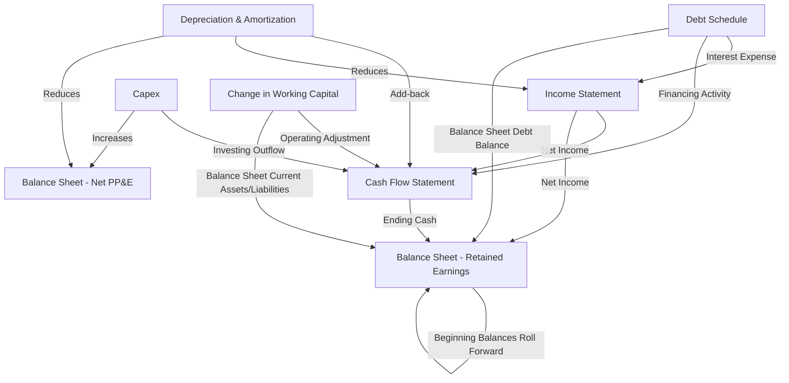

## Building an Integrated Three-Statement Model

### Overview

An integrated three-statement model links the income statement, balance sheet, and cash flow statement so that a change in any single assumption flows consistently through all three, and the balance sheet balances in every forecast period. This integration step consolidates the individual forecasting schedules — revenue, operating expenses, working capital, capex/depreciation, debt, and taxes — into a single coherent model, and serves as the structural foundation from which unlevered free cash flow is extracted for the DCF.

### Purpose and Role in the DCF Workflow

**Key Points**

- Provides an internal consistency check: if the balance sheet does not balance, an error exists somewhere in the linkages.
- Produces the periodic balance sheet needed to calculate changes in net working capital and net debt.
- Supports levered free cash flow, equity value bridging, and credit/covenant analysis in addition to the core unlevered DCF.
- Acts as an audit mechanism — plugging all forecast schedules into one model surfaces internal contradictions (e.g., a revenue forecast implying working capital levels inconsistent with the capex schedule) that would not be visible if each schedule were built in isolation.

### The Three Statements and Their Core Linkages

#### Income Statement → Cash Flow Statement

- Net income is the starting line of the indirect-method cash flow statement.
- Non-cash items (D&A, stock-based compensation, deferred taxes) are added back.
- Interest expense (from the debt schedule) flows into the income statement and reduces net income, which affects the cash flow statement's starting point.

#### Cash Flow Statement → Balance Sheet

- Ending cash balance from the cash flow statement becomes the balance sheet's cash line.
- Capex from the investing section increases gross PP&E.
- Debt draws/repayments from the financing section adjust the balance sheet's debt balances.

#### Balance Sheet → Cash Flow Statement (Working Capital)

- Period-over-period changes in operating current assets and liabilities (from the balance sheet forecast) populate the working capital adjustments in the cash flow statement's operating section.

$$\Delta \text{Cash}_t = \text{CFO}_t + \text{CFI}_t + \text{CFF}_t$$

$$\text{Ending Cash}_t = \text{Beginning Cash}_t + \Delta \text{Cash}_t$$

### Sequencing the Build

#### Recommended Build Order

1. **Revenue and operating expense forecast** (income statement drivers) — establishes EBITDA and EBIT.
2. **Capex and depreciation schedule** — links to both the income statement (D&A) and balance sheet (PP&E).
3. **Working capital schedule** — links balance sheet current assets/liabilities to the cash flow statement.
4. **Debt schedule** — links interest expense (income statement), debt balances (balance sheet), and financing cash flows (cash flow statement); this is where circularity is introduced if average-balance interest and cash sweeps are modeled.
5. **Tax schedule** (including NOL utilization) — finalizes net income.
6. **Assemble the cash flow statement** from the completed income statement and balance sheet schedules.
7. **Complete the balance sheet** and confirm it balances.

**Key Points**

- Building in this order minimizes rework, since later schedules (debt, taxes) depend on earlier ones (revenue, capex, working capital) but not vice versa in most cases — except where circularity (debt/interest) requires iterative resolution.

### The Balance Sheet Plug and Balancing Mechanism

#### Common Balancing Approaches

- **Cash as the plug**: if assets and liabilities/equity don't balance, cash absorbs the difference — appropriate when the model is otherwise fully linked and cash is genuinely the residual.
- **Revolver as the plug**: in models with a credit facility, a revolver draw/paydown mechanism absorbs financing needs or excess cash, which is standard in LBO and credit-intensive models (introduces the circularity discussed in debt scheduling).
- **Balance-check row**: a dedicated row calculating (Total Assets − Total Liabilities − Equity) that should equal zero in every period; this is the primary error-detection tool in an integrated model, not a balancing mechanism itself.

$$\text{Balance Check}_t = \text{Total Assets}_t - (\text{Total Liabilities}_t + \text{Total Equity}_t) = 0$$

**Key Points**

- A non-zero balance check indicates a broken link somewhere in the model (e.g., an item posted to the income statement but not the balance sheet, or a working capital change not flowing to the cash flow statement) and should be resolved before the model is used for valuation output.

### Statement-by-Statement Construction Detail

#### Income Statement Completion

- Revenue → COGS → Gross Profit → SG&A/R&D → EBITDA → D&A → EBIT → Interest Expense → Pre-Tax Income → Taxes → Net Income.
- Ties to prior schedules: revenue/margin forecast, D&A schedule, debt schedule (interest), tax schedule.

#### Balance Sheet Completion

| Section | Key Line Items | Source Schedule |
| --- | --- | --- |
| Current Assets | Cash, AR, Inventory, Prepaids | Cash flow statement (cash); working capital schedule (AR, inventory, prepaids) |
| Non-Current Assets | Net PP&E, Goodwill, Intangibles | Capex/depreciation schedule; typically held flat or amortized separately for intangibles |
| Current Liabilities | AP, Accrued Expenses, Current Debt | Working capital schedule (AP, accruals); debt schedule (current portion) |
| Non-Current Liabilities | Long-Term Debt, Deferred Tax Liabilities | Debt schedule; tax schedule |
| Equity | Common Stock, Retained Earnings, APIC | Net income roll-forward (retained earnings); financing activity (share issuance/buybacks) |

$$\text{Retained Earnings}_t = \text{Retained Earnings}_{t-1} + \text{Net Income}_t - \text{Dividends}_t$$

#### Cash Flow Statement Completion (Indirect Method)

$$\text{CFO}_t = \text{Net Income}_t + \text{D\&A}_t + \text{Other Non-Cash Items}_t - \Delta \text{NWC}_t$$

$$\text{CFI}_t = -\text{Capex}_t - \text{Acquisitions}_t + \text{Asset Disposal Proceeds}_t$$

$$\text{CFF}_t = \Delta \text{Debt}_t + \text{Equity Issuance}_t - \text{Dividends}_t - \text{Share Buybacks}_t$$

### Extracting Unlevered Free Cash Flow from the Integrated Model

**Key Points**

- Although the integrated model is built on a levered basis (including interest expense and financing activity), the DCF requires unlevered free cash flow, which strips out financing effects.
- This is typically calculated as a separate schedule that pulls EBIT, applies unlevered taxes (taxes on EBIT, not pre-tax income), and adds back D&A while subtracting capex and the change in NWC — all of which are sourced directly from the integrated model's completed schedules.

$$\text{Unlevered FCF}_t = \text{EBIT}_t \times (1 - \text{Tax Rate}_t) + \text{D\&A}_t - \text{Capex}_t - \Delta \text{NWC}_t$$

- Because unlevered FCF excludes interest expense, the debt schedule's circularity (discussed separately) does not need to be resolved simply to produce a standard enterprise-value DCF — it becomes necessary only if levered FCF, equity value via a full model, or credit metrics are also required outputs.

### Model Architecture and Best Practices

#### Structural Conventions

- **Separate input/assumption cells from formulas** — hardcoded assumptions should be visually distinguished (commonly blue font) from calculated cells (black font) to support auditability.
- **One schedule per tab/section**, with the three core statements aggregating from these supporting schedules rather than containing embedded, non-traceable calculations.
- **Consistent time period alignment** across all schedules (fiscal year-end, historical vs. forecast column labeling).
- **Explicit historical-to-forecast transition column**, clearly flagging where actuals end and projections begin.

#### Error-Checking Mechanisms

- Balance sheet balance check (described above) in every forecast period.
- Cash flow statement cross-check: cash flow statement's ending cash should tie exactly to the balance sheet's cash line.
- Sources-and-uses check for any modeled financing events (debt issuance, equity raises) to confirm all funds are accounted for.

### Common Pitfalls

- Building each statement in isolation and attempting to link them only after all three are "complete," which typically surfaces a large number of reconciliation errors simultaneously rather than catching them incrementally.
- Hardcoding a balancing plug into cash without verifying that all underlying schedules (working capital, capex, debt) are genuinely and correctly linked — masking real errors rather than fixing them.
- Inconsistent treatment of interest expense (levered) bleeding into the unlevered FCF calculation used for DCF purposes, understating unlevered FCF.
- Failing to roll forward equity correctly (e.g., omitting stock-based compensation or share buyback effects), causing the balance sheet to fail to balance even when the income statement and cash flow statement appear correct individually.
- [Inference] Overly complex circularity (interest expense, revolver sweep, and NOL utilization all interacting) without a circularity-breaker switch can make the model fragile and difficult to debug when assumptions change.

### Cross-Checking the Completed Model

- **Historical tie-out**: the model's historical columns should exactly match the company's reported financial statements before any forecast logic is trusted.
- **Ratio continuity**: key ratios (margins, working capital days, leverage) should transition smoothly from historical actuals into the forecast period without unexplained discontinuities.
- **Balance check across all scenarios**: the balance sheet should balance not only in the base case but also under any sensitivity or scenario toggles applied to the model.

**Next Steps**

- Deriving Unlevered Free Cash Flow
- Weighted Average Cost of Capital (WACC) Estimation
- Terminal Value Estimation Using the Gordon Growth Model
- Enterprise-Value-to-Equity-Value Bridge Construction
- Scenario and Sensitivity Analysis Design