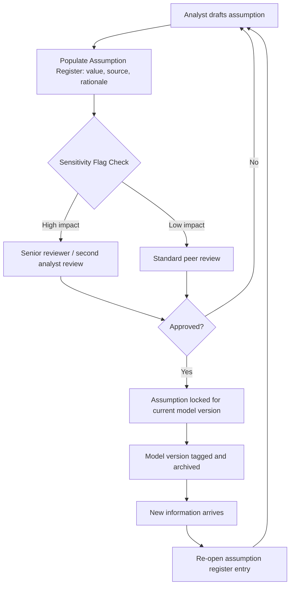
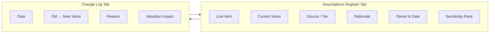

## Forecast Assumptions Documentation and Governance

### Overview and Purpose

Forecast assumptions documentation and governance is the discipline of systematically recording, justifying, sourcing, and controlling the inputs that drive a DCF model's projections. Every forecasted line item — revenue growth, margins, capital expenditures, working capital, discount rate inputs — rests on an assumption made by an analyst. Without a formal governance process, these assumptions become opaque, inconsistent across scenarios, and difficult to audit, update, or defend to stakeholders (investment committees, clients, auditors, or regulators).

This discipline sits at the intersection of financial modeling best practice and model risk management. It matters most when a model will be reused, reviewed by a third party, updated over multiple cycles, or relied upon for a high-stakes decision (M&A, fairness opinion, impairment testing, capital allocation).

### Why Governance Matters in DCF Modeling

- **Auditability**: an assumption without a documented source or rationale cannot be independently verified or defended
- **Version control**: forecasts change as new information arrives (earnings releases, guidance updates, macro shifts); undocumented changes make it impossible to reconstruct why a valuation moved
- **Bias mitigation**: explicit documentation of the *basis* for an assumption (management guidance vs. analyst judgment vs. historical trend) forces discipline and reduces unconscious optimism or pessimism bias
- **Reproducibility**: a well-governed model can be handed to another analyst, or revisited a year later, without requiring the original author to reconstruct their reasoning from memory
- **Regulatory and audit exposure**: in contexts like goodwill impairment testing (ASC 350) or fairness opinions, auditors and regulators explicitly test whether key assumptions are supportable and consistently applied

### Core Components of an Assumptions Governance Framework

#### 1. Assumption Register

A structured log — typically a dedicated worksheet or table — that captures, for every material assumption:

| Field | Description |
| --- | --- |
| Line item | The specific forecast driver (e.g., "Year 2 revenue growth rate") |
| Assumption value | The numeric input used |
| Source/basis | Management guidance, sell-side consensus, historical CAGR, analyst judgment, industry report |
| Rationale | Narrative justification for why this value was selected |
| Owner | Analyst or team responsible for the assumption |
| Date set/last updated | Version timestamp |
| Sensitivity flag | Whether this assumption is a high-impact driver (per sensitivity analysis) |
| Review status | Draft, reviewed, approved, superseded |

**Example**

| Line Item | Value | Source/Basis | Rationale | Sensitivity |
| --- | --- | --- | --- | --- |
| Yr 1–3 Revenue Growth | 8.5% | Management guidance (Q3 earnings call) | Aligns with disclosed backlog growth and new product launch timeline | High |
| Terminal Growth Rate | 2.5% | Long-run GDP/inflation proxy | Consistent with Gordon Growth Model constraint that $g_\infty < r$ | High |
| COGS % of Revenue | 58% | 3-year historical average, normalized for Year 5 write-down | Excludes one-time inventory charge identified in common-size analysis | Medium |
| Capex % of Revenue | 4.2% | Historical average + disclosed capacity expansion plan | Blends maintenance capex trend with known growth capex program | Medium |

#### 2. Source Hierarchy and Tiering

Well-governed models classify assumptions by source reliability, often in a tiered hierarchy:

1. **Tier 1 — Company-disclosed/contractual**: management guidance, signed contracts, disclosed capex budgets, backlog
2. **Tier 2 — Derived from verified historical data**: normalized historical trend and common-size ratios
3. **Tier 3 — External benchmarks**: sell-side consensus estimates, industry reports, peer comparables
4. **Tier 4 — Analyst judgment**: qualitative overlays where no hard data exists (e.g., anticipated competitive response, regulatory risk discount)

**Key Points**

- Lower-tier (judgment-based) assumptions should carry a higher governance burden — more documentation, more explicit sensitivity testing, and ideally independent review
- A model dominated by Tier 4 assumptions without corroborating analysis is a red flag in due diligence and audit contexts

#### 3. Approval and Review Workflow

This cycle should repeat any time a material new data point arrives (earnings release, guidance revision, macro data update), rather than only at the start of a project.

#### 4. Change Log / Version Control

A running log capturing every revision to a key assumption over the life of the model:

| Date | Line Item | Old Value | New Value | Reason for Change | Impact on Valuation |
| --- | --- | --- | --- | --- | --- |
| 2026-01-15 | WACC | 9.0% | 9.4% | Updated risk-free rate per 10-year Treasury move | -$0.42/share |
| 2026-03-10 | Yr 1 Revenue Growth | 7.0% | 8.5% | Q3 earnings beat + raised guidance | +$1.10/share |
| 2026-06-02 | Terminal Growth | 2.0% | 2.5% | Updated long-run inflation expectation per Fed dot plot | +$0.85/share |

**Key Points**

- Recording the *valuation impact* of each change, not just the assumption change itself, builds an audit trail that explains why the output moved
- This log is often what a reviewing analyst, auditor, or client asks for first when reconciling two versions of the same model

### Documentation Standards for Individual Assumptions

Each material assumption documented in the register should ideally answer four questions:

1. **What** is the assumption? (precise definition — e.g., "revenue growth" must specify organic vs. total, constant-currency vs. reported)
2. **Why** was this value chosen? (rationale tied to a specific source)
3. **How sensitive** is the valuation to this assumption? (quantified via sensitivity/scenario analysis)
4. **When** was it last validated, and against what trigger should it be revisited?

**Example: Well-Documented vs. Poorly-Documented Assumption**

Poorly documented:

> "Revenue growth: 10%"

Well documented:

> "Revenue growth, Year 1: 10.0%, organic constant-currency basis. Basis: midpoint of management's disclosed FY guidance range of 9–11% (Q4 earnings call, Feb 2026), corroborated by sell-side consensus mean of 9.8% (FactSet, 12 analysts, as of Mar 2026). Excludes contribution from pending acquisition (not yet closed). Sensitivity: high — a ±100bps change shifts implied equity value per share by approximately ±$0.75 (see sensitivity table, Section 6). Owner: J. Smith. Last reviewed: 2026-03-15. Revisit trigger: next quarterly earnings release or any acquisition close announcement."

### Governance for Scenario and Sensitivity Assumptions

When a DCF incorporates multiple scenarios (base, upside, downside) or a Monte Carlo/sensitivity framework, governance must additionally document:

- **Scenario definitions**: what qualitative narrative each scenario represents (e.g., "downside: recession scenario with 200bps margin compression and 18-month demand recovery")
- **Probability weights**, if a probability-weighted expected value approach is used, and the basis for those weights
- **Which assumptions vary by scenario** and which are held constant, with justification for the latter
- **Internal consistency checks**: ensuring that a downside revenue assumption is paired with logically consistent downside margin and capex assumptions rather than mixing scenario logic inconsistently across line items

[Inference] Formal probability weighting of DCF scenarios is common in academic and some institutional practice but is applied inconsistently across practitioners; many sell-side and corporate models present scenarios without explicit probability weights, relying instead on qualitative scenario ranges.

### Governance in Regulatory and Audit Contexts

For DCF models used in goodwill impairment testing, purchase price allocation, or fairness opinions, assumption governance is often subject to external scrutiny:

- **Auditor testing**: external auditors typically test whether key assumptions (growth rates, discount rates, terminal value assumptions) are reasonable, internally consistent, and consistent with other information available to the auditor (e.g., board-approved budgets, analyst reports)
- **Management's documented support**: companies are generally expected to retain contemporaneous documentation showing the basis for assumptions used in impairment models, since assumptions developed after the fact for audit purposes carry less evidentiary weight
- **Consistency across uses**: an assumption used in a DCF for impairment testing should generally reconcile to the same assumption used elsewhere (e.g., board-approved long-range plans, earnings guidance) unless a documented reason explains the divergence

[Unverified] Specific documentation retention periods and formats vary by jurisdiction, auditor, and company policy; the description above reflects general practice rather than a universal requirement.

### Common Governance Failures

- **Orphaned assumptions**: values embedded directly in formulas rather than referenced from a labeled assumptions tab, making them invisible to review
- **Silent overrides**: hard-coding a value that overrides a formula-driven output without flagging or documenting the override (a frequent source of model errors)
- **Stale documentation**: rationale text that references outdated guidance or data that has since been superseded, without an update trigger
- **Inconsistent tiering**: treating a judgment-based assumption with the same documentation rigor as a contractually disclosed one, understating the model's true uncertainty
- **No sensitivity linkage**: documenting an assumption's value and source but never quantifying how much the valuation depends on it, leaving reviewers unable to prioritize scrutiny

### Practical Template Structure

A minimal but functional assumptions governance tab typically includes, in this layout:

**Next Steps**

- Sensitivity Analysis and Tornado Diagrams for Key DCF Drivers
- Scenario Analysis: Base, Upside, and Downside Case Construction
- Building a Driver-Based Revenue Forecast Model
- Terminal Value Assumptions and the Gordon Growth Constraint
- Model Auditing Techniques and Error-Checking Protocols
- Board and Investment Committee Presentation of Valuation Assumptions
- Goodwill Impairment Testing Documentation Requirements (ASC 350 / IAS 36)