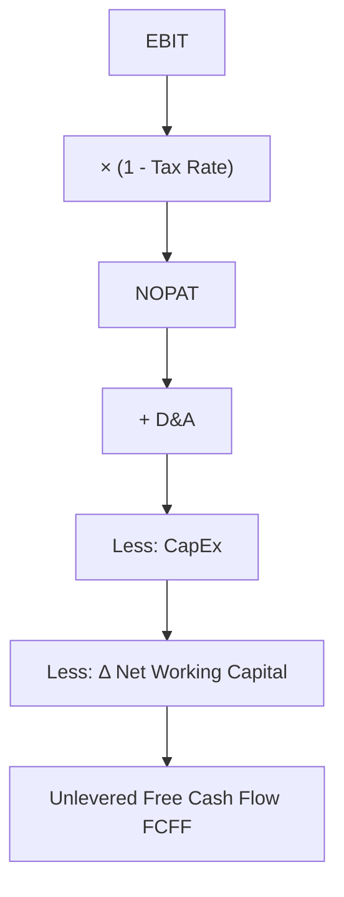

## Unlevered Free Cash Flow (FCFF) Derivation

### Overview and Purpose

Unlevered free cash flow, or Free Cash Flow to the Firm (FCFF), is the cash flow available to all capital providers — both debt and equity holders — before any financing effects. It is the cash flow metric used in an enterprise-value DCF, discounted at the weighted average cost of capital (WACC), to arrive at the total enterprise value of the firm. Because it excludes the effects of capital structure (interest expense, debt principal repayments), FCFF isolates the cash-generating capacity of the underlying operating business, independent of how it happens to be financed.

This distinguishes FCFF from Free Cash Flow to Equity (FCFE), which nets out debt-related cash flows and is discounted at the cost of equity to derive equity value directly.

### The Core FCFF Formula

The standard derivation starts from EBIT (earnings before interest and taxes):

$$FCFF = EBIT \times (1 - t) + D\&A - CapEx - \Delta NWC$$

Where:

- $EBIT$ = Earnings Before Interest and Taxes
- $t$ = the marginal or effective tax rate applied to EBIT
- $D\&A$ = Depreciation and Amortization (non-cash expense, added back)
- $CapEx$ = Capital Expenditures (cash outflow for fixed assets)
- $\Delta NWC$ = the increase (use) or decrease (source) in Net Working Capital

An equally common variant starts from Net Income and adds back after-tax interest expense:

$$FCFF = NI + Int \times (1 - t) + D\&A - CapEx - \Delta NWC$$

Both formulas converge to the same result when applied consistently, since $EBIT \times (1-t)$ (often called NOPAT, Net Operating Profit After Tax) is mathematically equivalent to $NI + Int \times (1-t)$ under a consistent tax treatment.

A third variant starts from Cash Flow from Operations (CFO) as reported on the cash flow statement:

$$FCFF = CFO + Int \times (1 - t) - CapEx$$

This version is useful because CFO already incorporates D&A add-backs and working capital changes as reported, reducing the risk of double-counting or omission errors — but it requires care, since $\Delta NWC$ embedded in reported CFO may not match the analyst's own working capital forecast definition.

### Step-by-Step Derivation from EBIT

**Step 1 — Start with EBIT.** Use EBIT before any non-operating items (interest income/expense, gains/losses on asset sales, one-time charges), which should already have been normalized out per the historical normalization process.

**Step 2 — Apply the tax rate to derive NOPAT.** The tax rate applied here should typically be the **marginal statutory tax rate** the firm would face on operating income, not necessarily the effective tax rate reported in historical financials, since the effective rate can be distorted by one-time tax items, NOLs, or credits unrelated to the ongoing operating business. [Inference] Practitioners vary in whether they use marginal statutory, blended statutory (federal + state), or a normalized effective rate; the "right" choice depends on the specific tax situation and is a common point of analyst judgment.

**Step 3 — Add back D&A.** D&A is a non-cash expense that reduced EBIT but did not consume cash; it must be added back to convert from an accrual-based income figure to a cash-based measure.

**Step 4 — Subtract CapEx.** Capital expenditures represent real cash outflows for maintaining and growing the asset base, and are not captured in the income statement (they hit the balance sheet as PP&E and flow through D&A over time instead).

**Step 5 — Subtract the increase in Net Working Capital.** An increase in NWC (e.g., growing receivables and inventory faster than payables) represents cash tied up in operations; a decrease represents cash freed up.

$$\Delta NWC = NWC_t - NWC_{t-1}$$

where $NWC$ is typically defined as (Accounts Receivable + Inventory + Other Current Operating Assets) − (Accounts Payable + Accrued Liabilities + Other Current Operating Liabilities), excluding cash and short-term debt.

### Worked Numerical Example

| Line Item | Value ($M) |
| --- | --- |
| EBIT | 150.0 |
| Tax Rate | 25% |
| NOPAT = EBIT × (1 − 0.25) | 112.5 |
| (+) D&A | 40.0 |
| (−) CapEx | (55.0) |
| (−) Δ NWC | (12.0) |
| **Unlevered FCF (FCFF)** | **85.5** |

Reconciling via the Net Income approach for the same company:

| Line Item | Value ($M) |
| --- | --- |
| Net Income | 90.0 |
| (+) Interest Expense × (1 − 0.25) | 15.0 |
| (+) D&A | 40.0 |
| (−) CapEx | (55.0) |
| (−) Δ NWC | (12.0) |
| **Unlevered FCF (FCFF)** | **78.0** |

**Note on the discrepancy above**: the two approaches only reconcile exactly when $NI + Int(1-t)$ equals $EBIT(1-t)$, which requires that Net Income, Interest, and EBIT are drawn from a fully consistent income statement with no other non-operating items (e.g., no interest income, no other non-operating gains/losses, and the same tax rate applied throughout). In practice, analysts should reconcile any such differences line by line rather than assume the two approaches are automatically interchangeable — this is a common source of modeling errors.

### Treatment of Specific Adjustment Items

**Stock-Based Compensation (SBC)**

SBC is a non-cash expense embedded in operating expenses that reduces EBIT and Net Income but does not consume cash in the period incurred. Analysts are divided on treatment:

- **Add back as non-cash** (like D&A), treating the dilutive effect as captured separately in the share count used for per-share value
- **Treat as a real economic cost** and do not add it back (or add it back but then subtract an estimated cash-equivalent cost), reflecting the view that SBC is a genuine cost of doing business that will require future share issuance or cash-funded buybacks to offset dilution

[Speculation] There is no universal consensus among practitioners on SBC treatment; treatment often depends on the analyst's or firm's specific valuation philosophy and the materiality of SBC for the company in question.

**Operating Leases (Post-ASC 842 / IFRS 16)**

Under current lease accounting standards, right-of-use assets and lease liabilities appear on the balance sheet. Analysts must decide whether to treat lease payments as an operating expense (as historically done, keeping EBIT lower) or reclassify the interest component of the lease liability as debt-like financing (raising EBITDA/EBIT but adding a lease-related "debt" balance). Consistency between the FCFF calculation and the treatment of lease obligations in the enterprise value bridge is essential to avoid double-counting or omitting lease-related value.

**Deferred Taxes**

Some FCFF formulations explicitly add back the change in deferred tax liabilities/assets as an additional non-cash adjustment:

$$FCFF = EBIT(1-t) + D\&A - CapEx - \Delta NWC + \Delta DTL$$

This is more common when using effective (rather than pure cash) tax rates, since deferred tax changes capture the gap between book tax expense and actual cash taxes paid.

### FCFF vs. FCFE: Key Distinction

| Feature | FCFF (Unlevered) | FCFE (Levered) |
| --- | --- | --- |
| Starting point | EBIT or CFO | Net Income |
| Interest expense | Excluded (added back after-tax if starting from NI) | Included (already reflected in NI) |
| Debt principal changes | Excluded | Included (net borrowing/repayment) |
| Discount rate | WACC | Cost of Equity |
| Resulting value | Enterprise Value | Equity Value directly |

$$FCFE = FCFF - Int \times (1-t) + Net\ Borrowing$$

**Key Points**

- FCFF-based DCF is generally preferred for companies with volatile or changing capital structures (e.g., LBO targets, companies undergoing refinancing), since it avoids forecasting debt schedules explicitly within the cash flow itself
- FCFE-based DCF is more direct for equity valuation but requires explicit modeling of debt issuance/repayment schedules, which introduces additional forecasting complexity and potential circularity (interest expense depends on debt balance, which depends on cash flow, which depends on interest expense)

### Common Errors in FCFF Derivation

- **Double-counting interest**: including interest expense in EBIT calculation (i.e., actually starting from EBT instead of EBIT) while also failing to add it back, understating FCFF
- **Using the wrong tax rate**: applying the historical effective tax rate (which may reflect one-time tax benefits or NOL utilization) rather than a normalized marginal rate to a growing, profitable forecast period
- **Inconsistent working capital definition**: mixing a working capital change derived from the balance sheet with one derived from the cash flow statement without reconciling definitional differences (e.g., inclusion/exclusion of cash, short-term debt, or specific accrued items)
- **Omitting maintenance vs. growth capex distinction**: applying a single blended CapEx assumption inappropriately across scenarios where the two require different modeling logic (see also: maintenance vs. growth capital expenditure forecasting)
- **Circularity from lease reclassification**: adjusting EBIT upward for lease treatment without correspondingly adjusting the enterprise-to-equity value bridge for lease liabilities, causing an inconsistent valuation

### FCFF in the Broader DCF Structure

FCFF sits at the center of the enterprise-value DCF workflow: it converts the forecasted income statement and balance sheet drivers into the cash flow stream that is ultimately discounted, making its correct derivation one of the highest-leverage steps in the entire valuation exercise — a single sign error or double-counted item flows directly into every projected period and the terminal value.

**Related Topics**

- Free Cash Flow to Equity (FCFE) Derivation and Reconciliation
- Maintenance vs. Growth Capital Expenditure Forecasting
- Net Working Capital Forecasting and Cash Conversion Cycle
- Normalizing EBIT for Non-Recurring and Non-Operating Items
- Treatment of Operating Leases in Enterprise Value (ASC 842 / IFRS 16)
- Stock-Based Compensation Treatment in DCF Models
- WACC Construction and the Capital Structure Weighting Debate
- Terminal Value: Gordon Growth vs. Exit Multiple Methods