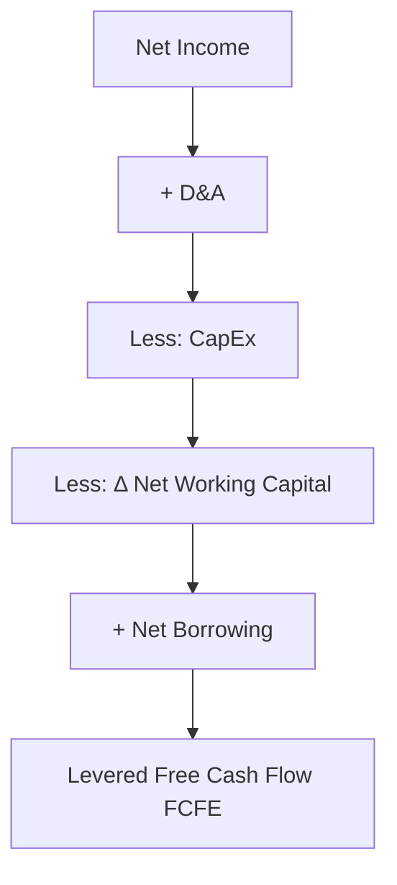
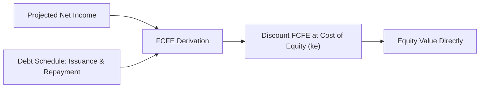

## Levered Free Cash Flow (FCFE) Derivation

### Overview and Purpose

Levered Free Cash Flow, or Free Cash Flow to Equity (FCFE), represents the cash flow available to a firm's common equity holders after all operating expenses, taxes, interest payments, and net debt repayments/issuances have been accounted for. Unlike FCFF, which measures cash available to all capital providers, FCFE isolates the residual cash flow that specifically belongs to shareholders — making it the appropriate metric for an equity-value DCF, discounted at the cost of equity ($k_e$) rather than WACC.

FCFE-based valuation directly produces equity value without requiring a subsequent enterprise-to-equity bridge, but this convenience comes at the cost of requiring explicit forecasts of the firm's debt schedule, which introduces additional complexity and, in leveraged contexts, circularity risk.

### The Core FCFE Formula

**From Net Income:**

$$FCFE = NI + D\&A - CapEx - \Delta NWC + Net\ Borrowing$$

Where:

- $NI$ = Net Income (already reflects interest expense and taxes)
- $D\&A$ = Depreciation and Amortization (non-cash add-back)
- $CapEx$ = Capital Expenditures
- $\Delta NWC$ = Increase (use) or decrease (source) in Net Working Capital
- $Net\ Borrowing$ = New debt issuance minus debt repayments (principal only)

**From FCFF (the reconciliation approach):**

$$FCFE = FCFF - Int \times (1 - t) + Net\ Borrowing$$

This form makes explicit that FCFE differs from FCFF by exactly two items: subtracting the after-tax cost of interest already embedded in FCFF's unlevered construction, and adding back the net cash flow effect of changes in the debt balance.

### Step-by-Step Derivation from Net Income

**Step 1 — Start with Net Income.** Net Income already reflects interest expense, taxes, and any non-operating items, so no separate interest add-back is needed (in contrast to FCFF's NOPAT starting point).

**Step 2 — Add back D&A.** Same treatment as in FCFF — a non-cash expense that reduced accounting income but not cash.

**Step 3 — Subtract CapEx.** Same treatment as in FCFF.

**Step 4 — Subtract the increase in Net Working Capital.** Same definition and mechanics as in FCFF.

**Step 5 — Add Net Borrowing.** This is the item unique to FCFE: cash inflows from new debt issuance, net of cash outflows for scheduled or discretionary principal repayments.

$$Net\ Borrowing = New\ Debt\ Issued - Debt\ Repaid$$

A firm that is deleveraging will show negative net borrowing (a cash outflow reducing FCFE); a firm raising incremental debt to fund growth or a dividend/buyback will show positive net borrowing (a cash inflow increasing FCFE).

### Worked Numerical Example

Starting from the same underlying company as the FCFF illustration, with debt schedule detail added:

| Line Item | Value ($M) |
| --- | --- |
| Net Income | 90.0 |
| (+) D&A | 40.0 |
| (−) CapEx | (55.0) |
| (−) Δ NWC | (12.0) |
| (+) Net Borrowing (New Debt $20M − Repayment $8M) | 12.0 |
| **Levered Free Cash Flow (FCFE)** | **75.0** |

Reconciling from FCFF (using the FCFF of $78.0M computed via the Net Income + after-tax interest approach in the prior topic):

| Line Item | Value ($M) |
| --- | --- |
| FCFF | 78.0 |
| (−) Interest Expense × (1 − 0.25) | (15.0) |
| (+) Net Borrowing | 12.0 |
| **FCFE** | **75.0** |

Both derivation paths converge to the same $75.0M result, confirming internal consistency between the two formulations.

### Net Borrowing: Sourcing and Forecasting

Net borrowing forecasts should be grounded in one of the following, in descending order of reliability:

1. **Contractual debt schedules**: known maturity dates, mandatory amortization schedules, and revolver draw/paydown mechanics disclosed in debt agreements or the company's debt footnote
2. **Management's stated capital structure policy**: e.g., a disclosed target leverage ratio (Net Debt/EBITDA) that the company manages toward, implying debt issuance or paydown as EBITDA grows
3. **Analyst assumption of a constant capital structure**: holding the debt-to-capital ratio constant over the forecast period, with net borrowing solving algebraically to maintain that ratio as the balance sheet grows
4. **Assumption of no net borrowing**: a simplifying assumption sometimes used when debt is not a significant or actively managed variable, though this is less common in FCFE-specific analysis since capital structure changes are the entire point of the FCFE distinction from FCFF

**Key Points**

- Because net borrowing is forecast-driven and often assumption-heavy, FCFE valuations are particularly sensitive to the analyst's capital structure assumption, more so than FCFF valuations
- In leveraged buyout (LBO) contexts, where mandatory debt amortization and cash sweep mechanics are central to the investment thesis, FCFE (or equivalent equity cash flow waterfalls) is generally the more natural and commonly used framework compared to FCFF

### The Circularity Problem in FCFE Modeling

A well-known modeling challenge in FCFE (and in levered DCF generally) arises because:

- Interest expense depends on the debt balance
- The debt balance depends on cash flow available for debt paydown (in a cash-sweep structure)
- Cash flow available for debt paydown depends on FCFE
- FCFE is partly what we are trying to calculate

This circular reference is typically resolved using one of the following approaches:

- **Iterative calculation** with circularity switches (a manual "circuit breaker" toggle in the spreadsheet that can zero out the circular loop to unstick the model, then be re-enabled)
- **Average balance method**: computing interest expense on the average of beginning and ending debt balances within a period, which still creates circularity but is often more stable numerically
- **Copy-paste-as-values / iterative solver settings**: enabling iterative calculation settings in spreadsheet software to let the circular reference converge numerically
- **Assume beginning-of-period balances only**: computing interest expense solely off the prior period's ending debt balance, which breaks the circularity entirely at the cost of some precision, particularly for companies with significant intra-period debt paydown

[Inference] The choice among these approaches is a matter of modeling convention and risk tolerance for spreadsheet circularity; there is no single universally mandated method, though beginning-balance and average-balance conventions are both widely used in practice.

### FCFE vs. FCFF: When to Use Each

| Consideration | Favors FCFF | Favors FCFE |
| --- | --- | --- |
| Capital structure stability | Volatile or actively changing (e.g., LBOs, refinancings) | Stable, well-understood debt schedule |
| Valuation objective | Enterprise value (e.g., M&A, comparable transaction analysis) | Direct equity value (e.g., minority equity investment, public equity research) |
| Modeling complexity tolerance | Lower — avoids explicit debt schedule modeling | Higher — requires explicit debt schedule and circularity handling |
| Industry context | Non-financial corporates generally | Financial institutions (banks, insurers) where debt is a raw material of the business, not a financing choice, making FCFF/WACC less meaningful |

**Example**

Valuing a bank or insurance company is a canonical case favoring an FCFE-style (or dividend discount model) approach over FCFF/WACC, because for financial institutions, debt (deposits, policyholder liabilities) is an operating input to the business rather than a discretionary financing choice, making the separation of operating and financing cash flows embedded in FCFF's construction conceptually awkward.

### Discount Rate Consistency

FCFE must be discounted at the **cost of equity** ($k_e$), typically derived via CAPM:

$$k_e = r_f + \beta \times (r_m - r_f)$$

Using WACC to discount FCFE (or, conversely, using cost of equity to discount FCFF) is a common and material valuation error, since it mismatches the risk profile of the cash flow stream with an inconsistent discount rate, systematically over- or under-stating value.

**Key Points**

- FCFE is riskier to equity holders than FCFF is to total capital providers (since equity is subordinate to debt), which is why $k_e > WACC$ in essentially all cases with any leverage
- The terminal value in an FCFE-based DCF should apply the same discount rate and growth logic as the FCFF approach, adjusted consistently for the equity-specific discount rate

### Common Errors in FCFE Derivation

- **Discounting FCFE at WACC** instead of cost of equity, or vice versa with FCFF — the single most common and highest-impact error in levered DCF work
- **Omitting net borrowing entirely**, effectively collapsing FCFE into an unlevered-adjacent figure that no longer reflects the actual cash available to equity holders
- **Inconsistent debt schedule assumptions** between the FCFE cash flow build and the balance sheet forecast, causing the projected debt balance to disagree with the net borrowing figures used in the cash flow statement
- **Failing to resolve circularity properly**, leading to unstable or non-converging spreadsheet outputs that produce different answers depending on calculation order or manual iteration count
- **Double-counting dividends or buybacks**: FCFE represents cash flow *available* to equity holders, not cash flow *actually distributed*; conflating FCFE with actual dividends paid conflates a capacity measure with a policy choice

### FCFE in the Broader Valuation Structure

Because FCFE produces equity value directly, it bypasses the enterprise-to-equity bridge required in FCFF-based DCF work (subtracting net debt, minority interest, and preferred stock). This makes FCFE conceptually attractive for direct equity valuation, but the explicit debt modeling and circularity management it requires mean FCFF/WACC remains the more commonly used framework in general corporate valuation practice, with FCFE reserved for cases — financial institutions, LBOs, and situations with a well-defined, contractually specified debt schedule — where its assumptions are most reliably grounded.

**Related Topics**

- Unlevered Free Cash Flow (FCFF) Derivation and Reconciliation
- Cost of Equity Estimation via CAPM and Build-Up Methods
- WACC Construction and the Capital Structure Weighting Debate
- Debt Schedule Modeling and Cash Sweep Mechanics
- Resolving Circular References in Levered Financial Models
- Dividend Discount Models vs. FCFE for Financial Institution Valuation
- Terminal Value Construction Under FCFE vs. FCFF Frameworks
- Leveraged Buyout (LBO) Modeling and Equity Returns Analysis