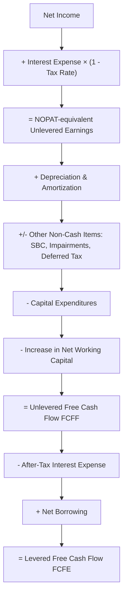

## Reconciling Net Income to Free Cash Flow

### Overview and Purpose

Reconciling Net Income to Free Cash Flow is the analytical discipline of explicitly bridging the accrual-based accounting profit reported on the income statement to the cash-based measures — FCFF and FCFE — used in a DCF valuation. Net Income is computed under accrual accounting principles (revenue recognition, matching principle, non-cash charges), while free cash flow is a purely cash concept. The two diverge for identifiable, structural reasons, and a rigorous reconciliation walk is essential both for building an error-free model and for explaining to a reviewer or stakeholder exactly why "the company made $90M but only generated $75M of free cash flow."

This topic ties together the FCFF and FCFE derivations covered previously by focusing specifically on the *bridge* — the itemized walk from one figure to the other — as a standalone analytical and communication tool.

### Why Net Income Diverges from Free Cash Flow

Three broad categories of divergence exist:

1. **Non-cash items embedded in Net Income**: expenses or income recognized under accrual accounting that do not correspond to a cash movement in the period (D&A, stock-based compensation, non-cash impairments, deferred tax expense)
2. **Cash items not embedded in Net Income**: cash outflows or inflows that do not appear on the income statement at all (capital expenditures, changes in working capital, debt issuance/repayment)
3. **Timing differences between revenue/expense recognition and cash receipt/payment**: the core driver of working capital changes (e.g., revenue recognized before cash is collected creates a receivable; an expense recognized before cash is paid creates a payable)

### The Full Reconciliation Bridge (Net Income to FCFF)

This single walk shows both FCFF and FCFE as points along one continuous bridge from Net Income, rather than as two disconnected formulas — which is the most useful way to present a reconciliation in a model or memo.

### Worked Full Reconciliation Example

Using the same illustrative company as prior topics:

| Step | Line Item | Amount ($M) | Running Total |
| --- | --- | --- | --- |
| Start | Net Income | 90.0 | 90.0 |
| + | Interest Expense × (1 − 25%) | 15.0 | 105.0 |
| = | Unlevered Earnings (NOPAT-equivalent) | — | **105.0** |
| + | Depreciation & Amortization | 40.0 | 145.0 |
| + | Stock-Based Compensation (non-cash) | 8.0 | 153.0 |
| + | Deferred Tax Expense (non-cash portion) | 3.0 | 156.0 |
| − | Capital Expenditures | (55.0) | 101.0 |
| − | Increase in Net Working Capital | (12.0) | 89.0 |
| **=** | **Unlevered Free Cash Flow (FCFF)** | — | **89.0** |
| − | After-Tax Interest Expense | (15.0) | 74.0 |
| + | Net Borrowing (Issuance − Repayment) | 12.0 | 86.0 |
| **=** | **Levered Free Cash Flow (FCFE)** | — | **86.0** |

Note this figure differs slightly from the FCFF/FCFE examples in the prior two topics because this reconciliation explicitly includes SBC and deferred tax add-backs that were omitted for simplicity in the earlier standalone derivations — illustrating exactly why a full reconciliation walk, rather than the shorthand formula alone, is the more robust practice for a live model.

**Key Points**

- Presenting the bridge as a running total (rather than isolated line items) makes it immediately clear how much each individual adjustment moves the final cash flow figure, which is valuable both for internal QA and for external presentation
- A reconciliation bridge should be rebuilt every time a new non-cash or timing item is discovered during historical statement review (e.g., a newly identified impairment or a contingent liability accrual)

### Reconciling via the Cash Flow Statement (CFO-Based Bridge)

An alternative and often more robust reconciliation path starts from the reported **Cash Flow from Operations (CFO)** line, since CFO is itself already a reconciliation of Net Income to operating cash flow performed by the company's own accounting under the indirect method:

$$FCFF = CFO + Int \times (1-t) - CapEx$$

| Step | Line Item | Amount ($M) |
| --- | --- | --- |
| Net Income |  | 90.0 |
| + D&A |  | 40.0 |
| + Stock-Based Compensation |  | 8.0 |
| + Deferred Taxes |  | 3.0 |
| − Increase in Working Capital |  | (12.0) |
| **= Cash Flow from Operations (CFO)** |  | **129.0** |
| + Interest Expense × (1 − 25%) |  | 15.0 |
| − Capital Expenditures |  | (55.0) |
| **= Unlevered Free Cash Flow (FCFF)** |  | **89.0** |

This matches the direct-build result exactly, confirming consistency. **Using the reported CFO as an anchor point is often the preferred practical approach** because it leverages a figure the company has already reconciled under GAAP/IFRS, reducing the risk that an analyst misses an obscure non-cash item buried in the notes (e.g., unrealized foreign exchange gains/losses, equity in earnings of unconsolidated affiliates, gain/loss on asset disposals).

[Inference] Whether to build FCFF from EBIT directly or from reported CFO is a matter of analyst preference and available data granularity; the CFO-based approach is often considered lower-risk for historical periods, while the EBIT-based approach is generally necessary for forecast periods where a full cash flow statement has not yet been projected.

### Handling Specific Reconciling Items

**Stock-Based Compensation**

As discussed in FCFF derivation, SBC's treatment varies. In a reconciliation bridge, best practice is to show it as an explicit, separately labeled line — never silently bundled into "D&A and other non-cash items" — so that a reviewer can independently apply their own treatment preference for terminal value or dilution purposes.

**Deferred Taxes**

The reconciliation should isolate the deferred component of tax expense from the current (cash) component:

$$Cash\ Taxes\ Paid = Total\ Tax\ Expense - \Delta Deferred\ Tax\ Liability + \Delta Deferred\ Tax\ Asset$$

Including deferred tax changes as a reconciling item is most important when a company's book and cash tax rates diverge materially (e.g., due to accelerated tax depreciation, NOL carryforwards, or R&D tax credits).

**Gains and Losses on Asset Sales**

A gain on sale of an asset increases Net Income but is not a recurring operating cash flow; it must be subtracted out of the bridge (and the actual cash proceeds, if relevant to enterprise value, handled separately as a one-time item rather than embedded in ongoing FCFF).

**Equity in Earnings of Unconsolidated Affiliates**

Non-cash equity method income included in Net Income (representing the company's share of an affiliate's earnings, not actual cash received) should be subtracted, with any actual cash dividends received from the affiliate added back separately if not already captured elsewhere.

**Currency Translation and Remeasurement Gains/Losses**

Non-cash foreign currency translation adjustments that flow through the income statement (as opposed to OCI) should be identified and excluded from the reconciliation as non-operating, non-cash items.

### Reconciliation as a Quality Control Tool

Beyond its role in building the DCF cash flow schedule itself, the Net Income–to–FCF reconciliation serves as a critical **quality control checkpoint**:

- **Historical validation**: reconciling several years of historical Net Income to actual reported CFO and comparing to the analyst's own bridge calculation surfaces modeling errors or misunderstood line items before they propagate into the forecast
- **Forecast consistency check**: in projected periods, the reconciliation confirms that the modeled income statement, balance sheet, and cash flow statement are fully integrated and mutually consistent (e.g., that the projected change in receivables on the balance sheet matches the working capital adjustment used in the cash flow bridge)
- **Cross-model comparability**: when comparing a company's DCF-implied FCF to third-party data (e.g., a data provider's reported "free cash flow" figure, which is often just CFO minus CapEx without the analyst's specific interest and non-cash adjustments), the reconciliation identifies definitional differences before they are mistaken for calculation errors

**Example**

An analyst notices that a third-party financial data platform reports "Free Cash Flow" for a company at $74M, while their own model produces $89M FCFF. Walking the reconciliation reveals the data platform's figure is simply CFO minus CapEx ($129.0M − $55.0M = $74.0M) without adding back after-tax interest expense — i.e., the third-party figure is closer to an FCFE-adjacent measure netted differently, not a comparable FCFF figure. This distinction matters enormously when benchmarking valuation multiples or growth assumptions against external data sources.

### Common Errors in Reconciliation

- **Treating reconciliation as optional**: building FCFF/FCFE directly from formulas without ever cross-checking against a full bridge, which allows errors (sign flips, omitted items, double-counted add-backs) to go undetected
- **Mismatched tax rate application**: applying a different tax rate to the interest add-back than was used elsewhere in the same model, breaking internal consistency
- **Failing to isolate one-time items**: allowing a one-time gain or loss to flow through the reconciliation as if it were a recurring non-cash item, distorting the historical base used for forecasting
- **Ignoring balance sheet integration**: computing $\Delta NWC$ using a different working capital definition in the reconciliation bridge than the one used elsewhere in the model (e.g., in the balance sheet forecast), leading to inconsistent forecasted cash balances

### Reconciliation Bridge as a Diagnostic Chart

<svg xmlns="http://www.w3.org/2000/svg" viewBox="0 0 760 320" font-family="Arial, sans-serif">
<text x="380" y="24" text-anchor="middle" font-size="15" font-weight="bold" fill="#1a1a1a">Net Income to FCFF Waterfall Bridge (svg_diagram)</text>
<line x1="50" y1="270" x2="720" y2="270" stroke="#999" stroke-width="1" />
<rect x="60" y="130" width="70" height="140" fill="#4285f4" />
<text x="95" y="285" text-anchor="middle" font-size="10" fill="#333">Net Income</text>
<text x="95" y="120" text-anchor="middle" font-size="10" fill="#1a1a1a">90.0</text>
<rect x="150" y="105" width="70" height="25" fill="#34a853" />
<text x="185" y="285" text-anchor="middle" font-size="9" fill="#333">+ Int(1-t)</text>
<text x="185" y="95" text-anchor="middle" font-size="10" fill="#1a1a1a">+15.0</text>
<rect x="240" y="80" width="70" height="50" fill="#34a853" />
<text x="275" y="285" text-anchor="middle" font-size="9" fill="#333">+ D&amp;A</text>
<text x="275" y="70" text-anchor="middle" font-size="10" fill="#1a1a1a">+40.0</text>
<rect x="330" y="70" width="70" height="10" fill="#34a853" />
<text x="365" y="285" text-anchor="middle" font-size="9" fill="#333">+ SBC</text>
<text x="365" y="60" text-anchor="middle" font-size="10" fill="#1a1a1a">+8.0</text>
<rect x="420" y="66" width="70" height="4" fill="#34a853" />
<text x="455" y="285" text-anchor="middle" font-size="9" fill="#333">+ Def. Tax</text>
<text x="455" y="56" text-anchor="middle" font-size="10" fill="#1a1a1a">+3.0</text>
<rect x="510" y="66" width="70" height="70" fill="#ea4335" />
<text x="545" y="285" text-anchor="middle" font-size="9" fill="#333">- CapEx</text>
<text x="545" y="56" text-anchor="middle" font-size="10" fill="#1a1a1a">-55.0</text>
<rect x="600" y="121" width="70" height="15" fill="#ea4335" />
<text x="635" y="285" text-anchor="middle" font-size="9" fill="#333">- ΔNWC</text>
<text x="635" y="111" text-anchor="middle" font-size="10" fill="#1a1a1a">-12.0</text>
<rect x="640" y="141" width="70" height="129" fill="#f9a825" />
<text x="675" y="285" text-anchor="middle" font-size="9" fill="#1a1a1a" font-weight="bold">FCFF</text>
<text x="675" y="131" text-anchor="middle" font-size="10" font-weight="bold" fill="#1a1a1a">89.0</text>
</svg>

**Related Topics**

- Unlevered Free Cash Flow (FCFF) Derivation
- Levered Free Cash Flow (FCFE) Derivation
- Net Working Capital Forecasting and Cash Conversion Cycle
- Normalizing EBIT and Net Income for Non-Recurring Items
- Deferred Tax Assets, Liabilities, and Cash Tax Rate Estimation
- Stock-Based Compensation Treatment in DCF Models
- Integrated Three-Statement Modeling and Cross-Statement Consistency Checks
- Maintenance vs. Growth Capital Expenditure Forecasting