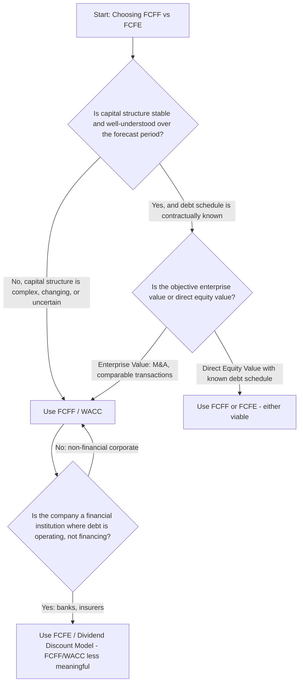

## Choosing Between FCFF and FCFE

### Overview and Purpose

Choosing between FCFF (unlevered) and FCFE (levered) as the cash flow basis for a DCF is a foundational modeling decision that shapes the entire valuation architecture — the discount rate used, the treatment of debt, the complexity of the forecast, and the exposure to circularity risk. This is not merely a mechanical choice between two formulas; it reflects a judgment about which framework best matches the company's capital structure behavior, the purpose of the valuation, and the analyst's tolerance for modeling complexity.

This topic synthesizes the decision framework, building on the individual FCFF and FCFE derivations and their reconciliation covered previously.

### The Core Decision Framework

### Primary Decision Criteria

#### 1. Nature of the Business — Financial vs. Non-Financial

For **non-financial corporates**, debt is a discretionary financing choice layered on top of an operating business; FCFF/WACC cleanly separates operating performance from financing decisions, which is why FCFF is the dominant framework in general corporate valuation.

For **financial institutions** (banks, insurance companies, some asset managers), debt-like liabilities (deposits, policyholder reserves, wholesale funding) are a raw material of the business itself, not a financing overlay. Attempting to compute an "unlevered" cash flow for a bank is often conceptually incoherent, since interest income and interest expense are core operating activities, not financing activities layered on top of operations. **FCFE (or a dividend discount model variant) is standard practice for financial institution valuation** for this reason.

#### 2. Capital Structure Stability

| Scenario | Implication |
| --- | --- |
| Stable target leverage ratio, no major refinancing expected | Either framework workable; FCFF/WACC often simpler |
| Actively changing capital structure (planned deleveraging, refinancing, upcoming debt maturity wall) | FCFF avoids needing to forecast the debt schedule inside the cash flow itself; WACC can be updated period-by-period to reflect the changing structure |
| Highly leveraged with contractually specified, mandatory amortization (e.g., LBO, project finance) | FCFE-style equity cash flow waterfalls are typically more natural, since the entire investment thesis often centers on debt paydown and its effect on equity value |

**Key Points**

- A common source of confusion: FCFF/WACC *can* handle a changing capital structure by allowing WACC to vary by period (as capital structure weights shift), but this is more complex than the single blended WACC typically used in standard practice, and many practitioners default to a constant target WACC even when leverage is expected to change — a modeling simplification worth flagging explicitly to a reviewer
- FCFE more directly captures the cash flow consequences of a specific, known debt paydown schedule, since net borrowing is an explicit line item rather than embedded in a discount rate assumption

#### 3. Valuation Objective

- **Enterprise value needed** (M&A analysis, comparable transaction benchmarking, LBO purchase price analysis, capital structure-agnostic company comparison) → **FCFF** is the natural fit, since enterprise value is capital-structure-neutral by construction
- **Direct equity value needed with minimal intermediate steps** (minority equity investment analysis, public equity research price targets in some contexts) → **FCFE** can be more direct, though FCFF followed by the standard enterprise-to-equity bridge (subtracting net debt, minority interest, preferred stock) is equally valid and arguably more transparent about the components of value

#### 4. Modeling Complexity and Circularity Tolerance

FCFE requires an explicit debt schedule with issuances and repayments modeled period by period, which:

- Introduces the interest-expense/debt-balance circularity problem discussed in FCFE derivation
- Requires more granular assumptions (specific debt tranches, maturity dates, revolver mechanics) that may not be necessary for an FCFF-based valuation
- Increases the number of assumptions subject to governance and documentation (see: forecast assumptions documentation and governance)

FCFF avoids this by absorbing capital structure effects into the WACC discount rate rather than the cash flow stream itself, at the cost of requiring a separate net debt bridge to get from enterprise value to equity value.

**Example**

An analyst valuing a stable, investment-grade industrial company with a long-standing 30% debt-to-capital target and no major refinancing on the horizon would generally default to **FCFF/WACC**: the capital structure is stable enough that a constant WACC is a reasonable simplification, and FCFF avoids the added complexity of explicit debt scheduling for a company where debt is not the central story.

An analyst valuing a private equity portfolio company two years post-LBO, with a mandatory amortization schedule, a cash sweep provision, and management targeting rapid deleveraging, would generally use an **explicit debt schedule with FCFE-style equity cash flows** (or, equivalently, an FCFF build combined with a detailed debt paydown schedule feeding into equity value), since the deleveraging trajectory is central to the investment thesis and cannot be adequately captured by a static WACC.

### Hybrid and Practical Middle-Ground Approaches

In practice, many models blend elements of both frameworks:

- **FCFF with a detailed net debt schedule**: build FCFF and discount at WACC to get enterprise value, but still maintain a detailed period-by-period debt schedule (for interest expense forecasting accuracy within EBIT, and for computing net debt at each future date) even though the cash flow being discounted is unlevered
- **Adjusted Present Value (APV)**: values the unlevered firm (using FCFF discounted at the unlevered cost of equity, not WACC) and separately values the tax shield from debt, then sums the two — useful when the capital structure is expected to change significantly and a single WACC would poorly capture the changing tax shield value over time
- **FCFE with a simplified constant-leverage proxy**: rather than modeling an explicit debt schedule, some analysts approximate net borrowing as the amount needed to hold a constant leverage ratio as the balance sheet grows, avoiding full debt schedule granularity while still working in an FCFE framework

[Inference] The prevalence of each hybrid approach varies significantly by industry, deal context (e.g., LBO modeling standards differ from public equity research norms), and firm-specific modeling conventions; there is no single dominant practice across all valuation contexts.

### Practical Checklist for the Decision

| Question | If "Yes" | If "No" |
| --- | --- | --- |
| Is the target a bank, insurer, or similar financial institution? | Favor FCFE / DDM | Continue to next question |
| Is there a specific, contractually known debt paydown schedule central to the thesis (e.g., LBO)? | Favor FCFE or explicit debt schedule approach | Continue to next question |
| Is the primary deliverable an enterprise value (for M&A, comps, or transaction benchmarking)? | Favor FCFF | Continue to next question |
| Is capital structure expected to remain roughly stable over the forecast horizon? | FCFF/WACC is a reasonable simplification | Consider APV or period-varying WACC |
| Is there low tolerance for spreadsheet circularity risk? | Favor FCFF | FCFE viable if circularity is properly managed |

### Common Errors in the FCFF/FCFE Choice

- **Mixing frameworks inconsistently**: discounting FCFF at cost of equity, or FCFE at WACC — a direct and severe methodological error covered in FCFE derivation, but one that recurs specifically when analysts switch between frameworks mid-project without updating the discount rate
- **Choosing FCFE for complexity's sake alone**: adding explicit debt schedule modeling and circularity risk to a company where capital structure is genuinely stable and a constant WACC would have been an adequate, simpler choice
- **Choosing FCFF for a financial institution**: attempting to separate "operating" from "financing" cash flows for a bank, where the distinction is often not economically meaningful, producing a distorted or uninterpretable valuation
- **Failing to disclose the simplification**: using a constant WACC under FCFF for a company with genuinely changing leverage without flagging this as a modeling simplification in the assumptions documentation, potentially misleading a reviewer about the model's precision

### Summary Comparison

| Dimension | FCFF (Unlevered) | FCFE (Levered) |
| --- | --- | --- |
| Cash flow available to | All capital providers | Common equity holders only |
| Discount rate | WACC | Cost of equity ($k_e$) |
| Requires explicit debt schedule | No (absorbed into WACC) | Yes |
| Circularity risk | Low | Higher (interest/debt balance loop) |
| Direct output | Enterprise value (requires bridge to equity value) | Equity value directly |
| Best suited for | Non-financial corporates, M&A/comps context, capital-structure-neutral comparison | Financial institutions, LBOs, companies with known/central debt paydown schedules |

**Next Steps**

- Adjusted Present Value (APV) as an Alternative to WACC-Based DCF
- WACC Construction and the Capital Structure Weighting Debate
- Debt Schedule Modeling and Cash Sweep Mechanics
- Cost of Equity Estimation via CAPM and Build-Up Methods
- Dividend Discount Models for Financial Institution Valuation
- Resolving Circular References in Levered Financial Models
- Enterprise Value to Equity Value Bridge Construction
- Leveraged Buyout (LBO) Modeling and Equity Returns Analysis