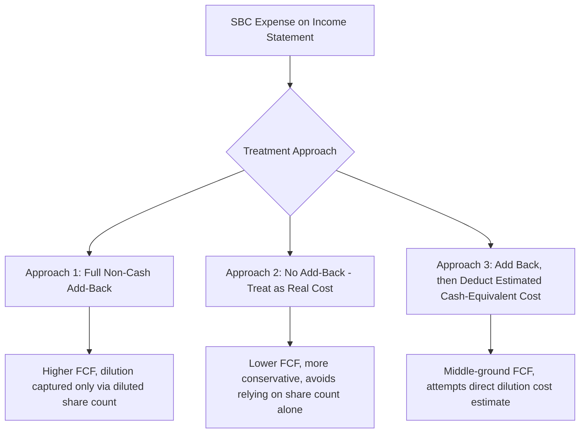

## Treatment of Stock-Based Compensation in Free Cash Flow

### Overview and Purpose

Stock-based compensation (SBC) treatment in free cash flow construction is one of the most consequential and contested judgment calls in DCF modeling, particularly for technology, biotech, and other growth-oriented companies where SBC can represent a substantial percentage of revenue. Because SBC is a non-cash expense on the income statement but has real economic costs through shareholder dilution, no single treatment is universally "correct" — the choice materially affects both projected free cash flow and, if handled inconsistently, can double-count or entirely omit a genuine economic cost.

This topic addresses SBC in depth, building on its brief treatment as a reconciling item in the FCFF derivation and Net Income reconciliation topics.

### Why SBC Creates a Valuation Problem

SBC (typically restricted stock units, stock options, or performance shares granted to employees) is expensed on the income statement over its vesting period per accounting standards (ASC 718 in US GAAP), reducing Net Income and EBIT. However:

- **No cash leaves the company** when the expense is recognized (the cash cost, if any, was effectively pre-funded by shareholders diluting their ownership)
- **The economic cost is real**: existing shareholders are diluted as new shares are issued to employees, transferring value from existing holders to employees, even though no cash changes hands
- **The magnitude can be substantial**: for many high-growth technology companies, SBC can represent 10–25%+ of revenue, making its treatment highly material to the valuation output

This creates a fundamental tension: treating SBC purely as a non-cash add-back (like D&A) overstates free cash flow relative to the true economic cost borne by shareholders, while ignoring the add-back entirely understates the cash-generating capacity of the business as commonly measured.

### The Three Primary Treatment Approaches

#### Approach 1: Full Non-Cash Add-Back

SBC is added back to Net Income or EBIT exactly like D&A, on the premise that it is genuinely non-cash in the period, and the dilutive economic cost is instead captured entirely through the use of a **fully diluted share count** in the final per-share value calculation.

$$FCFF = EBIT(1-t) + D\&A + SBC - CapEx - \Delta NWC$$

**Key Points**

- This is mechanically the simplest approach and is common in sell-side equity research and many standard DCF templates
- Its validity depends entirely on the diluted share count assumption being accurate and forward-looking (i.e., using the treasury stock method or a fully diluted count that reflects expected future dilution, not just currently outstanding options), since the entire dilution cost is being pushed into that one downstream calculation
- Risk: if the analyst uses a basic (non-diluted) share count, or a diluted count based only on *currently outstanding* awards without accounting for ongoing future grants, this approach can meaningfully overstate per-share value by fully crediting SBC as free cash while under-capturing the offsetting dilution

#### Approach 2: No Add-Back (Treat as a Real Economic Cost)

SBC is **not** added back — it is treated as if it were a genuine cash operating expense, on the premise that it represents a real transfer of value from shareholders and, in steady state, a company must either issue new shares indefinitely (perpetual dilution) or spend actual cash buying back shares to offset the dilution, making it economically equivalent to a cash cost either way.

$$FCFF = EBIT(1-t) - CapEx - \Delta NWC \quad \text{(D\&A added back, but SBC excluded from add-backs)}$$

**Key Points**

- This is the more conservative approach and is favored by analysts and investors skeptical that diluted share count adjustments alone adequately capture the ongoing cost of SBC-funded compensation programs
- Its main criticism is that it may understate near-term free cash flow for a company that is not, in fact, spending cash to offset dilution (e.g., a company allowing dilution to occur without an active buyback program), effectively double-penalizing the company for a cost it isn't currently cash-funding
- This approach is particularly favored when SBC is a large percentage of revenue and the company has a history of continuous, large share issuance without corresponding buybacks, since diluted share count alone may not fully capture an accelerating trend

#### Approach 3: Add Back, then Deduct an Estimated Cash-Equivalent Cost

SBC is added back as non-cash (as in Approach 1), but a separate deduction is applied to approximate the cash cost of offsetting the resulting dilution — often estimated as the cost of a hypothetical share buyback sufficient to keep the share count constant.

$$FCFF = EBIT(1-t) + D\&A + SBC - Estimated\ Buyback\ Cost\ to\ Offset\ Dilution - CapEx - \Delta NWC$$

The estimated buyback cost is typically approximated as:

$$Estimated\ Buyback\ Cost \approx New\ Shares\ Issued\ from\ SBC \times Current\ Share\ Price$$

**Key Points**

- This approach attempts to directly capture the economic cost of dilution in the cash flow itself, rather than relying entirely on the diluted share count mechanism
- It requires additional forecasting inputs (projected share issuance from vesting awards, share price assumption) that introduce their own estimation uncertainty
- [Inference] This approach is used less frequently in standard practice than Approaches 1 and 2 due to its added complexity, but is sometimes applied in more rigorous or academically-oriented valuation frameworks, or when a company's SBC levels are large enough that neither pure add-back nor pure exclusion is judged adequate

### Worked Comparative Example

Consider a growth technology company with the following figures ($M):

| Line Item | Value |
| --- | --- |
| EBIT (before SBC deduction reversal) | 100.0 |
| Tax Rate | 25% |
| D&A | 20.0 |
| SBC Expense | 30.0 |
| CapEx | 25.0 |
| Δ NWC | 5.0 |
| Diluted Shares Outstanding | 500M |
| Basic Shares Outstanding | 480M |
| Current Share Price | $40 |
| New Shares Issued from Vesting (estimate) | 4M |

**Approach 1 — Full Add-Back:**

$$FCFF = 100(1-0.25) + 20 + 30 - 25 - 5 = 75 + 20 + 30 - 25 - 5 = 95.0$$

FCF per diluted share: $95.0M / 500M = \$0.19$

**Approach 2 — No Add-Back:**

$$FCFF = 100(1-0.25) + 20 - 25 - 5 = 75 + 20 - 25 - 5 = 65.0$$

FCF per diluted share: $65.0M / 500M = \$0.13$

**Approach 3 — Add-Back with Estimated Offset:**

Estimated buyback cost to offset dilution: $4M \times \$40 = \$160M$ — but this is a one-time-period-scaled estimate that would typically be annualized or tied to the actual forecast period's share issuance rate rather than applied as a lump sum; for illustration, assume the relevant annual dilution offset cost is estimated at $18M (reflecting the recurring annual share issuance rate rather than a cumulative figure):

$$FCFF = 100(1-0.25) + 20 + 30 - 18 - 25 - 5 = 77.0$$

**Key Points**

- The three approaches produce materially different FCFF figures ($95M, $65M, $77M) from identical underlying operating performance — a spread of roughly 46% between the highest and lowest estimate — illustrating why SBC treatment must be explicitly documented and disclosed as an assumption (see: forecast assumptions documentation and governance) rather than left implicit
- No approach is "wrong" in isolation; the error is in applying one approach to the cash flow while implicitly assuming a different approach's logic elsewhere in the model (e.g., adding back SBC in full while also using a basic, non-diluted share count for per-share value — which would overstate value under both dimensions simultaneously)

### Consistency Requirements Across the Model

Whichever approach is chosen, it must be applied consistently across:

1. **The cash flow build itself** (add back or not)
2. **The share count used for per-share value** (diluted vs. basic, and whether the diluted count adequately reflects forward-looking dilution from ongoing future grants, not just currently outstanding awards)
3. **The terminal value calculation**, since SBC as a percentage of revenue may be assumed to converge toward a steady-state "mature company" level in the terminal year, and this assumption should be explicit and consistent with whichever SBC treatment approach was chosen for the explicit forecast period
4. **Peer and historical comparisons**, since comparing an FCFF margin computed with Approach 1 against a peer's or a data provider's FCF margin computed with a different implicit treatment produces a misleading comparison

**Example**

An analyst forecasting SBC as a declining percentage of revenue over the projection period (e.g., from 15% of revenue in Year 1 tapering to 5% by Year 5, reflecting an assumption that the company matures and SBC-heavy compensation practices normalize) must ensure the terminal year SBC assumption, the terminal year diluted share count growth assumption, and the terminal value growth rate are all mutually consistent — a terminal value calculated with near-zero assumed future dilution alongside a still-elevated terminal SBC add-back would be internally inconsistent.

### Industry and Practitioner Variation

[Speculation] There is no single dominant convention across all valuation contexts; practice varies by industry norms, firm-specific policy, and the specific analytical purpose:

- Growth-technology-focused equity research often defaults toward Approach 1 (full add-back) paired with careful diluted share count modeling
- More conservative, value-oriented, or credit-focused analysis often favors Approach 2 (no add-back) as a more conservative baseline
- Academic and some institutional valuation frameworks have explored Approach 3-style direct dilution cost estimation, though it remains less standardized in everyday practice

### Common Errors in SBC Treatment

- **Inconsistent share count usage**: adding back SBC in full (Approach 1) while using a basic share count instead of a properly forward-looking diluted count, compounding the overstatement of per-share value
- **Static diluted share count assumptions**: holding the diluted share count constant throughout the forecast period despite modeling continued SBC expense, which implicitly (and often incorrectly) assumes the company will conduct offsetting buybacks without explicitly modeling the cash cost of doing so
- **Silent treatment switching**: using Approach 1 in the explicit forecast period but implicitly shifting to Approach 2-like assumptions in the terminal value without disclosing the change
- **Failing to disclose the choice at all**: presenting a single FCFF figure without noting which of the three approaches was used, denying a reviewer the ability to assess the sensitivity of the valuation to this specific, high-impact judgment call

### Summary Comparison Table

| Approach | FCF Impact | Dilution Captured Via | Best Suited For |
| --- | --- | --- | --- |
| Full add-back | Highest FCF | Diluted share count only | Growth companies with rigorously forecasted diluted share counts |
| No add-back | Lowest FCF | Implicitly treated as ongoing cash cost | Conservative/credit-oriented analysis; companies with large, persistent SBC and no offsetting buybacks |
| Add-back + estimated offset | Middle FCF | Explicit cash-equivalent deduction plus share count | Rigorous, high-SBC-materiality situations warranting more granular treatment |

**Related Topics**

- Unlevered Free Cash Flow (FCFF) Derivation
- Reconciling Net Income to Free Cash Flow
- Fully Diluted Share Count and the Treasury Stock Method
- Terminal Value Assumptions and Steady-State Margin Normalization
- Forecast Assumptions Documentation and Governance
- Share Buyback Programs and Their Effect on Per-Share Value
- Normalizing Historical Financials for Non-Cash and Non-Recurring Items