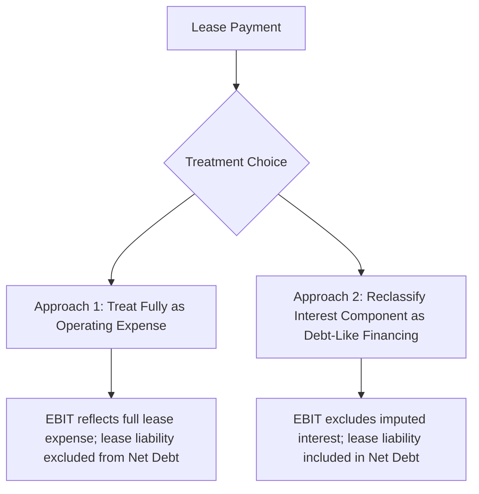

## Treatment of Capitalized Leases in Free Cash Flow

### Overview and Purpose

The treatment of capitalized leases in free cash flow construction addresses how lease obligations — now largely recognized on-balance-sheet under current accounting standards — should flow through EBIT, EBITDA, and the resulting FCFF or FCFE calculation. Since the adoption of ASC 842 (US GAAP) and IFRS 16, virtually all leases with terms beyond twelve months are capitalized as a right-of-use (ROU) asset and a corresponding lease liability, fundamentally changing how lease costs appear in the financial statements compared to the pre-2019 operating lease treatment. This creates important, frequently mishandled questions about consistency between the income statement, the cash flow build, and the enterprise-to-equity value bridge.

### Background: Lease Accounting Under ASC 842 / IFRS 16

Under current standards, leases are classified (under US GAAP) as either:

- **Finance leases** (formerly "capital leases"): the ROU asset is amortized separately, and the lease liability accretes interest expense, similar to debt-financed asset ownership — this depreciation and interest split flows through EBIT and the income statement much like owned PP&E financed with debt
- **Operating leases**: under ASC 842, a single lease expense is recognized on a straight-line basis over the lease term, which is **not** split into separate depreciation and interest components on the income statement (unlike finance leases), even though the balance sheet does recognize a ROU asset and lease liability

[Unverified] IFRS 16 does not retain the operating/finance lease distinction for lessees at all — under IFRS 16, virtually all leases are treated similarly to a finance lease with separate ROU asset amortization and interest expense recognition; this is a meaningful difference from US GAAP's continued operating/finance distinction under ASC 842, and analysts working across US GAAP and IFRS reporters should account for this structural difference explicitly.

This asymmetry under US GAAP — operating leases recognized as a single expense line without an explicit interest component, despite the presence of a lease liability that would suggest a debt-like financing element — is the central source of complexity in FCFF/FCFE treatment.

### The Core Question: Should Lease Payments Be Treated as Operating Expense or Debt-Like Financing?

#### Approach 1: Treat Lease Expense Fully as an Operating Cost

Under this approach — the simpler and still widely used convention, especially for operating leases under ASC 842 — the full lease expense (whether the straight-line operating lease expense or the combined depreciation + interest of a finance lease) is treated as an ordinary operating cost embedded in EBIT. The lease liability on the balance sheet is **excluded** from the Net Debt calculation used in the enterprise-to-equity bridge.

**Key Points**

- This approach is internally consistent as long as it is applied symmetrically: since the full lease cost reduces EBIT (and therefore reduces FCFF), and the corresponding liability is excluded from Net Debt, no double-counting occurs
- This is generally the more common convention for **operating leases specifically**, since ASC 842 does not require (or naturally produce) a separate interest component in the income statement for operating leases, making a "full expense as opex" treatment the path of least resistance
- Criticism: EBITDA under this treatment is understated relative to a "cash rent equivalent" view, since the full lease payment (including its financing-like component) reduces EBITDA rather than being split out — this can distort EBITDA-based multiples when comparing companies with different lease-versus-own asset strategies

#### Approach 2: Reclassify the Interest Component as Debt-Like Financing

Under this approach — more common for **finance leases**, and sometimes applied to operating leases by analysts seeking asset-strategy-neutral comparability — the imputed interest portion of the lease payment is added back to EBIT (treated analogously to interest expense on debt), while the lease liability is **included** in the Net Debt calculation used in the equity value bridge.

$$EBITDA_{adjusted} = EBITDA_{reported} + Imputed\ Lease\ Interest$$

$$Net\ Debt_{adjusted} = Net\ Debt_{reported} + Lease\ Liability$$

**Key Points**

- This approach treats a leased asset as economically equivalent to an owned asset financed with debt, which improves comparability between companies that own their real estate/equipment outright versus those that lease it — a common comparability concern in industries like retail, airlines, and restaurants where lease-versus-buy decisions vary significantly across otherwise similar companies
- Critically, this approach **must** be paired with including the lease liability in Net Debt; reclassifying the interest as debt-like financing (raising EBIT/EBITDA and FCFF) while failing to also add the lease liability to Net Debt in the equity bridge would **overstate equity value** by inflating cash flow without recognizing the corresponding obligation — this is one of the most common and severe errors in lease-adjusted DCF work

### Worked Example: Consistency Requirement

Consider a company with the following ($M):

| Line Item | Value |
| --- | --- |
| EBIT (as reported, full lease expense in opex) | 100.0 |
| Total Lease Expense (annual) | 20.0 |
| Imputed Interest Portion of Lease Expense | 8.0 |
| Imputed "Depreciation" Portion of Lease Expense | 12.0 |
| Lease Liability (balance sheet) | 150.0 |
| Traditional Debt | 300.0 |

**Approach 1 (No Reclassification):**

$$EBIT = 100.0 \text{ (unchanged)}, \quad Net\ Debt = 300.0 \text{ (lease liability excluded)}$$

**Approach 2 (Reclassification):**

$$EBIT_{adjusted} = 100.0 + 8.0 = 108.0, \quad Net\ Debt_{adjusted} = 300.0 + 150.0 = 450.0$$

Both approaches, if applied *consistently and paired correctly*, should produce approximately the same equity value — the higher EBIT and FCFF under Approach 2 is offset by the larger Net Debt deduction in the equity bridge. **The error case** — reclassifying interest upward without correspondingly adding the lease liability to Net Debt — would use $108.0M EBIT-based cash flows with only $300.0M of Net Debt, mechanically inflating equity value without economic justification.

### Treatment in the FCFF Formula Directly

If Approach 2 is used, the FCFF formula requires an explicit adjustment:

$$FCFF = [EBIT + Imputed\ Lease\ Interest](1-t) + D&A + Lease\ ROU\ Amortization - CapEx - \Delta NWC$$

Note that under this treatment, the **cash lease payment itself** should not be separately subtracted as an operating cash outflow if its depreciation-equivalent and interest-equivalent components have already been reflected through the adjusted EBIT and add-back structure — failing to remove the double-counted cash lease payment while also adding back its components is a related and common modeling error.

**Key Points**

- Analysts frequently default to **not** reclassifying operating leases at all (Approach 1) given the added complexity, reserving reclassification specifically for situations where cross-company or cross-period comparability is a stated analytical priority (e.g., comparing an airline that owns most of its fleet to one that leases most of its fleet)
- [Inference] Since ASC 842's 2019 implementation, market practice on this specific reclassification question has continued to evolve and is not fully standardized; some data providers and analysts have shifted toward including operating lease liabilities in enterprise value/EBITDA multiple calculations by default, while others have not, making explicit disclosure of the chosen convention especially important when this topic could be considered a moderately unsettled area of applied practice

### Multiple and Comparable Company Analysis Implications

Lease treatment inconsistency is a particularly acute problem in relative valuation (trading comps, precedent transactions) rather than DCF alone:

- **EV/EBITDA multiples** computed with inconsistent lease treatment across peer companies (e.g., one peer's EBITDA includes full lease expense as opex, while a data provider's EBITDA figure for another peer has been adjusted to add back imputed lease interest) produce a non-comparable multiple set
- Best practice is to explicitly confirm and disclose which lease treatment convention was used for every company in a comparable set, and adjust as needed for consistency, rather than assuming data providers apply a uniform convention across a peer group

### Common Errors in Capitalized Lease Treatment

- **Reclassifying EBIT/EBITDA upward for lease interest without including the lease liability in Net Debt** — the single most severe and common error, directly inflating equity value
- **Double-counting the cash lease payment**: subtracting the full cash lease payment as a cash outflow in the FCFF build while also having already reflected its components through an adjusted EBIT and D&A add-back structure
- **Inconsistent treatment across a comparable company set**: applying one lease convention to the subject company's DCF while implicitly relying on a different convention embedded in third-party comparable company multiples
- **Ignoring the finance lease vs. operating lease distinction under US GAAP**: treating both types identically in the model despite their differing income statement presentation (finance leases already separate depreciation and interest; operating leases under ASC 842 do not, absent a manual reclassification)
- **Applying IFRS-style treatment assumptions to a US GAAP reporter** (or vice versa) without adjusting for the structural accounting differences between the two standards' lessee models

### Summary Comparison

| Dimension | Approach 1: Full Opex Treatment | Approach 2: Debt-Like Reclassification |
| --- | --- | --- |
| EBIT/EBITDA impact | Lower (full lease expense embedded) | Higher (interest component added back) |
| Net Debt treatment | Lease liability excluded | Lease liability included |
| Complexity | Lower | Higher — requires imputed interest/depreciation split |
| Best suited for | Simpler models; operating leases under ASC 842 as default | Cross-company comparability; finance leases; lease-vs-own analysis |
| Key risk if misapplied | Understated EBITDA multiples in comps | Equity value overstatement if Net Debt not correspondingly adjusted |

**Related Topics**

- Unlevered Free Cash Flow (FCFF) Derivation
- Enterprise Value to Equity Value Bridge Construction
- Treatment of Stock-Based Compensation in Free Cash Flow
- Comparable Company Analysis and Multiple Consistency Adjustments
- Net Debt Calculation and Debt-Like Items Identification
- WACC Construction and the Capital Structure Weighting Debate
- Normalizing Historical Financials for Non-Cash and Non-Recurring Items