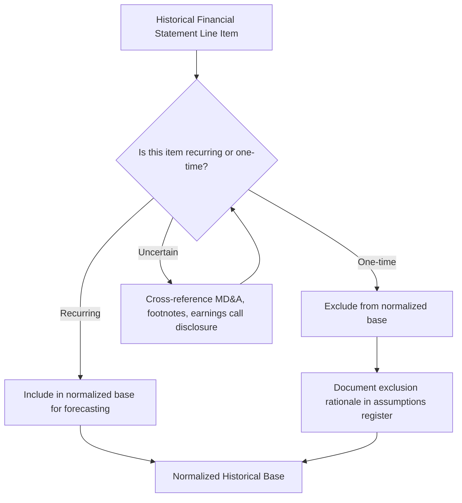

## Common Free Cash Flow Calculation Errors

### Overview and Purpose

This topic consolidates and organizes the recurring, high-impact errors analysts make when constructing free cash flow — drawing together and systematizing error patterns touched on individually throughout FCFF derivation, FCFE derivation, Net Income reconciliation, SBC treatment, and capitalized lease treatment. Because free cash flow sits at the center of DCF valuation, an error here propagates directly through every forecast period and into the terminal value, making FCF construction one of the highest-leverage places for rigorous error-checking in the entire model.

### Category 1: Discount Rate and Cash Flow Mismatches

**Error: Discounting FCFE at WACC, or FCFF at cost of equity**

This is widely regarded as the single most severe conceptual error in DCF construction. FCFF (available to all capital providers) must be discounted at WACC (the blended required return for all capital providers); FCFE (available only to equity holders) must be discounted at cost of equity alone. Mismatching these systematically over- or under-states value, since the discount rate no longer reflects the risk of the specific cash flow stream being valued.

$$\text{Correct: } EV = \sum \frac{FCFF_t}{(1+WACC)^t}, \quad Equity\ Value = \sum \frac{FCFE_t}{(1+k_e)^t}$$

**How to catch it**: verify that the discount rate used matches the cash flow definition on every single reference in the model — a common failure mode is copying a discount rate formula across a workbook without checking which cash flow line it is actually discounting.

### Category 2: Interest and Financing Treatment Errors

**Error: Double-counting or omitting interest expense**

Starting from EBIT but failing to apply the tax rate correctly, or starting from Net Income and forgetting to add back after-tax interest expense, both distort FCFF. Equally, starting from EBT (Earnings Before Tax, which already includes interest) while labeling it "EBIT" in a model is a subtle but consequential labeling error that causes interest to be excluded from EBIT twice — once in the mislabeled starting figure and once by treating it as already excluded.

**How to catch it**: reconcile Net Income to FCFF via the full explicit bridge (see: reconciling net income to free cash flow) for every historical period; a bridge that doesn't tie out to the reported cash flow statement signals an error somewhere in the walk.

**Error: Including net borrowing in FCFF**

Net borrowing (debt issuance/repayment) belongs only in FCFE, never in FCFF, since FCFF is explicitly a capital-structure-neutral measure. Including it in an FCFF calculation contaminates the unlevered cash flow with a financing decision.

### Category 3: Non-Cash Item Handling Errors

**Error: Failing to add back all non-cash items, or double-adding them**

Beyond D&A, non-cash items frequently mishandled include:

- Stock-based compensation (see: dedicated SBC treatment topic — the error here is typically *inconsistency* rather than simple omission, e.g., adding back SBC while using a basic, non-diluted share count)
- Deferred tax expense/benefit
- Non-cash impairment charges or write-downs
- Non-cash gains/losses on asset sales or debt extinguishment
- Equity in earnings of unconsolidated affiliates (non-cash portion)

**How to catch it**: build the full CFO-based reconciliation (Net Income → CFO per the indirect method) and confirm every non-cash add-back in the analyst's model matches an identifiable line in the company's actual reported cash flow statement; unexplained gaps indicate a missed or incorrectly sized item.

**Error: Treating a one-time item as recurring, or vice versa**

Failing to normalize a one-time charge (litigation settlement, restructuring cost, natural disaster impact) out of the historical base before using it to set forecast assumptions embeds a non-recurring distortion into every future projected period. The inverse error — treating a genuinely recurring cost as one-time and stripping it out — understates future costs and overstates FCF.

### Category 4: Working Capital Errors

**Error: Inconsistent Net Working Capital definition across the model**

Using a different definition of NWC (e.g., including vs. excluding cash, short-term debt, or specific accrued liabilities) in the historical common-size/trend analysis, the FCFF cash flow build, and the balance sheet forecast produces internally inconsistent results, particularly a projected ending cash balance that does not reconcile to the sum of forecasted operating, investing, and financing cash flows.

**Error: Sign errors in the $\Delta NWC$ calculation**

An increase in NWC is a *use* of cash (subtracted from cash flow); a decrease is a *source* of cash (added to cash flow). A simple sign flip here — easy to introduce when working capital unexpectedly declines in a given forecast year — silently reverses the direction of a material cash flow effect and is one of the more common line-level errors in practice.

**How to catch it**: sanity-check the direction of the adjustment against the underlying driver — if receivables and inventory grew and payables didn't keep pace, NWC increased and cash flow should be reduced, not increased.

### Category 5: Capital Expenditure and Asset Errors

**Error: Failing to distinguish maintenance capex from growth capex**

Applying a single blended CapEx assumption (e.g., a flat percentage of revenue) across all forecast scenarios can understate the capital intensity required to support an aggressive growth scenario, or overstate it in a conservative/mature-phase scenario, if the two capex components behave differently.

**Error: Using CapEx figures inconsistent with the D&A build**

Persistently modeling CapEx well above or below D&A without an explicit rationale (e.g., an expected asset base expansion or contraction) can produce an internally inconsistent long-run trajectory for the fixed asset base, particularly problematic in the terminal year where CapEx and D&A are often assumed to converge (see: terminal value assumptions and steady-state margin normalization).

### Category 6: Lease-Related Errors

**Error: Reclassifying lease interest into EBIT without adjusting Net Debt**

As detailed in the capitalized lease treatment topic, this specific error — treating lease liabilities as debt-like for the purpose of inflating EBIT/EBITDA, while excluding the corresponding liability from the Net Debt calculation used in the equity bridge — directly and often substantially overstates equity value.

**Error: Double-counting cash lease payments**

Subtracting the full cash lease payment as an operating outflow while separately having already reflected imputed interest and depreciation components elsewhere in the model overstates the cash cost of leases.

### Category 7: Tax Rate Errors

**Error: Applying the historical effective tax rate uncritically to forecast periods**

Historical effective tax rates are frequently distorted by one-time items (NOL utilization, tax credits, foreign tax rate differentials, discrete tax items from stock compensation vesting) that will not necessarily persist. Applying an artificially low or high effective rate to a growing forecast period compounds the distortion across every projected year.

**How to catch it**: compare the historical effective rate to the statutory marginal rate for the relevant jurisdiction(s); a persistent, unexplained gap between the two warrants investigation into the tax footnote before selecting a forecast tax rate.

### Category 8: Structural and Presentation Errors

**Error: Silent formula overrides / hard-coded values**

A hard-coded number pasted over what should be a formula-driven cell — common when an analyst manually adjusts a single period's output — breaks the model's internal logic for anyone else reviewing or updating it, and is a leading cause of models silently producing wrong answers after a seemingly unrelated input change.

**Error: Orphaned or undocumented assumptions**

Assumptions embedded directly within formulas rather than referenced from a labeled, documented assumptions tab (see: forecast assumptions documentation and governance) make errors far harder to locate and the model's logic far harder for a second reviewer to audit.

**Error: Circular reference instability**

In levered (FCFE) models with interest expense computed on average or ending debt balances, unresolved or improperly managed circularity (see: circularity discussion in FCFE derivation) can cause the model to produce different results depending on calculation order, iteration settings, or manual toggle states — an error that is particularly dangerous because it may not be visually obvious unless the analyst specifically stress-tests the circular loop.

### A Practical Error-Checking Checklist

| Check | What It Catches |
| --- | --- |
| Does FCFF reconcile to reported CFO via the full bridge for all historical periods? | Missing/incorrect non-cash add-backs, mislabeled starting figures |
| Is the discount rate matched correctly to FCFF (WACC) vs. FCFE ($k_e$)? | The single most severe conceptual mismatch error |
| Does $\Delta NWC$ direction match the underlying balance sheet driver direction? | Sign errors |
| Is the SBC treatment (add-back or not) consistent with the share count basis used downstream? | SBC double-counting or omission |
| If lease interest is reclassified into EBIT, is the lease liability included in Net Debt? | Equity value overstatement from lease treatment |
| Does the historical effective tax rate diverge significantly from the statutory rate, and if so, is that investigated? | Tax rate distortion carried into the forecast |
| Are any cells hard-coded that should be formula-driven? | Silent overrides breaking model integrity |
| Is every material assumption traceable to a documented source in the assumptions register? | Orphaned/undocumented assumptions |
| Does the projected ending cash balance reconcile across the three statements? | Working capital definition inconsistency |

**Key Points**

- Most severe FCF errors are not arithmetic mistakes but **definitional or consistency** errors — using two different, individually defensible conventions in two different parts of the same model
- A disciplined reconciliation-first workflow (build the full Net Income-to-FCF bridge before relying on shorthand formulas) is the single most effective general-purpose defense against the majority of errors catalogued here
- Errors that inflate FCF (double-counted add-backs, omitted net borrowing considerations, unadjusted Net Debt after lease reclassification) tend to be more common in practice than errors that understate it, likely because separately verifying "is this cash flow real" requires more deliberate cross-checking than simply summing plausible-looking positive adjustments

**Related Topics**

- Reconciling Net Income to Free Cash Flow
- Choosing Between FCFF and FCFE
- Treatment of Stock-Based Compensation in Free Cash Flow
- Treatment of Capitalized Leases in Free Cash Flow
- Forecast Assumptions Documentation and Governance
- Maintenance vs. Growth Capital Expenditure Forecasting
- Model Auditing Techniques and Error-Checking Protocols
- Terminal Value Assumptions and Steady-State Margin Normalization