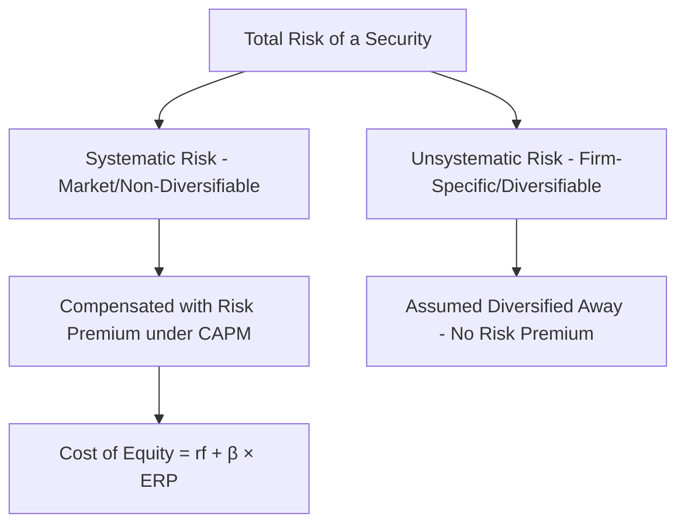

## The Capital Asset Pricing Model (CAPM)

### Overview and Purpose

The Capital Asset Pricing Model (CAPM) is the most widely used framework for estimating the cost of equity — the required rate of return equity investors demand for bearing the risk of holding a company's stock. In DCF valuation, cost of equity derived via CAPM serves two critical roles: it is the discount rate applied directly to FCFE in a levered DCF, and it is a required input into the WACC calculation that discounts FCFF. Given its centrality, CAPM is one of the most consequential — and most debated — building blocks in corporate valuation.

### The Core CAPM Formula

$$k_e = r_f + \beta \times (r_m - r_f)$$

Where:

- $k_e$ = cost of equity (required return on equity)
- $r_f$ = risk-free rate
- $\beta$ = the stock's beta, a measure of systematic (non-diversifiable) risk relative to the market
- $r_m$ = expected return on the market portfolio
- $(r_m - r_f)$ = the **equity risk premium (ERP)**, the additional return investors demand for holding market risk over a risk-free asset

The model rests on Modern Portfolio Theory's insight that in a diversified portfolio, only **systematic risk** (risk correlated with broad market movements) is compensated with additional expected return; **idiosyncratic (firm-specific) risk** can be diversified away and therefore commands no risk premium under the model's assumptions.

### Conceptual Foundations

CAPM assumes a rational investor holds a fully diversified portfolio, so the only risk that matters for pricing a security is the risk that cannot be eliminated through diversification — i.e., the covariance of the security's returns with the overall market's returns, captured by beta.

### Component 1: The Risk-Free Rate ($r_f$)

The risk-free rate represents the return available on an investment with no default or reinvestment risk relevant to the valuation horizon.

**Standard practice:**

- Use the yield on a **long-term government bond** matched to the duration of the cash flows being valued — typically the 10-year (or sometimes 20- or 30-year) government bond yield for a company with a long-dated cash flow stream, such as one being valued via DCF with a multi-year explicit forecast plus a terminal value
- For USD-denominated valuations, the yield on U.S. Treasury securities is the standard reference; for other currencies, the corresponding sovereign bond yield of a similarly high-credit-quality issuer denominated in that currency should be used

**Key Points**

- Using a short-term risk-free rate (e.g., 3-month T-bill) for a long-duration DCF creates a duration mismatch between the discount rate and the cash flows, and is generally considered inappropriate practice for corporate valuation
- For valuations in currencies or jurisdictions where the sovereign itself carries meaningful default risk, analysts often start from a benchmark "risk-free" government yield (e.g., US Treasury) and separately add a country risk premium (covered in the country risk premium and emerging markets adjustment topic) rather than treating the local government bond yield as risk-free outright

### Component 2: Beta ($\beta$)

Beta measures the sensitivity of a stock's returns to overall market returns, formally defined as:

$$\beta_i = \frac{Cov(r_i, r_m)}{Var(r_m)}$$

A beta of 1.0 indicates the stock moves in line with the market on average; a beta above 1.0 indicates greater-than-market sensitivity (more systematic risk); a beta below 1.0 indicates lower sensitivity.

#### Sourcing Beta

1. **Regression (historical) beta**: run a linear regression of the stock's historical returns against a market index's returns over a chosen period (commonly 2–5 years of monthly or weekly data)
2. **Published/vendor beta**: sourced from financial data providers (e.g., Bloomberg, FactSet, CapitalIQ), often already adjusted (see below)
3. **Bottom-up (unlevered/relevered) beta**: derived from a peer group of comparable companies rather than the subject company's own trading history — particularly important for private companies, recent IPOs, or companies with limited or unusual trading history

#### The Bottom-Up Beta Method

Because a company's observed equity beta reflects both its business risk and its specific capital structure (financial leverage amplifies equity beta), a common and often preferred approach for DCF work is to:

**Step 1 — Unlever the beta of each comparable company:**

$$\beta_{unlevered} = \frac{\beta_{levered}}{1 + (1-t) \times \frac{D}{E}}$$

**Step 2 — Average the unlevered betas** across the peer set to derive an industry/business-risk-only beta.

**Step 3 — Relever the average unlevered beta** to the subject company's own target capital structure:

$$\beta_{relevered} = \beta_{unlevered} \times \left[1 + (1-t) \times \frac{D}{E}_{target}\right]$$

**Worked Example:**

| Comparable Company | Levered Beta | D/E Ratio | Tax Rate | Unlevered Beta |
| --- | --- | --- | --- | --- |
| Peer A | 1.20 | 0.40 | 25% | $1.20 / [1 + 0.75(0.40)] = 0.923$ |
| Peer B | 1.35 | 0.60 | 25% | $1.35 / [1 + 0.75(0.60)] = 0.931$ |
| Peer C | 1.05 | 0.20 | 25% | $1.05 / [1 + 0.75(0.20)] = 0.913$ |
| **Average Unlevered Beta** |  |  |  | **0.922** |

Relevering to the subject company's target D/E of 0.50 at a 25% tax rate:

$$\beta_{relevered} = 0.922 \times [1 + 0.75(0.50)] = 0.922 \times 1.375 = 1.268$$

**Key Points**

- The bottom-up beta method is generally preferred over a subject company's own regression beta when: the company has limited trading history, illiquid or thinly traded stock, an unusual or transitioning capital structure, or is a private/pre-IPO company with no directly observable beta at all
- Choosing an appropriate, sufficiently comparable peer set is itself a significant analytical judgment call, similar in spirit to comparable company selection in relative valuation

#### Beta Adjustment Methods

Some practitioners and data providers apply an adjustment to raw historical (regression) beta on the empirical observation that betas tend to revert toward 1.0 over time (the mean-reversion property of beta):

$$\beta_{adjusted} = \frac{2}{3} \times \beta_{raw} + \frac{1}{3} \times 1.0$$

[Inference] This specific two-thirds/one-third weighting (sometimes attributed to a Bloomberg-style convention) is one commonly cited adjustment formula, but different data providers and academic sources use varying weights or methodologies for beta adjustment; the underlying rationale (mean reversion) is well documented, but the specific adjustment weighting is not a universal standard.

### Component 3: The Equity Risk Premium (ERP)

The ERP represents the additional expected return investors require for holding the market portfolio over the risk-free asset. It is arguably the single most debated and most consequential input in the entire CAPM formula, given the difficulty of directly observing a genuinely forward-looking expected return.

#### Estimation Approaches

1. **Historical ERP**: compute the average realized excess return of a broad equity market index over a risk-free benchmark across a long historical period (often 50–100+ years), on the premise that long-run realized returns approximate investors' long-run expected returns
2. **Implied (forward-looking) ERP**: back out the ERP implied by current market prices using a dividend discount model or similar framework applied to the aggregate market index, solving for the discount rate consistent with current index levels and consensus growth/dividend expectations
3. **Survey-based ERP**: aggregate surveyed expectations from academics, analysts, or CFOs regarding their expected future ERP

**Key Points**

- Historical ERP estimates vary meaningfully depending on the measurement period chosen (e.g., since 1926 vs. since 1960 vs. trailing 20 years), the choice of risk-free benchmark (T-bills vs. T-bonds), and whether an arithmetic or geometric mean of historical returns is used — arithmetic means are generally higher than geometric means and each has distinct theoretical justifications depending on the use case
- [Speculation] There is no single "correct" ERP; published estimates from reputable sources have varied by several percentage points depending on methodology, and the choice of ERP is frequently one of the most sensitive and most scrutinized assumptions in any CAPM-based cost of equity estimate
- Given a typical range of published ERP estimates, the resulting cost of equity and enterprise value can vary substantially, making ERP selection a prime candidate for explicit sensitivity analysis and clear documentation of source/methodology (see: forecast assumptions documentation and governance)

### Worked Full CAPM Example

| Input | Value |
| --- | --- |
| Risk-Free Rate ($r_f$) | 4.2% |
| Relevered Beta | 1.268 |
| Equity Risk Premium (ERP) | 5.5% |

$$k_e = 4.2\% + 1.268 \times 5.5\% = 4.2\% + 6.97\% = 11.17\%$$

This 11.17% cost of equity would then be used either directly to discount FCFE, or as an input into the WACC formula alongside the after-tax cost of debt and target capital structure weights.

### Extensions and Alternatives to Standard CAPM

- **Fama-French Three-Factor Model**: extends CAPM by adding size (SMB — small minus big) and value (HML — high minus low) factors, on the empirical observation that small-cap and value stocks have historically earned returns not fully explained by market beta alone
- **Country Risk Premium adjustment**: for companies operating substantially in emerging or higher-risk markets, an additional country risk premium is often added to the base CAPM formula to reflect sovereign and political risk not captured by a developed-market beta and ERP alone
- **Build-Up Method**: an alternative to CAPM, particularly common for small or private companies, that starts from a risk-free rate and adds a series of separately estimated premiums (equity risk premium, size premium, company-specific/unsystematic risk premium) without relying on a regression-derived beta at all

[Inference] The choice between CAPM, the Fama-French model, or a build-up method varies by valuation context (public company DCF vs. small private company valuation vs. academic research), and different practitioner communities have different default conventions; no single approach is universally mandated across all valuation practice.

### Common Errors in CAPM Application

- **Duration mismatch**: using a short-term risk-free rate for a long-duration DCF
- **Inconsistent tax rate in unlever/relever beta calculations**: using a different tax rate in the beta unlevering step than the tax rate used elsewhere in the DCF (e.g., in the FCFF tax adjustment), producing an internally inconsistent cost of capital
- **Applying a raw regression beta from an illiquid or thinly-traded stock** without considering whether a bottom-up peer-based beta would be more reliable
- **Mismatching currency and market index**: using a beta computed against one country's market index while applying a risk-free rate and ERP from a different currency/market without adjustment
- **Failing to disclose the ERP source and methodology**, given how sensitive the resulting cost of equity is to this specific input
- **Using an outdated peer set** for the bottom-up beta calculation that no longer reflects the subject company's current business mix (e.g., after a major divestiture or acquisition)

**Related Topics**

- WACC Construction and the Capital Structure Weighting Debate
- Country Risk Premium and Emerging Markets Cost of Capital Adjustments
- The Build-Up Method for Cost of Equity Estimation
- Fama-French Multi-Factor Models in Practice
- Levered Free Cash Flow (FCFE) Derivation
- Cost of Debt Estimation and the After-Tax Adjustment
- Forecast Assumptions Documentation and Governance