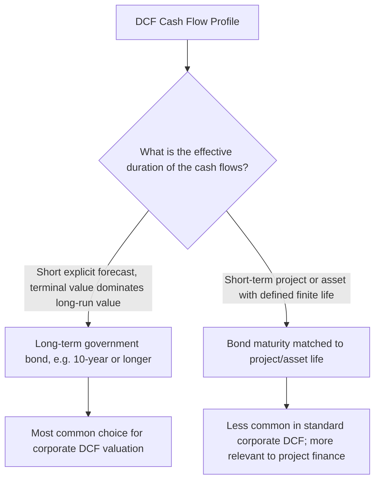

## Risk-Free Rate Selection

### Overview and Purpose

Risk-free rate selection is the foundational first input in the CAPM cost of equity formula and, by extension, in the WACC used to discount FCFF. Although conceptually simple — "the return on an investment with no default or reinvestment risk" — no truly risk-free asset exists in practice, and the specific choice of proxy, maturity, and measurement convention materially affects the resulting cost of capital and, therefore, the valuation output. This topic addresses the selection criteria and common pitfalls in depth, building on the brief treatment of the risk-free rate within the CAPM overview.

### What "Risk-Free" Actually Means in Practice

A theoretically risk-free asset has two defining characteristics:

1. **No default risk**: certainty that the promised cash flows will be paid in full and on time
2. **No reinvestment risk relevant to the valuation horizon**: the return is locked in for the full period being valued, without exposure to reinvesting interim cash flows at an uncertain future rate

In practice, government bonds issued by highly creditworthy sovereigns (in their own domestic currency) are used as the standard proxy, since default risk on such instruments is generally considered negligible — though not literally zero, particularly for sovereigns with less pristine credit profiles or history.

### Selecting the Appropriate Maturity

#### The Duration-Matching Principle

The core selection principle is **duration matching**: the maturity of the risk-free rate proxy should approximate the duration of the cash flows being discounted.

Since a standard corporate DCF typically involves a 5–10 year explicit forecast period followed by a terminal value representing the majority of total value (often 60–80%+ of enterprise value), the appropriate risk-free rate proxy is generally a **long-term government bond yield**, most commonly the **10-year government bond** in the relevant currency, though some practitioners prefer 20- or 30-year yields to better match the effectively perpetual nature of the terminal value cash flow stream.

**Key Points**

- Using a short-term instrument (e.g., a 3-month or 1-year Treasury bill) introduces a duration mismatch: short-term rates are influenced heavily by current monetary policy stance and can be significantly more volatile than long-term rates, making them a poor proxy for a discount rate meant to reflect the long-run required return over a multi-decade cash flow stream
- The 10-year government bond yield is the most widely cited convention in general corporate valuation practice, balancing duration-matching considerations against the greater liquidity and data availability of shorter-maturity long bonds relative to very long-dated (30-year+) issues

### Currency and Jurisdiction Considerations

The risk-free rate must be denominated in the **same currency as the cash flows being valued** — this is a critical consistency requirement, not a matter of preference.

| Cash Flow Currency | Appropriate Risk-Free Rate Reference |
| --- | --- |
| USD | US Treasury yield (typically 10-year) |
| EUR | German Bund yield (typically treated as the benchmark "risk-free" euro-area reference), or another high-credit-quality euro-area sovereign |
| GBP | UK Gilt yield |
| JPY | Japanese Government Bond (JGB) yield |
| Emerging market local currency | Local sovereign bond yield, often adjusted for a sovereign risk premium if the local government's own credit quality is not considered risk-free |

**Key Points**

- A common and serious error is combining a risk-free rate from one currency (e.g., US Treasuries) with cash flows and an ERP appropriate to a different currency/market without an explicit and justified adjustment — this creates an internally inconsistent discount rate that does not reflect the actual currency risk profile of the cash flows being valued
- For companies with significant multi-currency cash flow exposure, analysts typically either (a) convert all cash flows to a single reporting currency and apply a consistently-denominated discount rate, or (b) discount cash flows in each local currency using a currency-matched discount rate, then convert to a common currency at the valuation date — both are defensible provided currency consistency is maintained throughout

### The "Risk-Free" Assumption for Sovereigns with Meaningful Credit Risk

Not all government bonds are appropriately treated as risk-free, even in their own domestic currency, if the issuing sovereign carries meaningful default risk.

**Standard approach**: for jurisdictions where the local sovereign is not considered a suitably risk-free benchmark, analysts commonly:

1. Start from a benchmark truly risk-free rate (e.g., the US Treasury yield, treated as a global risk-free proxy)
2. Add a separately estimated **country risk premium** or **sovereign default spread** (often derived from that country's sovereign credit rating or the spread on its dollar-denominated bonds over comparable-maturity US Treasuries) to arrive at a local risk-free-equivalent rate, before then applying beta and ERP on top

$$r_f^{local} = r_f^{US\ Treasury} + Country\ Default\ Spread$$

[Inference] The specific method for deriving and applying a country risk premium varies across practitioners and institutions (some add it to the risk-free rate, others add it as a separate premium alongside the standard CAPM equation, and others build it into a company-specific adjustment based on revenue exposure by country); this remains an area with meaningful methodological variation rather than a single settled convention.

### Real vs. Nominal Risk-Free Rates

Analysts must maintain consistency between the **nominal or real** nature of the risk-free rate and the cash flows being discounted:

- **Nominal risk-free rate** (standard government bond yields, which embed expected inflation): must be paired with **nominal cash flow projections** (i.e., projections that include the effect of expected future price inflation on revenue, costs, and margins)
- **Real risk-free rate** (derived from inflation-protected government securities, such as US TIPS, or by backing out expected inflation from nominal yields): must be paired with **real (inflation-adjusted) cash flow projections**

$$r_{nominal} \approx r_{real} + \pi_{expected}$$

(an approximation of the Fisher equation, exact under continuous compounding)

**Key Points**

- Mixing a nominal risk-free rate with real (inflation-excluded) cash flow projections, or vice versa, is a subtle but consequential internal consistency error that effectively double-counts or omits inflation's projected effect on value
- The overwhelming majority of standard corporate DCF practice uses nominal cash flows paired with a nominal risk-free rate and nominal discount rate throughout, since most companies' financial projections (and most available forecasting data, such as analyst consensus estimates) are prepared on a nominal basis

### Point-in-Time vs. Normalized Risk-Free Rate

A further practical question is whether to use the **spot (current)** risk-free rate as of the valuation date, or a **normalized/long-run average** rate intended to smooth out short-term market volatility or perceived rate anomalies.

| Approach | Rationale | Consideration |
| --- | --- | --- |
| Spot rate as of valuation date | Reflects current market conditions and is the most objective, verifiable, and widely used convention | Can introduce valuation volatility if rates are unusually elevated or depressed at the specific valuation date due to transient market conditions |
| Normalized/long-run average rate | Smooths out perceived short-term anomalies (e.g., a temporary flight-to-quality rate spike or dip) | Introduces analyst judgment about what the "normal" rate should be, reducing objectivity and comparability across different analysts' models |

[Speculation] Practice is divided: many standard valuation approaches (e.g., in academic finance and much of everyday corporate valuation practice) default to using the spot rate as of the valuation date for objectivity and reproducibility, while some practitioners — particularly during periods viewed as containing unusual monetary policy distortions — have advocated for a normalized rate; there is no universal consensus on when, if ever, normalization is appropriate, and its use should be explicitly flagged as a judgment call if applied.

### Worked Example: Selecting and Applying the Risk-Free Rate

**Scenario**: Valuing a USD-denominated, developed-market industrial company via a standard 5-year explicit forecast plus terminal value DCF, using nominal cash flow projections.

**Step 1 — Choose maturity**: 10-year US Treasury yield selected, consistent with the long-duration nature of the terminal value.

**Step 2 — Confirm currency match**: cash flows are USD-denominated; US Treasury yield is the appropriate currency-matched benchmark.

**Step 3 — Confirm nominal/real consistency**: cash flow projections are nominal (include inflation); nominal US Treasury yield (not TIPS-derived real yield) is the correct pairing.

**Step 4 — Confirm point-in-time convention**: spot 10-year Treasury yield as of the valuation date is used, e.g., 4.2%, with this specific date and source documented in the assumptions register.

This risk-free rate of 4.2% then flows directly into both the CAPM cost of equity calculation and the WACC formula.

### Common Errors in Risk-Free Rate Selection

- **Duration mismatch**: using a short-term rate (T-bill) for a long-duration DCF
- **Currency mismatch**: using a risk-free rate denominated in a different currency than the cash flows without explicit, justified adjustment
- **Nominal/real inconsistency**: pairing a real risk-free rate with nominal cash flow projections, or vice versa
- **Using an inappropriately risky "risk-free" proxy**: treating a lower-credit-quality sovereign's local bond yield as risk-free without adding an appropriate country/default risk adjustment
- **Failing to document the specific source and date**: given that government bond yields move daily (sometimes materially), failing to record the exact source, maturity, and as-of date of the risk-free rate used undermines reproducibility and auditability of the valuation
- **Inconsistent risk-free rate across model components**: using a different risk-free rate in the CAPM cost of equity calculation than in a separately-sourced cost of debt calculation within the same WACC build, without justification

**Related Topics**

- The Capital Asset Pricing Model (CAPM)
- Country Risk Premium and Emerging Markets Cost of Capital Adjustments
- WACC Construction and the Capital Structure Weighting Debate
- The Equity Risk Premium: Estimation Methods and Debates
- Cost of Debt Estimation and the After-Tax Adjustment
- Nominal vs. Real Cash Flow Forecasting Consistency
- Forecast Assumptions Documentation and Governance