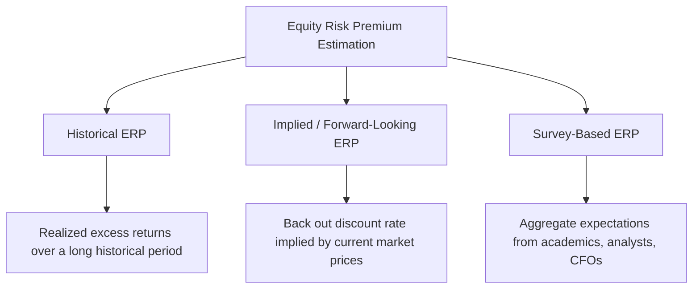

## Equity Risk Premium Estimation

### Overview and Purpose

The equity risk premium (ERP) is the expected additional return investors demand for holding a diversified equity market portfolio over a risk-free asset. It is the second core component of the CAPM cost of equity formula, multiplied by beta to derive the firm-specific risk premium added to the risk-free rate. Because a genuinely forward-looking market expectation cannot be directly observed, ERP estimation is widely regarded as the single most methodologically contested and most consequential judgment call in the entire cost of capital framework — small differences in ERP assumptions compound through beta multiplication and can shift valuation output substantially.

### Defining the ERP

$$ERP = E(r_m) - r_f$$

Where $E(r_m)$ is the expected return on a broad, diversified market portfolio (commonly proxied by a broad equity index) and $r_f$ is the risk-free rate over the same time horizon. Because $E(r_m)$ reflects investors' *expectations*, not a directly observable market price, every ERP estimation method is ultimately an attempt to infer or proxy for an unobservable expectation.

### The Three Primary Estimation Approaches

#### Approach 1: Historical ERP

This approach computes the average realized excess return of a broad equity market index over a risk-free benchmark across a long historical measurement period, on the theoretical premise that, absent a specific reason to expect a regime change, long-run realized historical returns are a reasonable proxy for long-run expected future returns.

$$ERP_{historical} = \frac{1}{n}\sum_{t=1}^{n}(r_{m,t} - r_{f,t})$$

**Key methodological choices within this approach:**

| Choice | Options | Consideration |
| --- | --- | --- |
| Measurement period | Since 1926, since 1960, trailing 20/30 years, etc. | Longer periods reduce sampling noise but may include structurally different economic regimes; shorter periods are more "current" but noisier |
| Risk-free benchmark | T-bills (short-term) vs. T-bonds (long-term) | Using T-bonds as the risk-free benchmark for ERP calculation, paired with a T-bond risk-free rate in the final CAPM formula, maintains internal consistency; mixing benchmarks across the two steps is an error |
| Averaging method | Arithmetic mean vs. geometric mean | Arithmetic mean is generally higher than geometric mean for volatile series (by Jensen's inequality) and is generally considered more appropriate for a single-period expected return estimate used in a discount rate context, while geometric mean is often considered more representative of realized long-run compound growth |

**Example**

Using a long-run historical dataset (e.g., spanning roughly a century) of US equity market returns over long-term government bond yields, published arithmetic-mean historical ERP estimates from reputable data sources have generally clustered in a range of approximately 4–7%, though the exact figure depends heavily on the specific period and methodology selected. [Unverified] Specific numeric point estimates from any particular data source require verification against the source's current published dataset, given that historical ERP estimates are periodically updated and vary by provider methodology.

**Key Points**

- Historical ERP is the most transparent and easily reproducible approach, since it relies on publicly available historical return data rather than an analyst's own forward-looking judgment
- Its central limitation is the implicit assumption that the future will resemble the historical measurement period — a assumption that becomes more questionable during structural shifts in monetary policy regimes, market composition, or macroeconomic conditions

#### Approach 2: Implied (Forward-Looking) ERP

This approach infers the ERP embedded in *current* market prices, typically via a reverse dividend discount model (or free cash flow-to-equity model) applied to the aggregate market index:

$$Index\ Level = \sum_{t=1}^{\infty} \frac{D_t}{(1+k_e)^t}$$

Given the current index level, projected aggregate dividends (or buybacks/FCFE) and their expected growth rate, the equation is solved for the implied $k_e$, from which the implied ERP is derived as $k_e - r_f$.

**Key Points**

- This approach is inherently **forward-looking**, reflecting the market's current pricing rather than a backward-looking historical average, which many practitioners view as conceptually more appropriate for a valuation exercise that is itself forward-looking
- It is highly sensitive to the assumed long-run growth rate of aggregate market cash flows/dividends, introducing its own significant estimation uncertainty
- Implied ERP estimates tend to fluctuate more with current market conditions (e.g., rising when markets are perceived as cheap relative to fundamentals, falling when markets are expensive), which some view as an advantage (capturing current market sentiment) and others view as a source of unwanted valuation volatility

#### Approach 3: Survey-Based ERP

This approach aggregates the ERP expectations reported by surveyed groups — academic finance professors, professional analysts, or corporate CFOs — typically compiled through periodic academic or industry surveys.

**Key Points**

- Survey-based estimates provide a useful cross-check against historical and implied methods, and can reveal a gap between "what the models say" and "what practitioners actually believe and use"
- [Speculation] Survey-based ERP estimates have generally clustered somewhat below long-run historical arithmetic-mean estimates in various published academic surveys, though exact figures and their trends over time require verification against current survey data given how frequently such surveys are updated and how much they can vary by respondent population and survey methodology

### Reconciling Divergent ERP Estimates

The three approaches frequently produce different point estimates, sometimes by several percentage points, because they answer subtly different questions: historical ERP asks "what did investors realize on average in the past," implied ERP asks "what does today's pricing imply investors expect," and survey ERP asks "what do surveyed groups say they expect."

**Practical reconciliation approaches:**

- Present a **range** bounded by the different methodologies rather than a single point estimate, and use this range explicitly in sensitivity analysis
- Select a **primary method** based on the specific valuation context (e.g., implied ERP may be preferred when valuing during a period of unusual market conditions where historical averages seem less representative) while disclosing the alternative estimates as a cross-check
- Anchor to a **reputable, consistently-updated third-party source** (e.g., a well-known valuation academic's regularly updated ERP estimates, or a major data provider's published ERP) for consistency and ease of audit, while still disclosing the source and methodology explicitly

**Key Points**

- Given the wide range of legitimate ERP estimates across methodologies and sources, ERP selection is a prime candidate for explicit sensitivity analysis in any DCF, since the valuation's dependence on this single assumption is often understated relative to its actual impact
- Documenting the specific ERP source, as-of date, and methodology in the assumptions register (see: forecast assumptions documentation and governance) is essential given how much scrutiny this particular input typically receives in review

### Worked Example: ERP Sensitivity Impact

Holding all other CAPM inputs constant ($r_f = 4.2\%$, $\beta = 1.268$):

| ERP Assumption | Cost of Equity ($k_e$) |
| --- | --- |
| 4.5% (lower end of range) | $4.2\% + 1.268 \times 4.5\% = 9.9\%$ |
| 5.5% (mid-range) | $4.2\% + 1.268 \times 5.5\% = 11.2\%$ |
| 6.5% (higher end of range) | $4.2\% + 1.268 \times 6.5\% = 12.4\%$ |

A roughly 2-percentage-point spread in the assumed ERP, well within the range of legitimate methodological disagreement, produces a spread of approximately 2.5 percentage points in the resulting cost of equity — a difference that, when compounded over a multi-year discounted cash flow stream and terminal value, can move enterprise or equity value substantially. This sensitivity underscores why ERP selection warrants explicit disclosure and sensitivity testing rather than being treated as a fixed, uncontroversial input.

### The Country-Specific ERP Question

For non-US or emerging market valuations, an additional layer of complexity arises: should the ERP itself vary by country, or should a single "global" or "mature market" ERP be used with country-specific risk captured separately via a country risk premium added elsewhere in the formula?

[Inference] Practice varies: some frameworks build a country-specific total equity risk premium (mature market ERP plus a country risk adjustment, sometimes further adjusted by the relative volatility of the local equity market to its sovereign bond market), while others keep a single global/mature-market ERP and handle all country-specific risk through a separately-added country risk premium term; this is a genuinely contested area without a single dominant convention, and the specific approach used should be explicitly documented (see: country risk premium and emerging markets cost of capital adjustments for further detail).

### Common Errors in ERP Estimation

- **Mismatching the risk-free benchmark used in ERP calculation and the risk-free rate used in the final CAPM formula** (e.g., computing historical ERP over T-bills, then adding it to a T-bond risk-free rate), creating an internally inconsistent cost of equity
- **Using a stale or unsourced ERP figure** without noting the source or as-of date, undermining reproducibility
- **Treating ERP as a fixed, uncontroversial constant** rather than disclosing the meaningful range of legitimate estimates and testing sensitivity to it
- **Applying a developed-market ERP to an emerging-market valuation without any country risk adjustment**, understating the appropriate cost of equity for the actual risk profile of the cash flows
- **Conflating arithmetic and geometric mean conventions** inconsistently between the ERP source and how it is applied in the single-period CAPM formula

**Related Topics**

- The Capital Asset Pricing Model (CAPM)
- Risk-Free Rate Selection
- Country Risk Premium and Emerging Markets Cost of Capital Adjustments
- WACC Construction and the Capital Structure Weighting Debate
- Sensitivity Analysis and Tornado Diagrams for Key DCF Drivers
- The Build-Up Method for Cost of Equity Estimation
- Forecast Assumptions Documentation and Governance