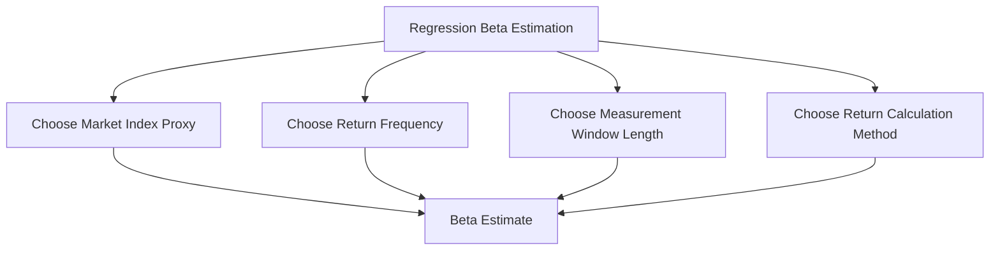

## Beta Estimation and Regression Betas

### Overview and Purpose

Beta estimation via regression is the most direct, empirically-grounded method of measuring a stock's systematic risk for use in the CAPM cost of equity formula. Regression beta uses a company's own historical trading data to estimate how sensitively its returns move relative to the broader market. While conceptually straightforward, regression beta estimation involves numerous methodological choices — index selection, return frequency, measurement window, and statistical adjustments — each of which can meaningfully affect the resulting estimate. This topic details the regression methodology itself, complementing the bottom-up (peer-based) beta approach introduced in the CAPM overview.

### The Regression Beta Formula

Beta is estimated via ordinary least squares (OLS) linear regression of a stock's periodic returns against a market index's returns:

$$r_{i,t} = \alpha_i + \beta_i \cdot r_{m,t} + \varepsilon_t$$

Where:

- $r_{i,t}$ = the stock's return in period $t$
- $r_{m,t}$ = the market index's return in period $t$
- $\alpha_i$ = the regression intercept (the stock's average return unexplained by market movement, sometimes called "Jensen's alpha")
- $\beta_i$ = the regression slope coefficient, i.e., the beta estimate
- $\varepsilon_t$ = the residual (idiosyncratic, firm-specific) return component in period $t$

Equivalently, beta can be expressed as:

$$\beta_i = \frac{Cov(r_i, r_m)}{Var(r_m)} = \rho_{i,m} \times \frac{\sigma_i}{\sigma_m}$$

where $\rho_{i,m}$ is the correlation between the stock's and market's returns, and $\sigma_i$, $\sigma_m$ are their respective standard deviations. This form makes explicit that beta depends on both the **correlation** between the stock and the market (how closely they move together) and the **relative volatility** of the stock versus the market.

### Key Methodological Choices

#### 1. Market Index Selection

The regression requires a proxy for the broad "market portfolio," which in practice is typically a broad, well-diversified equity index appropriate to the stock's primary listing and economic exposure (e.g., a broad total-market or large-cap index for a US-listed stock).

**Key Points**

- Using a narrower or sector-specific index as the market proxy produces a beta that measures sensitivity to that narrower index rather than to the broad market, which is generally inconsistent with CAPM's theoretical foundation of a fully diversified market portfolio
- For companies with significant international operations or dual/cross listings, the choice between a domestic index and a broader global index can produce meaningfully different beta estimates, and the choice should align with the currency and market of the risk-free rate and ERP used elsewhere in the CAPM formula (see: risk-free rate selection for the related currency-matching principle)

#### 2. Return Frequency

Common choices are daily, weekly, or monthly return observations.

| Frequency | Advantage | Disadvantage |
| --- | --- | --- |
| Daily | Maximizes sample size for a given calendar window | More susceptible to microstructure noise, bid-ask bounce, and non-trading/thin-trading effects, particularly for less liquid stocks |
| Weekly | Balances sample size with reduced microstructure noise | Fewer observations than daily for the same calendar window |
| Monthly | Standard academic convention (e.g., widely used in academic finance research); minimizes microstructure noise | Requires a longer calendar window to achieve adequate statistical sample size |

**Key Points**

- **Weekly and monthly returns using a several-year window are common conventions in professional valuation practice**, often preferred over daily returns specifically to reduce the influence of short-term noise and thin-trading effects, particularly relevant for less liquid stocks
- [Inference] There is no single universally mandated frequency; different data providers and practitioner communities have different default conventions (e.g., some vendors publish weekly-return-based betas over a 2-year window, others use monthly returns over 5 years), and the choice should be disclosed given that different frequencies can produce meaningfully different beta point estimates for the same stock

#### 3. Measurement Window Length

Common windows range from 2 to 5 years of historical data.

**Key Points**

- A **longer window** (e.g., 5 years) provides more statistical observations, reducing standard error, but risks including periods where the company's business mix, capital structure, or competitive position differed materially from its current state
- A **shorter window** (e.g., 2 years) better reflects the company's current business and risk profile but has fewer observations, resulting in a noisier, less statistically reliable estimate
- For companies that have undergone a major structural change (e.g., a large acquisition, divestiture, spin-off, or shift in business mix) within the historical window, a regression beta spanning the change captures a blend of the pre- and post-change risk profiles, which may not accurately represent the company's current risk characteristics — a bottom-up peer-based beta is often preferred in such cases

#### 4. Return Calculation Method

- **Simple (arithmetic) returns**: $r_t = \frac{P_t - P_{t-1}}{P_{t-1}}$
- **Log (continuously compounded) returns**: $r_t = \ln\left(\frac{P_t}{P_{t-1}}\right)$

[Inference] Both conventions are used in practice; log returns have desirable statistical properties (time-additivity, better approximation to normality for small returns) that are sometimes preferred in academic and quantitative contexts, while simple returns are more intuitive and commonly used in standard practitioner valuation work; the choice generally has a modest effect on the resulting beta estimate relative to the index, frequency, and window choices above.

### Statistical Considerations and Regression Diagnostics

**R-squared (goodness of fit)**: the regression's $R^2$ indicates what proportion of the stock's return variance is explained by market movements. A low $R^2$ signals that a large share of the stock's return variation is idiosyncratic (firm-specific) rather than systematic, which means the resulting beta estimate carries a wider confidence interval and should be interpreted with greater caution.

**Standard error of the beta estimate**: regression output typically reports a standard error alongside the point estimate; a wide standard error (common for thinly-traded or highly idiosyncratic stocks) indicates the point estimate itself should be treated as imprecise, reinforcing the case for cross-checking against a bottom-up peer-based beta.

**Key Points**

- A regression beta with a low $R^2$ and wide standard error is a signal to lean more heavily on the bottom-up (peer-based) beta method described in the CAPM overview, rather than relying on the company's own noisy regression estimate
- Outlier periods (e.g., a market crash, a company-specific event like an earnings surprise or M&A announcement) within the regression window can disproportionately influence the beta estimate; some practitioners examine and, in limited justified cases, exclude extreme outlier observations, though doing so introduces its own judgment calls and should be transparently documented if applied

### Worked Illustrative Example

Consider a regression of a stock's weekly returns against a broad market index over a 3-year window, producing the following summary output:

| Statistic | Value |
| --- | --- |
| Beta (slope coefficient) | 1.15 |
| Standard Error of Beta | 0.12 |
| $R^2$ | 0.42 |
| Number of Observations | 156 (weekly, 3 years) |

An approximate 95% confidence interval for the beta estimate would be roughly:

$$\beta \pm 1.96 \times SE = 1.15 \pm 1.96(0.12) \approx [0.91, 1.39]$$

This fairly wide confidence interval illustrates that even a seemingly precise point estimate of 1.15 carries meaningful statistical uncertainty — a consideration often omitted when a single beta figure is reported without its associated standard error, but one that should inform how much weight is placed on the regression estimate versus a bottom-up cross-check.

### Beta Adjustment (Bloomberg-Style Adjustment)

As introduced in the CAPM overview, raw regression betas are frequently adjusted toward 1.0 to reflect the empirically observed tendency of betas to mean-revert over time:

$$\beta_{adjusted} = w \times \beta_{raw} + (1-w) \times 1.0$$

[Inference] The weighting $w$ varies by source; a commonly cited convention uses $w = 2/3$, though this is not a universally standardized weighting across all data providers, and some practitioners choose not to apply any adjustment at all, using the raw regression beta directly.

### When Regression Beta Is Least Reliable

- **Thinly traded or illiquid stocks**: infrequent trading creates stale prices that don't reflect true contemporaneous market movements, biasing the beta estimate (often downward, a phenomenon sometimes discussed in the context of non-synchronous trading effects)
- **Recently IPO'd companies**: insufficient trading history to construct a statistically meaningful regression window
- **Companies undergoing major structural change**: as discussed above, a regression spanning a major business mix or capital structure shift blends distinct risk regimes into a single, less representative estimate
- **Highly acquisitive companies or those with frequent large one-time events**: idiosyncratic, company-specific news flow can dominate the return series, depressing $R^2$ and widening the beta's standard error

In each of these cases, the **bottom-up beta method** (unlevering a peer group's betas and relevering to the subject company's capital structure, as detailed in the CAPM overview topic) is generally the preferred and more robust alternative.

### Common Errors in Regression Beta Estimation

- **Using an inappropriate or overly narrow market index proxy** inconsistent with CAPM's diversified market portfolio assumption
- **Ignoring a low $R^2$ or wide standard error** and treating a statistically weak point estimate with unwarranted precision
- **Failing to consider structural breaks**: using a regression window that spans a major, risk-profile-altering corporate event without adjustment or cross-check
- **Mismatching index currency/market with the risk-free rate and ERP** used elsewhere in the same CAPM calculation
- **Applying a regression beta from a thinly-traded stock without considering the bottom-up alternative**, particularly for private companies, recent IPOs, or illiquid small-cap names where regression estimates are least reliable
- **Failing to disclose the specific methodology** (index, frequency, window length, adjustment applied) used to derive a reported beta, undermining reproducibility given how sensitive the estimate is to these choices

**Related Topics**

- The Capital Asset Pricing Model (CAPM)
- Bottom-Up Beta: Unlevering and Relevering Across Comparable Companies
- Equity Risk Premium Estimation
- Risk-Free Rate Selection
- Comparable Company Selection Criteria
- WACC Construction and the Capital Structure Weighting Debate
- Statistical Considerations in Financial Data Analysis