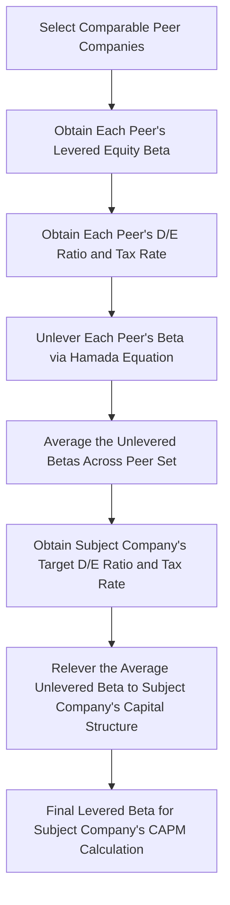

## Levering and Unlevering Beta

### Overview and Purpose

Levering and unlevering beta is the technique used to separate a company's **business risk** (operating risk inherent to the industry and business model) from its **financial risk** (risk added by the use of debt financing) within an observed equity beta. This separation is essential for the bottom-up beta method introduced in the CAPM overview: it allows an analyst to borrow risk information from a peer group of comparable companies with different capital structures, strip out each peer's own financial leverage effect, average the resulting "pure business risk" betas, and then re-apply the subject company's own specific capital structure to arrive at an appropriately levered beta for that subject company.

### Why Observed (Levered) Beta Is Not Purely a Business Risk Measure

A company's publicly observed equity beta (from regression, as detailed in the beta estimation topic) reflects the combined effect of:

1. **Asset/business risk** — the inherent volatility of the company's operating cash flows, driven by its industry, competitive position, operating leverage, and cyclicality
2. **Financial risk** — the amplifying effect of debt financing on equity returns, since debt holders have a prior, fixed claim on cash flows, making the residual equity claim more volatile as leverage increases

Because debt amplifies equity risk, two companies with identical underlying businesses but different capital structures will exhibit different equity betas — the more leveraged company will show a higher equity beta purely due to financial risk, not because its underlying business is riskier.

### The Hamada Equation

The standard framework for separating these two risk components is the **Hamada equation**, which relates levered beta (observed equity beta) to unlevered beta (asset/business-risk-only beta):

$$\beta_{levered} = \beta_{unlevered} \times \left[1 + (1-t) \times \frac{D}{E}\right]$$

Rearranged to solve for unlevered beta:

$$\beta_{unlevered} = \frac{\beta_{levered}}{1 + (1-t) \times \frac{D}{E}}$$

Where:

- $\beta_{levered}$ = the observed equity beta (reflecting both business and financial risk)
- $\beta_{unlevered}$ = the asset beta (reflecting business risk only, as if the company were entirely equity-financed)
- $t$ = the marginal tax rate
- $D/E$ = the company's debt-to-equity ratio (using market values, ideally)

**Key Points**

- The $(1-t)$ term reflects the tax shield benefit of debt: because interest expense is tax-deductible, the effective cost of leverage-related risk borne by equity holders is reduced by the tax benefit, which is why the tax rate appears explicitly in the formula
- The Hamada equation is derived from Modigliani-Miller capital structure theory extended to incorporate corporate taxes, and it embeds specific simplifying assumptions (discussed below) about how debt itself is risk-free and how the tax shield is valued

### Derivation Logic and Underlying Assumptions

The Hamada equation is built on the assumption that **debt beta is zero** (i.e., debt itself is treated as risk-free from a systematic risk perspective) and that the value of the interest tax shield is discounted at the same rate as the unlevered firm's assets. Under these assumptions, the firm's overall (asset) beta can be expressed as a weighted average of its debt and equity betas, adjusted for the tax shield:

$$\beta_{asset} = \beta_{equity} \times \frac{E}{D+E} + \beta_{debt} \times \frac{D}{D+E}$$

Setting $\beta_{debt} = 0$ and rearranging with the tax adjustment yields the standard Hamada formula above.

[Inference] The assumption that debt beta is exactly zero is a simplification; in practice, particularly for highly leveraged companies or companies with below-investment-grade debt, debt does carry some systematic risk (a positive debt beta), and some more advanced frameworks incorporate a non-zero debt beta estimate to refine the unlevering calculation, though the standard Hamada equation with zero debt beta remains the most commonly used convention in everyday valuation practice due to its simplicity and the difficulty of reliably estimating debt beta directly.

### Step-by-Step Application: The Bottom-Up Beta Process

**Step 1 — Select an appropriate peer group** of publicly traded comparable companies (similar industry, business model, growth profile, and operating risk characteristics).

**Step 2 — Obtain each peer's observed (levered) equity beta**, typically via regression as detailed in the beta estimation topic, or from a data provider.

**Step 3 — Obtain each peer's capital structure (D/E ratio) and applicable tax rate.** Market values of debt and equity are theoretically preferred over book values, though book value of debt is a commonly used practical proxy given that market values of debt are often not directly observable for non-traded corporate debt.

**Step 4 — Unlever each peer's beta** using the Hamada equation.

**Step 5 — Average the unlevered betas** across the peer set (a simple average is common, though some practitioners weight by market capitalization or apply judgment to exclude clear outliers).

**Step 6 — Relever the averaged unlevered beta** to the subject company's own **target** capital structure — not necessarily its current capital structure, particularly if the company is expected to move toward a different target leverage over the forecast period (e.g., in a post-LBO deleveraging scenario, or a company with a stated capital structure policy).

### Full Worked Example

**Peer group data:**

| Peer | Levered Beta | Debt ($M) | Equity Market Value ($M) | D/E | Tax Rate | Unlevered Beta |
| --- | --- | --- | --- | --- | --- | --- |
| Peer A | 1.20 | 400 | 1,000 | 0.40 | 25% | $1.20 / [1+0.75(0.40)] = 0.923$ |
| Peer B | 1.35 | 600 | 1,000 | 0.60 | 25% | $1.35 / [1+0.75(0.60)] = 0.931$ |
| Peer C | 1.05 | 200 | 1,000 | 0.20 | 25% | $1.05 / [1+0.75(0.20)] = 0.913$ |
| Peer D | 0.95 | 100 | 1,000 | 0.10 | 21% | $0.95 / [1+0.79(0.10)] = 0.883$ |

$$\bar{\beta}_{unlevered} = \frac{0.923 + 0.931 + 0.913 + 0.883}{4} = 0.9125$$

**Subject company's target capital structure**: D/E = 0.50, tax rate = 25%

$$\beta_{relevered} = 0.9125 \times [1 + 0.75(0.50)] = 0.9125 \times 1.375 = 1.2547$$

This relevered beta of approximately 1.25 is the figure that would then be used directly in the subject company's CAPM cost of equity formula, having appropriately transferred the peer group's average business-risk characteristics onto the subject company's own specific financial leverage profile.

### Market Value vs. Book Value of Debt and Equity

**Key Points**

- **Equity**: market value (market capitalization) is straightforward to obtain for publicly traded peers and is the theoretically correct input
- **Debt**: theoretically, market value of debt should be used, but since much corporate debt (particularly bank debt and private placements) does not trade actively, **book value of debt is a widely accepted practical proxy**, especially when the debt is not trading at a significant premium or discount to par
- For companies with debt trading at a significant discount (e.g., financially distressed companies) or with substantial off-balance-sheet or lease-related debt-like obligations, using book value alone can meaningfully misstate the true D/E ratio used in the unlevering/relevering calculation, and adjustments (or market value estimates) may be warranted

### Handling the Subject Company's Own Target Capital Structure

Determining the appropriate "target" D/E ratio to relever to is itself a judgment call, typically informed by:

- The company's **current** capital structure, if considered representative and stable
- The company's **stated capital structure policy or target leverage ratio**, if disclosed by management
- The **peer group's median or average capital structure**, if the subject company's current structure is viewed as transitional or atypical
- A **capital structure appropriate to the specific transaction context** (e.g., a pro forma post-LBO capital structure, if valuing a leveraged buyout scenario)

[Inference] Choice of target capital structure is one of the more subjective inputs in this entire process and can meaningfully affect the final relevered beta and resulting cost of equity; this choice should be explicitly documented and justified rather than defaulted to without consideration (see: forecast assumptions documentation and governance).

### Common Errors in Levering and Unlevering Beta

- **Inconsistent tax rate application**: using a different tax rate in the unlevering step (across peers, who may have different effective or statutory rates) than in the relevering step for the subject company, without deliberate justification
- **Using inconsistent D/E measurement bases**: mixing peers' market-value D/E with the subject company's book-value D/E (or vice versa) without reconciling the difference
- **Failing to relever to a *target* structure**: relevering to the subject company's *current* capital structure when a different target structure is more appropriate given the specific valuation context (e.g., an LBO's expected deleveraging path)
- **Applying the standard Hamada zero-debt-beta assumption uncritically to highly leveraged or distressed peers**, where a non-trivial debt beta assumption may be more appropriate but is rarely incorporated in standard practice
- **Averaging unlevered betas from a peer set that includes companies with meaningfully different business risk profiles**, undermining the core premise that the peer group represents a reasonably homogeneous business-risk cohort

**Related Topics**

- The Capital Asset Pricing Model (CAPM)
- Beta Estimation and Regression Betas
- Comparable Company Selection Criteria
- WACC Construction and the Capital Structure Weighting Debate
- Modigliani-Miller Capital Structure Theorems and Extensions
- Cost of Debt Estimation and the After-Tax Adjustment
- Forecast Assumptions Documentation and Governance