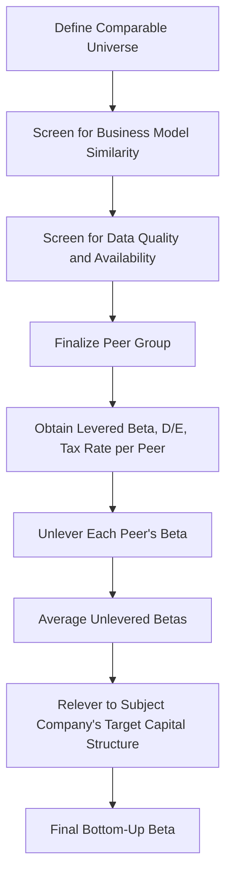

## Bottom-Up Beta from Comparable Companies

### Overview and Purpose

Bottom-up beta from comparable companies is the practical, end-to-end methodology for estimating a subject company's beta by leveraging the observed betas of a peer group rather than relying solely on the subject company's own (often noisy, unreliable, or unavailable) regression beta. This approach synthesizes the levering/unlevering mechanics detailed in the prior topic into a complete workflow, with particular emphasis on the aspects most critical to getting a reliable result in practice: peer group construction, screening, and judgment application. It is the standard approach for private companies, recent IPOs, thinly-traded stocks, or any subject company whose own regression beta is considered unreliable or unavailable.

### Why Bottom-Up Beta Is Often Preferred Over Direct Regression

As established in the beta estimation topic, a company's own regression beta can be unreliable due to thin trading, limited history, or structural business changes within the regression window. The bottom-up approach addresses this by recognizing a key insight: **business risk (asset beta) tends to be more stable across a group of similar companies than a single noisy regression estimate for any one company**, particularly when that single company has limited or unusual trading characteristics. By averaging unlevered betas across multiple peers, idiosyncratic noise in any single company's regression estimate is diluted, producing a more statistically robust estimate of the underlying industry/business risk.

### Step 1: Defining the Comparable Universe

The initial peer universe is typically identified through:

- **Industry classification systems** (e.g., GICS, SIC, or NAICS codes) as a starting screen
- **Business description review**: reading each candidate company's own description of its operations to confirm genuine business model similarity, since industry classification codes alone are often too coarse or occasionally miscategorize companies
- **Analyst and industry research**: cross-referencing sell-side research reports, industry association membership, or trade publications that group companies by genuine competitive/operational similarity

### Step 2: Screening for Business Model Similarity

Not every company sharing an industry code is a genuinely appropriate beta peer. Key screening dimensions include:

| Dimension | Why It Matters for Beta Comparability |
| --- | --- |
| Revenue mix and end markets | Different end-market exposure (e.g., consumer vs. enterprise, domestic vs. international) can produce different cyclicality and systematic risk |
| Business model (asset-light vs. asset-heavy) | Different degrees of operating leverage affect the inherent volatility of operating cash flows, independent of financial leverage |
| Growth stage and maturity | Early-stage, high-growth companies often exhibit different risk characteristics than mature companies in the same broad industry |
| Geographic exposure | Companies with different country/regional revenue mixes may have different systematic risk exposure, particularly relevant when combined with country risk premium considerations |
| Regulatory environment | Heavily regulated segments of an industry (e.g., regulated utilities) can have structurally different risk profiles than less-regulated segments of the same broad industry classification |

**Key Points**

- The goal of screening is to assemble a set of companies that share the subject company's **business/asset risk profile** as closely as possible, since the entire premise of the bottom-up method is transferring unlevered (business-risk-only) beta information from peers to the subject company
- Overly broad industry classification-based screening (including every company sharing a 4-digit SIC code, for example) risks diluting the peer group with businesses that are only superficially similar, while overly narrow screening risks an insufficient sample size to average out idiosyncratic noise effectively

### Step 3: Screening for Data Quality and Availability

- **Sufficient trading history and liquidity** for the peer's own regression beta to be considered reasonably reliable (avoiding the same thin-trading concerns that motivated using bottom-up beta for the subject company in the first place)
- **Absence of major structural changes** within the peer's own beta measurement window (recent large M&A, spin-off, or business mix shift) that would distort its regression beta
- **Availability of reliable capital structure data** (debt and equity values) needed for the unlevering calculation

### Step 4: Determining Peer Group Size

**Key Points**

- There is a trade-off between peer group size and homogeneity: a larger peer group better averages out idiosyncratic noise in individual betas, but risks including less comparable companies if the pool of genuinely similar businesses is limited
- [Inference] No universally mandated minimum or maximum peer count exists; practitioner convention often favors somewhere in the range of roughly 5–15 peers where a sufficiently comparable universe exists, though the appropriate number depends heavily on how many genuinely comparable public companies exist for the specific industry/business model in question, and for narrow or unique business models, a smaller peer set may be unavoidable

### Step 5: Handling Peer Group Heterogeneity

Even after careful screening, some genuine heterogeneity in unlevered betas across the peer group is expected and should be examined rather than mechanically averaged away:

- **Wide dispersion in unlevered betas** across the peer set suggests either the group is not as homogeneous as intended, or genuine variation exists in operating risk even among reasonably comparable companies (e.g., differing degrees of operating leverage or end-market cyclicality)
- **Outlier peers** with unlevered betas far from the group's central tendency warrant individual scrutiny — is the outlier due to a data or methodology issue (e.g., an unusually short trading history, a recent structural change) or a genuine, real business risk difference worth retaining in the analysis?
- **Median vs. mean**: some practitioners prefer the median unlevered beta over the simple mean specifically to reduce the influence of outlier peers, particularly in smaller peer groups where a single outlier can meaningfully skew a mean average

### Worked Example: Full Bottom-Up Process for a Hypothetical Subject Company

**Scenario**: valuing a mid-sized, privately-held specialty industrial equipment manufacturer with no directly observable public beta.

**Step 1–3**: After screening, five publicly traded specialty industrial equipment manufacturers with similar end-market exposure, asset intensity, and business models are identified as the peer group.

**Step 4–5**: Peer betas, capital structures, and tax rates are gathered and unlevered:

| Peer | Levered Beta | D/E | Tax Rate | Unlevered Beta |
| --- | --- | --- | --- | --- |
| Peer 1 | 1.10 | 0.35 | 25% | 0.898 |
| Peer 2 | 1.30 | 0.55 | 25% | 0.945 |
| Peer 3 | 0.90 | 0.15 | 21% | 0.815 |
| Peer 4 | 1.45 | 0.70 | 25% | 0.975 |
| Peer 5 | 1.00 | 0.25 | 25% | 0.865 |

$$\bar{\beta}_{unlevered} = \frac{0.898 + 0.945 + 0.815 + 0.975 + 0.865}{5} = 0.8996 \approx 0.90$$

**Step 6**: The subject private company's expected post-transaction target capital structure is D/E = 0.45 at a 25% tax rate:

$$\beta_{relevered} = 0.90 \times [1 + 0.75(0.45)] = 0.90 \times 1.3375 = 1.204$$

This relevered beta of approximately 1.20 becomes the subject company's beta input for its CAPM cost of equity calculation.

**Key Points**

- Note that Peer 3's relatively low unlevered beta (0.815) and Peer 4's relatively high unlevered beta (0.975) represent a meaningfully wide dispersion around the mean (roughly ±0.08–0.09); an analyst should investigate whether this dispersion reflects genuine business risk differences (e.g., Peer 3 may serve a more stable, less cyclical end market than Peer 4) before mechanically averaging, and should disclose this dispersion as context for the resulting beta estimate's precision

### Special Cases

**Private Companies and Recent IPOs**: bottom-up beta is essentially the default and often only viable method, since no reliable own-company regression beta exists at all.

**Multi-Segment / Conglomerate Companies**: for a company operating multiple distinct business lines with different risk profiles, a **sum-of-the-parts beta approach** is often more appropriate — estimating a separate bottom-up beta for each segment using segment-specific peer groups, then computing a weighted-average beta based on each segment's proportional contribution to overall enterprise value (not simply revenue, since different segments may carry different margins and capital intensity).

**Newly Formed or Spin-Off Entities**: since the entity itself has no trading history, and its "as-is" peer group may not yet be well defined immediately post-spin-off, particular care and often longer post-spin-off observation periods (or a bottom-up approach layered with judgment about the specific new entity's likely risk profile relative to its former parent and its now-identified market peers) are warranted.

### Common Errors in Bottom-Up Beta Construction

- **Over-relying on industry classification codes** without confirming genuine business model similarity through qualitative review
- **Including peers with unreliable regression betas** (thinly traded, insufficient history, own structural change) in the peer set, undermining the diversification-of-noise benefit that motivates the bottom-up method
- **Mechanically averaging without investigating dispersion**: failing to examine why unlevered betas vary meaningfully across a supposedly comparable peer set
- **Relevering to an inappropriate target capital structure** for the subject company (see: levering and unlevering beta topic for this specific error in more depth)
- **Failing to apply a sum-of-the-parts approach for genuinely multi-segment businesses**, instead using a single blended peer group that may not represent any of the subject company's actual segments well
- **Insufficient documentation of peer selection rationale**, denying a reviewer the ability to assess whether the peer group is genuinely comparable or was selected to produce a particular desired beta outcome

**Related Topics**

- The Capital Asset Pricing Model (CAPM)
- Levering and Unlevering Beta
- Beta Estimation and Regression Betas
- Comparable Company Selection Criteria
- Sum-of-the-Parts Valuation for Multi-Segment Businesses
- WACC Construction and the Capital Structure Weighting Debate
- Forecast Assumptions Documentation and Governance