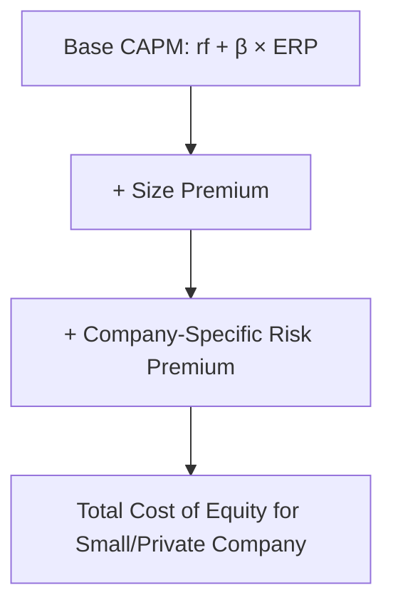

## Size Premium and Company-Specific Risk Adjustments

### Overview and Purpose

Size premium and company-specific risk adjustments address a well-documented empirical limitation of standard CAPM: small-capitalization companies have historically exhibited average realized returns higher than what their beta alone would predict under the pure CAPM formula. To address this and other unsystematic risk factors that CAPM's diversification assumption does not fully capture in practice — particularly relevant for small or closely-held private companies — practitioners commonly layer additional premiums onto the base CAPM cost of equity. This topic covers the size premium specifically, along with the broader, more subjective category of company-specific risk premiums.

### The Size Premium

#### Empirical Basis

Academic research beginning in the early 1980s (often associated with the initial "size effect" or "small-firm effect" literature) documented that small-capitalization stocks have historically generated average returns exceeding what CAPM, using only beta and the standard market ERP, would predict. This unexplained excess return for smaller companies is termed the **size premium**.

$$k_e = r_f + \beta \times ERP + Size\ Premium$$

**Key Points**

- The size premium is typically presented as a **decile or size-band-based table**, where companies are grouped by market capitalization into bands (e.g., decile 1 = largest companies, decile 10 = smallest), with a separately estimated historical size premium reported for each band
- Size premium magnitude is inversely related to company size: larger companies generally receive a minimal or zero size premium, while very small companies can receive a substantially larger addition to their CAPM-implied cost of equity
- [Unverified] Specific numeric size premium figures by decile vary by data source (e.g., different published studies and commercial data providers) and are periodically updated as more historical data accumulates; any specific percentage figures should be sourced from a current, reputable, regularly-updated dataset rather than relied upon from memory, given how much these figures can shift with updated methodology and data

#### Theoretical Explanations and Critiques

Several explanations have been proposed for the empirically observed size premium, and its interpretation remains genuinely debated in both academic and practitioner communities:

- **Liquidity risk**: smaller companies' stocks are generally less liquid, and investors may demand additional compensation for this liquidity risk, which is not directly captured by a standard beta measure
- **Information risk**: smaller companies often have less analyst coverage and less publicly available information, potentially increasing perceived risk for investors
- **Distress risk**: some research has linked the size effect to a broader "distress risk" factor, where smaller companies are more likely to face financial distress, and the observed premium may partly reflect distress risk rather than "size" as a distinct, causally meaningful risk factor per se
- **Data and methodology critiques**: some researchers have questioned whether the historically observed size effect has persisted, weakened, or reversed in more recent data periods, and whether early studies' findings were partly attributable to specific data construction choices (e.g., survivorship bias, the specific historical period studied)

[Speculation] The size premium remains one of the more academically contested areas in asset pricing; whether it represents a genuine, persistent risk factor requiring compensation, or is better explained by other factors (distress risk, liquidity, data artifacts), is a subject of ongoing debate rather than settled consensus, and practitioners should be aware that its inclusion and magnitude is a meaningfully more contested assumption than, for example, the basic CAPM beta-ERP relationship itself.

### Company-Specific Risk Premium (CSRP)

Beyond the size premium, a broader and more subjective category — often called a company-specific risk premium (CSRP) or unsystematic risk premium — is sometimes added, particularly in private company and small business valuation contexts, to account for risks that are specific to the subject company and not adequately captured by beta, ERP, or even the size premium alone.

#### Common Factors Considered in a CSRP

- **Key person / management depth risk**: heavy reliance on one or a small number of key individuals, without adequate succession planning or management depth
- **Customer or supplier concentration**: a small number of customers or suppliers representing a disproportionate share of revenue or input costs, creating vulnerability not reflected in a diversified peer beta
- **Limited product/service diversification**: reliance on a narrow product line or service offering, increasing vulnerability to a single competitive or technological disruption
- **Lack of access to capital markets**: private or small companies often face higher costs and more limited availability of both debt and equity financing than their larger, publicly-traded peers, a constraint not captured by a peer-derived beta
- **Pending litigation, regulatory, or contractual risks specific to the subject company**: idiosyncratic legal or regulatory exposures unique to the company being valued
- **Limited operating history or unproven business model**: particularly relevant for early-stage or recently-founded companies

**Key Points**

- Unlike the size premium (which, despite its own controversies, is at least grounded in a broad, published empirical dataset), the CSRP is inherently **more judgment-based and less empirically standardized**, since it is calibrated to the specific, qualitative circumstances of an individual subject company rather than derived from a broad cross-sectional dataset
- Because of this subjectivity, CSRP is one of the most scrutinized and most frequently challenged inputs in contexts like private company valuations for tax, litigation, or dispute purposes, where an opposing expert or reviewing party may specifically contest the magnitude (or even the existence) of a claimed CSRP

### Worked Example: Building Up Cost of Equity for a Small Private Company

| Component | Value |
| --- | --- |
| Risk-Free Rate | 4.2% |
| Beta (bottom-up, relevered) | 1.10 |
| Equity Risk Premium | 5.5% |
| **Base CAPM Cost of Equity** | $4.2\% + 1.10 \times 5.5\% = 10.25\%$ |
| Size Premium (small-cap decile) | +3.5% |
| Company-Specific Risk Premium (customer concentration, key-person risk) | +2.0% |
| **Total Cost of Equity** | **15.75%** |

This example illustrates how, for a genuinely small and closely-held private company, the size premium and CSRP additions can represent a very substantial component of the total cost of equity — in this case, more than a third of the total figure — underscoring why these specific additive judgments warrant particularly careful documentation and justification.

### Documentation and Justification Standards

Given the subjectivity involved, best practice for any applied size premium or CSRP includes:

- **Explicit, itemized justification** for each specific risk factor being compensated (see: forecast assumptions documentation and governance for the broader documentation framework this fits within)
- **Avoiding double-counting**: ensuring that a risk factor being compensated via CSRP is not *also* already reflected elsewhere (e.g., already embedded in a lower projected cash flow forecast, which would double-penalize the same risk both in the cash flows and in the discount rate)
- **Benchmarking against comparable situations** where possible, even though CSRP is inherently less standardized than other CAPM components, to avoid an arbitrary or unsupportable figure
- **Distinguishing systematic from diversifiable risk conceptually**: a rigorous CSRP application should, in principle, only compensate for risk that a diversified investor could not otherwise eliminate — though in practice, particularly for a controlling owner of a private company who is inherently undiversified with respect to that specific investment, this distinction is itself a matter of debate in valuation theory

[Inference] The theoretical justification for CSRP is more contested than for the broader size premium, precisely because CAPM's foundational assumption is that diversifiable risk should not be compensated at all; applying a CSRP is, in effect, implicitly relaxing this assumption for the specific investor context being valued (e.g., an undiversified private company owner), which is a defensible but non-trivial theoretical departure from pure CAPM logic, and should be understood and disclosed as such.

### Risk of Double-Counting Across Discount Rate and Cash Flow Adjustments

**Key Points**

- A common and serious error is to apply a downward adjustment to cash flow projections to reflect a specific risk (e.g., assuming lower revenue growth due to customer concentration risk) **and** separately add a CSRP to the discount rate for the same customer concentration risk — this double-counts the same underlying risk factor in two different places in the model, compounding its effect on the resulting valuation
- Best practice is to choose **one** location — either the cash flow forecast (via more conservative/probability-weighted projections) or the discount rate (via CSRP) — as the primary mechanism for reflecting a specific identified risk, and to explicitly document that choice to avoid inadvertent double-counting in either direction

### Common Errors in Size Premium and CSRP Application

- **Using outdated or unsourced size premium data** without confirming the specific dataset, methodology, and as-of date
- **Applying a CSRP without itemized, specific justification** for each risk factor being compensated, reducing it to an arbitrary "plug" figure that lacks defensibility
- **Double-counting risk** between the cash flow forecast and the discount rate for the same underlying risk factor
- **Applying a large size premium and/or CSRP to a company that is actually being valued from the perspective of a well-diversified investor** (e.g., a minority interest being acquired by a large, diversified strategic or financial acquirer), where the undiversified-investor rationale for CSRP may not straightforwardly apply
- **Failing to distinguish size premium (grounded in a broad empirical dataset, however contested) from CSRP (a more purely judgment-based addition)** when documenting and defending the overall cost of equity build-up

**Related Topics**

- The Capital Asset Pricing Model (CAPM)
- Bottom-Up Beta from Comparable Companies
- The Build-Up Method for Cost of Equity Estimation
- Private Company and Closely-Held Business Valuation Considerations
- Discount for Lack of Marketability and Control Premiums
- Forecast Assumptions Documentation and Governance
- Country Risk Premium and Emerging Markets Cost of Capital Adjustments