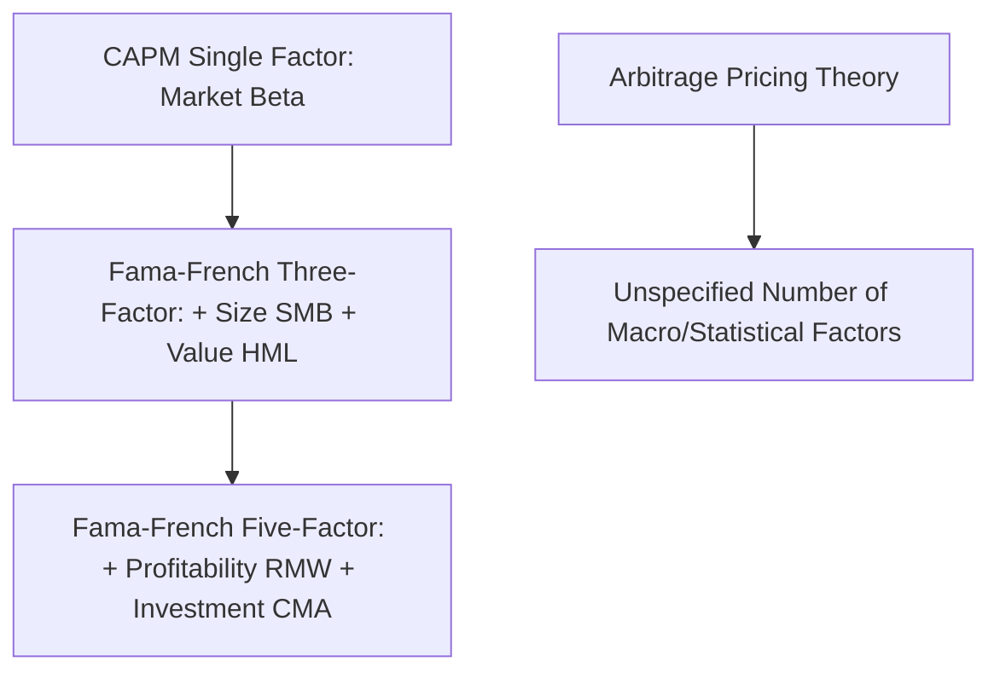
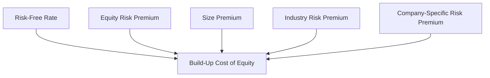
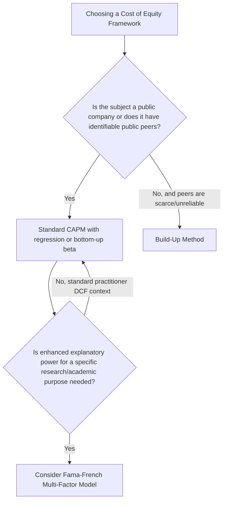

## Fama-French, Arbitrage Pricing Theory, and Build-Up Models

### Overview and Purpose

Fama-French multi-factor models, Arbitrage Pricing Theory (APT), and build-up models represent the principal alternatives and extensions to standard single-factor CAPM for estimating the cost of equity. Each addresses a specific limitation practitioners and academics have identified in pure CAPM: its reliance on a single risk factor (market beta), its data requirements (a reliable regression beta), or its theoretical foundations (mean-variance portfolio optimization under restrictive assumptions). Understanding these alternatives equips an analyst to select the most appropriate cost of equity framework for a given valuation context, and to understand the broader academic and practitioner debate underlying the CAPM-based approach used as the default throughout most of this curriculum.

### Multi-Factor Models: The Fama-French Framework

#### Motivation

Empirical research beginning in the late 1980s and early 1990s (associated primarily with Eugene Fama and Kenneth French) documented that standard single-factor CAPM beta failed to fully explain the cross-section of average stock returns — specifically, that **small-capitalization stocks** and **high book-to-market ("value") stocks** have historically earned average returns exceeding what their CAPM beta alone would predict, echoing and formalizing the size premium phenomenon discussed in the prior topic.

#### The Fama-French Three-Factor Model

$$k_e = r_f + \beta_{mkt}(r_m - r_f) + \beta_{SMB} \times SMB + \beta_{HML} \times HML$$

Where, in addition to the standard market factor:

- $SMB$ ("Small Minus Big") = the historical return premium of small-cap stocks over large-cap stocks
- $HML$ ("High Minus Low") = the historical return premium of high book-to-market ("value") stocks over low book-to-market ("growth") stocks
- $\beta_{SMB}$, $\beta_{HML}$ = the subject company's own sensitivity (loading) to each of these additional factors, estimated via a multiple regression analogous to the single-factor CAPM regression but with three independent variables instead of one

#### The Fama-French Five-Factor Model

A later extension adds two additional factors:

$$k_e = r_f + \beta_{mkt}(r_m-r_f) + \beta_{SMB} \times SMB + \beta_{HML} \times HML + \beta_{RMW} \times RMW + \beta_{CMA} \times CMA$$

Where:

- $RMW$ ("Robust Minus Weak") = the return premium associated with companies exhibiting robust (high) versus weak (low) operating profitability
- $CMA$ ("Conservative Minus Aggressive") = the return premium associated with companies that invest conservatively versus aggressively

**Key Points**

- Multi-factor models generally achieve a **higher statistical explanatory power (higher $R^2$)** for the cross-section of historical stock returns than single-factor CAPM, which is their central empirical selling point
- **Practical adoption in everyday corporate valuation (as opposed to academic asset pricing research) remains more limited than CAPM**, primarily because: (a) estimating a company-specific loading on each additional factor requires more data and more complex regression methodology than a simple single-factor beta; (b) obtaining reliable, up-to-date factor return data (SMB, HML, RMW, CMA) requires either subscribing to a specific academic data source or constructing the factors independently; and (c) CAPM's relative simplicity and long-standing practitioner familiarity continue to make it the default choice in most standard corporate DCF and cost of capital work
- [Inference] The degree of practical adoption of Fama-French style multi-factor models varies significantly by practitioner community: it is more commonly encountered in academic finance, some institutional asset management contexts, and select rigorous valuation contexts, while standard corporate finance/investment banking DCF practice has generally continued to default to single-factor CAPM, often supplemented by the size premium and CSRP additions discussed in the prior topic rather than a full multi-factor regression

### Arbitrage Pricing Theory (APT)

#### Theoretical Foundation

APT, developed by Stephen Ross, is a more general theoretical framework than either CAPM or Fama-French, positing that a security's expected return can be modeled as a linear function of multiple systematic risk factors, without APT itself specifying in advance what those factors must be (in contrast to Fama-French's specific, empirically-identified factor set):

$$k_e = r_f + \beta_1 \times RP_1 + \beta_2 \times RP_2 + \ldots + \beta_n \times RP_n$$

Where each $RP_i$ represents the risk premium associated with a distinct systematic risk factor (which might include macroeconomic factors such as unexpected inflation, industrial production growth, changes in the term structure of interest rates, and other statistically or economically motivated factors, depending on the specific implementation).

**Key Points**

- APT is derived from a **no-arbitrage argument** rather than CAPM's mean-variance portfolio optimization foundation, making it theoretically more general and reliant on fewer restrictive assumptions about investor behavior and preferences
- APT's practical drawback is precisely its generality: because the theory does not specify which factors matter or how many there should be, implementing APT in practice requires the analyst (or a specific empirical study) to identify and estimate a specific factor set, introducing significant methodological discretion
- [Inference] Direct application of APT in standard everyday corporate DCF valuation work is relatively uncommon compared to CAPM or even Fama-French, given the added complexity of factor identification and estimation; APT's greater practical influence has arguably been as a theoretical foundation motivating the broader class of multi-factor models (including Fama-French) rather than as a directly and commonly implemented cost of equity formula in standard practitioner valuation work

### The Build-Up Method

#### Overview

The build-up method is a widely used alternative primarily in **private company and small business valuation** contexts, constructing cost of equity as an additive sum of separately estimated components, **without relying on a regression-derived beta at all**:

$$k_e = r_f + ERP + Size\ Premium + Industry\ Risk\ Premium + CSRP$$

**Key Points**

- The build-up method's defining characteristic relative to CAPM is the **absence of an explicit beta term** — instead of using a market-derived beta to scale the ERP for the subject company's systematic risk, the build-up method treats the ERP as applying at a base level (implicitly assuming average, beta-of-1.0 systematic risk) and layers on separately estimated additive premiums for size, industry-specific risk, and company-specific risk
- An **industry risk premium** component (sometimes included, sometimes folded into the size premium data source depending on the specific dataset/methodology used) attempts to capture industry-level risk characteristics not otherwise reflected in the additive framework
- This method is particularly common for **small, closely-held private companies** where a reliable beta (whether from the company's own trading history, which doesn't exist, or from a bottom-up peer approach, which may be difficult if genuinely comparable public peers are scarce for a very niche or small business) is difficult to construct with confidence

#### Build-Up Method vs. CAPM: Practical Comparison

| Consideration | CAPM (with bottom-up beta if needed) | Build-Up Method |
| --- | --- | --- |
| Requires a beta estimate | Yes | No (implicitly assumes beta = 1.0 as a baseline) |
| Data requirements | Peer group beta, D/E, tax rate data | ERP, size premium tables, industry risk premium data, CSRP judgment |
| Typical use case | Public companies; private companies with identifiable public peers for bottom-up beta | Small, closely-held private companies, especially where genuinely comparable public peers are scarce or beta estimation is otherwise unreliable |
| Degree of judgment involved | Moderate (peer selection, target capital structure) | Higher (CSRP and sometimes industry risk premium are more subjective) |

**Example**

A boutique professional services firm with no direct, closely comparable set of publicly traded peers (making a reliable bottom-up beta difficult to construct with confidence) might reasonably use the build-up method instead, layering a risk-free rate, standard ERP, an appropriate small-company size premium from a published dataset, an industry risk premium (if available for the specific service industry), and a CSRP reflecting firm-specific factors such as client concentration or key-person dependency — arriving at a cost of equity without ever needing to estimate a beta directly.

### Choosing Among Frameworks

**Key Points**

- **Standard CAPM (with bottom-up beta where needed) remains the dominant default framework** in mainstream corporate valuation, investment banking, and equity research practice, given its relative simplicity, long-standing familiarity among practitioners and reviewers, and generally adequate performance for the purpose of estimating a defensible discount rate
- **Fama-French and APT-style multi-factor approaches** are more prevalent in academic finance research and certain institutional/quantitative contexts, where the added statistical explanatory power and more rigorous factor-based risk decomposition are more directly valued
- **The build-up method** occupies a distinct practical niche, specifically suited to private/small company valuation where beta estimation (via either direct regression or a reliable bottom-up peer approach) is genuinely difficult or unreliable

### Common Errors Across These Frameworks

- **Mixing components from different frameworks inconsistently**: e.g., using a build-up method's additive size premium and CSRP alongside a full CAPM beta-scaled ERP, effectively double-counting size and idiosyncratic risk that the beta-scaling and the additive premiums may already jointly reflect in different ways
- **Applying a full Fama-French multi-factor model without access to reliable, current factor return data**, using approximate or outdated factor premiums that undermine the model's theoretical advantage over simpler CAPM
- **Using the build-up method for a company with perfectly good identifiable public peers available**, forgoing the more standard and often more easily benchmarked CAPM bottom-up beta approach without clear justification
- **Failing to disclose which framework was used and why**, particularly important given how differently each framework is constructed and how much this choice can affect the resulting cost of equity for smaller or less conventional companies

**Next Steps**

- The Capital Asset Pricing Model (CAPM)
- Size Premium and Company-Specific Risk Adjustments
- Bottom-Up Beta from Comparable Companies
- Private Company and Closely-Held Business Valuation Considerations
- WACC Construction and the Capital Structure Weighting Debate
- Modern Portfolio Theory and Mean-Variance Optimization Foundations
- Forecast Assumptions Documentation and Governance