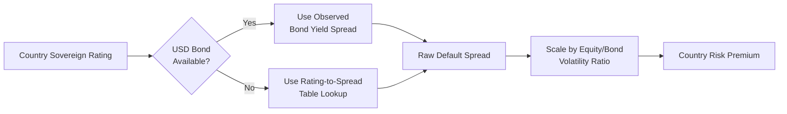

## Country Risk Premium for Emerging Market Valuation

### Definition and Conceptual Foundation

The Country Risk Premium (CRP) is the additional return investors demand for holding equity exposure in a given country beyond what would be required in a "base" mature market (typically the United States). It captures risks not fully diversifiable through global portfolios: political instability, currency inconvertibility, expropriation risk, weak institutions, sovereign default probability, and macroeconomic volatility.

In the Capital Asset Pricing Model (CAPM) framework extended for emerging markets, the cost of equity becomes:

$$k_e = R_f + \beta \times ERP_{mature} + CRP$$

Where $R_f$ is the risk-free rate (usually the US Treasury yield), $\beta$ is the levered equity beta, $ERP_{mature}$ is the mature market equity risk premium, and $CRP$ is the country risk premium being added as a separate term.

**Key Points**

- CRP is layered on top of, not blended into, the mature market ERP
- It is a company-valuation adjustment, not a macroeconomic forecasting exercise
- Practitioners disagree on whether CRP should be scaled by a company's exposure to that country or applied uniformly — this is one of the most debated areas in applied valuation

---

### Why Country Risk Matters in DCF

Emerging market cash flows are riskier not because accounting numbers differ, but because the *distribution of possible outcomes* is wider: currency devaluation, capital controls, tax law changes, or sovereign default can all disrupt cash flow realization even if the underlying business fundamentals are sound. A DCF model that uses a mature-market discount rate for an emerging-market company will systematically overvalue the asset, because it fails to price in the tail risk embedded in operating in that jurisdiction.

There are two theoretically distinct places country risk could be reflected in a DCF:

1. **In the cash flows** — haircut projected cash flows for probability-weighted adverse scenarios (currency crisis, expropriation)
2. **In the discount rate** — add a CRP to the cost of equity/capital

Most practitioners use the discount rate approach for tractability, but this creates a **double-counting risk** if cash flows have already been conservatively adjusted for country-specific risk. This is discussed further below.

---

### Sources of Country Risk Premium Estimates

#### Sovereign Bond Default Spread Approach

The most widely used starting point (popularized by Aswath Damodaran) uses the spread between a country's sovereign bond yield (denominated in a hard currency like USD) and the US Treasury yield of comparable maturity:

$$\text{Default Spread} = Y_{sovereign,\$} - Y_{UST}$$

This spread is observable from sovereign bonds issued in USD, or inferred from the country's sovereign credit rating using a ratings-to-spread mapping table (since not all countries have liquid USD-denominated bonds).

**Example**

If a 10-year USD-denominated Philippine sovereign bond yields 5.8% and the 10-year US Treasury yields 4.3%, the raw sovereign default spread is 1.5%.

#### Relative Equity Market Volatility Adjustment

Because equity markets are inherently more volatile than sovereign bond markets, Damodaran's approach scales the default spread upward by the ratio of equity market volatility to bond market volatility:

$$CRP = \text{Default Spread} \times \left(\frac{\sigma_{equity}}{\sigma_{sovereign\ bond}}\right)$$

This ratio is often estimated using the standard deviation of the country's equity index returns divided by the standard deviation of the sovereign bond returns (or a proxy such as an emerging market bond index).

**[Inference]** In practice this volatility ratio commonly falls in the range of 1.0x–1.5x for many emerging markets, though this varies significantly by country and time period, and should be recalculated rather than assumed.

**Example (continued)**

If Philippine equity volatility is 22% annualized and the sovereign bond volatility is 14%, the ratio is 1.57x. Applying this to the 1.5% default spread:

$$CRP = 1.5\% \times 1.57 = 2.36\%$$

#### Credit Default Swap (CDS) Spreads

Where liquid CDS markets exist for sovereign debt, the CDS spread (cost of insuring against sovereign default) offers an alternative, market-based, real-time estimate of country risk, often preferred over bond spreads because it strips out liquidity premium distortions present in the underlying bond.

#### Country Risk Rating Services

Organizations such as the PRS Group (International Country Risk Guide), the Economist Intelligence Unit, and Institutional Investor's country credit ratings provide composite scores incorporating political, financial, and economic risk sub-indices. These are typically converted to an implied premium via regression against observed sovereign spreads, since the raw scores are not denominated in return terms.

---

### Sovereign Rating-to-Spread Mapping

When a country lacks liquid USD-denominated sovereign debt, practitioners map its credit rating (Moody's, S&P, Fitch) to a typical default spread observed for that rating category, often derived from a broader sample of rated sovereigns.

**[Unverified]** Exact rating-to-spread mappings change over time as credit markets reprice risk, so any specific numerical table should be sourced from a current published dataset (e.g., Damodaran's annually updated country risk data) rather than treated as fixed.

---

### Incorporating CRP into the Cost of Equity: Three Approaches

#### Approach 1: Uniform Addition (Full Exposure)

Add the entire CRP to every company operating in that country, regardless of the nature of its business:

$$k_e = R_f + \beta \times ERP_{mature} + CRP$$

This is simple but crude — it treats an export-oriented multinational with minimal local currency exposure the same as a purely domestic retailer.

#### Approach 2: Lambda-Adjusted (Exposure-Weighted)

Damodaran's refinement scales the CRP by a company-specific factor $\lambda$ (lambda) that measures how exposed the company actually is to that country's risk, rather than assuming uniform exposure:

$$k_e = R_f + \beta \times ERP_{mature} + \lambda \times CRP$$

Lambda is often proxied by the proportion of revenue generated domestically versus internationally, though more rigorous approaches regress the company's stock returns against a country risk factor (such as sovereign bond returns) to estimate sensitivity directly.

**Example**

A mining company generating 80% of revenue from commodity exports (priced in USD globally) versus 20% from domestic sales might warrant a $\lambda$ of roughly 0.3–0.5, since global commodity pricing insulates most of its cash flow from local country risk, whereas a purely domestic bank might warrant $\lambda \approx 1.0$ or higher given its direct sovereign and currency linkage.

#### Approach 3: Melded/Blended Country Risk in the ERP

Instead of adding CRP as a separate additive term, some practitioners blend it directly into a country-specific total equity risk premium:

$$ERP_{country} = ERP_{mature} + CRP$$

$$k_e = R_f + \beta \times ERP_{country}$$

This is mathematically equivalent to Approach 1 when $\lambda = 1$, but is often presented as a single "total ERP" figure in market data services, which can obscure the fact that a lambda adjustment is being implicitly skipped.

---

### Currency Considerations

CRP estimates derived from USD-denominated sovereign bonds are inherently in **USD terms**. If the DCF is being built in local currency (nominal), the CRP must be converted to a local-currency-equivalent premium, typically via the relative inflation differential (using an approximation of purchasing power parity / the international Fisher relation):

$$(1 + k_{e,local}) = (1 + k_{e,\$}) \times \frac{(1 + \pi_{local})}{(1 + \pi_{\$})}$$

Where $\pi_{local}$ and $\pi_{\$}$ are the expected inflation rates in the local currency and USD respectively. Failing to make this adjustment — mixing a dollar-based discount rate with local-currency nominal cash flows — is one of the most common practical DCF errors when valuing emerging market assets.

**Key Points**

- Always match the currency of the discount rate to the currency of the cash flows
- A dollar-denominated CRP applied to peso-denominated nominal cash flows without inflation adjustment will misstate value
- The direction of the error typically overstates the discount rate (and understates value) when local inflation exceeds USD inflation, since the mismatch omits a currency-driven cash flow growth offset

---

### The Double-Counting Problem

A frequently raised critique: if cash flow projections already embed conservative assumptions for currency devaluation risk, political disruption, or a haircut for expropriation probability, then *also* adding a full CRP to the discount rate double-penalizes the valuation for the same risk.

**[Speculation]** Some practitioners resolve this by using scenario-weighted or probability-weighted cash flows (explicitly modeling a low-probability adverse state) combined with a discount rate that reflects only *systematic*, non-diversifiable risk — theoretically excluding the CRP entirely if the adverse scenario is fully captured in the numerator. This is a less common practice in applied corporate valuation than the discount-rate approach, largely due to the difficulty of credibly estimating scenario probabilities.

The more common practical convention is a middle ground: apply the discount-rate-based CRP (as the primary mechanism) while keeping cash flow projections at a "base case, no major disruption" level, avoiding an additional discretionary haircut layered on top.

---

### Illustrative Diagram: CRP Layering in the Cost of Equity

<svg xmlns="http://www.w3.org/2000/svg" viewBox="0 0 640 320" font-family="Helvetica, Arial, sans-serif">
<text x="320" y="24" text-anchor="middle" font-size="15" font-weight="bold" fill="#1a1a1a">Cost of Equity Build-Up: Emerging Market (svg_diagram)</text>

<rect x="220" y="260" width="140" height="30" fill="#4A90D9" stroke="#2a5d8a" />
<text x="290" y="280" text-anchor="middle" font-size="12" fill="#fff">Risk-Free Rate</text>
<rect x="220" y="200" width="140" height="60" fill="#6FBF73" stroke="#3d8b41" />
<text x="290" y="234" text-anchor="middle" font-size="12" fill="#fff">β × Mature Market ERP</text>
<rect x="220" y="140" width="140" height="60" fill="#E8A33D" stroke="#b5791f" />
<text x="290" y="174" text-anchor="middle" font-size="12" fill="#fff">λ × Country Risk</text>
<text x="290" y="188" text-anchor="middle" font-size="11" fill="#fff">Premium (CRP)</text>

<line x1="365" y1="140" x2="385" y2="140" stroke="#333" stroke-width="1.5" />
<line x1="385" y1="140" x2="385" y2="290" stroke="#333" stroke-width="1.5" />
<line x1="365" y1="290" x2="385" y2="290" stroke="#333" stroke-width="1.5" />
<line x1="385" y1="215" x2="410" y2="215" stroke="#333" stroke-width="1.5" />
<rect x="410" y="190" width="180" height="50" fill="#fff" stroke="#333" stroke-width="1.5" rx="4" />
<text x="500" y="212" text-anchor="middle" font-size="13" font-weight="bold" fill="#1a1a1a">Cost of Equity</text>
<text x="500" y="228" text-anchor="middle" font-size="12" fill="#1a1a1a">(Emerging Market)</text>

<line x1="60" y1="290" x2="60" y2="140" stroke="#888" stroke-width="1" />
<text x="45" y="215" text-anchor="middle" font-size="11" fill="#666" transform="rotate(-90 45 215)">Increasing k_e</text>
</svg>

---

### Worked Numerical Example

**Inputs**

- Risk-free rate ($R_f$): 4.3% (US 10-year Treasury)
- Mature market ERP: 5.0%
- Levered beta ($\beta$): 1.1
- Sovereign default spread: 1.5%
- Equity/bond volatility ratio: 1.4x
- Company lambda ($\lambda$): 0.7 (partial export exposure)

**Calculation**

Step 1 — Compute CRP:

$$CRP = 1.5\% \times 1.4 = 2.1\%$$

Step 2 — Apply lambda adjustment:

$$\lambda \times CRP = 0.7 \times 2.1\% = 1.47\%$$

Step 3 — Assemble cost of equity:

$$k_e = 4.3\% + (1.1 \times 5.0\%) + 1.47\% = 4.3\% + 5.5\% + 1.47\% = 11.27\%$$

**Output**

The emerging-market-adjusted cost of equity is approximately **11.27%**, compared to a mature-market-only estimate of 9.8% (4.3% + 5.5%) — a 1.47 percentage point uplift attributable to country risk exposure, net of the company's partial insulation via export revenue.

---

### Common Pitfalls

- **Applying CRP twice**: once via a discount-rate add-on and again via a discretionary cash flow haircut, without a documented rationale for both
- **Currency mismatch**: using a USD-derived CRP in a local-currency nominal DCF without an inflation-differential conversion
- **Ignoring lambda**: applying full CRP uniformly to companies with minimal true country exposure (e.g., a global commodity exporter), overstating the discount rate
- **Stale spread data**: sovereign spreads are market-driven and can move sharply during crises; using outdated spread data materially misprices risk. **[Inference]** this is particularly consequential during acute sovereign stress episodes, when spreads can move by hundreds of basis points within weeks
- **Rating-implied spread staleness**: rating agencies tend to lag market pricing of sovereign risk, so a rating-based CRP proxy may understate risk relative to a market-based (bond or CDS) measure during a rapidly deteriorating credit situation

---

### Alternative and Supplementary Methods

| Method | Basis | Strength | Limitation |
| --- | --- | --- | --- |
| Sovereign bond default spread | Observed USD bond yields | Market-based, transparent | Requires liquid USD sovereign debt |
| CDS spread | Credit default swap pricing | Real-time, strips liquidity premium | Limited to countries with active CDS markets |
| Rating-to-spread mapping | Credit rating tables | Works for any rated country | Lags market-implied risk |
| Relative volatility (equity vs. bond) | Historical return volatility | Captures equity-specific risk premium | Sensitive to estimation window chosen |
| Composite country risk scores | Political/financial/economic indices | Multidimensional risk view | Requires regression conversion to a return premium |

---

**Related Topics**

- Levered vs. Unlevered Beta Estimation for Emerging Market Comparables
- Currency Risk and Real vs. Nominal DCF Construction
- Terminal Value Estimation Under Sovereign Risk Uncertainty
- WACC Construction for Multinational Companies with Cross-Border Revenue
- Damodaran's Implied Equity Risk Premium Methodology
- Sovereign Credit Rating Migration and Its Impact on Corporate Cost of Capital
- Political Risk Insurance and Its Interaction with Discount Rate Adjustments