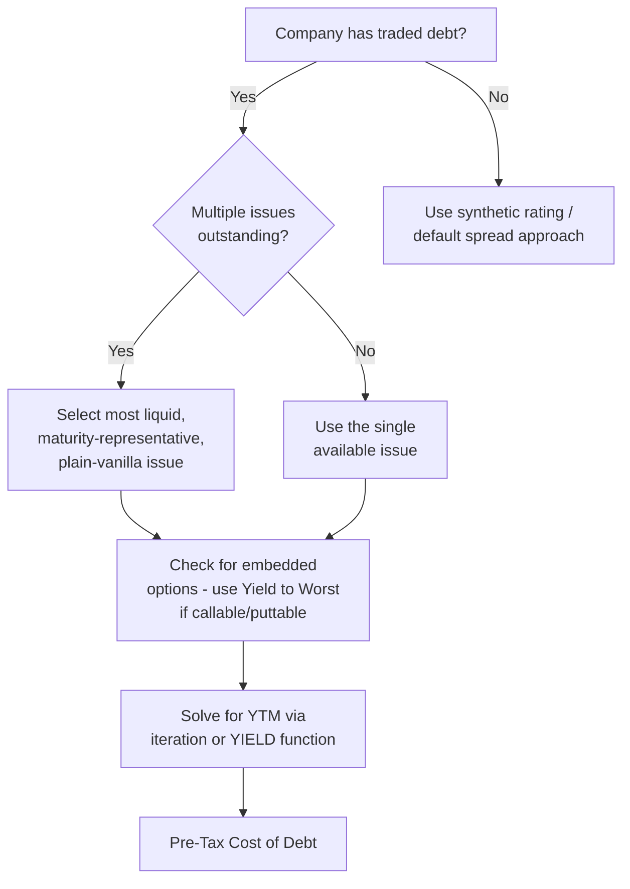

## Cost of Debt from Yield to Maturity

### Definition and Conceptual Foundation

The Yield to Maturity (YTM) approach estimates a company's pre-tax cost of debt directly from the market price of its traded bonds, representing the total annualized return an investor would earn holding the bond to maturity, assuming all coupon and principal payments are made as scheduled. It is the preferred method for estimating cost of debt whenever a company has liquid, actively traded debt outstanding, since it reflects current market pricing of default risk rather than a historical or accounting-based cost.

**Key Points**

- YTM is a market-implied, forward-looking rate — not the coupon rate, not the historical average interest rate paid
- It is the internal rate of return (IRR) that equates the bond's discounted cash flows to its current market price
- The YTM approach is a direct substitute for the synthetic rating / default spread approach, used when actual traded debt is available

---

### The YTM Formula

The bond price is the present value of all future coupon payments plus the present value of the face value at maturity, discounted at the yield to maturity:

$$P = \sum_{t=1}^{n} \frac{C}{(1+YTM)^t} + \frac{F}{(1+YTM)^n}$$

Where $P$ is the current market price of the bond, $C$ is the periodic coupon payment, $F$ is the face (par) value, $n$ is the number of periods to maturity, and $YTM$ is the yield to maturity being solved for.

Because $YTM$ appears in every discounting term, this equation generally has **no closed-form algebraic solution** for $n > 2$ and must be solved iteratively (numerically) — typically via financial calculators, spreadsheet functions, or root-finding algorithms such as Newton-Raphson.

---

### Approximation Formula

Before computational tools were ubiquitous, analysts used an approximation formula that provides a reasonably close estimate without iteration:

$$YTM \approx \frac{C + \frac{F - P}{n}}{\frac{F + P}{2}}$$

This approximates the yield as the annual coupon plus the amortized capital gain or loss (from price converging to par at maturity), divided by the average of face value and price.

**[Inference]** This approximation is generally accurate to within a few basis points for bonds priced close to par with moderate maturities, but the error widens for deep discount/premium bonds or very long maturities, so it should be treated as a sanity check rather than a substitute for the exact iterative solution in a valuation model.

---

### Worked Example: Solving for YTM

**Inputs**

- Face value ($F$): $1,000
- Annual coupon rate: 6% (coupon $C$ = $60/year, assume annual payments for simplicity)
- Current market price ($P$): $950
- Years to maturity ($n$): 5

**Approximation Calculation**

$$YTM \approx \frac{60 + \frac{1000 - 950}{5}}{\frac{1000 + 950}{2}} = \frac{60 + 10}{975} = \frac{70}{975} \approx 7.18\%$$

**Exact Iterative Solution**

Testing $YTM = 7.2\%$:

$$P = \frac{60}{1.072^1} + \frac{60}{1.072^2} + \frac{60}{1.072^3} + \frac{60}{1.072^4} + \frac{1060}{1.072^5}$$


$$P \approx 55.97 + 52.21 + 48.70 + 45.43 + 751.13 \approx 953.44$$

Since $953.44 is slightly above the target price of $950, the actual YTM is marginally higher than 7.2%. Iterating further (e.g., via a financial calculator's IRR/YTM function or Excel's `YIELD()` function) converges to approximately **7.24%**.

**Output**

The bond's yield to maturity is approximately 7.24%, which represents the market's current required pre-tax return on this company's debt — higher than the 6% coupon because the bond trades at a discount to par.

---

### Practical Implementation in Excel/Spreadsheet Models

The standard approach in a working DCF model uses a built-in financial function rather than manual iteration:



```
=YIELD(settlement_date, maturity_date, coupon_rate, price, redemption, frequency, [basis])
```

Where `price` is entered as a percentage of face value (e.g., 95 for a bond priced at 95% of par), `redemption` is typically 100 (percentage of face value repaid at maturity), and `frequency` is 2 for semiannual coupon bonds (the market convention for most corporate bonds, particularly in the US).

Alternatively, for a quick IRR-style calculation from raw cash flows:



```
=IRR(cash_flow_range)
```

adjusted for the periodicity of payments (e.g., multiply a semiannual IRR by 2 to annualize, using the bond-equivalent yield convention, rather than compounding it, since bond market convention typically quotes YTM on a simple annualized/bond-equivalent basis rather than an effective annual basis).

**Key Points**

- Always check whether coupons are paid annually or semiannually — mismatching frequency assumptions is a common source of error
- Bond-equivalent yield (simple annualization) differs from effective annual yield (compounded annualization); DCF models should be explicit and consistent about which convention is used, since mixing them introduces small but avoidable rate distortions
- If using `YIELD()` in Excel, the `basis` parameter (day-count convention) can materially affect the output for short-maturity bonds; 30/360 is the common US corporate bond default

---

### Selecting Which Bond to Use

When a company has multiple bond issues outstanding, several practical considerations guide the choice:

1. **Maturity matching**: prefer a bond with maturity closest to the company's typical debt tenor or the valuation horizon, since the yield curve for the company's credit typically slopes with maturity
2. **Liquidity**: prefer the most actively traded issue — illiquid bonds can show stale or distorted pricing that doesn't reflect true current credit risk
3. **Seniority and covenants**: senior secured debt will yield differently than subordinated or unsecured debt; select the issue most representative of the company's overall capital structure, or use a weighted average across tranches
4. **Embedded options**: callable, puttable, or convertible bonds have yields distorted by the option value; where possible, use **Yield to Worst** (the lower of yield-to-call and yield-to-maturity) or a plain-vanilla issue instead



---

### From Pre-Tax YTM to After-Tax Cost of Debt

YTM as computed above is the **pre-tax** cost of debt. Because interest expense is tax-deductible in most jurisdictions, the effective cost to the firm is reduced by the tax shield:

$$k_d = YTM \times (1 - t)$$

Where $t$ is the marginal tax rate applicable to the company (not necessarily the effective/average tax rate reported in financial statements, since marginal rate better reflects the incremental tax benefit of an additional dollar of interest expense).

**Example (continued)**

Using the 7.24% YTM computed above, with a marginal tax rate of 25%:

$$k_d = 7.24\% \times (1 - 0.25) = 7.24\% \times 0.75 = 5.43\%$$

This after-tax cost of debt of 5.43% is the figure used in the WACC calculation, not the raw YTM.

---

### YTM vs. Alternative Cost of Debt Methods

| Method | Basis | When Used | Limitation |
| --- | --- | --- | --- |
| YTM (market-based) | Current traded bond price | Company has liquid public debt | Requires actively traded debt; distorted by embedded options |
| Synthetic rating / default spread | Interest coverage ratio mapped to a rating-implied spread | No traded debt, or debt is illiquid/private | Depends on accuracy of the rating-to-spread mapping and the coverage ratio proxy used |
| Historical/effective interest rate | Total interest expense ÷ average total debt (from financial statements) | Backward-looking sanity check | Reflects historical, not current, market pricing; distorted by debt issued at different times/rates |
| Credit spread over risk-free | Observed spread on comparable-rated bonds | Cross-check or when company-specific bonds are unavailable | Requires genuinely comparable peer bonds (rating, sector, tenor) |

**[Inference]** In practice, YTM-based estimates and synthetic-rating-based estimates should converge reasonably closely for a given company at a given point in time; a large divergence between the two often signals either a stale/illiquid bond price or a rating that has not yet been updated to reflect the market's current view of credit risk, and warrants investigating which input is less reliable before proceeding.

---

### Common Pitfalls

- **Using coupon rate instead of YTM**: the coupon rate is a historical contractual artifact fixed at issuance and does not reflect the company's current cost of borrowing
- **Forgetting the tax adjustment**: using pre-tax YTM directly in WACC overstates the cost of debt
- **Ignoring embedded options**: computing plain YTM on a callable bond ignores the fact that the issuer will likely refinance if rates fall, understating the true yield to worst
- **Frequency/compounding mismatches**: treating a semiannual-pay bond's periodic yield as if it were already annualized (or double-compounding it) produces a materially wrong rate
- **Using illiquid or off-the-run bond pricing**: stale quotes on thinly traded issues can significantly misstate the true market-required yield
- **Applying a single bond's YTM across a firm with a very different overall capital structure** (e.g., using a short-dated senior secured note's yield to represent a firm predominantly financed with longer-dated subordinated debt)

---

**Related Topics**

- Synthetic Credit Rating Approach for Private/Unrated Companies
- Yield to Worst and Yield to Call for Callable Bonds
- Marginal vs. Effective Tax Rate Selection in WACC
- Credit Spread Term Structure and Maturity-Matched Discount Rates
- Weighted Average Cost of Debt Across Multiple Debt Tranches
- Bond Pricing Fundamentals: Duration and Convexity
- Building the WACC: Combining Cost of Equity and Cost of Debt