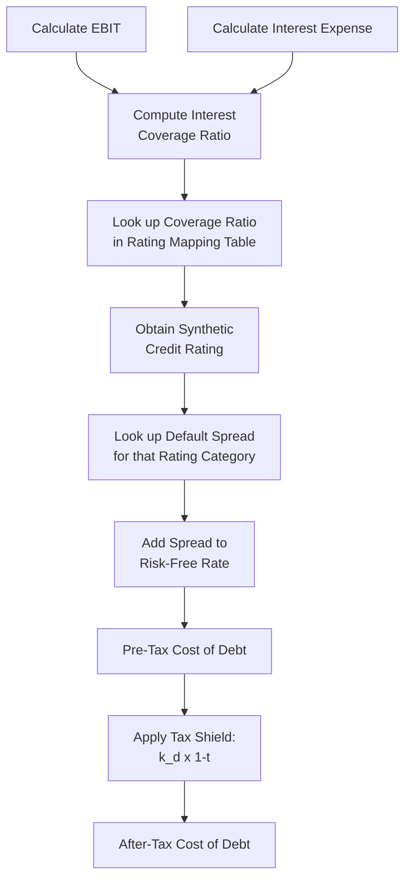

## Synthetic Credit Rating Approach to Cost of Debt

### Definition and Conceptual Foundation

The synthetic credit rating approach estimates a company's cost of debt when it has no traded public debt, illiquid debt, or is entirely privately held, by inferring what credit rating the company *would* receive from a rating agency based on its financial characteristics, then mapping that implied rating to a market-observed default spread. This spread is added to the risk-free rate to construct a pre-tax cost of debt, without requiring an actual bond price or an actual agency rating.

**Key Points**

- This is the standard fallback whenever the YTM approach is unavailable (private companies, unrated companies, illiquid debt)
- The method proxies for an agency rating using a single financial ratio (most commonly interest coverage), rather than the full multi-factor analysis a rating agency would perform
- It is inherently an approximation — the goal is a reasonable, defensible, and internally consistent cost of debt, not a precise replication of what S&P or Moody's would actually assign

---

### The Core Mechanism: Interest Coverage Ratio

The most widely used variant (popularized by Aswath Damodaran) uses the **interest coverage ratio** as the sole explanatory variable, based on the empirical observation that this ratio correlates strongly with actual agency credit ratings across large samples of rated companies:

$$\text{Interest Coverage Ratio} = \frac{EBIT}{\text{Interest Expense}}$$

A higher ratio indicates the company generates more operating earnings relative to its debt service obligations, implying lower default risk and therefore a higher (better) synthetic rating.

**[Inference]** Some practitioners substitute EBITDA for EBIT in the numerator, reasoning that EBITDA better approximates cash available for debt service since it excludes non-cash depreciation and amortization; however, the original and most widely cited rating-to-spread mapping tables are calibrated using EBIT-based coverage, so consistency with the source mapping table used matters more than which earnings measure is theoretically "more correct."

---

### Step-by-Step Process

**Step 1 — Compute the interest coverage ratio** using the most recent trailing twelve-month or normalized annual EBIT and interest expense.

**Step 2 — Map the ratio to a synthetic rating** using a published lookup table (interest coverage ranges bucketed by rating category, e.g., AAA, AA, A, BBB, BB, B, CCC).

**Step 3 — Map the synthetic rating to a default spread** using current market-observed spreads for bonds of that rating category (these spreads are dynamic and must be refreshed periodically, as they widen and narrow with credit market conditions).

**Step 4 — Construct pre-tax cost of debt**:

$$k_{d,pretax} = R_f + \text{Default Spread}_{synthetic\ rating}$$

**Step 5 — Apply the tax shield** to arrive at the after-tax cost of debt used in WACC:

$$k_d = k_{d,pretax} \times (1 - t)$$

---

### Illustrative Rating Mapping Table Structure

**[Unverified]** The specific numerical breakpoints below illustrate the *structure* of such a mapping table; exact coverage ratio thresholds and spread values change over time and vary by company size (large-cap vs. small-cap tables typically differ, since smaller firms are riskier at the same coverage ratio). Current values should be sourced from an up-to-date published dataset (e.g., Damodaran's periodically updated ratings tables) rather than treated as fixed constants.

| Interest Coverage Ratio (illustrative range) | Synthetic Rating (illustrative) | Illustrative Default Spread |
| --- | --- | --- |
| > 12.5x | AAA | ~0.4% |
| 9.5x – 12.5x | AA | ~0.6% |
| 7.5x – 9.5x | A+ | ~0.8% |
| 6.0x – 7.5x | A | ~1.0% |
| 4.5x – 6.0x | A- | ~1.2% |
| 3.5x – 4.5x | BBB | ~1.6% |
| 3.0x – 3.5x | BB+ | ~2.0% |
| 2.5x – 3.0x | BB | ~2.5% |
| 2.0x – 2.5x | B+ | ~3.25% |
| 1.5x – 2.0x | B | ~4.0% |
| 1.25x – 1.5x | B- | ~5.5% |
| 0.8x – 1.25x | CCC | ~7.5% |
| < 0.8x | D/near-default | ~10%+ |

---

### Worked Example

**Inputs**

- EBIT: $85 million
- Interest expense: $14 million
- Risk-free rate: 4.3%
- Marginal tax rate: 25%

**Step 1 — Interest coverage ratio**

$$\text{Coverage} = \frac{85}{14} = 6.07x$$

**Step 2 — Map to synthetic rating**

A coverage ratio of 6.07x falls in the "A" range per the illustrative table above.

**Step 3 — Look up default spread**

Illustrative A-rated spread: 1.0%

**Step 4 — Pre-tax cost of debt**

$$k_{d,pretax} = 4.3\% + 1.0\% = 5.3\%$$

**Step 5 — After-tax cost of debt**

$$k_d = 5.3\% \times (1 - 0.25) = 5.3\% \times 0.75 = 3.975\%$$

**Output**

The company's synthetic-rating-implied after-tax cost of debt is approximately **3.98%**, derived entirely from its income statement, without reference to any actual traded bond price.

---

### Adjustments for Company Size and Risk Profile

Larger, more diversified companies with the same interest coverage ratio as a smaller company are generally viewed by rating agencies as less risky, because size correlates with revenue diversification, market power, and access to capital markets during stress. Accordingly, refined versions of the mapping table apply different coverage-to-rating breakpoints for:

- **Large-cap / more financially stable firms**: wider coverage ratio bands qualify for a given rating (i.e., a lower coverage ratio can still achieve an investment-grade synthetic rating)
- **Small-cap / higher-risk firms**: narrower bands — a small company needs a meaningfully higher coverage ratio to achieve the same synthetic rating as a large company would with a lower ratio

**Key Points**

- Always select the mapping table variant appropriate to the company's size/risk category, since applying a large-cap table to a small, volatile-earnings company will overstate the synthetic rating and understate the true cost of debt
- Cyclical industries (e.g., commodities, homebuilders) often warrant a more conservative rating interpretation even at a seemingly healthy coverage ratio, since coverage computed on a single year's EBIT can be misleadingly favorable at a cycle peak

---

### Multi-Factor Extensions

While single-ratio interest coverage mapping is the standard teaching and practitioner shortcut, more rigorous synthetic rating models incorporate multiple financial ratios, mirroring the broader set of factors rating agencies actually consider:

- **Leverage ratios**: Debt/EBITDA, Debt/Capital
- **Profitability**: EBITDA margin, return on capital
- **Liquidity**: current ratio, quick ratio
- **Size**: revenue or asset base (as a scale/diversification proxy)
- **Cash flow coverage**: (EBITDA − Capex) / Interest Expense, which is more conservative than plain EBIT coverage since it nets out reinvestment needs before assessing debt service capacity

**[Inference]** Multi-factor synthetic rating models (such as those built via statistical regression against actual historical agency ratings) tend to produce more accurate rating estimates than the single-ratio approach, particularly for companies with unusual capital structures or non-standard profitability profiles, but they require materially more data and are less commonly used in a standard classroom or quick-turnaround valuation context due to the added complexity.

---

### Synthetic Rating vs. YTM: When Each Applies

| Scenario | Recommended Approach |
| --- | --- |
| Company has liquid, actively traded public debt | YTM approach (direct market observation) |
| Company has debt, but it is illiquid/thinly traded | Synthetic rating (YTM price may be unreliable) |
| Private company or subsidiary with no public debt | Synthetic rating (only viable option) |
| Company has an actual agency credit rating but no traded bonds | Use the agency rating directly, mapped to spread (skip the synthetic estimation step — use the real rating) |
| Newly public / recently restructured company with limited financial history | Synthetic rating with caution; consider normalizing EBIT for one-time items |

---

### Common Pitfalls

- **Using a single year's EBIT** without checking for cyclicality, one-time charges, or unusually depressed/inflated earnings, which can distort the coverage ratio and produce a misleading synthetic rating
- **Applying the wrong size-based mapping table**, inflating the synthetic rating for a genuinely higher-risk small-cap company
- **Failing to refresh default spreads**, since spread-to-rating tables shift meaningfully with credit market conditions (e.g., spreads widen materially during a credit crunch, even if the company's own fundamentals haven't changed)
- **Ignoring off-balance-sheet or operating lease obligations** that function economically like debt, understating true leverage and thus overstating the synthetic rating
- **Treating the synthetic rating as precise** rather than as a reasonable proxy — it is a modeling convenience, not a substitute for genuine credit analysis when precision materially matters (e.g., in a fairness opinion or credit-sensitive transaction)

---

**Related Topics**

- Cost of Debt from Yield to Maturity (Market-Based Alternative)
- Interest Coverage Ratio Normalization for Cyclical Industries
- Operating Lease Capitalization and Its Effect on Leverage Ratios
- Marginal vs. Effective Tax Rate Selection in WACC
- Credit Rating Agency Methodology: Moody's, S&P, and Fitch Frameworks
- Building the WACC: Combining Cost of Equity and Cost of Debt
- Target vs. Actual Capital Structure Weights in WACC