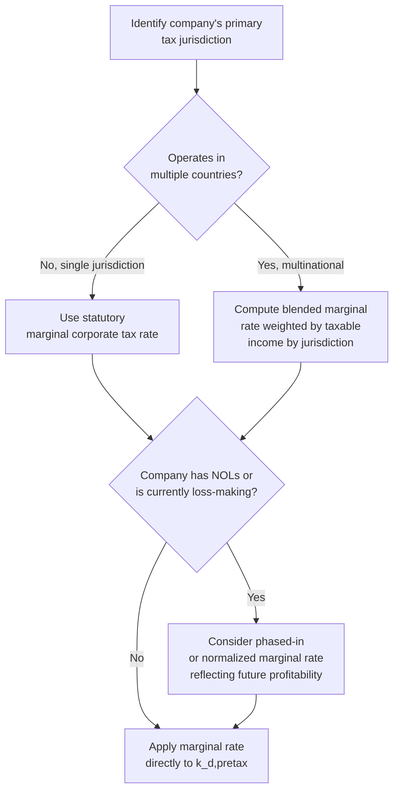

## After-Tax Cost of Debt and Marginal Tax Rate Selection

### Definition and Conceptual Foundation

The after-tax cost of debt is the effective cost a firm incurs on its borrowings once the tax deductibility of interest expense is accounted for. Because interest payments reduce taxable income in most jurisdictions, part of the cost of debt is effectively subsidized by the tax authority — this subsidy is known as the **interest tax shield**. The after-tax cost of debt is the figure used in the Weighted Average Cost of Capital (WACC), never the pre-tax rate.

$$k_d = k_{d,pretax} \times (1 - t)$$

Where $k_{d,pretax}$ is the pre-tax cost of debt (from YTM or the synthetic rating approach) and $t$ is the tax rate applied to the interest tax shield.

**Key Points**

- The tax adjustment is what makes debt a cheaper source of capital than equity, dollar-for-dollar, in the WACC framework
- The tax rate selected here has a first-order effect on WACC and therefore on enterprise value — it is not a minor technical footnote
- The correct rate to use is the **marginal tax rate**, not the effective/average tax rate reported on the income statement

---

### Why Marginal Tax Rate, Not Effective Tax Rate

The **effective tax rate** is a backward-looking, blended figure computed as:

$$\text{Effective Tax Rate} = \frac{\text{Total Tax Expense}}{\text{Pre-Tax Income}}$$

This ratio reflects the historical mix of tax credits, deferred tax items, foreign tax rate differentials, one-time items, and jurisdiction-specific incentives that applied to that specific year's income — it does not represent the tax rate that will apply to the *next incremental dollar* of interest expense.

The **marginal tax rate** is the tax rate that applies to the last dollar of taxable income, and is therefore the theoretically correct rate for computing the tax shield's value, since the interest tax shield's benefit is realized precisely on that incremental dollar.

**Key Points**

- Effective tax rates are volatile year-to-year due to one-time items (asset sales, restructuring charges, tax credit expirations) and can be misleading if used mechanically in a forward-looking discount rate
- Marginal tax rate is typically closer to the statutory corporate tax rate of the company's headquarters jurisdiction, adjusted for known permanent differences
- Using effective tax rate when it is unusually low (e.g., due to a one-time tax credit) will understate the true after-tax cost of debt and overstate valuation; using it when unusually high will do the reverse

---

### Selecting the Appropriate Marginal Tax Rate

**Single-jurisdiction domestic companies**: use the statutory corporate income tax rate of the country of incorporation/primary operations (e.g., the US federal corporate rate combined with an applicable state rate, if material).

**Multinational companies**: a blended marginal rate is often constructed as a taxable-income-weighted average of the marginal rates across the jurisdictions in which the company generates most of its earnings, since a single country's statutory rate may not represent the group's actual marginal tax exposure.

**[Inference]** In practice, many analysts default to a single home-country statutory marginal rate as a simplifying assumption even for multinationals, particularly when detailed jurisdictional taxable income breakdowns aren't readily available; this is a defensible simplification for a first-pass valuation but introduces imprecision for companies with a large proportion of foreign-sourced earnings taxed at materially different rates.

---

### Worked Example: Single-Jurisdiction Company

**Inputs**

- Pre-tax cost of debt: 5.3% (from synthetic rating or YTM)
- Applicable marginal tax rate: 25% (combined statutory rate)

**Calculation**

$$k_d = 5.3\% \times (1 - 0.25) = 5.3\% \times 0.75 = 3.975\%$$

**Output**

The after-tax cost of debt is approximately 3.98%.

---

### Worked Example: Multinational Blended Marginal Rate

**Inputs**

- Pre-tax cost of debt: 5.3%
- Jurisdiction A (60% of taxable income): 25% marginal rate
- Jurisdiction B (30% of taxable income): 21% marginal rate
- Jurisdiction C (10% of taxable income): 30% marginal rate

**Step 1 — Compute the blended marginal tax rate**

$$t_{blended} = (0.60 \times 25\%) + (0.30 \times 21\%) + (0.10 \times 30\%)$$

$$t_{blended} = 15\% + 6.3\% + 3\% = 24.3\%$$

**Step 2 — Apply to pre-tax cost of debt**

$$k_d = 5.3\% \times (1 - 0.243) = 5.3\% \times 0.757 = 4.01\%$$

**Output**

The blended after-tax cost of debt is approximately 4.01%, marginally higher than the single-jurisdiction example above because the weighted-average marginal rate (24.3%) is slightly below the 25% used in the domestic-only case.

---

### The Net Operating Loss (NOL) and Loss-Making Company Problem

A significant complication arises when a company is currently loss-making or has substantial Net Operating Loss (NOL) carryforwards: in the near term, additional interest expense may not generate an *immediate* cash tax benefit, because there is no current taxable income against which to apply the deduction (though it may be carried forward, subject to jurisdiction-specific limitations on NOL usage and expiration).

**Approaches to Handling This**

1. **Zero tax shield during the loss/NOL period**: apply a 0% marginal tax rate to the interest tax shield for as long as the company is expected to have NOLs or negative taxable income, then transition to the full marginal rate once NOLs are projected to be exhausted
2. **Phased-in marginal rate**: gradually ramp the effective tax rate applied to the interest deduction from 0% toward the full statutory marginal rate as the projection period progresses and profitability is expected to normalize
3. **Simplifying assumption**: some practitioners apply the full marginal rate throughout regardless of near-term NOLs, reasoning that the DCF's terminal value dominates total value and near-term tax shield timing differences are immaterial to the overall conclusion

**[Speculation]** Approach 1 or 2 is generally more defensible for early-stage, cyclical, or recently-loss-making companies where NOL usage is a genuine multi-year constraint, since ignoring it can materially overstate near-term free cash flow to equity if the tax shield is credited before it is actually usable; Approach 3 is more common as a pragmatic simplification in mature, consistently profitable companies where the issue is immaterial by construction.

---

### Statutory Rate Changes and Forward-Looking Adjustments

Marginal tax rate selection must also account for any **known, enacted future changes** to statutory tax rates (e.g., a legislated phased rate reduction or increase taking effect in a future year). Using a currently effective rate that is scheduled to change during the explicit forecast period, without adjusting for the known future rate, introduces an avoidable inaccuracy.

**Key Points**

- Use the rate expected to apply during each specific forecast year, not necessarily a single static rate across the entire projection
- For the terminal value calculation, use the marginal rate expected to prevail in perpetuity post-forecast-period, which is typically the steady-state statutory rate once all known scheduled changes have taken effect
- Tax law changes are a common source of valuation model staleness — a model built before a change in the tax code and not updated afterward can carry a meaningfully wrong tax shield assumption

---

### Interaction with WACC and Enterprise Value

The after-tax cost of debt feeds directly into WACC:

$$WACC = \frac{E}{V} \times k_e + \frac{D}{V} \times k_d \times (1-t)$$

Because $k_d \times (1-t)$ appears as the debt component, a higher marginal tax rate assumption *lowers* WACC (all else equal), which *increases* the present value of projected cash flows and thus enterprise value. This creates a direct, mechanical, and often underappreciated sensitivity: valuation conclusions can shift meaningfully based purely on which tax rate convention (marginal vs. effective) or which blended rate methodology is selected, independent of any change in the operating business assumptions.

**Example**

Holding all other WACC inputs constant, moving the marginal tax rate assumption from 21% to 25% on a pre-tax cost of debt of 5.3%, with a 30% debt weight in the capital structure:

At $t = 21\%$: debt component contribution to WACC $= 0.30 \times 5.3\% \times 0.79 = 1.256\%$

At $t = 25\%$: debt component contribution to WACC $= 0.30 \times 5.3\% \times 0.75 = 1.193\%$

The WACC declines by roughly 0.06 percentage points purely from the tax rate assumption change — a seemingly small shift that can still meaningfully affect enterprise value at higher discount rates and longer projection horizons, particularly through the terminal value.

---

### Common Pitfalls

- **Using the effective tax rate mechanically** without checking whether it reflects unusual one-time items that distort it away from the true marginal rate
- **Ignoring NOL carryforwards** for currently loss-making or recently-turnaround companies, overstating near-term tax shield benefits
- **Failing to update for enacted future tax law changes** known at the valuation date
- **Applying a single home-country rate to a heavily multinational company** without considering a blended jurisdictional rate, particularly when a large share of income is earned in a materially different tax regime
- **Inconsistency between the tax rate used for the cost of debt tax shield and the tax rate used elsewhere in the model** (e.g., in unlevering/relevering beta, or in computing unlevered free cash flow) — these should generally be the same rate for internal consistency unless a specific, documented reason justifies divergence

---

**Related Topics**

- Cost of Debt from Yield to Maturity
- Synthetic Credit Rating Approach to Cost of Debt
- Building the WACC: Combining Cost of Equity and Cost of Debt
- Net Operating Loss Carryforwards in Free Cash Flow Projections
- Unlevering and Relevering Beta: The Role of the Tax Rate
- Target vs. Actual Capital Structure Weights in WACC
- Terminal Value Assumptions and Steady-State Tax Rate Selection