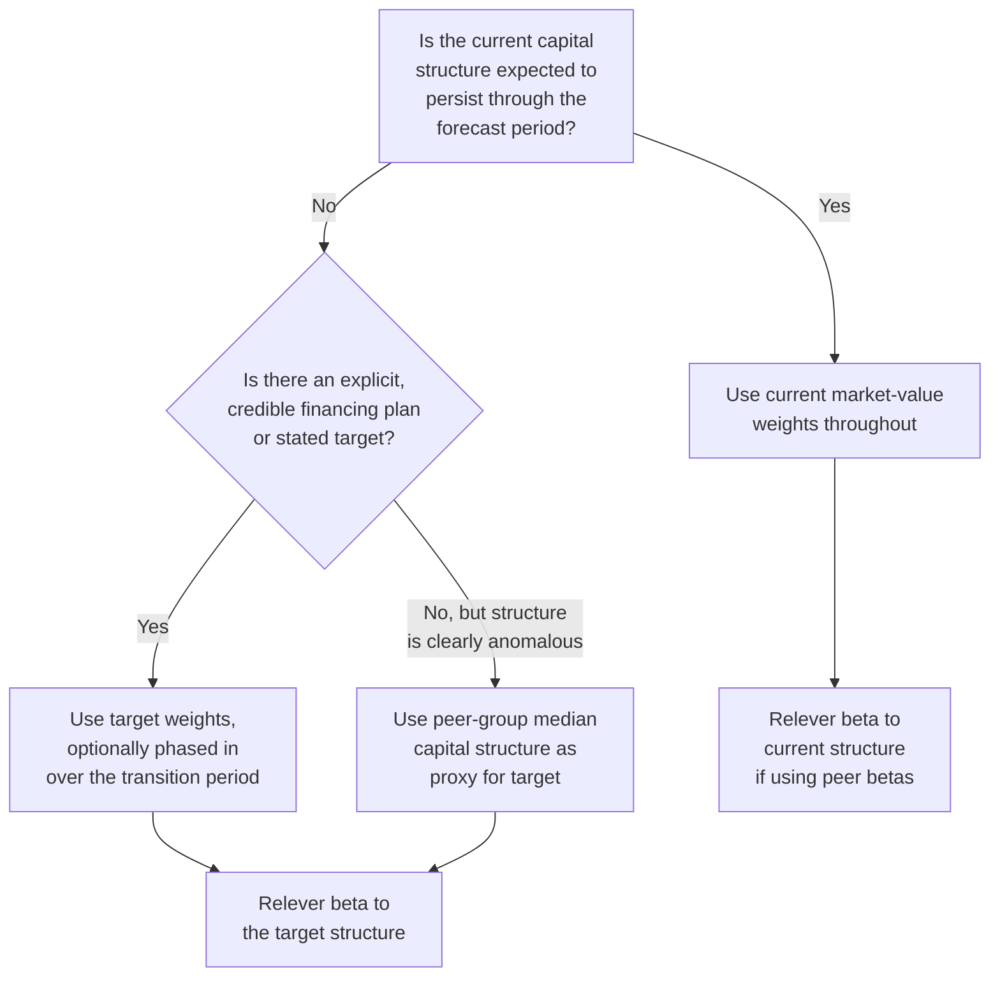

## Target versus Current Capital Structure Weights

### Definition and Conceptual Foundation

Capital structure weights determine how much influence the cost of equity versus the cost of debt has on the Weighted Average Cost of Capital (WACC). The central methodological question this topic addresses is: **should these weights reflect the company's current, actual mix of debt and equity, or a target/optimal mix that the company is expected to move toward over time?**

$$WACC = \frac{E}{V} \times k_e + \frac{D}{V} \times k_d \times (1-t)$$

Where $E$ is the market value of equity, $D$ is the market value of debt, and $V = E + D$. The choice of which $E$, $D$, and $V$ to use — current market values, current book values, or target/normalized values — materially affects the resulting WACC and therefore enterprise value.

**Key Points**

- Weights should always be based on **market values**, not book values, regardless of whether current or target weights are used
- "Current" and "target" refer to the *proportions* of debt and equity, not to whether market or book values are used
- This is one of the most consequential and most frequently mishandled inputs in a practical DCF, because it interacts with beta relevering, the cost of debt, and the entire WACC simultaneously

---

### Why Market Values, Never Book Values

Book value of equity reflects historical accounting entries (retained earnings, paid-in capital, less accumulated losses) and can diverge enormously from the market's current assessment of the company's worth. Book value of debt is a closer proxy to market value for debt trading near par, but can still diverge meaningfully for distressed debt or debt issued at very different interest rate environments than today's.

$$\text{Market Value of Equity} = \text{Share Price} \times \text{Diluted Shares Outstanding}$$

For debt, if market prices for the company's bonds are unavailable, book value of debt is commonly used as a reasonable proxy, since debt values tend to be closer to par than equity values are to book equity — but this is an approximation, not a preference for book value in principle.

**Key Points**

- Using book value of equity when the company trades well above or below book (common for growth companies or distressed companies, respectively) can produce a materially distorted capital structure weight
- Debt-to-value ratios based on book value of debt are a widely accepted simplification specifically because debt market values are usually reasonably close to book, not because book value is theoretically preferred

---

### Current (Actual) Capital Structure Weights

The current approach uses the company's actual, present-day market value mix of debt and equity as observed at the valuation date.

**When Current Weights Are Appropriate**

- The company's capital structure is stable and not expected to change materially over the forecast horizon
- There is no announced or anticipated refinancing, deleveraging, or leveraging event
- The valuation is being performed on a going-concern basis without an activist, LBO, or restructuring thesis attached

**Example**

A mature, stable industrial company with:

- Market value of equity: $4.2 billion
- Market value of debt: $1.8 billion
- Total value: $6.0 billion

$$\frac{E}{V} = \frac{4.2}{6.0} = 70\%, \quad \frac{D}{V} = \frac{1.8}{6.0} = 30\%$$

These weights would be applied directly to the WACC formula.

---

### Target Capital Structure Weights

The target approach uses the capital structure the company is *expected to move toward*, rather than its current mix — commonly derived from industry peer averages, management's stated capital structure policy, or an explicit financing plan (e.g., in an LBO or turnaround scenario where leverage is deliberately being paid down or increased over time).

**When Target Weights Are Appropriate**

- The company has announced or is executing a deliberate deleveraging or releveraging plan
- The company's current structure is transitional (e.g., recently post-IPO, recently post-acquisition, or holding unusually high cash/low debt pending a planned buyback or acquisition)
- The current structure is anomalous relative to the company's stated long-term policy or its industry peer group, and management has signaled an intent to normalize toward that peer/policy level
- Valuing a private company or division with no independent market-observable capital structure, where a peer-derived target structure is the only available benchmark

**Example**

A company currently has:

- Market value of equity: $5.0 billion
- Market value of debt: $0.5 billion (unusually low, post-recent-IPO)
- Current $D/V = 9\%$

But management has stated an intent to lever up to a target $D/V = 25\%$ (consistent with mature industry peers) over the next several years through debt-funded buybacks. In this case, using the current 9% weight would understate the tax shield benefit and cost of capital dynamics the company is actually moving toward, so the analyst would use the 25% target weight instead (adjusting beta accordingly — see below).

---

### Decision Framework

---

### Interaction with Beta Relevering

Capital structure weight selection is inseparable from the beta used in the cost of equity calculation. If a target capital structure is used for the WACC weights, the beta must also be relevered to that same target structure for internal consistency — using a beta relevered to the current structure alongside WACC weights based on the target structure (or vice versa) produces an internally inconsistent cost of equity.

$$\beta_{levered} = \beta_{unlevered} \times \left[1 + (1-t) \times \frac{D}{E}\right]$$

The $D/E$ used here must match whichever capital structure (current or target) is being used to weight the WACC, ensuring the beta and the weights are computed on a consistent basis.

**Key Points**

- Mismatching the beta's embedded leverage assumption against the WACC's weight assumption is a common and easily overlooked internal consistency error
- If using peer-derived unlevered betas (common when the subject company itself has limited trading history or an unusual structure), the unlevering/relevering process must be applied twice: first unlever each peer's beta using *that peer's own* capital structure, then relever the resulting average unlevered beta using the *subject company's* target (or current) structure

---

### Phased or Transitional Weighting

When a company is in the process of transitioning from a current structure to a clearly identified target structure over a defined multi-year period (e.g., an LBO paying down acquisition debt, or a company gradually re-levering after a deleveraging phase), a **phased WACC approach** is sometimes used instead of a single static rate for the entire projection:

- Compute a separate WACC for each year (or defined phase) of the explicit forecast period, using the projected capital structure weight expected in that specific year
- Apply the terminal value's WACC using the long-run target/steady-state structure
- Discount each year's cash flow using that year's specific rate (compounding sequentially), rather than a single blended rate across all years

**[Inference]** This phased approach is standard practice in LBO and leveraged recapitalization modeling, where the debt paydown schedule is explicit and material to value; it is less commonly applied in standard corporate DCF valuations of stable, unlevered operating companies, where the added complexity is rarely justified relative to the marginal accuracy gained.

---

### Worked Example: Target Weight with Beta Relevering

**Inputs**

- Current company: $D/V = 10\%$, $E/V = 90\%$, current levered beta = 1.05
- Target structure (per stated management policy and peer benchmarking): $D/V = 30\%$, $E/V = 70\%$
- Marginal tax rate: 25%

**Step 1 — Unlever the current beta**

$$\beta_{unlevered} = \frac{1.05}{1 + (1-0.25) \times \frac{0.10}{0.90}} = \frac{1.05}{1 + 0.75 \times 0.111} = \frac{1.05}{1.0833} \approx 0.969$$

**Step 2 — Relever to the target structure**

$$\beta_{target} = 0.969 \times \left[1 + (1-0.25) \times \frac{0.30}{0.70}\right] = 0.969 \times [1 + 0.75 \times 0.4286]$$

$$\beta_{target} = 0.969 \times 1.3214 \approx 1.281$$

**Output**

Using the target 30%/70% structure both for the WACC weights and consistently for the relevered beta (1.281, higher than the current 1.05 due to higher assumed financial leverage) ensures the cost of equity, cost of debt weighting, and overall WACC all reflect the same assumed future capital structure rather than mixing current and target assumptions inconsistently.

---

### Common Pitfalls

- **Using book value weights** out of convenience when market values are readily available
- **Mixing current-structure beta with target-structure weights** (or vice versa), producing an internally inconsistent WACC
- **Assuming a target structure without a credible basis** — an arbitrary or aspirational target not grounded in peer data, management guidance, or an explicit financing plan is difficult to defend and introduces unsubstantiated bias into the valuation
- **Ignoring off-balance-sheet debt-like obligations** (capitalized operating leases, underfunded pension obligations, preferred stock) when computing the "debt" component of both current and target structures
- **Applying a single static WACC across a period where leverage is materially and predictably changing** (e.g., an LBO), when a phased/period-specific WACC would more accurately reflect the actual risk profile in each year
- **Failing to update target weights over time** — a "target" set years ago based on stale peer data or an outdated management policy should be revisited before being used in a current valuation

---

**Related Topics**

- Unlevering and Relevering Beta: The Role of the Tax Rate
- After-Tax Cost of Debt and Marginal Tax Rate Selection
- Building the WACC: Combining Cost of Equity and Cost of Debt
- Peer Group Selection and Comparable Company Beta Estimation
- LBO Modeling: Debt Paydown Schedules and Phased Discount Rates
- Operating Lease Capitalization and Its Effect on Leverage Ratios
- Market Value of Equity vs. Book Value of Equity in Valuation Inputs