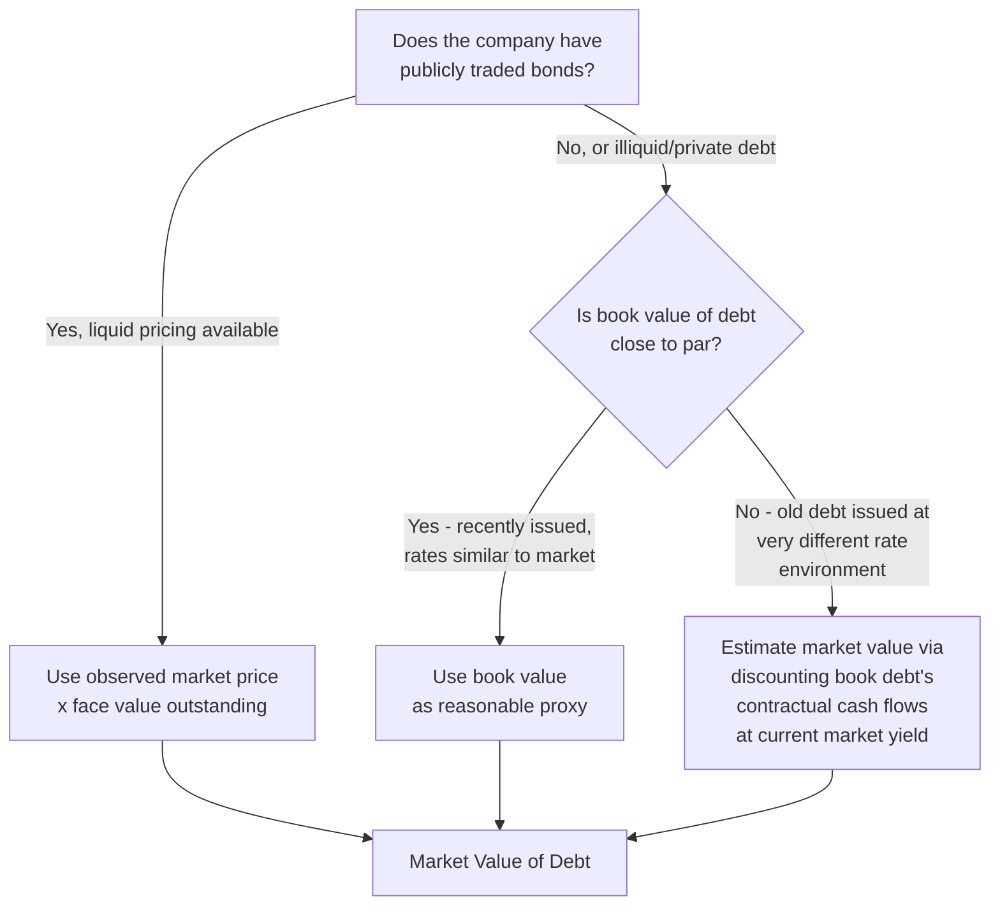

## Market Value versus Book Value Weights

### Definition and Conceptual Foundation

This topic addresses which valuation basis — market value or book value — should be used to compute the debt and equity weights in the WACC formula. While closely related to the current-vs-target capital structure question, it is a conceptually distinct issue: it concerns *how* each component (debt, equity) is measured, not whether the *proportions* should reflect the present or an anticipated future mix.

$$WACC = \frac{E}{V} \times k_e + \frac{D}{V} \times k_d \times (1-t)$$

The theoretically correct answer is unambiguous: **market values should always be used**, because WACC represents the return investors currently require given what they would have to pay today to acquire that claim on the firm — and that price is the market value, not a historical accounting figure.

**Key Points**

- This is one of the few areas in valuation methodology where there is near-universal academic and practitioner consensus on the "correct" answer
- Book value weights are used in practice primarily as a pragmatic proxy when market values are unobservable (private debt) or as a simplifying convention, not because they are theoretically preferred
- The market-value requirement applies to both the equity and debt components, though the practical difficulty of obtaining each differs substantially

---

### Why Market Value Is Theoretically Correct

WACC is meant to represent the *opportunity cost of capital* — the return investors could earn elsewhere for bearing equivalent risk, given what it would cost to acquire the security today. Book value reflects a **historical, backward-looking accounting entry**: original issuance price, accumulated retained earnings, treasury stock repurchases, and other entries that have no necessary relationship to what the security is worth or costs to acquire today.

$$\text{Market Value of Equity} = P_{share} \times \text{Shares Outstanding (diluted)}$$

Book value of equity, by contrast, is:

$$\text{Book Value of Equity} = \text{Common Stock} + \text{Additional Paid-in Capital} + \text{Retained Earnings} - \text{Treasury Stock}$$

These two figures can diverge by an order of magnitude or more, particularly for asset-light, high-growth, or intangible-heavy businesses where the market prices in growth expectations, brand value, or intellectual property that never appears on the balance sheet.

**Example**

A technology company might have:

- Book value of equity: $800 million
- Market value of equity (at a $40 share price × 100 million diluted shares): $4,000 million

Using book value equity weight would understate the true (much larger) proportion of the capital structure financed by equity, artificially inflating the apparent weight of debt, and — since debt is typically cheaper than equity — understating the true WACC.

---

### Practical Sourcing of Market Value of Equity

Market value of equity is generally the easiest component to obtain accurately, since public companies have observable, continuously updated share prices:

$$MV_{Equity} = \text{Current Share Price} \times \text{Fully Diluted Shares Outstanding}$$

**Key Points**

- Use fully diluted shares outstanding (including in-the-money options, warrants, and convertible securities using the treasury stock method or as-converted method, as appropriate), not basic shares outstanding, since the fully diluted count better reflects the true claims on equity value
- Use a reasonably current share price; some practitioners use a short trailing average (e.g., 30-day volume-weighted average price) rather than a single spot price, to reduce the influence of a single day's market noise or a transient price spike/dip
- For private companies with no traded equity, market value of equity must be estimated circularly (it is often the very output the valuation is trying to determine) — this is commonly resolved through an iterative approach, or by using an initial proxy (e.g., a comparable company multiple) that is refined once the DCF's own implied equity value is computed

---

### Practical Sourcing of Market Value of Debt

Market value of debt is more frequently approximated using book value, for practical reasons:

**When book value of debt is a reasonable proxy**: debt trades close to par when coupon rates are reasonably close to current market yields for comparable credit risk, and when the issuer's credit quality has not changed dramatically since issuance. In these cases, book value (from the balance sheet) is commonly accepted as a practical substitute for true market value.

**When book value diverges materially from market value**: this occurs when (a) interest rates have moved significantly since the debt was issued (causing a fixed-rate bond's market price to move inversely), or (b) the company's credit quality has deteriorated or improved substantially since issuance (widening or narrowing the credit spread relative to what was priced in at issuance).

**Approximating market value of debt when it diverges from book value**: discount the debt's contractual remaining cash flows (coupons and principal) at the *current* market yield for debt of that credit quality and maturity, rather than at the original coupon rate:

$$MV_{Debt} = \sum_{t=1}^{n} \frac{\text{Coupon Payment}_t}{(1+YTM_{current})^t} + \frac{\text{Face Value}}{(1+YTM_{current})^n}$$

This is mechanically the same present-value calculation used to derive YTM from price, run in reverse: instead of solving for the yield given the price, the current market yield is used to solve for the implied market value.

**[Inference]** For most stable, investment-grade companies with debt of moderate maturity, the divergence between book and market value of debt is typically modest (often within a few percentage points of face value) unless there has been a significant interest rate move or credit event since issuance — in which case using book value as a proxy introduces a correspondingly larger, and less defensible, approximation error.

---

### Worked Example: Book vs. Market Value Weight Divergence

**Inputs**

- Market value of equity: $3,600 million
- Book value of equity: $1,100 million
- Book value of debt: $900 million (assume market value of debt ≈ book value, debt trades near par)

**Book Value Weights**

$$\frac{D}{V}_{book} = \frac{900}{900 + 1{,}100} = \frac{900}{2{,}000} = 45\%$$

$$\frac{E}{V}_{book} = 55\%$$

**Market Value Weights**

$$\frac{D}{V}_{market} = \frac{900}{900 + 3{,}600} = \frac{900}{4{,}500} = 20\%$$

$$\frac{E}{V}_{market} = 80\%$$

**Output**

Book value weights suggest a 45% debt-financed capital structure, while market value weights reveal the company is actually only 20% debt-financed once the true market value of equity is reflected. Since equity is typically more expensive than debt, using the book-value-derived 45% debt weight would materially understate WACC (by over-weighting the cheaper debt component), leading to an overstated enterprise value.

---

### Quantifying the WACC Distortion

Continuing the example above, assume:

- Cost of equity ($k_e$): 11%
- After-tax cost of debt ($k_d$): 4%

**WACC using book value weights**

$$WACC_{book} = (0.55 \times 11\%) + (0.45 \times 4\%) = 6.05\% + 1.80\% = 7.85\%$$

**WACC using market value weights**

$$WACC_{market} = (0.80 \times 11\%) + (0.20 \times 4\%) = 8.80\% + 0.80\% = 9.60\%$$

**Output**

The book-value-weighted WACC (7.85%) is materially lower than the theoretically correct market-value-weighted WACC (9.60%) — a difference of 1.75 percentage points, purely from the choice of weighting basis. Given the sensitivity of DCF valuations to the discount rate, this single input choice can shift enterprise value substantially, generally overstating it when book value understates the true (larger) equity weight, since the cheaper debt component is then over-weighted relative to its true proportion.

---

### Circularity Considerations

Because market value of equity is often the *output* the DCF is trying to solve for (particularly in a standalone valuation with no observable public market price), using market value weights can introduce a mild circularity: the WACC depends on the market value of equity, but the market value of equity depends on the WACC-discounted DCF.

**Common Resolutions**

1. **Iterative solving**: use spreadsheet iterative calculation (circular reference toggle) to let the model converge on a self-consistent WACC and implied equity value
2. **Initial proxy, then refine**: start with a reasonable initial estimate of equity value (e.g., from a comparable company multiple or the company's current trading price if partially public), compute WACC, run the DCF, then re-check whether the resulting implied equity value is reasonably consistent with the initial proxy — iterating manually if not
3. **For public companies**: this circularity is largely moot, since actual observed market capitalization can be used directly, sidestepping the need to solve for it

---

### Common Pitfalls

- **Defaulting to book value out of convenience** for equity, when market value is readily observable for any public company
- **Using stale share prices** (e.g., from several months prior) rather than a reasonably current price or short trailing average
- **Using basic shares outstanding instead of fully diluted shares**, understating true market value of equity
- **Assuming book value of debt is always an adequate proxy** without checking whether interest rates or credit quality have shifted materially since issuance
- **Mixing bases inconsistently** — using market value for equity but book value for debt (or vice versa) without a clear, documented rationale for the asymmetry
- **Ignoring the circularity issue entirely** for private company valuations, effectively anchoring to an arbitrary or outdated equity value assumption without any iterative refinement

---

**Related Topics**

- Target versus Current Capital Structure Weights
- Cost of Debt from Yield to Maturity
- Building the WACC: Combining Cost of Equity and Cost of Debt
- Fully Diluted Share Count: Treasury Stock Method and As-Converted Securities
- Circularity in DCF Models: Iterative Solving Techniques
- Comparable Company Analysis for Private Company Equity Value Proxies
- Operating Lease Capitalization and Its Effect on Leverage Ratios