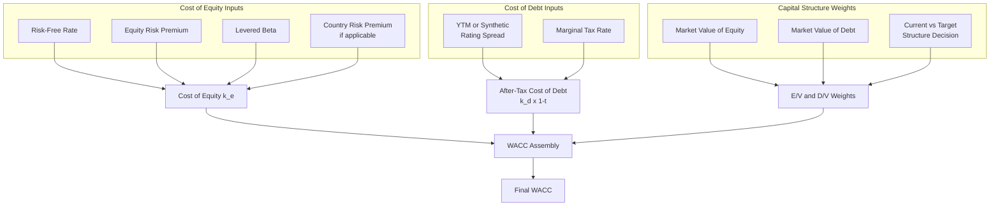

## Weighted Average Cost of Capital (WACC) Assembly

### Definition and Conceptual Foundation

The Weighted Average Cost of Capital (WACC) is the blended discount rate representing the average return required by *all* providers of capital — equity holders and debtholders — weighted by their respective proportions in the firm's capital structure. It is the discount rate applied to unlevered free cash flows (free cash flow to the firm) in an enterprise DCF, because those cash flows belong jointly to both equity and debt claimants before any financing-related cash flows are subtracted.

$$WACC = \frac{E}{V} \times k_e + \frac{D}{V} \times k_d \times (1-t)$$

Where $E$ = market value of equity, $D$ = market value of debt, $V = E + D$, $k_e$ = cost of equity, $k_d$ = pre-tax cost of debt, and $t$ = marginal tax rate. This formula assembles into a single number every major cost of capital topic covered previously in this chapter and the prior chapter.

**Key Points**

- WACC assembly is not a new calculation in itself — it is the final integration step that combines cost of equity, cost of debt, tax rate, and capital structure weights into one rate
- Every component must be computed on a mutually consistent basis (same capital structure assumption for weights and for beta relevering, matching currency, matching time horizon)
- WACC is only the correct discount rate for unlevered free cash flow (FCFF); levered free cash flow to equity should be discounted at the cost of equity alone, not WACC

---

### The Full Assembly Pipeline

Each of the four input branches (cost of equity, cost of debt, tax rate, and weights) has its own internal methodology and its own set of judgment calls — the assembly step is where those judgment calls must all be reconciled into one internally consistent number.

---

### Step-by-Step Numerical Assembly

**Step 1 — Establish Capital Structure Weights**

Using market values (never book values — see prior topic):

- Market value of equity: $3,600 million
- Market value of debt: $900 million
- Total value: $4,500 million

$$\frac{E}{V} = \frac{3{,}600}{4{,}500} = 80\%, \quad \frac{D}{V} = \frac{900}{4{,}500} = 20\%$$

**Step 2 — Compute Cost of Equity via CAPM**

Using:

- Risk-free rate: 4.3%
- Equity risk premium: 5.0%
- Levered beta (relevered to this 20% D/V structure): 1.15

$$k_e = 4.3\% + (1.15 \times 5.0\%) = 4.3\% + 5.75\% = 10.05\%$$

**Step 3 — Compute Pre-Tax Cost of Debt**

Using YTM on the company's traded bonds: 5.3%

**Step 4 — Apply the Tax Shield**

Using marginal tax rate of 25%:

$$k_d = 5.3\% \times (1 - 0.25) = 3.975\%$$

**Step 5 — Assemble WACC**

$$WACC = (0.80 \times 10.05\%) + (0.20 \times 3.975\%)$$

$$WACC = 8.04\% + 0.795\% = 8.835\%$$

**Output**

The company's WACC is approximately **8.84%**, the rate that will be applied to discount projected unlevered free cash flows and the terminal value in the enterprise DCF.

---

### Internal Consistency Checklist

Because WACC assembly draws together several independently-derived inputs, internal consistency errors are the most common source of quiet, hard-to-detect valuation mistakes. Before finalizing WACC, verify:

1. **Capital structure consistency**: the $D/V$ and $E/V$ weights used in the final WACC formula match the $D/E$ ratio used to relever beta in the cost of equity calculation
2. **Tax rate consistency**: the marginal tax rate used in the cost of debt tax shield matches the tax rate used in unlevering/relevering beta (both should generally use the same rate)
3. **Currency consistency**: risk-free rate, equity risk premium, cost of debt, and projected cash flows are all denominated in the same currency (or properly converted via the inflation-differential approach if mixing nominal local currency cash flows with a USD-derived discount rate)
4. **Nominal vs. real consistency**: if cash flows are projected in nominal terms (including expected inflation), WACC must also be a nominal rate; a real WACC should only discount real (inflation-excluded) cash flows
5. **Time horizon consistency**: the risk-free rate tenor should reasonably match the duration of the cash flows being valued (e.g., a 10-year or longer government bond yield for a multi-year DCF, not a short-term Treasury bill rate)
6. **Current vs. target structure consistency**: if a target capital structure is used for weights (see prior topic), the same target structure — not the current structure — must also underlie the beta relevering

**Key Points**

- A WACC that has quietly mixed a target-structure weight with a current-structure beta (or similar mismatches) will look like a normal, plausible number, making the error especially easy to miss without deliberately checking each linkage
- Building a single, clearly laid-out WACC schedule (rather than burying the calculation across scattered cells or paragraphs) makes these consistency checks tractable

---

### Sensitivity of Enterprise Value to WACC

Because WACC compounds over the entire discounting period (including the terminal value, which typically represents the majority of total enterprise value in a DCF), even small changes in WACC produce disproportionately large changes in enterprise value — particularly for high-growth companies with cash flows weighted toward the distant future.

**Example — Terminal Value Sensitivity**

Using the Gordon Growth terminal value formula with a 3% perpetual growth rate on a normalized $100 million terminal-year free cash flow:

$$TV = \frac{FCF_{n+1}}{WACC - g}$$

At $WACC = 8.84\%$: $TV = \frac{100}{0.0884 - 0.03} = \frac{100}{0.0584} \approx \$1{,}712$ million

At $WACC = 9.84\%$ (a 1 percentage point increase): $TV = \frac{100}{0.0984 - 0.03} = \frac{100}{0.0684} \approx \$1{,}462$ million

**Output**

A single one-percentage-point increase in WACC reduces this illustrative terminal value by approximately 14.6% — illustrating why the composed inputs behind WACC (each individually a source of judgment and estimation uncertainty) deserve careful, well-documented treatment rather than being treated as a mechanical afterthought once the operating model is complete.

---

### Presenting WACC: The Standard Build-Up Schedule

A clean, auditable WACC schedule typically presents each input and sub-calculation in a single visible block, allowing a reviewer to trace every number back to its source without needing to inspect hidden formulas:

| Component | Value | Source/Method |
| --- | --- | --- |
| Risk-free rate | 4.3% | 10-year government bond yield |
| Equity risk premium | 5.0% | Historical or implied ERP for the relevant market |
| Unlevered beta | 0.95 | Peer group average, unlevered |
| Target/current D/E | 25% | (D/V 20% ÷ E/V 80%) |
| Relevered (levered) beta | 1.15 | Unlevered beta relevered to target D/E |
| Cost of equity ($k_e$) | 10.05% | CAPM: $R_f + \beta \times ERP$ |
| Pre-tax cost of debt | 5.3% | YTM on traded bonds (or synthetic rating) |
| Marginal tax rate | 25% | Statutory rate, jurisdiction-appropriate |
| After-tax cost of debt | 3.975% | $k_{d,pretax} \times (1-t)$ |
| E/V weight | 80% | Market value of equity ÷ total market value |
| D/V weight | 20% | Market value of debt ÷ total market value |
| **WACC** | **8.84%** | Weighted blend of $k_e$ and after-tax $k_d$ |

---

### Special Cases and Extensions

**Multi-business-segment companies**: when a company operates distinct business segments with materially different risk profiles (e.g., a conglomerate with a stable utility segment and a volatile technology segment), a **sum-of-the-parts** approach using segment-specific WACCs (each with its own peer-derived beta) is generally more accurate than applying a single blended, company-wide WACC to all segments' cash flows.

**Multinational companies**: may require either a single blended WACC using a weighted-average country risk premium and blended marginal tax rate (as covered in prior topics), or fully separate country-specific WACCs applied to each country's cash flows individually, then aggregated — with the latter being more rigorous but also more data- and effort-intensive.

**[Inference]** The single blended WACC approach remains more common in practice for companies without extreme segment or geographic risk divergence, primarily due to the substantially greater effort required to build and defend fully disaggregated discount rates; the sum-of-the-parts or fully disaggregated approach is more frequently justified when segment or country risk profiles diverge sharply enough that a single blended rate would materially misprice at least one component.

---

### Common Pitfalls

- **Internal inconsistency** between the capital structure used for weights and the capital structure used for beta relevering (the single most common WACC assembly error)
- **Mismatched tax rates** used in the cost of debt tax shield versus beta unlevering/relevering
- **Using book value weights** for convenience despite market values being available
- **Applying a single company-wide WACC to segments or geographies with materially different risk profiles**
- **Currency or nominal/real mismatches** between the discount rate and the cash flows being discounted
- **Treating WACC as a fixed, "solved" number** rather than revisiting it if capital structure, credit quality, or market rate conditions shift materially during a long or iterative valuation process
- **Under-scrutinizing a "reasonable-looking" WACC** — a rate that falls within a plausible range can still be internally inconsistent in ways that are not visible without explicitly checking each component's underlying assumptions

---

**Related Topics**

- Building the Cost of Equity: CAPM Assembly
- Country Risk Premium for Emerging Market Valuation
- Cost of Debt from Yield to Maturity
- Synthetic Credit Rating Approach to Cost of Debt
- After-Tax Cost of Debt and Marginal Tax Rate Selection
- Target versus Current Capital Structure Weights
- Market Value versus Book Value Weights
- Terminal Value Sensitivity Analysis and Gordon Growth Model Assumptions
- Sum-of-the-Parts Valuation for Multi-Segment Companies