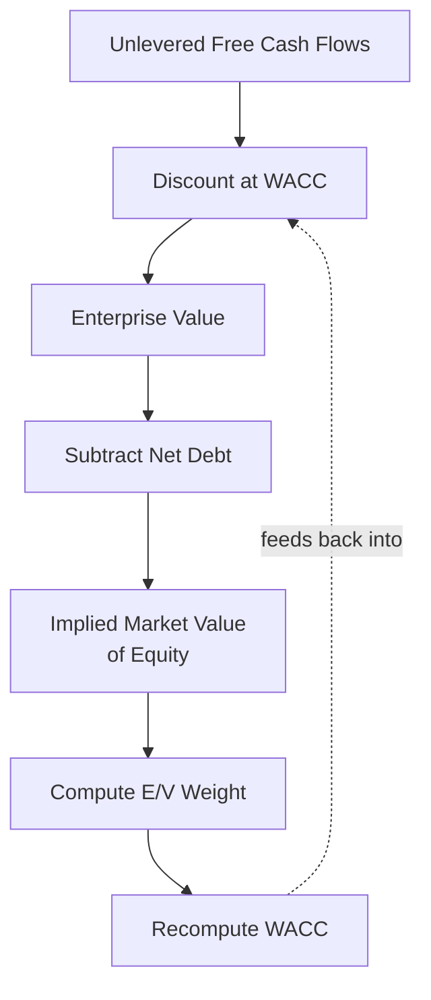

## Circularity Between WACC and Enterprise Value

### Definition and Conceptual Foundation

Circularity in a DCF model arises because the WACC formula requires market-value-based capital structure weights, but the market value of equity is often precisely what the DCF is being built to determine. This creates a closed loop: enterprise value depends on WACC, WACC depends on the equity weight $E/V$, and $E/V$ depends on the market value of equity, which is itself derived from enterprise value.

$$EV = \sum \frac{FCFF_t}{(1+WACC)^t} \quad \text{and} \quad WACC = f\left(\frac{E}{V}\right) \quad \text{and} \quad E = EV - \text{Net Debt}$$

Substituting through this chain reveals the circular dependency: enterprise value is a function of WACC, and WACC is a function of a market value of equity that is itself derived from enterprise value.

**Key Points**

- This circularity does not occur when book value of debt and *observed* market value of equity (i.e., the company is already publicly traded with a known share price) are used, since the equity weight input is then external to the model, not an output of it
- The circularity specifically arises when the analyst is trying to derive an *implied* equity value from the DCF itself and simultaneously wants that same implied value to inform the weighting used to discount the cash flows producing it
- This is most acute in private company valuations, LBO models, and situations where a genuinely independent market price for equity is unavailable or deliberately being second-guessed by the analysis

---

### Why This Circularity Occurs

The loop closes because WACC assembly (see prior topic) explicitly requires the market value of equity as an input to the $E/V$ weight, yet the very purpose of running the DCF is frequently to determine that market value of equity in the first place — particularly for a private company, a division being carved out, or any subject with no independently observable trading price.

---

### When This Circularity Does NOT Arise

It is worth being precise about when this is actually a problem, since it is easy to over-apply this concern:

- **Public companies with an observed market capitalization**: the $E/V$ weight can be computed directly from the current, externally observable share price and shares outstanding — no circularity, because the equity value used for weighting is not an output of the model being built
- **Fixed target capital structure weights**: if the analyst has deliberately chosen to use a target structure (e.g., peer-derived or management-stated) rather than solving for an implied current structure, the weights are exogenous inputs and the circularity does not bind
- **Book-value-based debt weight assumptions held constant**: using book value of debt as a fixed input (a common simplification) removes one side of the circularity, though it does not by itself resolve circularity coming from the equity side if equity value is still being solved for endogenously

**Key Points**

- The circularity problem is specific to the situation where market value of equity is both an *input* to WACC and the *output* being solved for
- Many practical valuations sidestep the issue entirely by using an observable market price (public companies) or a fixed target structure (private companies, LBOs) rather than attempting to solve the circular system

---

### Resolution Method 1: Iterative Calculation (Circular Reference Solving)

The most direct resolution allows the model to iterate until it converges: the spreadsheet repeatedly recalculates WACC based on the most recent implied equity value, then recalculates enterprise value and implied equity value based on the updated WACC, continuing until the values stabilize (change by less than a negligible tolerance between iterations).

**Implementation Steps**

1. Enable iterative calculation in the spreadsheet software (e.g., in Excel: File → Options → Formulas → enable "Enable iterative calculation," setting a maximum iteration count and a small tolerance such as 0.001)
2. Set an initial seed value for market value of equity (any reasonable starting guess — the model will converge regardless of the starting point, provided the underlying system is well-behaved)
3. Link the $E/V$ weight formula directly to the model's own implied equity value output cell
4. Allow the spreadsheet to iterate to convergence

**[Inference]** Circular reference toggles are broadly considered acceptable and common practice specifically for this WACC-circularity use case in professional financial modeling, but they carry a real practical risk: an unrelated, unintended circular reference elsewhere in the model (introduced by a formula error) can go undetected once the iterative calculation setting is globally enabled, since the software will attempt to resolve *any* circular reference rather than flag it as an error. Many practitioners therefore prefer to isolate the intentional circularity to a clearly labeled section of the model, or use one of the alternative non-iterative methods below specifically to avoid globally enabling iterative calculation.

---

### Resolution Method 2: Copy-Paste-Values Iteration (Manual Breaking)

A more controlled manual alternative avoids enabling global iterative calculation:

1. Start with an initial estimate of $E/V$ (e.g., from a comparable company analysis, or simply an assumed starting weight such as 80/20)
2. Run the full DCF using this initial weight to compute an implied enterprise value and equity value
3. Recompute the $E/V$ weight using this newly implied equity value
4. Manually copy this new weight back in as a hard-coded input (breaking the live formula link, avoiding an actual circular reference)
5. Re-run the DCF with the updated weight
6. Repeat steps 3–5 until the implied equity value from one iteration is acceptably close to the value from the prior iteration (convergence)

**Key Points**

- This method avoids any actual circular formula reference in the spreadsheet, making the model easier to audit and less prone to the "hidden unintended circularity" risk described above
- It requires more manual intervention but gives the analyst direct visibility and control over each iteration step
- Convergence is typically reached within just a few iterations for most reasonably well-behaved capital structures, since the $E/V$ weight's influence on WACC (and thus on enterprise value) is a relatively gentle, continuous function rather than one prone to wild oscillation

---

### Resolution Method 3: Solve Algebraically (Closed-Form, Simplified Cases)

For simplified capital structure assumptions (e.g., assuming debt is fixed in dollar terms rather than as a fixed proportion of value, which is a common and often more realistic assumption for companies with a fixed debt balance), the circularity can sometimes be resolved algebraically without iteration, since a fixed dollar debt amount removes the mutual dependency between the debt weight and enterprise value.

Under a **fixed dollar debt** assumption (rather than fixed debt-to-value ratio), $D$ is a known constant, and:

$$E = EV - D$$

Since $D$ is fixed, WACC can be computed directly once $EV$ is expressed in terms of known cash flows and the (now determinable) $E/V$ ratio, avoiding the need for iterative convergence. This works cleanly under the Adjusted Present Value (APV) framework or under a fixed-debt assumption, but does not eliminate circularity under a fixed debt-to-value target ratio assumption, where $D$ itself scales with $EV$.

**[Inference]** This algebraic shortcut is most naturally suited to models where debt is assumed to be a fixed dollar amount (common in stable, non-LBO corporate contexts) rather than a fixed percentage of a fluctuating enterprise value; it is generally not applicable, without modification, to models that explicitly target a constant leverage ratio, since that assumption reintroduces the same circular dependency it was meant to avoid.

---

### Resolution Method 4: Adjusted Present Value (APV) as a Circularity-Avoiding Alternative

The APV method sidesteps WACC-based circularity entirely by valuing the firm's cash flows as if it were entirely equity-financed (using the unlevered cost of capital, which does not depend on the capital structure weight), then separately adding the present value of the interest tax shield:

$$APV = V_{unlevered} + PV(\text{Interest Tax Shield})$$

Because the unlevered cost of capital does not depend on $E/V$, this approach avoids the circular dependency altogether — at the cost of requiring a separate, explicit projection and discounting of the interest tax shield, which introduces its own set of assumptions (particularly around the appropriate discount rate for the tax shield itself, a topic of ongoing debate in corporate finance).

**Key Points**

- APV is particularly well-suited to situations with a known, explicit debt paydown schedule (e.g., LBOs), since the tax shield can be projected directly from the known debt balance in each period, without needing to know the resulting equity value first
- APV is less commonly used in standard corporate DCF valuation outside of leveraged transaction contexts, in part because WACC-based DCF remains the more widely taught and more widely expected format in most conventional applications

---

### Worked Example: Manual Iteration to Convergence

**Inputs**

- Unlevered free cash flow (perpetuity, for simplicity): $120 million/year
- Perpetual growth rate: 2.5%
- Cost of equity: 10.5%
- After-tax cost of debt: 4.0%
- Fixed net debt: $500 million
- Initial seed $E/V$ guess: 75%/25% (D/V = 25%)

**Iteration 1**

$$WACC_1 = (0.75 \times 10.5\%) + (0.25 \times 4.0\%) = 7.875\% + 1.0\% = 8.875\%$$

$$EV_1 = \frac{120}{0.08875 - 0.025} = \frac{120}{0.06375} \approx \$1{,}882\text{ million}$$

$$E_1 = 1{,}882 - 500 = \$1{,}382\text{ million}, \quad \frac{E}{V}_1 = \frac{1{,}382}{1{,}882} \approx 73.4\%$$

**Iteration 2** (using updated $E/V = 73.4\%$, $D/V = 26.6\%$)

$$WACC_2 = (0.734 \times 10.5\%) + (0.266 \times 4.0\%) = 7.707\% + 1.064\% = 8.771\%$$

$$EV_2 = \frac{120}{0.08771 - 0.025} = \frac{120}{0.06271} \approx \$1{,}913\text{ million}$$

$$E_2 = 1{,}913 - 500 = \$1{,}413\text{ million}, \quad \frac{E}{V}_2 = \frac{1{,}413}{1{,}913} \approx 73.9\%$$

**Iteration 3** (using updated $E/V = 73.9\%$)

$$WACC_3 = (0.739 \times 10.5\%) + (0.261 \times 4.0\%) = 7.760\% + 1.044\% = 8.804\%$$

$$EV_3 = \frac{120}{0.08804 - 0.025} = \frac{120}{0.06304} \approx \$1{,}903\text{ million}$$

**Output**

The implied enterprise value has converged from $1,882 million (iteration 1) to $1,913 million (iteration 2) to $1,903 million (iteration 3) — the oscillation is narrowing quickly, and a few further iterations would settle on a stable value in the vicinity of approximately $1,905–1,910 million, illustrating typical rapid convergence behavior for this type of circularity.

---

### Common Pitfalls

- **Enabling global iterative calculation without isolating the intended circularity**, risking that an unrelated formula error elsewhere in the model also "resolves" silently instead of throwing a circular reference warning
- **Failing to check for convergence** — stopping after a single iteration without confirming the implied equity value has actually stabilized
- **Applying this fix unnecessarily** for public companies where an observable market capitalization already exists and should simply be used directly, rather than being re-derived circularly from the DCF itself
- **Confusing this circularity with the separate current-vs-target capital structure question** — using a genuinely fixed target weight (an exogenous assumption) removes the circularity entirely, since the weight is then not an output of the model at all
- **Not documenting which resolution method was used**, making it difficult for a reviewer to understand why the model's WACC and equity value are mutually referential (or deliberately are not)

---

**Related Topics**

- Weighted Average Cost of Capital (WACC) Assembly
- Market Value versus Book Value Weights
- Target versus Current Capital Structure Weights
- Adjusted Present Value (APV) Method as an Alternative to WACC-Based DCF
- Interest Tax Shield Valuation and Discount Rate Selection
- LBO Modeling: Debt Paydown Schedules and Phased Discount Rates
- Iterative Calculation and Circular Reference Management in Spreadsheet Models