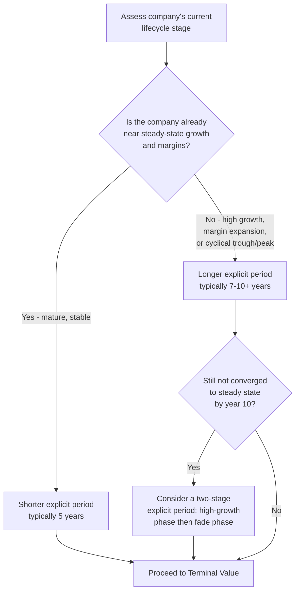

## Structuring the Explicit Forecast Period

### Definition and Conceptual Foundation

The explicit forecast period is the span of years over which a DCF model projects detailed, line-item-level financial statements and free cash flows, before the analysis transitions to a simplified terminal value calculation representing all cash flows beyond that horizon. Structuring this period correctly — its length, its granularity, and the assumptions governing its trajectory — is foundational to the credibility of the entire valuation, since errors compound through every subsequent discounting step.

$$EV = \sum_{t=1}^{n} \frac{FCFF_t}{(1+WACC)^t} + \frac{TV_n}{(1+WACC)^n}$$

Where $n$ is the length of the explicit forecast period and $TV_n$ is the terminal value computed at the end of year $n$. The explicit period is where the analyst's specific, company-informed judgment is applied; the terminal value is where a simplifying steady-state assumption takes over.

**Key Points**

- The explicit period should be long enough for the company to reach a stable, sustainable growth and margin profile by its final year, since the terminal value calculation assumes exactly that stability in perpetuity
- There is no universally "correct" length — it is a function of the company's current lifecycle stage, industry cyclicality, and how far the business is from a normalized steady state
- Poor structuring of this period (too short, inconsistent granularity, or unrealistic convergence assumptions) is one of the most common sources of DCF valuation error, often more impactful than terminal growth rate or discount rate precision

---

### Determining the Appropriate Length

**Mature, stable companies** (moderate, steady growth; stable margins; established competitive position): a 5-year explicit period is often sufficient, since near-term projections can reasonably approximate the company's likely steady-state trajectory without much further adjustment needed.

**High-growth or early-stage companies**: often require 7 to 10 years (or occasionally longer) to allow sufficiently for the deceleration of high initial growth rates down toward a sustainable long-run rate, since jumping straight from a 30% growth rate to a 3% terminal growth rate within a short explicit period is generally not a credible trajectory.

**Cyclical companies**: the explicit period should ideally span at least one full business cycle (or be explicitly normalized), so the terminal year does not inadvertently represent a cyclical peak or trough extrapolated in perpetuity.

**[Inference]** In practice, 5 years is the most commonly used default for a first-pass or generic corporate DCF template, with extensions to 7–10 years reserved specifically for companies where the analyst can articulate a clear reason the company has not yet reached a normalized state within 5 years; using a longer period without such a rationale mainly adds spurious precision to what are, by year 8 or 10, largely speculative assumptions.

---

### The Convergence Principle

The central structural requirement governing the explicit period is that **by its final year, every key driver should have converged to a level that is sustainable indefinitely** — because the terminal value formula implicitly assumes the final year's economics persist (adjusted only for the terminal growth rate) forever after.

Key drivers that must converge by the final explicit year:

- **Revenue growth rate**: should approach a rate no higher than long-run nominal GDP growth (or the specific industry's long-run growth ceiling) by the final year, since no company can grow faster than the broader economy indefinitely without eventually representing an implausibly large share of it
- **Operating margin**: should reach a sustainable, defensible level consistent with long-run competitive dynamics (new entrants and competition typically erode abnormally high margins over time, absent a durable structural moat)
- **Capital intensity (Capex as % of revenue, or Capex/Depreciation ratio)**: should reach a steady-state relationship appropriate for a mature, non-expanding asset base — capex approximately equal to depreciation is a common (though not universal) proxy for a business in maintenance mode rather than expansion mode
- **Working capital as a percentage of revenue**: should stabilize at a ratio the business can sustain without continuing to consume or release incremental cash disproportionately
- **Return on invested capital (ROIC)**: should converge toward the industry's long-run sustainable ROIC (or toward the cost of capital, under strong competitive assumptions), since abnormally high ROIC tends to attract competition that erodes it over time absent a durable advantage

**Key Points**

- A DCF where the final explicit year still shows 25% revenue growth, 40% operating margins, and minimal capex has implicitly assumed those figures continue forever in the terminal value — a claim that requires explicit justification if intended, and is usually not intended
- The fade or convergence pattern across the explicit period should be smooth and economically motivated (e.g., competitive entry gradually compressing margins), not an arbitrary mechanical linear interpolation applied without regard to the underlying business narrative

---

### Two-Stage and Multi-Stage Explicit Period Structuring

For companies far from steady state, a single uniform growth/margin trajectory across the entire explicit period is often less credible than an explicitly staged structure:

**Stage 1 — High-growth/current-trajectory phase** (e.g., years 1–3): reflects near-term visibility — existing contracts, current market share trends, management guidance, and analyst consensus, where forecasting confidence is comparatively higher

**Stage 2 — Fade/convergence phase** (e.g., years 4–10): explicitly models the gradual deceleration of growth and normalization of margins toward the terminal steady state, often via a mechanical fade formula (e.g., linear or exponential decay from the Stage 1 exit rate toward the terminal growth rate)

**Example — Linear Fade Formula**

$$g_t = g_{stage1,exit} - \left(\frac{t - t_{stage1,end}}{n - t_{stage1,end}}\right) \times (g_{stage1,exit} - g_{terminal})$$

Applied to a company with a Stage 1 exit growth rate of 15% (at year 3), fading linearly to a terminal growth rate of 3% by year 10:

At year 5: $g_5 = 15\% - \left(\frac{5-3}{10-3}\right) \times (15\% - 3\%) = 15\% - 0.286 \times 12\% = 15\% - 3.43\% = 11.57\%$

At year 8: $g_8 = 15\% - \left(\frac{8-3}{10-3}\right) \times 12\% = 15\% - 0.714 \times 12\% = 15\% - 8.57\% = 6.43\%$

**Output**

This produces a smooth, economically plausible deceleration path rather than an abrupt jump from a high explicit-period growth rate directly to the terminal rate in the final year, which would otherwise create an artificial and unrealistic discontinuity at the explicit-period/terminal-value boundary.

---

### Structuring Granularity: Annual vs. Stub Periods vs. Sub-Annual

**Standard annual periods**: the default approach for most corporate valuations — project full fiscal years for the entire explicit period.

**Stub period handling**: when the valuation date falls mid-fiscal-year (a very common practical situation), the first "period" in the model is often a stub — a partial year representing only the remaining months of the current fiscal year — followed by full annual periods thereafter. The discounting convention must then adjust: cash flows in the stub period are discounted for a fractional period rather than a full year.

$$PV_{stub} = \frac{FCF_{stub}}{(1+WACC)^{fraction\ of\ year\ remaining}}$$

**Mid-year convention**: many practitioners apply a mid-year discounting convention (discounting each year's cash flow as though it arrives, on average, at the midpoint of the year rather than at year-end), reflecting the reality that cash flows accrue continuously throughout the year rather than arriving in a single lump sum at year-end:

$$PV_t = \frac{FCF_t}{(1+WACC)^{t-0.5}}$$

**[Inference]** The mid-year convention is widely used in practice and generally regarded as a more accurate approximation of actual cash flow timing than the year-end convention, though its effect on total enterprise value is usually modest (typically a low-single-digit percentage increase relative to year-end discounting, since it effectively shortens the discounting period for every cash flow slightly) — some practitioners omit it for simplicity when the resulting precision gain is not material to the decision at hand.

---

### Worked Example: Structuring a 7-Year Explicit Period

**Scenario**: A mid-growth software company currently growing revenue at 22% annually with 18% operating margins, expected to converge toward a mature SaaS profile (8% long-run growth, 30% operating margin) reflecting increasing scale efficiencies and market saturation.

| Year | Revenue Growth | Operating Margin | Rationale |
| --- | --- | --- | --- |
| 1 | 22% | 19% | Near-term visibility from current bookings/pipeline |
| 2 | 19% | 21% | Continued but decelerating growth as market matures |
| 3 | 16% | 23% | Deceleration continues; margin expansion from operating leverage |
| 4 | 13% | 25% | Approaching mid-point of convergence path |
| 5 | 11% | 27% | Growth nearing long-run industry ceiling |
| 6 | 9% | 29% | Near-terminal profile |
| 7 (terminal year) | 8% | 30% | Fully converged: matches assumed terminal growth and steady-state margin |

**Output**

By year 7, both revenue growth (8%) and operating margin (30%) have reached levels the analyst is prepared to defend as sustainable indefinitely — satisfying the convergence principle required before transitioning to the terminal value calculation. Using this year's economics as the basis for the Gordon Growth terminal value formula is now defensible, since it does not implicitly assume an already-elevated, still-converging growth or margin figure persists forever.

---

### Common Pitfalls

- **Using a uniform 5-year period by default** regardless of the company's actual distance from steady state, particularly for high-growth or early-stage companies
- **Abrupt discontinuity at the explicit-period/terminal boundary**: a final explicit year that still shows meaningfully elevated growth or margins relative to the terminal assumptions, creating an unrealistic jump rather than a smooth convergence
- **Mechanical, non-economically-motivated fade patterns**: applying a fade formula without grounding the trajectory in an actual competitive or market-share narrative
- **Ignoring stub period timing** when the valuation date falls mid-year, distorting near-term present values
- **Failing to check capital intensity and working capital convergence alongside revenue growth and margin** — these are just as essential to the steady-state assumption but are more frequently neglected than the more visible growth/margin drivers
- **Extending the explicit period arbitrarily far (e.g., 15–20 years) without added forecasting rigor**, which mainly adds spurious precision to assumptions that are, by that point, largely speculative rather than genuinely improving valuation accuracy

---

**Related Topics**

- Terminal Value Estimation: Gordon Growth vs. Exit Multiple Methods
- Revenue Growth Modeling and Deceleration Curves
- Operating Margin Convergence and Competitive Fade Analysis
- Working Capital Modeling as a Percentage of Revenue
- Capital Expenditure and Depreciation Convergence in Steady State
- Mid-Year Convention and Stub Period Discounting Mechanics
- Free Cash Flow to the Firm: Build-Up from EBIT