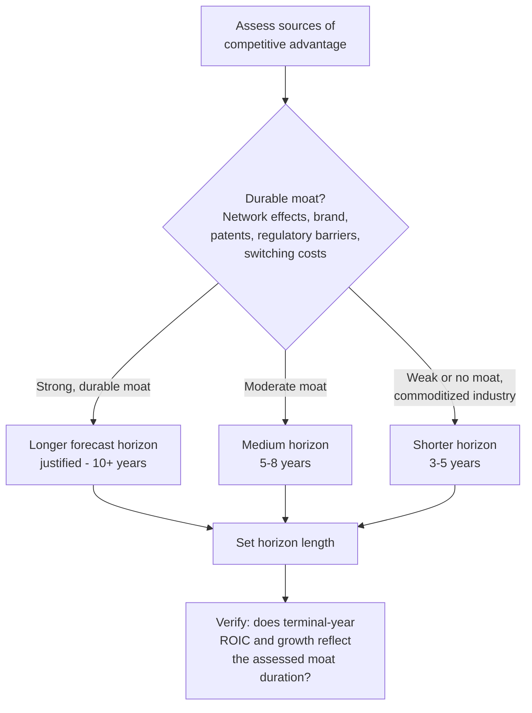
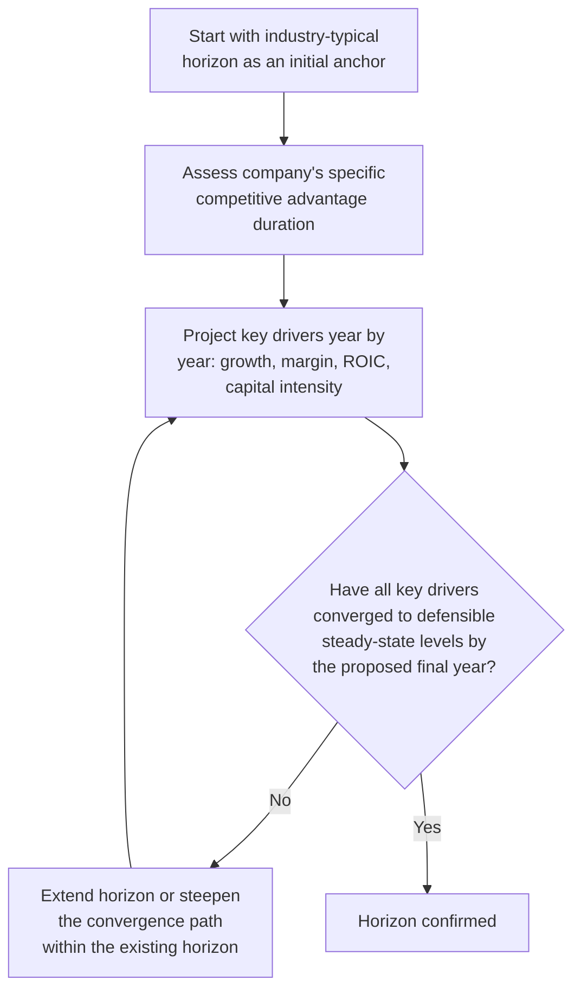

## Determining an Appropriate Forecast Horizon

### Definition and Conceptual Foundation

Determining the forecast horizon is the decision of *how many years* the explicit projection period should span before transitioning to a terminal value. While closely related to structuring the explicit period, this topic focuses specifically on the diagnostic criteria and decision process for selecting the horizon length itself — the analytical question that must be answered *before* the year-by-year convergence path can be built.

**Key Points**

- Forecast horizon and forecast granularity/structure (covered in the prior topic) are related but distinct decisions: horizon is "how long," structure is "what happens within that length"
- The horizon should be driven by the company's specific competitive and lifecycle characteristics, not by a fixed convention applied without diagnostic justification
- An improperly short horizon is the single most common way analysts inadvertently embed unrealistic perpetual growth or margin assumptions into a terminal value

---

### The Core Diagnostic Question

The forecast horizon should extend until the point at which the company's key value drivers reach a state that is credible to sustain in perpetuity. This is fundamentally a question about **competitive advantage duration**: how long can the company sustain above-normal growth and/or above-normal returns on invested capital before competitive forces, market saturation, or industry maturation drive it toward an industry-average steady state?

$$\text{Horizon} = \text{years until } \begin{cases} g_t \to g_{terminal} \\ \text{Margin}_t \to \text{Margin}_{sustainable} \\ ROIC_t \to ROIC_{industry} \text{ or } WACC \end{cases}$$

**Key Points**

- This is fundamentally an economic and strategic judgment, not a mechanical financial calculation — it requires assessing the durability of the company's competitive moat
- A longer horizon is not inherently more accurate; it is only more accurate if the additional years genuinely improve the credibility of the convergence assumption, rather than merely extending speculative precision further into the future

---

### Diagnostic Framework: Competitive Advantage Period (CAP)

The **Competitive Advantage Period** concept, drawn from corporate strategy and applied finance, asks: for how many years can this company sustain a return on invested capital meaningfully above its cost of capital (i.e., genuinely value-creating growth), before competitive entry, technological disruption, patent expiration, or market maturation compresses that excess return away?

**Sources of durable competitive advantage that typically justify a longer horizon**:

- Strong network effects (value increases with user base, creating a self-reinforcing moat)
- High switching costs (enterprise software with deep workflow integration, for example)
- Patent protection with a clearly defined remaining life
- Regulatory barriers to entry (licenses, exclusive concessions)
- Strong brand loyalty in categories where brand genuinely drives purchasing decisions

**Factors that typically justify a shorter horizon**:

- Commoditized products with low switching costs
- Low barriers to entry and a history of rapid competitive replication in the industry
- Rapid technological change that can obsolete the current business model
- Regulatory or patent protections with a known, approaching expiration date

**[Inference]** Industries such as branded consumer staples, network-effect-driven platforms, and certain regulated utilities often support longer horizons (or, in the utility case, a horizon that is less about growth deceleration and more about a stable regulated return persisting indefinitely), whereas industries such as consumer electronics hardware, generic commodities, and businesses facing near-term patent cliffs typically warrant shorter, more conservative horizons — though this varies meaningfully by specific company circumstances and should not be treated as a rigid industry-wide rule.

---

### Quantitative Signals for Horizon Length

Beyond the qualitative competitive assessment, several quantitative diagnostics help pinpoint when a company is approaching (or has already reached) a sustainable steady state:

1. **ROIC trend relative to WACC**: if ROIC is projected to remain persistently and substantially above WACC well beyond a typical competitive advantage period without a specific, identifiable reason, this signals either an overly optimistic model or a genuinely exceptional, longer-duration moat that should be explicitly justified
2. **Market share trajectory relative to total addressable market (TAM)**: if the growth trajectory implies the company would capture an implausibly large share of its TAM by the end of the explicit period, the horizon (or the growth assumptions within it) likely needs revisiting
3. **Margin trend relative to industry peers**: if projected margins are converging toward, rather than diverging from, the mature industry average, this is a signal the horizon is appropriately capturing the convergence process
4. **Revenue growth rate relative to GDP/industry growth ceiling**: the terminal year's growth rate should be at or below the long-run growth ceiling appropriate to the company's market — a terminal year still substantially above this ceiling signals the horizon needs to be extended, or the fade path within it needs to be steepened

**Example**

A company currently holding 8% market share in a $50 billion TAM, growing revenue at 25% annually. Extending that growth rate mechanically for even 5 more years would imply:

$$\text{Revenue}_{year\ 5} = \text{Current Revenue} \times (1.25)^5$$

If current revenue is $4 billion (8% × $50 billion), this becomes $4 \times 3.05 \approx \$12.2$ billion after 5 years — implying roughly 24% market share of a TAM assumed to remain $50 billion (or higher, if the TAM itself is also growing). Whether this is plausible depends entirely on competitive dynamics and TAM growth — but the calculation itself is a useful, quick diagnostic for whether the current explicit growth trajectory can credibly continue for the assumed horizon length, or whether the horizon needs to be extended (with a more gradual fade) or the growth path within it reconsidered.

---

### Industry-Specific Horizon Considerations

| Industry Type | Typical Horizon Driver | Illustrative Horizon Range |
| --- | --- | --- |
| Mature consumer staples | Stable, low growth already at steady state | 5 years |
| Regulated utilities | Regulatory cycle and rate case timing | 5–10 years, or often modeled with a stable perpetual return given the regulated nature |
| High-growth SaaS/technology | Time to market saturation and margin maturation | 7–10 years |
| Early-stage/pre-profitability companies | Time to reach sustainable profitability and normalized capital intensity | 10+ years, sometimes with a distinct "ramp to profitability" sub-phase |
| Commodity/cyclical industries | Full business cycle length, or normalization point | Spans at least one full cycle; often 5–8 years |
| Pharmaceutical (patent-dependent) | Remaining patent life / patent cliff timing | Driven by specific patent expiration dates rather than a generic convention |

**[Unverified]** These ranges are illustrative starting points reflecting common practitioner conventions rather than fixed rules; the appropriate horizon for any specific company should be derived from its own specific competitive and lifecycle circumstances rather than assigned purely by industry category.

---

### The Cost of Getting the Horizon Wrong

**Too short a horizon**: forces the terminal value calculation to implicitly assume a still-elevated growth rate or margin persists forever, since the terminal year's economics have not genuinely converged. This tends to inflate enterprise value, sometimes substantially, since the perpetuity formula compounds the (too-optimistic) terminal-year figure indefinitely.

**Too long a horizon**: does not necessarily bias the valuation in a particular direction, but adds spurious apparent precision to what are, by the later years, largely speculative assumptions — creating a false sense of analytical rigor without a corresponding improvement in actual forecast accuracy, and consuming modeling effort that might be better allocated to more consequential inputs (e.g., near-term margin assumptions, WACC construction, or terminal growth rate selection).

**Example — Quantifying the "Too Short" Error**

Consider a company using a 5-year horizon where year 5 still shows 18% growth and 32% margins (versus a genuinely sustainable 5% growth and 22% margin), feeding directly into the Gordon Growth terminal value:

$$TV_{overstated} = \frac{FCF_{year\ 5} \times (1+g_{terminal})}{WACC - g_{terminal}}$$

If $FCF_{year\ 5}$ is computed using the inflated 32% margin rather than a normalized 22% margin, the terminal value — and by extension, the majority of total enterprise value in most DCFs — will be overstated by roughly the same proportional margin gap, compounded through the perpetuity formula's leverage effect on any single input error.

---

### Practical Decision Process

**Key Points**

- This is inherently an iterative process — the initial horizon guess should be tested against the convergence diagnostic and adjusted as needed, rather than fixed at the outset and never revisited
- Documenting the specific rationale for the chosen horizon (competitive moat assessment, industry benchmarks, quantitative convergence checks) makes the assumption auditable and defensible, rather than an unexplained black-box convention

---

### Common Pitfalls

- **Defaulting to a fixed horizon (typically 5 years) without diagnostic justification**, regardless of the company's actual distance from steady state
- **Treating horizon length as independent of the competitive advantage assessment**, when in reality the two should be directly linked
- **Failing to check quantitative convergence signals** (ROIC vs. WACC, market share vs. TAM, margin vs. industry peers) before finalizing the horizon
- **Extending the horizon without also extending genuine analytical effort within it** — simply adding more years of a mechanically extrapolated trend does not solve the underlying convergence problem if the added years still don't reach a defensible steady state
- **Applying a uniform industry convention without considering company-specific circumstances** (e.g., a specific patent cliff date, an unusually strong or weak moat relative to typical industry peers)
- **Over-engineering horizon length for marginal precision gains** at the expense of scrutinizing more consequential assumptions like terminal growth rate or WACC construction

---

**Related Topics**

- Structuring the Explicit Forecast Period
- Terminal Value Estimation: Gordon Growth vs. Exit Multiple Methods
- Return on Invested Capital (ROIC) and Competitive Advantage Period Analysis
- Revenue Growth Modeling and Deceleration Curves
- Total Addressable Market (TAM) Sizing and Market Share Trajectory Analysis
- Operating Margin Convergence and Competitive Fade Analysis
- Terminal Growth Rate Selection and GDP Growth Ceiling Constraints