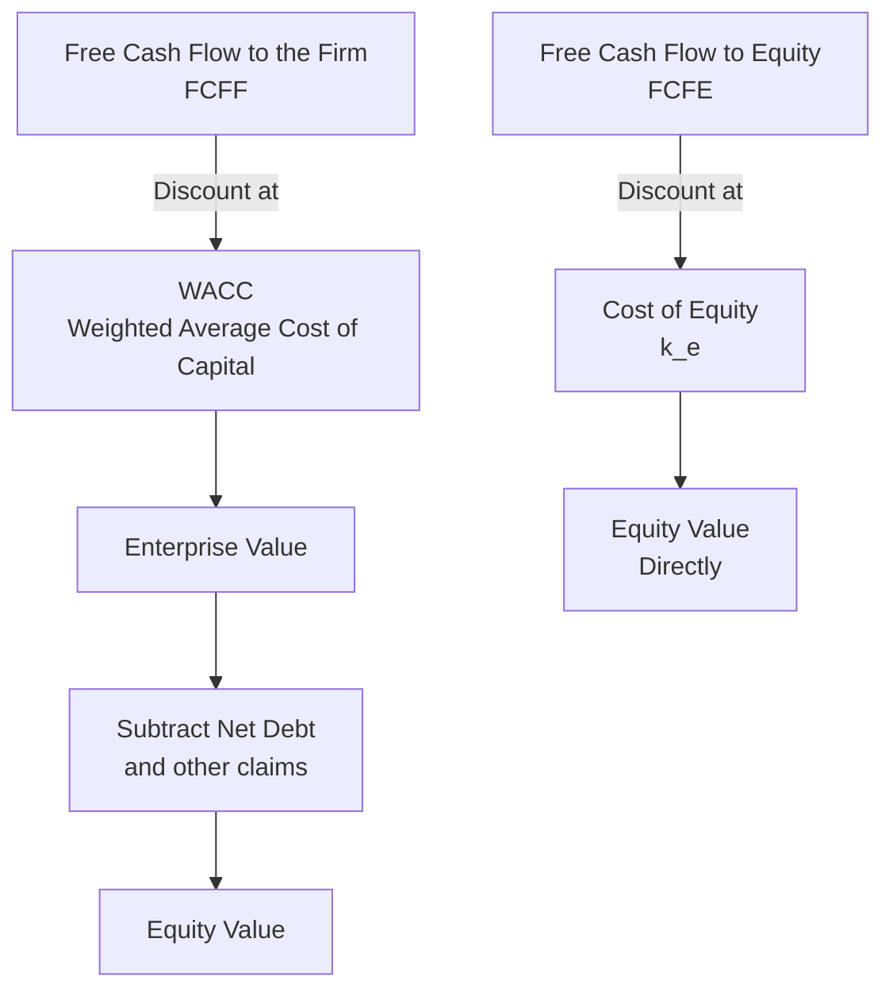
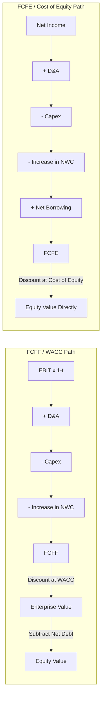

## Matching Free Cash Flow Type to the Appropriate Discount Rate

### Definition and Conceptual Foundation

This topic addresses one of the most fundamental internal consistency requirements in DCF modeling: the specific type of cash flow being discounted must be matched to the discount rate that reflects the risk borne by the specific claimants entitled to that cash flow. Mismatching cash flow type and discount rate is a structural error that produces a systematically wrong valuation, regardless of how accurate every individual input otherwise is.

**Key Points**

- There are two primary cash flow/discount rate pairings in standard DCF practice, and they are not interchangeable
- The error of mismatching them is not a matter of degree or approximation — it is a conceptual error that double-counts or omits a layer of claim on the firm's cash flows
- Understanding *why* each pairing works clarifies why substituting one discount rate for the other cash flow type produces a distorted result, rather than simply being a stylistic choice

---

### The Two Standard Pairings

**Pairing 1 — FCFF discounted at WACC**: Free Cash Flow to the Firm represents cash available to *all* capital providers — both debtholders and equityholders — before any financing-related cash flows (interest payments, debt principal repayments, or debt issuances) are considered. Because this cash flow belongs jointly to both classes of claimants, the appropriate discount rate must reflect the blended risk and required return of both — which is precisely what WACC represents. Discounting FCFF at WACC produces **enterprise value**, from which net debt (and other non-equity claims) must be subtracted to arrive at equity value.

**Pairing 2 — FCFE discounted at cost of equity**: Free Cash Flow to Equity represents cash remaining specifically for equityholders *after* all debt-related cash flows have already been accounted for (interest expense, net of the tax shield, and net debt principal changes). Because this cash flow already reflects only the equity claim, the appropriate discount rate is the cost of equity alone — the required return specific to equity risk. Discounting FCFE at the cost of equity produces **equity value directly**, with no further adjustment needed.

**Key Points**

- FCFF/WACC → Enterprise Value → (minus net debt) → Equity Value
- FCFE/cost of equity → Equity Value directly
- These are two internally consistent, theoretically equivalent routes to the same equity value conclusion (assuming perfectly consistent underlying assumptions) — they are not competing methodologies where one is generally superior, but different paths suited to different circumstances

---

### Why the Pairing Cannot Be Mixed

**Discounting FCFF at the cost of equity** would understate the appropriate discount rate for FCFF, since FCFF includes cash flows attributable to debtholders (who bear less risk and require a lower return than equityholders) without applying that lower, blended rate — cost of equity alone is too high a rate for cash flows that partly belong to lower-risk debt claims, but more importantly, the resulting present value would not represent either enterprise value (since debt's lower required return wasn't reflected) or equity value (since debt cash flows haven't been stripped out).

**Discounting FCFE at WACC** would apply an average, blended rate to a cash flow stream that already belongs exclusively to equityholders — understating the required return for that already-equity-only cash flow, since WACC is a lower blended rate reflecting debt's lower risk, which is inappropriate once debt's claim has already been removed from the cash flow itself.

**Example — Illustrating the Distortion**

Consider a company with:

- FCFF: $100 million
- Net interest expense (after-tax): $15 million
- Net debt principal repayment: $10 million
- FCFE = FCFF − after-tax interest − net debt repayment = $100 - 15 - 10 = \$75$ million
- WACC: 9%
- Cost of equity: 11%

**Correct approach**: discount FCFF ($100 million) at WACC (9%), then subtract net debt to reach equity value.

**Correct alternative approach**: discount FCFE ($75 million) at cost of equity (11%) to reach equity value directly.

**Incorrect approach**: discounting FCFE ($75 million) at WACC (9%) applies too low a rate to a cash flow stream that is already purely an equity claim — mechanically inflating the present value of that equity-only cash flow relative to what the equity's true required return (11%) would imply, since a lower discount rate always produces a higher present value for the same cash flow.

---

### Building FCFF: The Standard Bridge

$$FCFF = EBIT \times (1-t) + D\&A - Capex - \Delta NWC$$

Where $EBIT \times (1-t)$ is unlevered net income (NOPAT), $D\&A$ is depreciation and amortization added back as a non-cash expense, $Capex$ is capital expenditures, and $\Delta NWC$ is the increase in net working capital. Note that interest expense is deliberately excluded — FCFF is calculated as though the company were entirely unlevered (all-equity financed), which is precisely why it represents the pool of cash available to all capital providers before financing decisions are layered on top.

---

### Building FCFE: The Standard Bridge

$$FCFE = FCFF - \text{Interest Expense} \times (1-t) - \text{Net Debt Repayment} + \text{New Debt Issuance}$$

Or, built directly from net income:

$$FCFE = \text{Net Income} + D\&A - Capex - \Delta NWC + \text{Net Borrowing}$$

Where Net Income already reflects interest expense (since it is computed after interest and taxes on the income statement), and Net Borrowing captures the net change in debt outstanding (new issuance minus repayments).

**Key Points**

- FCFE is inherently more sensitive to a company's specific capital structure and financing decisions (debt issuance/repayment schedule) than FCFF, since those financing flows are explicitly embedded in FCFE but deliberately excluded from FCFF
- This makes FCFE-based valuation more natural for financial institutions (banks, insurers) where debt is a core operating input rather than a discretionary financing choice, and where a "capital structure-neutral" FCFF concept is less meaningful

---

### When to Use FCFF/WACC vs. FCFE/Cost of Equity

| Scenario | Preferred Approach | Rationale |
| --- | --- | --- |
| Standard corporate valuation, non-financial company | FCFF/WACC | Cleanly separates operating performance from financing decisions; capital structure changes are handled through the weights rather than requiring re-projection of debt schedules |
| Company with a rapidly changing or unstable capital structure (e.g., LBO, active deleveraging) | FCFE/cost of equity, or phased WACC | FCFF/WACC assumes a relatively stable capital structure for the weights to be meaningful over the projection; a rapidly changing structure is better captured by explicitly modeling debt paydown and its cash flow effects directly in FCFE |
| Financial institutions (banks, insurers) | FCFE/cost of equity (often via a Dividend Discount Model variant) | Debt (deposits, policy liabilities) is a core operating input rather than discretionary financing; a clean, capital-structure-neutral "unlevered" cash flow concept is not meaningful for these business models |
| Valuing a specific tranche or claim rather than the whole enterprise | FCFE/cost of equity | More directly isolates the equity claim without requiring an intermediate enterprise value and net debt subtraction step |

---

### Illustrating the Structural Difference

---

### Theoretical Equivalence and Practical Divergence

Under a set of fully internally consistent assumptions (same underlying operating projections, correctly matched discount rates, and a capital structure that is either stable or whose changes are fully and correctly reflected in both the WACC weights and the FCFE financing flows), the two approaches should produce the **same** implied equity value.

**[Inference]** In practice, the two approaches can produce modestly different results even when applied carefully, primarily because FCFF/WACC implicitly assumes the capital structure is reasonably stable (or converges smoothly to a target) over the projection period, while FCFE explicitly and directly reflects whatever specific debt issuance/repayment schedule is projected; when these two implicit and explicit capital structure assumptions are not perfectly reconciled with each other, a divergence between the two methods' outputs emerges — and this divergence is itself a useful diagnostic that the underlying capital structure assumptions embedded in each approach may not be fully consistent with one another.

---

### Common Pitfalls

- **Discounting FCFE at WACC** (or vice versa, discounting FCFF at cost of equity) — the single most direct violation of this matching principle
- **Forgetting to subtract net debt after discounting FCFF at WACC**, treating the resulting enterprise value as if it were already equity value
- **Double-counting the tax shield** — since WACC already incorporates the after-tax cost of debt (embedding the interest tax shield benefit into the discount rate itself), FCFF should not *also* separately deduct an interest tax shield within the cash flow build, or the tax benefit is counted twice
- **Using FCFE for a company with a target/non-current capital structure** without explicitly modeling the debt issuance or repayment cash flows needed to actually reach that target structure — FCFE requires an explicit financing schedule that FCFF's implicit weight-based approach does not
- **Inconsistent treatment of preferred stock or minority interest** across the FCFF/enterprise value bridge and the FCFE calculation — both must be handled consistently with whichever approach is used, since these are additional claims beyond common equity and common debt

---

**Related Topics**

- Weighted Average Cost of Capital (WACC) Assembly
- Free Cash Flow to the Firm: Build-Up from EBIT
- Free Cash Flow to Equity: Build-Up and Financing Flow Treatment
- Enterprise Value to Equity Value Bridge: Net Debt and Other Claims
- Dividend Discount Model for Financial Institution Valuation
- Circularity Between WACC and Enterprise Value
- Adjusted Present Value (APV) Method as an Alternative to WACC-Based DCF