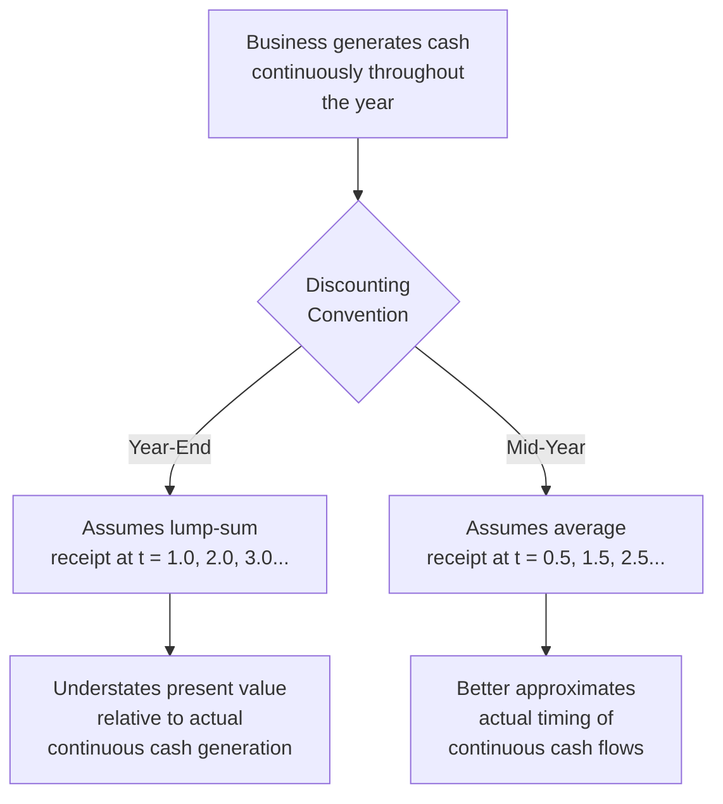

## Mid-Year Convention versus Year-End Discounting

### Definition and Conceptual Foundation

This topic addresses a discounting mechanics decision: when discounting a period's projected cash flow back to present value, should the model assume the cash flow arrives entirely at the end of the period (year-end convention), or should it assume the cash flow arrives, on average, at the midpoint of the period (mid-year convention)? This is a purely mechanical timing assumption, but it has a small, consistent, and often underappreciated effect on the resulting present value.

$$PV_{year\text{-}end} = \frac{FCF_t}{(1+WACC)^t}$$

$$PV_{mid\text{-}year} = \frac{FCF_t}{(1+WACC)^{t-0.5}}$$

**Key Points**

- Year-end discounting assumes all cash generated during a period is received in a single lump sum on the last day of that period
- Mid-year convention assumes cash flows accrue evenly (or approximately evenly) throughout the period, so the "average" receipt date is the period's midpoint
- The choice affects every discounted cash flow in the model, including the terminal value, so its cumulative effect on enterprise value, while modest per-period, is not trivial in aggregate

---

### Why Mid-Year Convention Is Often More Realistic

Real businesses generate revenue and incur costs continuously throughout the year — a retailer sells goods every day, a subscription business collects revenue monthly, a manufacturer ships products throughout each quarter. Very few businesses genuinely receive the entirety of a year's cash flow in a single lump sum on December 31st, which is the literal (if usually unstated) assumption embedded in standard year-end discounting.

Because mid-year convention effectively shortens the discounting period for every cash flow (discounting for $t - 0.5$ years instead of a full $t$ years), it produces a **higher** present value for every individual cash flow relative to year-end discounting, all else equal — reflecting the fact that, on average, the cash was actually available to the firm (and to a present-value calculation anchored at time zero) somewhat earlier than a strict year-end assumption would imply.

**Key Points**

- Mid-year convention is not a valuation "trick" to inflate value — it is a refinement intended to more accurately reflect actual cash flow timing
- The magnitude of the adjustment is a function of the discount rate: higher discount rates produce a larger proportional difference between the two conventions, since discounting is more sensitive to timing at higher rates

---

### Worked Example: Single-Period Comparison

**Inputs**

- Free cash flow in year 1: $100 million
- WACC: 10%

**Year-end discounting**

$$PV = \frac{100}{(1.10)^1} = \frac{100}{1.10} \approx \$90.91\text{ million}$$

**Mid-year discounting**

$$PV = \frac{100}{(1.10)^{0.5}} = \frac{100}{1.0488} \approx \$95.35\text{ million}$$

**Output**

The mid-year convention produces a present value approximately 4.9% higher than the year-end convention for this single year-1 cash flow ($95.35 million vs. $90.91 million) — illustrating the direction and rough magnitude of the effect for a single period at a 10% discount rate.

---

### Worked Example: Full Explicit Period and Terminal Value

**Inputs**

- 5-year explicit period free cash flows: $80M, $90M, $100M, $108M, $115M
- WACC: 9%
- Terminal value at end of year 5 (Gordon Growth, 3% terminal growth): calculated separately

**Year-End Discounting of Explicit Period**

$$PV_{explicit} = \frac{80}{1.09^1} + \frac{90}{1.09^2} + \frac{100}{1.09^3} + \frac{108}{1.09^4} + \frac{115}{1.09^5}$$

$$PV_{explicit} \approx 73.39 + 75.75 + 77.22 + 76.51 + 74.75 \approx \$377.62\text{ million}$$

**Mid-Year Discounting of Explicit Period**

$$PV_{explicit} = \frac{80}{1.09^{0.5}} + \frac{90}{1.09^{1.5}} + \frac{100}{1.09^{2.5}} + \frac{108}{1.09^{3.5}} + \frac{115}{1.09^{4.5}}$$

$$PV_{explicit} \approx 76.62 + 79.10 + 80.63 + 79.90 + 78.06 \approx \$394.31\text{ million}$$

**Output**

The mid-year convention increases the present value of the explicit period cash flows from approximately $377.62 million to $394.31 million — an increase of roughly 4.4% in this example, consistent with the expected direction and rough order of magnitude from the single-period illustration above.

---

### Applying Mid-Year Convention to the Terminal Value

The terminal value itself requires careful handling under mid-year convention, since there are two distinct sub-decisions: (1) how the terminal value is computed at the valuation point (typically the end of the explicit period, using the Gordon Growth formula on the terminal year's cash flow), and (2) how that terminal value is then discounted back to present value.

**Standard approach**: compute the terminal value as of the end of the final explicit year (year $n$) using the standard Gordon Growth formula, but then discount that terminal value back to present value using the *same fractional exponent* as the final explicit year's mid-year-adjusted cash flow — i.e., $t = n - 0.5$, not $t = n$.

$$PV_{TV} = \frac{TV_n}{(1+WACC)^{n-0.5}}$$

**[Inference]** This treatment is a commonly used convention, reflecting the view that the terminal value represents the present value (as of the end of year $n$) of a stream of cash flows that themselves continue to arrive throughout each future year (i.e., the perpetuity itself is also assumed to follow mid-year timing); some practitioners instead discount the terminal value using the full $t = n$ exponent, reasoning that the terminal value is conceptually a lump-sum value crystallized precisely at the end of year $n$, regardless of how the underlying perpetuity's own cash flows are timed. Both conventions appear in practice, so consistency and disclosure of which convention is used matters more than a claim that one is universally correct.

**Example (continued from above)**

If the terminal value at the end of year 5 is $1,900 million:

Year-end discounting of TV: $\frac{1{,}900}{1.09^5} \approx \$1{,}234.7$ million

Mid-year discounting of TV (using $n - 0.5 = 4.5$): $\frac{1{,}900}{1.09^{4.5}} \approx \$1{,}289.4$ million

---

### When Mid-Year Convention Should Be Used

**Generally appropriate**:

- Standard operating businesses with continuous, relatively evenly distributed cash generation throughout the year
- Most corporate DCF valuations as a refinement over the simpler year-end default

**Less appropriate, or requires adjustment**:

- Businesses with highly seasonal or lumpy cash flow patterns concentrated in specific months (e.g., a retailer generating the bulk of annual cash flow in a holiday-season quarter) — a strict mid-year assumption may not accurately reflect the actual weighted-average timing in these cases, and a custom weighted timing adjustment may be more appropriate
- The stub period at the start of a mid-year valuation date, which requires its own fractional-period adjustment distinct from the standard mid-year convention applied to subsequent full years

**Key Points**

- Mid-year convention is a refinement, not a universal requirement — many models, particularly quick or illustrative ones, use year-end discounting for simplicity, and this is a reasonable simplification as long as it is applied consistently and its modest effect on precision is understood
- Whichever convention is chosen, it should be applied consistently across the entire explicit period and the terminal value, rather than mixed inconsistently within a single model

---

### Comparative Summary Table

| Aspect | Year-End Convention | Mid-Year Convention |
| --- | --- | --- |
| Discounting exponent | $t$ (1, 2, 3, ...) | $t - 0.5$ (0.5, 1.5, 2.5, ...) |
| Implicit cash flow timing assumption | Lump sum at period end | Evenly distributed throughout the period |
| Effect on present value | Lower (more conservative) | Higher, by a modest but consistent margin |
| Realism for typical operating businesses | Understates actual cash timing | Better approximates continuous cash generation |
| Common usage | Simpler models, quick illustrative valuations | Refined, more precision-oriented professional models |
| Complexity | Marginally simpler formula | Requires consistent fractional-exponent application throughout, including terminal value |

---

### Common Pitfalls

- **Applying mid-year convention to the explicit period cash flows but forgetting to apply the corresponding adjustment to the terminal value discounting**, creating an internal inconsistency
- **Mixing conventions across different parts of the same model** without a clear, documented rationale
- **Applying mid-year convention mechanically to a highly seasonal business** without considering whether the actual cash flow timing genuinely resembles an even, mid-period distribution
- **Failing to adjust the stub period's fractional exponent correctly** when the valuation date falls mid-year, since the stub period requires its own period-specific fraction rather than the standard 0.5 mid-year adjustment
- **Treating the convention choice as immaterial** — while the effect per period is modest, it compounds across the number of periods discounted and can shift enterprise value by a low-to-mid single-digit percentage in aggregate, which is not negligible in a competitive or precision-sensitive valuation context

---

**Related Topics**

- Structuring the Explicit Forecast Period
- Terminal Value Estimation: Gordon Growth vs. Exit Multiple Methods
- Stub Period Discounting for Mid-Year Valuation Dates
- Matching Free Cash Flow Type to the Appropriate Discount Rate
- Weighted Average Cost of Capital (WACC) Assembly
- Seasonal Revenue Modeling and Cash Flow Timing Adjustments