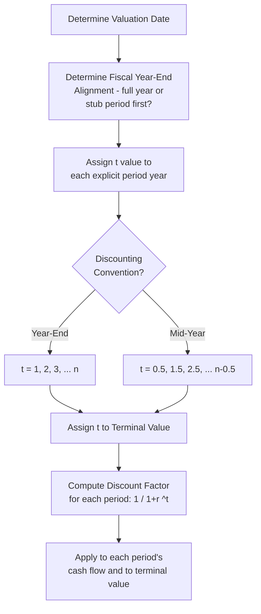

## Discount Factor Mechanics and Period Timing

### Definition and Conceptual Foundation

A discount factor is the multiplier applied to a future cash flow to convert it into its present value equivalent, capturing both the time value of money and the risk-adjusted required return embedded in the discount rate. While the concept is simple in isolation, correctly implementing discount factor mechanics across a full DCF model — with stub periods, mid-year adjustments, and a terminal value — requires careful, consistent period-timing bookkeeping that is a frequent source of quiet, hard-to-detect modeling errors.

$$DF_t = \frac{1}{(1+r)^t}$$

Where $r$ is the periodic discount rate (WACC or cost of equity, as appropriate — see the prior topic on matching cash flow type to discount rate) and $t$ is the time period, expressed in years (or fractions of years) from the valuation date.

**Key Points**

- The discount factor is always between 0 and 1 for a positive discount rate and positive time period, and it decreases as $t$ increases — cash flows further in the future are worth less today
- Every cash flow in the model — each explicit period year, the terminal value, and any stub period — needs its own precisely defined $t$ value
- Small errors in period timing compound: an error in year 1's $t$ value propagates proportionally into that period's present value, and a similar conceptual error in the terminal value's $t$ can distort a very large share of total enterprise value, since the terminal value is typically the majority of total value in most DCFs

---

### Building the Discount Factor Schedule

**Step 1 — Anchor the valuation date**: every $t$ value is measured relative to a single, explicitly defined valuation date (often the balance sheet date closest to the analysis, or the specific transaction/analysis date if different).

**Step 2 — Determine period alignment**: decide whether the first forecast period is a full year or a stub (partial year), based on how the valuation date relates to the company's fiscal year-end.

**Step 3 — Assign $t$ values consistently**: under year-end convention, $t$ values are whole numbers (1, 2, 3, ...); under mid-year convention, $t$ values are offset by 0.5 (0.5, 1.5, 2.5, ...), as covered in the prior topic.

**Step 4 — Extend the same logic to the terminal value**, ensuring its $t$ value is consistent with whichever convention governs the rest of the model.

---

### Handling Stub Periods

When the valuation date falls mid-fiscal-year, the first forecast period is a **stub period** — a partial year covering only the remaining months of the current fiscal year before the first full projected fiscal year begins.

$$t_{stub} = \frac{\text{Number of days (or months) remaining in current fiscal year}}{365 \text{ (or 12)}}$$

**Example**

If the valuation date is June 30 and the fiscal year ends December 31, the stub period covers the remaining 6 months (July–December):

$$t_{stub} = \frac{6}{12} = 0.5$$

The stub period's cash flow (only the remaining half-year's worth of free cash flow, not a full year) is then discounted using this fractional $t$ value:

$$PV_{stub} = \frac{FCF_{stub}}{(1+WACC)^{0.5}}$$

**Subsequent full-year periods** then continue from this stub-adjusted starting point:

- Year 1 (first full fiscal year after the stub): $t = 0.5 + 1 = 1.5$ (year-end convention) or $t = 0.5 + 0.5 = 1.0$ (mid-year convention, since the mid-year adjustment is applied *within* that full year, added on top of the stub period already elapsed)
- Year 2: $t = 0.5 + 2 = 2.5$ (year-end) or $t = 0.5 + 1.5 = 2.0$ (mid-year)

**Key Points**

- The stub period's own cash flow should reflect only that partial year's economics (e.g., roughly half of a normal full year's free cash flow, adjusted for any known seasonality), not a full year's cash flow discounted for a shorter period
- Getting stub period mechanics wrong is a common source of near-term valuation distortion, since the stub period and the immediately following year or two typically carry more discounting weight (less discounted) than later years, making errors here proportionally more consequential than similar errors in later, more heavily discounted years

---

### Worked Example: Full Discount Factor Schedule with Stub Period and Mid-Year Convention

**Scenario**: Valuation date of April 1; fiscal year-end December 31; mid-year convention applied throughout.

**Step 1 — Stub period** (April 1 to December 31 = 9 months remaining):

$$t_{stub,base} = \frac{9}{12} = 0.75 \text{ years elapsed to fiscal year-end}$$

Applying mid-year convention to the stub itself (assuming the stub's own cash flow arrives evenly across those 9 months, so its midpoint is 4.5 months, or 0.375 years, from the valuation date):

$$t_{stub} = 0.375$$

**Step 2 — Subsequent full years**, each offset by the stub's full base (0.75 years to reach fiscal year-end) plus the standard mid-year adjustment within each subsequent year:

| Period | Base Timing (to period end) | Mid-Year Adjusted $t$ |
| --- | --- | --- |
| Stub (9 months) | 0.75 | 0.375 |
| Year 1 (full year after stub) | 0.75 + 1.0 = 1.75 | 0.75 + 0.5 = 1.25 |
| Year 2 | 0.75 + 2.0 = 2.75 | 0.75 + 1.5 = 2.25 |
| Year 3 | 0.75 + 3.0 = 3.75 | 0.75 + 2.5 = 3.25 |
| Year 4 | 0.75 + 4.0 = 4.75 | 0.75 + 3.5 = 4.25 |
| Year 5 (terminal year) | 0.75 + 5.0 = 5.75 | 0.75 + 4.5 = 5.25 |

**Step 3 — Compute discount factors** (using WACC = 9%):

$$DF_{stub} = \frac{1}{1.09^{0.375}} \approx \frac{1}{1.0332} \approx 0.9679$$

$$DF_{year\ 1} = \frac{1}{1.09^{1.25}} \approx \frac{1}{1.1146} \approx 0.8972$$

$$DF_{year\ 5} = \frac{1}{1.09^{5.25}} \approx \frac{1}{1.5836} \approx 0.6315$$

**Output**

Each period's discount factor reflects its precise fractional distance from the valuation date, correctly incorporating both the stub period offset and the mid-year timing adjustment — this schedule of discount factors is then applied directly to each period's projected free cash flow to build the present value of the explicit period.

---

### Discount Factor Application to Terminal Value

The terminal value's $t$ value should match the final explicit period's $t$ value (the point in time at which the terminal value is calculated to represent), following whichever convention (year-end or mid-year) governs the rest of the schedule, as discussed in the prior topic:

$$PV_{TV} = TV_n \times DF_n = TV_n \times \frac{1}{(1+WACC)^{t_n}}$$

Continuing the example above, using year 5's mid-year-adjusted $t = 5.25$:

$$DF_{TV} = \frac{1}{1.09^{5.25}} \approx 0.6315$$

This same discount factor (0.6315) that applies to year 5's free cash flow also applies to the terminal value, since both are being brought back to present value from the same point in time.

---

### Building a Clean, Auditable Discount Factor Schedule

A well-constructed model presents the discount factor calculation as its own explicit, visible row (or set of rows) rather than embedding it invisibly within each period's present value formula — this makes period timing assumptions immediately auditable by a reviewer.

| Period | Calendar Date Range | $t$ (years from valuation date) | Discount Factor | Free Cash Flow | Present Value |
| --- | --- | --- | --- | --- | --- |
| Stub | Apr 1 – Dec 31, Yr 0 | 0.375 | 0.9679 | $45M | $43.6M |
| Year 1 | Jan 1 – Dec 31, Yr 1 | 1.25 | 0.8972 | $92M | $82.5M |
| Year 2 | Jan 1 – Dec 31, Yr 2 | 2.25 | 0.8231 | $99M | $81.5M |
| Year 3 | Jan 1 – Dec 31, Yr 3 | 3.25 | 0.7552 | $107M | $80.8M |
| Year 4 | Jan 1 – Dec 31, Yr 4 | 4.25 | 0.6930 | $114M | $79.0M |
| Year 5 + TV | Jan 1 – Dec 31, Yr 5 | 5.25 | 0.6315 | $121M + TV | (computed) |

**Key Points**

- Laying out calendar dates alongside $t$ values makes it straightforward to spot-check that the timing logic is correct
- This structure also makes it easy to adjust the model if the valuation date changes, since the stub period and all subsequent $t$ values can be recalculated systematically rather than requiring manual re-derivation of each period's exponent

---

### Common Pitfalls

- **Inconsistent $t$ value conventions across the model** — mixing year-end and mid-year exponents within the same discount factor schedule
- **Incorrect stub period fraction calculation**, particularly around leap years, differing month-length assumptions (30/360 vs. actual/365 day-count conventions), or miscounting the number of remaining months
- **Forgetting to carry the stub period's base timing forward into subsequent full-year periods**, causing every subsequent year's $t$ value to be understated by the stub period's duration
- **Applying the wrong $t$ value to the terminal value** — either forgetting the mid-year adjustment applied to the final explicit year, or using $n$ instead of $n - 0.5$ (or vice versa, depending on which terminal value convention is being used, as discussed in the prior topic)
- **Treating discount factor errors as immaterial** because each individual period's error seems small — timing errors in the terminal value's exponent, given its outsized share of total value, can materially distort the final valuation conclusion even from what looks like a minor timing discrepancy
- **Using inconsistent day-count conventions** (e.g., mixing actual calendar days in one part of the model with a simplified 30/360 assumption elsewhere) when computing stub period fractions

---

**Related Topics**

- Mid-Year Convention versus Year-End Discounting
- Structuring the Explicit Forecast Period
- Matching Free Cash Flow Type to the Appropriate Discount Rate
- Terminal Value Estimation: Gordon Growth vs. Exit Multiple Methods
- Weighted Average Cost of Capital (WACC) Assembly
- Building an Auditable DCF Model: Structure and Layout Best Practices