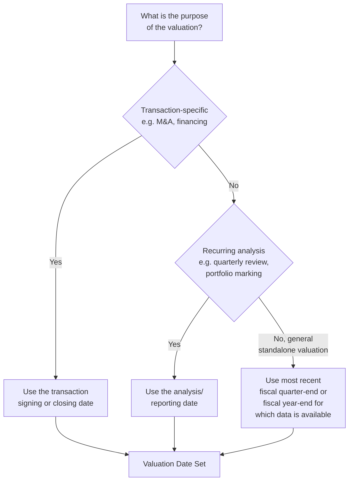

## Stub Period and Valuation Date Adjustments

### Definition and Conceptual Foundation

The valuation date is the specific point in time to which all cash flows in a DCF model are discounted back — it is the "as-of" date the resulting enterprise and equity value refer to. Because this date very rarely coincides exactly with a company's fiscal year-end, the model must handle a **stub period**: a partial-year segment bridging the valuation date to the end of the current fiscal year, before standard full-year projections begin. Getting this adjustment right is foundational to the accuracy of near-term present values, which — being the least discounted — carry disproportionate weight in the overall valuation relative to a similarly-sized error in a distant future period.

**Key Points**

- The valuation date is a deliberate analytical choice, not automatically today's date or the most recent fiscal year-end — though it is very often set to one of these for practical convenience
- A stub period is required whenever the valuation date falls between fiscal year-ends, which is the norm rather than the exception in real-world valuation work
- Stub period treatment interacts directly with discount factor mechanics (covered in the prior topic) but is a distinct conceptual step: determining the *cash flow* for the partial period, not just its discounting exponent

---

### Selecting the Valuation Date

**Transaction-driven valuations**: the valuation date is typically fixed by the transaction itself — the signing date, an agreed reference date in the purchase agreement, or the expected closing date, depending on the specific purpose of the valuation.

**Recurring or periodic analyses**: portfolio marks, quarterly fairness reviews, and similar recurring valuations typically use the specific reporting or analysis date as the valuation date.

**General standalone valuations**: absent a specific transaction or recurring reporting requirement, the most recent fiscal quarter-end or year-end for which reliable actual financial data is available is a common practical choice, since it anchors the model to verified historical figures rather than requiring estimation of interim results.

---

### Why the Stub Period Matters

If the valuation date is, for example, May 15, and the fiscal year ends December 31, the "first forecast period" is not a full year — it is only the remaining approximately 7.5 months of the current fiscal year. Treating this remaining partial period as if it were a full year (discounting a full year's projected cash flow for only a partial year's time, or vice versa) introduces a clear and avoidable distortion into the model's near-term present values.

$$\text{Stub Period Length (years)} = \frac{\text{Days from Valuation Date to Fiscal Year-End}}{365}$$

**Example**

Valuation date: May 15. Fiscal year-end: December 31.

Days remaining: approximately 230 days (May 15 to December 31)

$$\text{Stub Length} = \frac{230}{365} \approx 0.630 \text{ years}$$

---

### Estimating the Stub Period's Cash Flow

Once the stub period's *length* is established, its *cash flow* must be estimated — this is a distinct step from the discounting mechanics and requires judgment about how the company's cash flow is actually distributed within its fiscal year.

**Approach 1 — Straight-line pro-ration**: assume cash flow accrues evenly throughout the fiscal year, so the stub period's cash flow is simply the full projected fiscal-year cash flow multiplied by the stub period's fraction of the year:

$$FCF_{stub} = FCF_{full\ year} \times \text{Stub Fraction}$$

**[Inference]** This approach is a reasonable default for businesses without significant seasonality, but it will misstate the stub period's true cash flow for any business with a meaningfully uneven distribution of revenue, costs, or working capital swings across the fiscal year.

**Approach 2 — Actual-plus-estimate (using interim financial data)**: if actual results are available for part of the period already elapsed (e.g., quarterly filings), use those actual figures for the elapsed portion and only estimate the remaining, not-yet-reported portion of the stub — generally more accurate than pure straight-line pro-ration, since it anchors part of the stub to known, actual results rather than a purely projected pro-ration.

**Approach 3 — Seasonally-adjusted pro-ration**: for businesses with known, material seasonal patterns (e.g., a retailer with a disproportionate share of annual cash flow concentrated in a holiday quarter), apply a seasonality curve to allocate the fiscal year's projected cash flow unevenly across months, then sum the months falling within the stub period, rather than assuming even distribution.

**Key Points**

- The choice of approach should reflect the business's actual cash flow seasonality — a highly seasonal business modeled with straight-line pro-ration can materially misstate the stub period's true cash contribution
- Using actual interim data (Approach 2) whenever available is generally preferable to relying entirely on a pro-ration estimate, since it reduces one layer of estimation uncertainty

---

### Worked Example: Straight-Line Stub Period Cash Flow

**Inputs**

- Valuation date: May 15
- Fiscal year-end: December 31
- Full projected fiscal year free cash flow: $120 million
- Stub fraction: 0.630 (as calculated above)

**Calculation**

$$FCF_{stub} = 120 \times 0.630 = \$75.6\text{ million}$$

This $75.6 million figure represents the estimated free cash flow for the remaining portion of the current fiscal year (May 15 through December 31), to be discounted using the corresponding fractional $t$ value established in the discount factor schedule.

---

### Worked Example: Seasonally-Adjusted Stub Period

**Scenario**: A retailer with a fiscal year ending December 31, where actual historical cash flow distribution shows the following approximate monthly pattern (illustrative, based on the company's own historical seasonality):

| Period | Approx. % of Annual Cash Flow |
| --- | --- |
| Jan – Apr | 20% |
| May – Aug | 25% |
| Sep – Oct | 15% |
| Nov – Dec (holiday season) | 40% |

**Valuation date**: May 15 (stub period covers mid-May through December 31)

Using the seasonality table, the stub period (roughly the second half of May through August, all of September–October, and all of November–December) would be estimated by summing the relevant seasonal allocations rather than assuming even distribution — in this case, capturing roughly half of the "May–Aug" bucket plus the full "Sep–Oct" and "Nov–Dec" buckets:

$$FCF_{stub} \approx (0.5 \times 25\%) + 15\% + 40\% = 12.5\% + 15\% + 40\% = 67.5\% \text{ of full-year FCF}$$

If full-year projected FCF is $120 million:

$$FCF_{stub} \approx 120 \times 0.675 = \$81\text{ million}$$

**Output**

Notice this seasonally-adjusted stub estimate ($81 million) differs meaningfully from the straight-line pro-ration estimate that would result from a simple time-fraction calculation, precisely because this retailer's cash flow is disproportionately weighted toward the November–December holiday period, which falls entirely within the stub in this example — illustrating why seasonality-aware stub estimation matters for businesses with genuinely uneven annual cash flow distribution.

---

### Discounting the Stub Period

Once the stub period's cash flow is estimated, it is discounted using the fractional $t$ value corresponding to its timing — following either a year-end convention (discounting to the stub's endpoint) or a mid-year convention (discounting to the stub's own midpoint), consistent with whichever convention governs the rest of the model, as detailed in the prior topics on discount factor mechanics.

$$PV_{stub} = \frac{FCF_{stub}}{(1+WACC)^{t_{stub}}}$$

Subsequent full-year periods then continue from the stub period's endpoint, with their own $t$ values offset by the stub's full duration (see the discount factor mechanics topic for the complete worked schedule).

---

### Handling the "Valuation Date = Fiscal Year-End" Special Case

When the valuation date is deliberately set to coincide exactly with the most recent fiscal year-end (a common simplifying choice for standalone or illustrative valuations), no stub period is required at all — the first forecast period is simply the next full fiscal year, with $t = 1$ (year-end convention) or $t = 0.5$ (mid-year convention).

**Key Points**

- This is often the preferred simplification when a precise, transaction-specific valuation date is not required, since it avoids the additional complexity of stub period estimation entirely
- The trade-off is that the resulting valuation is "as of" a potentially several-months-stale date rather than the actual present analysis date, which may or may not be an acceptable simplification depending on the purpose of the valuation

---

### Common Pitfalls

- **Ignoring the stub period entirely**, effectively treating the valuation date as if it were the fiscal year-end when it is not — this misstates both the timing and magnitude of near-term cash flows
- **Using straight-line pro-ration for a highly seasonal business** without checking whether the resulting stub estimate materially misrepresents the business's actual cash flow pattern during that specific window
- **Failing to use available actual interim financial data** when it exists, relying entirely on a pro-rated estimate when better information is at hand
- **Inconsistent day-count conventions** between the stub period fraction calculation and the rest of the discount factor schedule (e.g., mixing actual/365 for the stub with 30/360 assumptions elsewhere)
- **Forgetting to adjust subsequent full-year periods' $t$ values** to account for the stub period's duration already elapsed, causing every later period's discounting to be understated
- **Treating stub period precision as immaterial** — because the stub period and immediately following years are the least-discounted (and therefore most heavily weighted) periods in present value terms, errors here are proportionally more consequential than similar errors in later, more heavily discounted periods

---

**Related Topics**

- Discount Factor Mechanics and Period Timing
- Mid-Year Convention versus Year-End Discounting
- Structuring the Explicit Forecast Period
- Seasonal Revenue Modeling and Cash Flow Timing Adjustments
- Building an Auditable DCF Model: Structure and Layout Best Practices
- Matching Free Cash Flow Type to the Appropriate Discount Rate