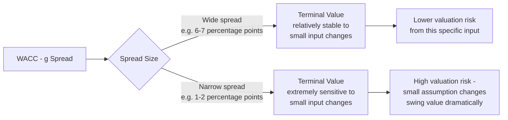

## Gordon Growth Perpetuity Method

### Definition and Conceptual Foundation

The Gordon Growth Model (also called the Gordon Growth Perpetuity Method, or the perpetuity growth method) estimates the terminal value of a business by treating all cash flows beyond the explicit forecast period as a perpetuity growing at a constant rate indefinitely. It is one of the two dominant terminal value methodologies in DCF practice (the other being the exit multiple method), and it is the approach most directly grounded in the underlying mathematics of the DCF framework itself rather than relying on comparable-company market pricing.

$$TV_n = \frac{FCF_{n+1}}{WACC - g} = \frac{FCF_n \times (1+g)}{WACC - g}$$

Where $TV_n$ is the terminal value calculated as of the end of the explicit forecast period (year $n$), $FCF_{n+1}$ is the first year of the perpetuity (i.e., the terminal year's cash flow grown one additional year at the terminal growth rate $g$), $WACC$ is the discount rate, and $g$ is the assumed perpetual growth rate.

**Key Points**

- This formula is the standard growing perpetuity formula from time value of money mathematics, applied specifically to free cash flow
- The terminal value calculated is as of the *end of year $n$*, not as of today — it must still be discounted back to present value using the appropriate discount factor (see prior topics on discount factor mechanics)
- The formula requires $WACC > g$; if $g \geq WACC$, the formula produces a negative or undefined (infinite) result, which is a mathematical signal that the growth assumption is inconsistent with the discount rate, not a usable output

---

### Derivation and Mathematical Basis

The Gordon Growth formula derives from summing an infinite geometric series of growing cash flows, each discounted back to the terminal point:

$$TV_n = \frac{FCF_{n+1}}{(1+WACC)^1} + \frac{FCF_{n+1}(1+g)}{(1+WACC)^2} + \frac{FCF_{n+1}(1+g)^2}{(1+WACC)^3} + \ldots$$

This infinite sum, provided $WACC > g$, converges algebraically to the closed-form expression:

$$TV_n = \frac{FCF_{n+1}}{WACC - g}$$

**[Inference]** This convergence result is a standard mathematical property of geometric series (specifically, a growing perpetuity) rather than an empirical or estimated relationship — it holds exactly given the stated assumptions of constant perpetual growth and a constant discount rate, which is why the formula's accuracy in practice depends entirely on how well those two constancy assumptions actually describe the business's true long-run behavior, not on any approximation error in the formula itself.

---

### Critical Input: The Terminal Growth Rate

The terminal growth rate ($g$) represents the rate at which free cash flow is assumed to grow **forever**, and is therefore subject to a firm theoretical ceiling: no company can grow faster than the overall economy indefinitely without eventually representing an implausibly large (and ultimately impossible, mathematically) share of it.

**Standard constraint**: $g \leq$ long-run nominal GDP growth rate of the economy (or economies) in which the company primarily operates.

**Common practitioner ranges**: for mature economy exposure, terminal growth rates are frequently set in the range of 2%–4%, broadly consistent with long-run nominal GDP growth expectations (real GDP growth plus expected inflation) for developed markets.

**[Unverified]** Specific numerical ranges for "typical" terminal growth rates shift with prevailing inflation and long-run growth expectations at any given point in time; the underlying principle — that $g$ should not exceed a defensible long-run nominal economic growth ceiling — is the durable rule, while the specific numerical range used to reflect it should be checked against current macroeconomic conditions and consensus long-run forecasts rather than treated as a fixed constant.

**Key Points**

- $g$ should reflect the growth rate of the specific markets and geographies the company operates in (which may differ from a single global average), particularly for companies with concentrated geographic exposure
- $g$ is a *nominal* growth rate (including inflation) if the cash flows and WACC are also nominal — real and nominal figures must not be mixed (see the discount rate mechanics and WACC topics)
- Even small changes in $g$ have an outsized effect on terminal value, because $g$ appears in the denominator alongside WACC — a small numerical change in either input produces a proportionally much larger change in the $(WACC - g)$ spread

---

### Sensitivity of Terminal Value to the WACC–g Spread

Because the denominator is the *difference* between two numbers, a narrow spread between WACC and $g$ makes the terminal value extremely sensitive to small changes in either input — this is one of the most important practical sensitivities to understand and communicate in any DCF that relies on the Gordon Growth method.

**Worked Example — Sensitivity Illustration**

Using $FCF_{n+1} = \$100$ million:

| WACC | g | Spread | Terminal Value |
| --- | --- | --- | --- |
| 9% | 3% | 6% | $100M / 0.06 = $1,667M |
| 9% | 4% | 5% | $100M / 0.05 = $2,000M |
| 9% | 5% | 4% | $100M / 0.04 = $2,500M |
| 8% | 3% | 5% | $100M / 0.05 = $2,000M |
| 8% | 5% | 3% | $100M / 0.03 = $3,333M |

**Output**

Moving the terminal growth rate from 3% to 5% (holding WACC constant at 9%) increases terminal value by 50% ($1,667M to $2,500M) — illustrating why disproportionate scrutiny should be applied to the terminal growth rate assumption relative to its seemingly modest 2-percentage-point range of variation.

---

### Consistency Requirement: The Terminal Year Cash Flow Must Reflect Steady State

The Gordon Growth formula implicitly assumes that **every** driver underlying the terminal year's cash flow — margin, capital intensity, working capital needs, tax rate — remains structurally consistent with the assumed perpetual growth rate $g$ forever. This connects directly to the convergence principle discussed in the explicit forecast period topics: if the terminal year's cash flow still reflects an unconverged, transitional state (e.g., abnormally low capex relative to depreciation, or margins still above a sustainable long-run level), the terminal value will be systematically distorted regardless of how carefully $g$ and WACC themselves are chosen.

**Key Points**

- A common and consequential error is applying the Gordon Growth formula to a terminal-year cash flow where capex is assumed to remain below depreciation indefinitely (implying a perpetually shrinking asset base, which is inconsistent with also assuming perpetual revenue growth)
- In a genuine steady state, capex should generally approximate depreciation, adjusted for the assumed growth rate (a growing business needs some net capital investment beyond mere maintenance, proportional to $g$), not simply mirror a maintenance-only assumption if $g > 0$
- Reinvestment needs in steady state can be approximated using the relationship between growth, return on invested capital, and the reinvestment rate: $g = ROIC \times \text{Reinvestment Rate}$, which provides a useful cross-check that the terminal year's capex and working capital assumptions are consistent with the assumed terminal growth rate

---

### Worked Example: Full Terminal Value Calculation

**Inputs**

- Terminal year (year 5) free cash flow: $115 million
- Terminal growth rate ($g$): 3%
- WACC: 8.84%

**Step 1 — Grow the terminal year cash flow one additional year**

$$FCF_{n+1} = 115 \times (1 + 0.03) = \$118.45\text{ million}$$

**Step 2 — Apply the Gordon Growth formula**

$$TV_5 = \frac{118.45}{0.0884 - 0.03} = \frac{118.45}{0.0584} \approx \$2{,}028.3\text{ million}$$

**Step 3 — Discount the terminal value back to present value**

Using a discount factor consistent with year 5's timing (e.g., mid-year convention, $t = 4.5$):

$$PV_{TV} = \frac{2{,}028.3}{(1.0884)^{4.5}} \approx \frac{2{,}028.3}{1.4595} \approx \$1{,}389.7\text{ million}$$

**Output**

The present value of the terminal value is approximately $1,389.7 million — this figure is then added to the present value of the explicit period free cash flows to arrive at total enterprise value, and, as is typical in most DCFs, this terminal value component usually represents the majority share of total enterprise value.

---

### Gordon Growth vs. Exit Multiple: A Brief Comparative Note

| Aspect | Gordon Growth Method | Exit Multiple Method |
| --- | --- | --- |
| Theoretical grounding | Directly derived from DCF mathematics (growing perpetuity) | Relies on current market pricing of comparable companies at the assumed exit point |
| Key sensitivity | WACC–g spread | Multiple selection and comparable company set |
| Consistency check | Implied exit multiple should be checked against current market multiples for reasonableness | Implied perpetual growth rate should be checked against the GDP growth ceiling for reasonableness |
| Common practitioner approach | Often triangulated against the exit multiple method as a cross-check, rather than relied upon in isolation | Often triangulated against Gordon Growth as a cross-check |

**Key Points**

- Best practice in most professional contexts is to compute terminal value both ways and compare the implied outputs of each method against the other (an implied exit multiple from the Gordon Growth result, and an implied perpetual growth rate from the exit multiple result), rather than relying on a single method without cross-checking
- A large divergence between the two methods' implied outputs signals that at least one method's underlying assumptions may not be well-calibrated to the business's actual circumstances

---

### Common Pitfalls

- **Using a terminal growth rate that exceeds long-run nominal GDP growth** without a specific, well-justified reason (e.g., a company with a genuinely growing global market share ceiling far above the analyst's own home-market GDP assumption)
- **Applying the Gordon Growth formula to a terminal-year cash flow that has not actually reached a defensible steady state** (unconverged margins, capital intensity, or working capital dynamics)
- **Ignoring the WACC–g spread sensitivity** and treating a narrow spread's resulting terminal value as equally reliable as a wide-spread scenario's result
- **Forgetting to grow the terminal year's cash flow by one additional year** ($FCF_{n+1}$, not $FCF_n$) before applying the formula
- **Mixing real and nominal figures** — using a nominal WACC with a real (inflation-excluded) terminal growth rate, or vice versa
- **Treating the Gordon Growth result as definitive without a cross-check** against the exit multiple method or against the implied steady-state ROIC and reinvestment rate relationship
- **Failing to apply the correct discount factor timing** to the terminal value itself, as discussed in the discount factor mechanics and mid-year convention topics

---

**Related Topics**

- Exit Multiple Terminal Value Method
- Structuring the Explicit Forecast Period
- Determining an Appropriate Forecast Horizon
- Discount Factor Mechanics and Period Timing
- Mid-Year Convention versus Year-End Discounting
- Return on Invested Capital (ROIC) and the Reinvestment Rate Relationship
- Weighted Average Cost of Capital (WACC) Assembly
- Terminal Value Sensitivity Analysis and Scenario Testing