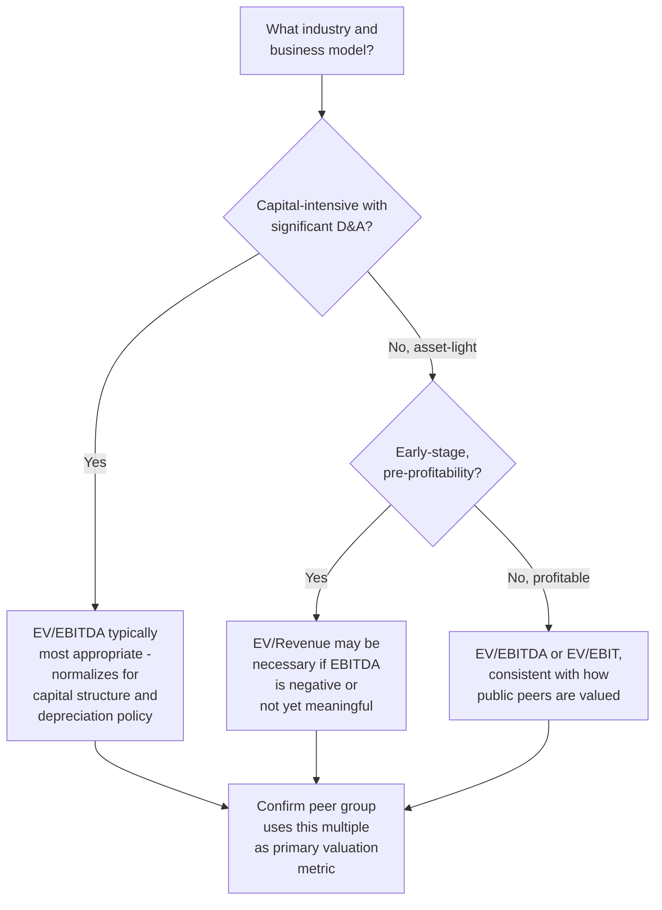
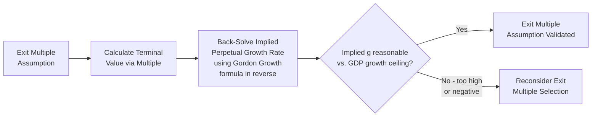

## Exit Multiple Method

### Definition and Conceptual Foundation

The Exit Multiple Method estimates terminal value by applying a valuation multiple — typically EV/EBITDA, though other multiples are used depending on the industry — to the company's projected terminal-year financial metric, implicitly assuming the business could be sold at that multiple at the end of the explicit forecast period. Unlike the Gordon Growth method, which derives terminal value directly from the mathematics of a growing perpetuity, the exit multiple method anchors terminal value to observable, market-based pricing of comparable companies at a hypothetical future sale point.

$$TV_n = \text{Terminal Year Metric}_n \times \text{Exit Multiple}$$

Most commonly:

$$TV_n = EBITDA_n \times EV/EBITDA_{exit}$$

Where $TV_n$ is the terminal value as of the end of the explicit forecast period (year $n$), and the exit multiple is typically derived from current trading multiples of comparable public companies, precedent transaction multiples, or the company's own current trading multiple.

**Key Points**

- This terminal value is calculated as of the end of year $n$ and must still be discounted back to present value, exactly as with the Gordon Growth method
- The exit multiple method is fundamentally a market-based (relative valuation) approach embedded within an otherwise intrinsic (DCF) framework — a hybrid that draws criticism from purists but is nonetheless very widely used in practice
- The choice of multiple type (EV/EBITDA, EV/EBIT, EV/Revenue, P/E, industry-specific multiples) should match how the company and its peers are typically valued in the market

---

### Selecting the Appropriate Multiple Type

**EV/EBITDA**: the most commonly used exit multiple across most industries, since it is capital-structure-neutral (unaffected by financing decisions) and removes distortions from differing depreciation policies across companies.

**EV/EBIT**: sometimes preferred for capital-intensive industries where depreciation represents a genuine ongoing economic cost (e.g., heavy manufacturing, where equipment genuinely wears out and must be replaced) rather than merely an accounting or tax artifact.

**EV/Revenue**: used when EBITDA is negative, not yet meaningful, or highly volatile — common for early-stage or high-growth companies not yet at a mature profitability profile, though by the *terminal* year (which should reflect a converged, steady-state business per the forecast horizon topics), EBITDA-based multiples are usually more appropriate than at the valuation date itself.

**Industry-specific multiples**: certain industries use specialized metrics better suited to their value drivers (e.g., EV per subscriber for subscription businesses, EV per bed for healthcare facilities, EV per proven reserve barrel for oil and gas) — the multiple selected should mirror how the market actually prices comparable companies in that specific industry.

---

### Sourcing the Exit Multiple

**Approach 1 — Current comparable company trading multiples**: use the current EV/EBITDA (or relevant metric) multiple of a carefully selected peer group of publicly traded comparable companies, under the assumption that the company's own multiple at the future exit point will resemble today's peer group multiple.

**Approach 2 — Precedent transaction multiples**: use multiples paid in recent M&A transactions involving similar companies, which may better reflect a control premium or strategic value if the terminal value is meant to represent an actual sale scenario rather than a public market trading value.

**Approach 3 — The company's own current trading multiple**: for a publicly traded company, sometimes its own current multiple is used as the exit assumption, under the assumption that the market's current view of the company's quality and growth prospects will persist.

**Key Points**

- Whichever source is used, the multiple should reflect the terminal year's *anticipated* business characteristics (growth rate, margin profile, capital intensity) rather than the company's *current* characteristics, since these may differ substantially by the end of the explicit forecast period (see the forecast horizon and convergence topics)
- Using today's peer trading multiples assumes those peers' own growth and margin profiles are reasonably representative of what the subject company will look like at the terminal year — an assumption that should be explicitly checked, not assumed automatically valid

---

### Worked Example: Basic Exit Multiple Terminal Value

**Inputs**

- Terminal year (year 5) EBITDA: $180 million
- Exit EV/EBITDA multiple: 9.5x (based on current peer group median)
- WACC: 8.84%

**Step 1 — Apply the multiple**

$$TV_5 = 180 \times 9.5 = \$1{,}710\text{ million}$$

**Step 2 — Discount to present value**

Using mid-year convention, $t = 4.5$:

$$PV_{TV} = \frac{1{,}710}{(1.0884)^{4.5}} \approx \frac{1{,}710}{1.4595} \approx \$1{,}171.6\text{ million}$$

**Output**

The present value of the terminal value using the exit multiple method is approximately $1,171.6 million.

---

### The Critical Cross-Check: Implied Perpetual Growth Rate

Because the exit multiple method does not explicitly reference a growth rate, a crucial validation step is to back out the perpetual growth rate *implied* by the chosen exit multiple, using the Gordon Growth formula in reverse, and check whether that implied rate is economically sensible.

$$g_{implied} = WACC - \frac{FCF_{n+1}}{TV_n}$$

**Worked Example (continued)**

Assume the terminal year's free cash flow (distinct from EBITDA) is $115 million, growing to $FCF_{n+1} = 115 \times 1.03 = \$118.45$ million for illustration (though solving in reverse, the growth embedded is what's being determined, so this is solved iteratively or via rearrangement):

$$g_{implied} = WACC - \frac{FCF_n}{TV_n} \approx 8.84\% - \frac{115}{1{,}710} \approx 8.84\% - 6.73\% \approx 2.11\%$$

**Output**

The 9.5x exit multiple implies a perpetual growth rate of approximately 2.11% — a figure that should then be evaluated against the same reasonableness ceiling (long-run nominal GDP growth) applied to the terminal growth rate in the Gordon Growth method. If this implied growth rate is negative, unreasonably high, or otherwise implausible, it signals the chosen exit multiple itself may not be well-calibrated to the business's actual sustainable economics.

**Key Points**

- This cross-check is considered essential practice, not optional, precisely because the exit multiple method's key weakness is that it can silently embed an unreasonable implied growth assumption without that assumption ever being explicitly stated or scrutinized
- Running both methods (Gordon Growth and exit multiple) and comparing their respective implied growth rate and implied exit multiple is the standard way to triangulate a defensible terminal value range, rather than relying on either method's headline output in isolation

---

### Advantages and Limitations

**Advantages**:

- Anchors terminal value to observable, real-world market pricing rather than a purely theoretical mathematical construct
- Often more intuitive to communicate to stakeholders familiar with trading and transaction multiples (bankers, corporate development teams, boards)
- Avoids the extreme sensitivity to a narrow WACC–g spread that can make the Gordon Growth method's output swing dramatically from small input changes

**Limitations**:

- Introduces a market-based (relative valuation) element into what is otherwise an intrinsic valuation framework — a philosophical inconsistency that critics argue undermines the DCF's purpose of deriving value independent of potentially mispriced market comparables
- Current market multiples may reflect a temporary market cycle (peak or trough valuation environment) that will not necessarily persist to the actual future terminal date
- Requires a credible, comparable peer group — for unique businesses, recent IPOs, or companies without close comparables, selecting a defensible multiple is genuinely difficult
- **[Inference]** Because current multiples embed the market's own view of near-term growth and margin expectations for the peer set, applying today's multiple to a terminal year several years in the future implicitly assumes market pricing conventions and risk appetites remain stable over that horizon — an assumption that is convenient but not necessarily more reliable than the growth rate assumption embedded in the Gordon Growth method, merely different in form

---

### Comparative Summary

| Aspect | Gordon Growth Method | Exit Multiple Method |
| --- | --- | --- |
| Basis | Intrinsic, derived from DCF mathematics | Market-based, derived from comparable pricing |
| Key input | Terminal growth rate ($g$) | Exit multiple (e.g., EV/EBITDA) |
| Key sensitivity | WACC–g spread | Multiple selection and comparable set quality |
| Hidden assumption to check | Terminal-year cash flow reflects true steady state | Implied perpetual growth rate is reasonable |
| Market cycle risk | Lower (not directly tied to current market pricing) | Higher (embeds current market sentiment into a future point) |
| Best practice | Cross-check against exit multiple's implied growth rate | Cross-check against Gordon Growth's implied multiple |

---

### Worked Example: Implied Multiple from Gordon Growth (Reverse Cross-Check)

Using the Gordon Growth example from the prior topic ($TV_5 \approx \$2,028.3$ million, terminal year EBITDA assumed at $180 million for this illustration):

$$\text{Implied EV/EBITDA} = \frac{TV_5}{EBITDA_n} = \frac{2{,}028.3}{180} \approx 11.27x$$

**Output**

If the Gordon Growth method implies an exit multiple of 11.27x, but the current peer group actually trades at a median of 9.5x, this divergence signals the Gordon Growth assumptions (WACC and/or $g$) may be more optimistic than what the market currently prices for comparable businesses — a discrepancy worth investigating and reconciling before finalizing the terminal value conclusion, rather than a discrepancy to be ignored.

---

### Common Pitfalls

- **Using a peer group whose growth and margin profile doesn't match the subject company's expected terminal-year profile**, applying a multiple calibrated to a different risk/growth characteristic
- **Failing to back-solve and sanity-check the implied perpetual growth rate**, allowing an unreasonable growth assumption to hide silently within the multiple
- **Using a cyclically elevated or depressed current market multiple** without adjusting for where the broader market or industry cycle currently sits relative to its long-run average
- **Applying a multiple based on the company's or peers' current (unconverged) financial profile** rather than the terminal year's expected, steady-state profile
- **Treating the exit multiple method as inherently more "objective" or reliable than Gordon Growth simply because it uses observable market data** — it carries its own equally significant set of embedded assumptions and risks
- **Not running both methods as a cross-check**, relying on a single terminal value approach without triangulating

---

**Related Topics**

- Gordon Growth Perpetuity Method
- Determining an Appropriate Forecast Horizon
- Structuring the Explicit Forecast Period
- Comparable Company Analysis and Peer Group Selection
- Precedent Transaction Analysis and Control Premium Considerations
- Terminal Value Sensitivity Analysis and Scenario Testing
- Discount Factor Mechanics and Period Timing