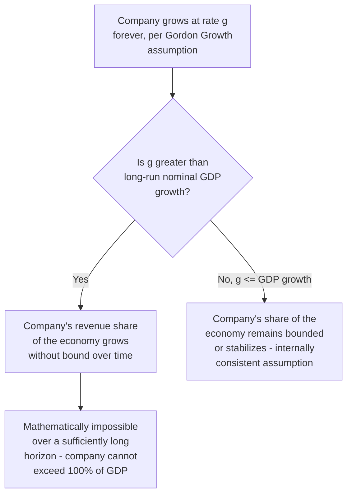

## Selecting a Sustainable Long-Term Growth Rate

### Definition and Conceptual Foundation

Selecting the terminal growth rate ($g$) is arguably the single most consequential judgment call in the entire DCF model, given the extreme sensitivity of the Gordon Growth terminal value formula to this input. This topic focuses specifically on the diagnostic framework and defensible bounds for choosing $g$, building on the mechanics of the Gordon Growth formula covered in the prior topic.

$$g \leq g_{GDP,nominal,long\text{-}run}$$

**Key Points**

- The terminal growth rate represents growth **in perpetuity**, not a near-term forecast — this is fundamentally different from, and should be much more conservative than, any explicit-period growth assumption
- The governing constraint is mathematical, not merely conventional: a company cannot grow faster than the aggregate economy forever without eventually exceeding the size of that economy, which is a logical impossibility
- $g$ must be internally consistent with the currency, geography, and nominal/real basis of every other input in the model (cash flows, WACC)

---

### The GDP Growth Ceiling: Why It Is a Hard Constraint

If a company's cash flow grows at, say, 6% forever while the economy grows at 4% nominal, the company's revenue would represent an ever-increasing share of total economic output — a trajectory that is mathematically guaranteed to become impossible within a finite (if long) time horizon, since a company's revenue cannot exceed the total output of the economy it operates within. This is why $g$ should essentially never exceed the long-run nominal GDP growth rate of the company's primary market(s), regardless of how fast the company is currently growing in the explicit forecast period.

**[Inference]** Fast-growing companies can and often do exceed GDP growth for extended periods (years, even a decade or more, during the explicit forecast period) — this is entirely consistent with the framework, since the explicit period is precisely where such above-GDP growth is expected to play out and then decelerate. It is only the *terminal*, perpetual growth assumption that must respect the GDP ceiling, because "forever" is the operative word that makes the mathematical constraint bind.

---

### Determining the Relevant GDP Growth Benchmark

The appropriate GDP growth benchmark depends on the company's actual geographic revenue exposure, not simply the analyst's home country by default.

**Single-market, domestically-focused companies**: use the long-run nominal GDP growth forecast for that specific country.

**Multinational companies**: use a revenue-weighted blend of long-run nominal GDP growth rates across the countries or regions where the company generates its revenue, mirroring the same weighting logic used for a blended marginal tax rate or blended country risk premium.

**Current illustrative reference points**: as of recent 2026 forecasts, near-term US real GDP growth has been projected in the range of roughly 2.2%–2.8% for 2026 by various institutional forecasters (CBO, Goldman Sachs Research), with core inflation expectations around 2.1%. Goldman Sachs Research projected US GDP to expand 2.5% in Q4 2026 year-over-year, with an above-consensus growth forecast and below-consensus inflation forecast, driven by a shift from tariff drag toward a tax-cut-driven boost. The Congressional Budget Office separately estimated US GDP growth accelerating to 2.2% in 2026. [goldmansachs](https://goldmansachs.com/insights/articles/us-gdp-growth-is-projected-to-outperform-economist-forecasts-in-2026)[newsquawk](https://www.newsquawk.com/headlines/cbo-estimates-us-gdp-growth-to-accelerate-to-22-in-2026-unemployment-to-be-46-in-2026-and-44-in-2028-and-the-effr-to-decrease-to-34-in-2026)

**[Unverified]** These are near-term (single-year or few-year) forecasts, not long-run structural estimates — they should not be used directly as the terminal growth rate itself, but they help anchor a reasonable long-run nominal GDP growth range (commonly approximated as long-run real GDP growth of roughly 1.5%–2.5% plus long-run inflation expectations of roughly 2%–2.5%, yielding a long-run nominal GDP growth ceiling in the rough vicinity of 3.5%–4.5% for the US specifically). This range shifts with prevailing macroeconomic conditions and should be periodically refreshed against current long-run consensus forecasts (e.g., Federal Reserve long-run projections, CBO long-term budget outlook, or IMF long-run projections) rather than treated as fixed.

---

### Practitioner Range Framework

| Market Type | Illustrative Terminal Growth Range | Rationale |
| --- | --- | --- |
| Mature developed markets (US, Western Europe, Japan) | ~2%–3% | Reflects modest long-run real GDP growth plus central-bank-targeted inflation (~2%) |
| Emerging markets (higher structural growth) | ~3%–5% | Reflects higher long-run real GDP growth potential plus typically higher structural inflation |
| Frontier/high-growth emerging markets | Potentially above 5%, with caution | Requires strong justification; higher country risk premium (see Cost of Equity chapter) should already be capturing much of this market's additional risk separately |

**[Inference]** These ranges represent commonly cited practitioner conventions rather than fixed rules, and should always be cross-checked against the specific, current long-run growth consensus for the company's actual revenue geography rather than applied as a rote lookup table.

---

### Distinguishing Terminal Growth from Explicit-Period Growth

A frequent source of confusion is conflating the explicit period's final-year growth rate with the terminal growth rate itself. These serve entirely different purposes and are governed by different constraints.

**Key Points**

- The explicit period's growth trajectory (as covered in the forecast horizon and explicit period structuring topics) should *fade toward* the terminal growth rate by the final explicit year — the terminal rate is the destination of that fade path, not a separate, independently chosen number that can be inconsistent with where the explicit period actually lands
- If the final explicit year still shows growth meaningfully above the intended terminal rate, either the explicit period needs to be extended (see the forecast horizon topic), or the fade path within it needs to be steepened, so that the terminal-year growth rate genuinely matches the assumed perpetual rate
- A terminal growth rate chosen in isolation, disconnected from the trajectory the explicit period actually produces, creates an artificial discontinuity at the boundary between the two periods

---

### Cross-Checking Terminal Growth Against Reinvestment Economics

A terminal growth rate should also be consistent with the terminal year's implied reinvestment requirements, using the fundamental relationship between growth, return on invested capital, and the reinvestment rate:

$$g = ROIC \times \text{Reinvestment Rate}$$

Rearranging to solve for the required reinvestment rate given an assumed terminal growth rate and a defensible steady-state ROIC:

$$\text{Reinvestment Rate}_{implied} = \frac{g}{ROIC}$$

**Worked Example**

Assume a terminal growth rate of $g = 3\%$ and a steady-state ROIC (assumed to converge toward, or modestly above, WACC in a competitive terminal state) of $ROIC = 10\%$:

$$\text{Reinvestment Rate}_{implied} = \frac{3\%}{10\%} = 30\%$$

**Output**

This implies that 30% of the terminal year's NOPAT (net operating profit after tax) must be reinvested (net capex plus working capital investment, beyond depreciation) to sustain 3% perpetual growth at a 10% ROIC. If the terminal-year free cash flow build in the model does not reflect a reinvestment rate anywhere near this implied figure — for example, if capex is assumed to barely exceed depreciation while still assuming 3% growth — this is an internal inconsistency that should be corrected, since insufficient reinvestment cannot support the assumed growth rate indefinitely.

**Key Points**

- This cross-check connects directly to the convergence principle from the explicit forecast period topic: it validates that the terminal year's capex and working capital assumptions are not just plausible in isolation, but specifically consistent with the chosen terminal growth rate
- If the assumed terminal ROIC is set equal to WACC (a common simplifying assumption reflecting full long-run competitive erosion of excess returns), this relationship also implies that the specific reinvestment rate becomes irrelevant to enterprise value in the terminal period, since value-neutral reinvestment at exactly the cost of capital does not change intrinsic value regardless of the rate — a useful and often underappreciated theoretical result

---

### Currency and Nominal/Real Consistency

As with every other DCF input, the terminal growth rate must be expressed on a consistent nominal or real basis matching the cash flows and discount rate it is paired with.

$$WACC_{nominal} - g_{nominal} \quad \text{or} \quad WACC_{real} - g_{real}$$

Mixing a real terminal growth rate (excluding inflation) with a nominal WACC (including inflation) systematically understates the appropriate perpetuity spread, distorting terminal value. The terminal growth rate should also reflect the currency of the projected cash flows — a terminal growth rate benchmarked to US nominal GDP growth is not appropriate for cash flows projected in a different currency with a materially different inflation environment (see the Country Risk Premium topic's discussion of currency-consistent discount rate construction).

---

### Common Pitfalls

- **Setting the terminal growth rate based on the company's historical or current growth rate** rather than a defensible long-run economic ceiling
- **Using a terminal growth rate disconnected from where the explicit period's fade path actually lands**, creating an artificial discontinuity at the terminal boundary
- **Ignoring the reinvestment rate cross-check**, allowing a terminal year with insufficient capex/working capital investment to nonetheless assume a growth rate that would require substantially more reinvestment
- **Applying a single global GDP growth ceiling to a multinational company** without weighting by actual revenue geography
- **Mixing nominal and real bases** between the terminal growth rate and WACC
- **Treating the terminal growth rate as a free parameter to "solve for" a desired valuation outcome**, rather than deriving it independently from macroeconomic and competitive fundamentals — reverse-engineering $g$ to hit a target value undermines the entire purpose of an independent, defensible valuation
- **Using stale GDP growth benchmarks** without periodically refreshing them against current long-run consensus forecasts, particularly during periods of unusual macroeconomic volatility or structural shifts in inflation expectations

---

**Related Topics**

- Gordon Growth Perpetuity Method
- Exit Multiple Method
- Determining an Appropriate Forecast Horizon
- Return on Invested Capital (ROIC) and the Reinvestment Rate Relationship
- Country Risk Premium for Emerging Market Valuation
- Weighted Average Cost of Capital (WACC) Assembly
- Structuring the Explicit Forecast Period
- Terminal Value Sensitivity Analysis and Scenario Testing