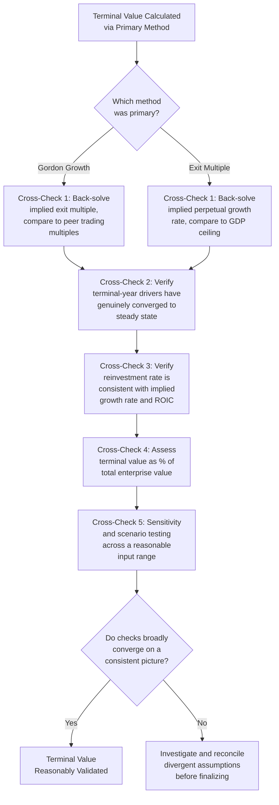

## Reasonableness-Checking Terminal Value Assumptions

### Definition and Conceptual Foundation

Reasonableness-checking is the disciplined process of validating terminal value assumptions against multiple independent cross-checks, rather than accepting the output of a single formula (Gordon Growth or exit multiple) at face value. Because the terminal value typically represents the majority of total enterprise value in most DCFs, and because its two dominant methodologies each carry a distinct, easily hidden failure mode, this validation step is not an optional add-on but a required part of responsible DCF construction.

**Key Points**

- No single terminal value method is self-validating — each requires an independent check drawn from a different analytical lens
- The goal is convergence: when multiple independent checks broadly agree, confidence in the terminal value increases; when they diverge sharply, the divergence itself is diagnostic and warrants investigation before finalizing the valuation
- This is fundamentally a triangulation exercise, not a search for a single "correct" number

---

### The Core Reasonableness-Checking Framework

---

### Cross-Check 1: Cross-Method Triangulation

As established in the prior two topics, the Gordon Growth method and the exit multiple method should be run **both**, with each method's output translated into the other method's terms for direct comparison.

- From Gordon Growth's terminal value, back-solve the implied EV/EBITDA (or relevant) multiple: $\text{Implied Multiple} = TV_n / EBITDA_n$
- From the exit multiple's terminal value, back-solve the implied perpetual growth rate: $g_{implied} = WACC - (FCF_n / TV_n)$, or more precisely accounting for the growth term

**Worked Example**

Continuing figures from the prior two topics: Gordon Growth produced $TV_5 \approx \$2,028.3$ million (implying an ~11.27x EV/EBITDA multiple against $180 million terminal EBITDA), while the exit multiple method using a 9.5x peer multiple produced $TV_5 = \$1,710$ million.

**Output**

The roughly 19% gap between these two independently-derived terminal values ($2,028.3 million vs. $1,710 million) is itself the key diagnostic output of this cross-check — it signals that either the Gordon Growth inputs (WACC, $g$) are more optimistic than what the market currently prices for comparable businesses, or the peer group's current 9.5x multiple reflects company or market circumstances not fully representative of the subject company's terminal-year profile. This gap should be investigated and, ideally, narrowed through refined assumptions before finalizing a terminal value conclusion — not silently accepted by picking whichever method's output is more convenient.

---

### Cross-Check 2: Terminal-Year Driver Convergence Verification

Revisit each key driver feeding the terminal-year cash flow and confirm each has genuinely reached a level defensible to sustain indefinitely — this directly connects to the convergence principle established in the explicit forecast period topics.

**Checklist**:

- Revenue growth rate ≤ terminal growth rate ceiling (GDP-based)
- Operating margin at a level consistent with long-run competitive dynamics for the industry, not still reflecting transitional expansion or unusual compression
- Capital intensity (capex relative to depreciation) consistent with the assumed growth rate, not merely mirroring a pure maintenance-capex assumption if $g > 0$
- Working capital as a percentage of revenue stabilized at a sustainable ratio
- Tax rate reflecting the steady-state marginal rate expected to prevail in perpetuity, including any known future statutory changes

**Key Points**

- A terminal value built on a formula that is mathematically correct but fed by an unconverged terminal-year cash flow will still be wrong — the formula's internal correctness does not validate the inputs feeding it
- This check requires revisiting the *entire* explicit period's fade path, not just inspecting the final year's figures in isolation, since an implausible final year often traces back to an implausible or insufficiently steep convergence trajectory earlier in the model

---

### Cross-Check 3: Reinvestment Rate and ROIC Consistency

As detailed in the prior topic on selecting a sustainable growth rate, verify that the terminal year's implied reinvestment rate is consistent with the relationship:

$$g = ROIC \times \text{Reinvestment Rate}$$

**Worked Example**

If the model's terminal-year growth rate is 3% and the model's own terminal-year figures imply a steady-state ROIC of 10%, the required reinvestment rate is:

$$\text{Reinvestment Rate} = \frac{3\%}{10\%} = 30\%$$

Check this against what the model's actual terminal-year capex and working capital assumptions imply as a percentage of NOPAT. A significant mismatch (e.g., the model's actual implied reinvestment rate is only 10%, well below the 30% required to sustain 3% growth at a 10% ROIC) signals an internal inconsistency that will overstate free cash flow and, by extension, terminal value.

---

### Cross-Check 4: Terminal Value as a Percentage of Total Enterprise Value

Calculate what share of total enterprise value the terminal value represents, and assess whether that share is reasonable given the length of the explicit forecast period and the nature of the business.

$$\text{TV Share} = \frac{PV(TV)}{PV(TV) + PV(\text{Explicit Period FCF})}$$

**[Inference]** As a general pattern, shorter explicit periods (5 years) tend to produce a higher terminal value share of total enterprise value (often 60%–80% or more, depending on growth and discount rate assumptions) than longer explicit periods (10 years), since a smaller portion of total value has been captured through explicit, more granular projection. Neither a high nor low terminal value share is inherently wrong, but an unusually high share (particularly alongside a short explicit period for a company far from its own steady state) should prompt scrutiny of whether the explicit period itself is long enough, per the forecast horizon topic, since a high terminal value dependency concentrates most of the valuation's total risk into the least scrutinized part of the model.

**Key Points**

- A very high terminal value share is not a red flag on its own — it is a normal and expected feature of most DCFs, especially for growth companies — but it does mean the terminal value assumptions deserve proportionally more analytical attention than their position at the "end" of the model might suggest
- Communicating this percentage explicitly to stakeholders (e.g., in a sensitivity table or summary slide) is good practice, since it transparently conveys how much of the total valuation conclusion rests on long-run, inherently more speculative assumptions versus near-term, more grounded projections

---

### Cross-Check 5: Sensitivity and Scenario Testing

Given the extreme sensitivity of terminal value to the WACC–$g$ spread (Gordon Growth) or to multiple selection (exit multiple method), a two-way sensitivity table across a reasonable range of each key input is standard practice for communicating the range of plausible outcomes, rather than presenting a single point estimate as if it were precise.

**Illustrative Sensitivity Table — Enterprise Value ($ millions) to WACC and Terminal Growth Rate**

| WACC \ g | 2.0% | 2.5% | 3.0% | 3.5% | 4.0% |
| --- | --- | --- | --- | --- | --- |
| 8.0% | 2,150 | 2,280 | 2,430 | 2,610 | 2,820 |
| 8.5% | 2,010 | 2,120 | 2,250 | 2,400 | 2,570 |
| 9.0% | 1,890 | 1,980 | 2,090 | 2,220 | 2,370 |
| 9.5% | 1,780 | 1,860 | 1,950 | 2,060 | 2,190 |

**[Speculation]** Illustrative figures for demonstration purposes only, not derived from a specific worked model; the actual magnitudes and sensitivity gradient would depend on the specific company's cash flow profile and discount rate.

**Key Points**

- Presenting a range (via sensitivity tables) rather than a single point estimate is generally considered more honest and more useful to decision-makers than a false-precision single number, especially given how much of the total valuation typically rests on the terminal value's inherently uncertain long-run assumptions
- Scenario testing (bull/base/bear cases with internally consistent sets of assumptions across growth, margin, and discount rate, rather than mechanically varying one input at a time) provides an additional, complementary layer of validation beyond a pure sensitivity table

---

### Assembling the Reasonableness-Check Summary

A well-documented DCF presents the results of these cross-checks together, allowing a reviewer to quickly assess overall confidence in the terminal value conclusion:

| Check | Result | Assessment |
| --- | --- | --- |
| Gordon Growth implied multiple vs. peer multiple | 11.27x implied vs. 9.5x peer median | Moderate divergence — investigate WACC/g inputs |
| Exit multiple implied growth rate vs. GDP ceiling | 2.1% implied vs. ~3.5%–4.0% ceiling | Comfortably within bounds |
| Terminal-year driver convergence | Margins and growth converged; capex slightly below implied reinvestment need | Minor inconsistency — revisit capex assumption |
| Reinvestment rate vs. required rate for assumed g | Implied 22% vs. required 30% | Inconsistency — capex/working capital assumptions likely need adjustment |
| Terminal value as % of total EV | 68% | Within normal range for a 5-year explicit period |
| Sensitivity range (WACC ±0.5%, g ±0.5%) | EV range of roughly $1,780M–$2,820M | Wide range — appropriately disclosed to stakeholders |

**Output**

This summary reveals that while most checks broadly support the terminal value conclusion, the reinvestment rate inconsistency identified in Cross-Check 3 warrants a specific model revision (adjusting terminal-year capex or working capital assumptions upward) before the valuation is finalized — illustrating how this process surfaces concrete, actionable corrections rather than simply producing a vague overall confidence score.

---

### Common Pitfalls

- **Running only one terminal value method** without a cross-check against the other, foregoing the most direct and informative validation available
- **Treating a wide divergence between Gordon Growth and exit multiple results as acceptable** without investigating and attempting to reconcile the underlying cause
- **Checking the terminal growth rate against the GDP ceiling but neglecting the reinvestment rate consistency check**, which can reveal an internal inconsistency the growth-rate check alone would miss
- **Presenting a single point-estimate terminal value to stakeholders** without accompanying sensitivity analysis, implying false precision
- **Treating a high terminal value share of total enterprise value as inherently suspicious**, when it is a normal feature of DCF mathematics that instead calls for proportionally greater assumption scrutiny, not automatic rejection
- **Performing reasonableness checks only after the model is otherwise "complete,"** rather than integrating them as a standard, required step in the model-building process itself

---

**Related Topics**

- Gordon Growth Perpetuity Method
- Exit Multiple Method
- Selecting a Sustainable Long-Term Growth Rate
- Determining an Appropriate Forecast Horizon
- Return on Invested Capital (ROIC) and the Reinvestment Rate Relationship
- Terminal Value Sensitivity Analysis and Scenario Testing
- Structuring the Explicit Forecast Period
- Building an Auditable DCF Model: Structure and Layout Best Practices