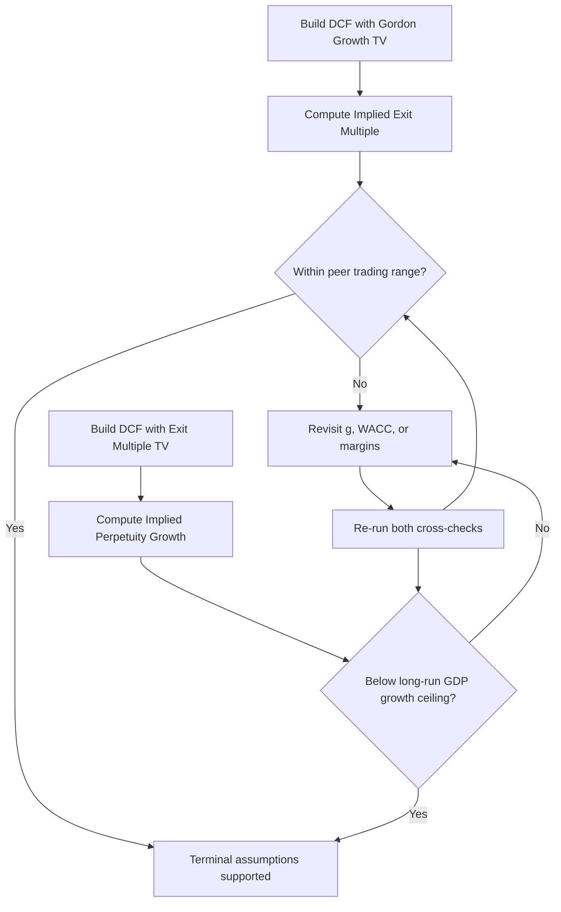

## Implied Multiple and Implied Growth Rate Cross-Checks

### Purpose and Rationale

Terminal value (TV) typically represents 60–80% of total enterprise value in a standard DCF, which makes it the single largest source of valuation error. Cross-checking the terminal value assumption from multiple angles guards against silently embedding an unreasonable assumption inside a formula that otherwise looks correct.

Two terminal value methods exist, and each can be cross-checked against the other:

- **Gordon Growth Method (Perpetuity Growth)**: $TV_n = \dfrac{FCF_{n+1}}{r-g}$
- **Exit Multiple Method**: $TV_n = Metric_n \times Multiple$

The cross-check discipline works in both directions:

1. **Implied Exit Multiple** — derived from a Gordon Growth terminal value, then compared to observed trading/transaction multiples.
2. **Implied Perpetuity Growth Rate** — derived from an Exit Multiple terminal value, then compared to reasonable long-run macroeconomic growth bounds.

If either implied figure falls outside a defensible range, the underlying assumption ($g$, $r$, or the multiple itself) requires revisiting.

### Implied Exit Multiple from Perpetuity Growth

**Key Points**

- Converts a Gordon Growth TV into an EV/EBITDA (or similar) multiple so it can be benchmarked against market comparables.
- Formula: $$\text{Implied Multiple} = \dfrac{TV_n}{Metric_n}$$
- Where $TV_n = \dfrac{FCF_{n+1}}{r-g}$ and $Metric_n$ is typically EBITDA in the terminal year.

**Derivation**

Starting from the Gordon Growth terminal value and expressing it as a multiple of EBITDA:

$$\text{Implied EV/EBITDA} = \dfrac{FCF_{n+1}}{(r-g) \times EBITDA_n}$$

Since $FCF_{n+1}$ can be decomposed as $EBITDA_{n+1} \times (\text{FCF conversion \%})$, adjusted for taxes, capex, and working capital, the implied multiple is sensitive to the terminal-year margin structure and reinvestment intensity, not just $r$ and $g$.

**Example**

Assume:

- Terminal year EBITDA ($EBITDA_n$) = $500M
- Terminal year unlevered FCF ($FCF_n$) = $300M
- Perpetuity growth rate ($g$) = 2.5%
- WACC ($r$) = 9.0%

Step 1 — Terminal year + 1 FCF:

$$FCF_{n+1} = 300 \times (1 + 0.025) = 307.5$$

Step 2 — Terminal value:

$$TV_n = \dfrac{307.5}{0.09 - 0.025} = \dfrac{307.5}{0.065} = 4{,}730.8$$

Step 3 — Implied EV/EBITDA multiple:

$$\dfrac{4{,}730.8}{500} = 9.46x$$

**Interpretation**: If comparable companies in this sector trade at 6.5x–7.5x EV/EBITDA, a 9.46x implied multiple signals the DCF's growth/discount rate combination is too aggressive — either $g$ is too high, $r$ is too low, or terminal-year margins are overstated relative to the peer set.

### Implied Perpetuity Growth Rate from Exit Multiple

**Key Points**

- Reverses the process: takes an exit multiple TV and solves for the $g$ that would make the Gordon Growth formula produce the same value.
- Formula, solving $TV_n = \dfrac{FCF_{n+1}}{r-g}$ for $g$:

$$g = r - \dfrac{FCF_{n+1}}{TV_n}$$

Since $FCF_{n+1} = FCF_n \times (1+g)$, this requires either an iterative solve or a simplifying approximation using $FCF_n$ directly, then refining.

**Example**

Assume:

- Terminal year EBITDA = $500M
- Exit multiple = 8.0x EV/EBITDA (drawn from precedent transactions)
- Terminal year FCF ($FCF_n$) = $300M
- WACC ($r$) = 9.0%

Step 1 — Terminal value from exit multiple:

$$TV_n = 500 \times 8.0 = 4{,}000$$

Step 2 — First-pass implied growth (using $FCF_n$ as approximation):

$$g \approx 0.09 - \dfrac{300}{4{,}000} = 0.09 - 0.075 = 0.015 \ (1.5\%)$$

Step 3 — Refine using $FCF_{n+1} = 300 \times 1.015 = 304.5$:

$$g = 0.09 - \dfrac{304.5}{4{,}000} = 0.09 - 0.076 = 0.014 \ (1.4\%)$$

Iterating once more converges quickly since the FCF adjustment is small relative to $r$.

**Interpretation**: An implied growth rate of ~1.4% is conservative relative to typical long-run nominal GDP growth assumptions (commonly 2–4% for developed markets), which would generally be viewed as reasonable or even conservative. An implied $g$ above long-run nominal GDP growth is a red flag, since no company can outgrow the aggregate economy in perpetuity without an ever-increasing market share [Inference: the theoretical ceiling; practical analyst thresholds vary by firm and industry].

### Reasonable Range Benchmarks

| Cross-Check | Typical Sanity Range | Red Flag Threshold |
| --- | --- | --- |
| Implied perpetuity growth ($g$) | 2.0%–3.5% (developed markets, nominal) | $g$ > long-run nominal GDP growth |
| Implied EV/EBITDA multiple | Within ±1.0x–1.5x of current trading comps | Implied multiple materially exceeds peer max |
| Implied EV/EBIT or P/E | Consistent with sector historical average | Implied multiple exceeds sector 75th percentile |

These ranges are **[Unverified]** as universal constants — they are commonly cited practitioner heuristics rather than fixed rules, and appropriate bounds vary by sector growth profile, geography, and prevailing interest rate regime.

### Why Discrepancies Arise

**Key Points**

- **Mismatched terminal-year normalization**: if the terminal year FCF or EBITDA reflects an unusually high or low margin (due to a one-off capex cycle, working capital swing, or cyclicality), both cross-checks will be distorted even if $r$ and $g$ are individually reasonable.
- **WACC misspecification**: an understated $r$ inflates both TV and, consequently, the implied multiple.
- **Multiple selection bias**: exit multiples drawn from a small precedent transaction set may reflect deal-specific control premiums or synergies not applicable to the standalone DCF.
- **Growth/reinvestment inconsistency**: a terminal $g$ that isn't matched by a consistent reinvestment rate (via the sustainable growth relationship $g = ROIC \times \text{Reinvestment Rate}$) creates an internally inconsistent FCF trajectory.

### Sustainable Growth Consistency Check

A supplementary cross-check ties $g$ to terminal-year return on invested capital (ROIC) and reinvestment rate:

$$g = ROIC \times RR$$

where $RR$ is the reinvestment rate (capex + ΔNWC – D&A, net of tax effects, divided by NOPAT).

**Example**: If terminal ROIC = 12% and implied $g$ = 3%, the required reinvestment rate is:

$$RR = \dfrac{g}{ROIC} = \dfrac{0.03}{0.12} = 25\%$$

If the model's terminal-year reinvestment assumptions imply a materially different RR (e.g., 40%), the model has an internal inconsistency between its growth assumption and its capital allocation assumption that should be reconciled.

### Process Flow for the Cross-Check

### Visual: Cross-Check Relationship

<svg xmlns="http://www.w3.org/2000/svg" viewBox="0 0 700 320" font-family="Arial, sans-serif">
<text x="350" y="25" font-size="16" font-weight="bold" text-anchor="middle">Implied Multiple / Implied Growth Cross-Check (svg_diagram)</text>
<rect x="30" y="60" width="260" height="90" rx="8" fill="#e8f0fe" stroke="#4a6fa5" stroke-width="1.5" />
<text x="160" y="90" font-size="13" font-weight="bold" text-anchor="middle">Gordon Growth TV</text>
<text x="160" y="112" font-size="12" text-anchor="middle">TV = FCF(n+1) / (r - g)</text>
<text x="160" y="132" font-size="11" text-anchor="middle" fill="#555">Inputs: r, g, FCF</text>
<rect x="410" y="60" width="260" height="90" rx="8" fill="#fdece8" stroke="#a5624a" stroke-width="1.5" />
<text x="540" y="90" font-size="13" font-weight="bold" text-anchor="middle">Exit Multiple TV</text>
<text x="540" y="112" font-size="12" text-anchor="middle">TV = Metric x Multiple</text>
<text x="540" y="132" font-size="11" text-anchor="middle" fill="#555">Inputs: EBITDA, Multiple</text>
<line x1="290" y1="105" x2="410" y2="105" stroke="#333" stroke-width="1.5" marker-end="url(#arrow)" />
<line x1="410" y1="130" x2="290" y2="130" stroke="#333" stroke-width="1.5" marker-end="url(#arrow)" />
<text x="350" y="98" font-size="10" text-anchor="middle">solve for Multiple</text>
<text x="350" y="147" font-size="10" text-anchor="middle">solve for g</text>
<rect x="80" y="200" width="220" height="70" rx="8" fill="#eef7ea" stroke="#5a8a4a" stroke-width="1.5" />
<text x="190" y="225" font-size="12" font-weight="bold" text-anchor="middle">Compare to Trading</text>
<text x="190" y="242" font-size="12" font-weight="bold" text-anchor="middle">Comps / Precedents</text>
<text x="190" y="258" font-size="10" text-anchor="middle" fill="#555">6.5x - 7.5x range example</text>
<rect x="400" y="200" width="220" height="70" rx="8" fill="#eef7ea" stroke="#5a8a4a" stroke-width="1.5" />
<text x="510" y="225" font-size="12" font-weight="bold" text-anchor="middle">Compare to Long-Run</text>
<text x="510" y="242" font-size="12" font-weight="bold" text-anchor="middle">GDP Growth Ceiling</text>
<text x="510" y="258" font-size="10" text-anchor="middle" fill="#555">~2% - 4% nominal</text>
<line x1="160" y1="150" x2="190" y2="200" stroke="#333" stroke-width="1.5" marker-end="url(#arrow)" />
<line x1="540" y1="150" x2="510" y2="200" stroke="#333" stroke-width="1.5" marker-end="url(#arrow)" />
</svg>

### Common Pitfalls

- Treating the implied multiple/growth check as a one-time validation rather than re-running it after every sensitivity table change.
- Using stale or overly broad comparable sets (e.g., global peers for a domestic-only business) that widen the "reasonable range" until the check becomes meaningless.
- Ignoring the interaction between $r$ and $g$: a small change in either variable has a nonlinear effect on TV as $(r - g)$ approaches zero, so the implied multiple check becomes especially critical when the spread is narrow (below ~4–5 percentage points).
- Forgetting to normalize the terminal-year metric for one-time items before computing the implied multiple, which distorts the comparison to clean trading comps.

### Next Steps

- **Terminal Value Sensitivity Tables** (two-way data tables on $r$ and $g$)
- **Sustainable Growth Rate and ROIC-Driven Terminal Value**
- **Mid-Year Convention Adjustments to Terminal Value**
- **Fade Period / Explicit Convergence to Terminal Growth**
- **Selecting Defensible WACC and Terminal Growth Assumptions**
- **Terminal Value as % of Enterprise Value Diagnostic**