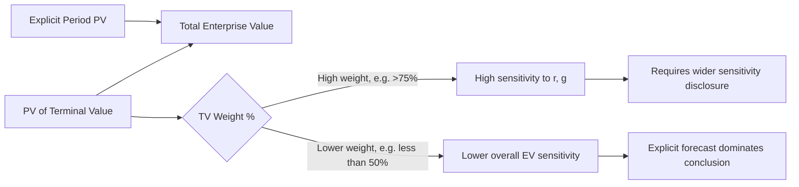

## Terminal Value Sensitivity and Weight in Total Value

### Overview and Significance

Terminal value (TV) commonly accounts for 60–80% of total enterprise value in a DCF with a 5–10 year explicit forecast period, which means the valuation's conclusion is disproportionately dependent on assumptions that apply to a single, highly compressed calculation rather than the detailed year-by-year forecast. Understanding both the *magnitude* of TV's weight and its *sensitivity* to key inputs is essential to assessing how much confidence the overall valuation deserves.

Two distinct but related analyses are covered here:

1. **Weight analysis** — quantifying what percentage of enterprise value comes from TV versus the explicit forecast period.
2. **Sensitivity analysis** — quantifying how much TV (and thus EV) changes in response to small changes in WACC ($r$), perpetuity growth ($g$), or exit multiple.

### Computing Terminal Value Weight

**Key Points**

- Formula: $$\text{TV Weight %} = \dfrac{PV(TV)}{EV}$$
- $PV(TV)$ is the terminal value discounted back to present value at $r$ over $n$ periods: $PV(TV) = \dfrac{TV_n}{(1+r)^n}$
- $EV = PV(\text{Explicit FCFs}) + PV(TV)$

**Example**

Assume a 5-year explicit forecast with:

- Sum of PV of explicit-period FCFs = $420M
- Terminal value at year 5 ($TV_5$) = $4,200M
- WACC ($r$) = 9.0%

Step 1 — Discount factor for year 5:

$$\dfrac{1}{(1.09)^5} = 0.6499$$

Step 2 — PV of terminal value:

$$PV(TV) = 4{,}200 \times 0.6499 = 2{,}729.6$$

Step 3 — Total enterprise value:

$$EV = 420 + 2{,}729.6 = 3{,}149.6$$

Step 4 — TV weight:

$$\dfrac{2{,}729.6}{3{,}149.6} = 86.7\%$$

**Interpretation**: With 86.7% of value derived from TV, this valuation is highly dependent on long-run assumptions ($r$, $g$, or exit multiple) rather than the near-term forecast that analysts can underwrite with more confidence. A weight this high (>85%) typically signals either a very long-duration growth story or an unusually short explicit forecast period, and warrants extending the forecast horizon or applying heavier sensitivity scrutiny.

### Drivers of TV Weight

**Key Points**

- **Length of explicit forecast period**: longer forecasts (10+ years) mechanically reduce TV weight since more value is captured in discounted explicit cash flows.
- **WACC level**: higher $r$ discounts both explicit FCFs and TV, but compounds more heavily against TV since it sits further in the future — this can reduce absolute TV weight in percentage terms even though $(r-g)$ also shrinks TV's undiscounted value.
- **Growth trajectory**: companies with high near-term growth that fades to a stable terminal rate tend to show lower TV weight than steady, low-growth businesses, because more value is realized in the explicit period.
- **FCF conversion pattern**: businesses with heavy near-term capex (e.g., building out capacity) that normalizes by the terminal year push more value into TV.

### Sensitivity of Terminal Value to WACC and Growth Rate

**Key Points**

- Because $TV = \dfrac{FCF_{n+1}}{r-g}$, TV is a nonlinear (hyperbolic) function of both $r$ and $g$ — sensitivity increases sharply as the spread $(r-g)$ narrows.
- Partial derivatives illustrate the sensitivity direction and magnitude:

$$\dfrac{\partial TV}{\partial g} = \dfrac{FCF_{n+1}}{(r-g)^2} > 0$$

$$\dfrac{\partial TV}{\partial r} = \dfrac{-FCF_{n+1}}{(r-g)^2} < 0$$

Both derivatives share the same $(r-g)^2$ denominator, which is why TV sensitivity accelerates disproportionately as $r$ and $g$ converge.

**Example: Two-Way Sensitivity Table**

Using $FCF_{n+1} = \$307.5M$ (as in the prior terminal-year example):

| WACC \ Growth | 1.5% | 2.0% | 2.5% | 3.0% | 3.5% |
| --- | --- | --- | --- | --- | --- |
| 8.0% | 4,731 | 5,125 | 5,614 | 6,244 | 7,105 |
| 8.5% | 4,269 | 4,577 | 4,957 | 5,441 | 6,076 |
| 9.0% | 3,900 | 4,140 | 4,433 | 4,800 | 5,271 |
| 9.5% | 3,594 | 3,781 | 4,013 | 4,304 | 4,672 |
| 10.0% | 3,346 | 3,500 | 3,679 | 3,893 | 4,150 |

*(All figures in $M, computed as $FCF_{n+1}/(r-g)$; small rounding may vary.)*

**Interpretation**: Moving from $r=9.0\%/g=2.5\%$ (TV ≈ $4,433M) to $r=8.5\%/g=3.0\%$ (TV ≈ $5,441M) — a combined 100bp shift in favorable direction — increases TV by roughly 23%. This magnitude of swing from modest assumption changes is precisely why sensitivity tables, not single-point estimates, are the appropriate way to present TV-driven valuations.

### Sensitivity Under the Exit Multiple Method

Exit multiple TV sensitivity is more linear and generally lower in magnitude than Gordon Growth sensitivity, since:

$$TV_n = Metric_n \times Multiple$$

is a simple linear product rather than a hyperbolic function. A 0.5x change in exit multiple produces a proportionally consistent change in TV regardless of the starting multiple, unlike the accelerating sensitivity near the $(r-g)$ asymptote in Gordon Growth.

**Example**

With terminal EBITDA = $500M:

| Exit Multiple | Implied TV ($M) |
| --- | --- |
| 7.0x | 3,500 |
| 7.5x | 3,750 |
| 8.0x | 4,000 |
| 8.5x | 4,250 |
| 9.0x | 4,500 |

Each 0.5x increment adds a constant $250M — a linear, easily interpretable relationship compared to the Gordon Growth table above.

### EV Sensitivity (Not Just TV Sensitivity)

**Key Points**

- TV sensitivity does not translate 1:1 into EV sensitivity, since TV must first be discounted to present value, and explicit-period FCFs act as a stabilizing base.
- $$\Delta EV \% = \Delta TV\% \times \text{TV Weight \%}$$

**Example**: If TV increases by 23% (per the table above) and TV weight is 86.7%, the resulting EV increase is approximately:

$$23\% \times 86.7\% \approx 19.9\%$$

This scaling relationship is why disclosing TV weight alongside sensitivity tables gives a more complete picture than either metric in isolation — a high TV sensitivity with low TV weight is far less consequential than the reverse.

### Visualizing the Weight and Sensitivity Relationship

### Visual: TV Weight vs. Forecast Horizon

<svg xmlns="http://www.w3.org/2000/svg" viewBox="0 0 700 350" font-family="Arial, sans-serif">
<text x="350" y="25" font-size="16" font-weight="bold" text-anchor="middle">Terminal Value Weight vs. Explicit Forecast Length (svg_diagram)</text>
<line x1="70" y1="300" x2="650" y2="300" stroke="#333" stroke-width="1.5" />
<line x1="70" y1="300" x2="70" y2="50" stroke="#333" stroke-width="1.5" />
<text x="360" y="330" font-size="12" text-anchor="middle">Explicit Forecast Length (Years)</text>
<text x="30" y="180" font-size="12" text-anchor="middle" transform="rotate(-90 30 180)">TV Weight (%)</text>

<text x="70" y="315" font-size="10" text-anchor="middle">3</text>

<text x="215" y="315" font-size="10" text-anchor="middle">5</text>

<text x="360" y="315" font-size="10" text-anchor="middle">7</text>

<text x="505" y="315" font-size="10" text-anchor="middle">10</text>

<text x="650" y="315" font-size="10" text-anchor="middle">15</text>

<text x="60" y="295" font-size="10" text-anchor="end">40%</text>

<text x="60" y="220" font-size="10" text-anchor="end">60%</text>

<text x="60" y="145" font-size="10" text-anchor="end">80%</text>

<text x="60" y="70" font-size="10" text-anchor="end">95%</text>

<polyline points="70,80 215,110 360,150 505,205 650,270" fill="none" stroke="#a5624a" stroke-width="2.5" />
<circle cx="70" cy="80" r="4" fill="#a5624a" />
<circle cx="215" cy="110" r="4" fill="#a5624a" />
<circle cx="360" cy="150" r="4" fill="#a5624a" />
<circle cx="505" cy="205" r="4" fill="#a5624a" />
<circle cx="650" cy="270" r="4" fill="#a5624a" />

<text x="700" y="80" font-size="10" text-anchor="end" fill="`#a5624a`" />

<text x="360" y="180" font-size="11" fill="#555">Illustrative trend: longer explicit</text>

<text x="360" y="195" font-size="11" fill="#555">horizon reduces TV's share of EV</text>

</svg>

*[Inference: the exact shape and slope of this curve is company-specific, driven by growth trajectory and margin normalization timing — the illustration shows the general directional relationship rather than a precise universal function.]*

### Practical Guidelines for Managing High TV Weight

- **Extend the explicit forecast** to 10+ years for high-growth or long-duration businesses so more value is captured in a more granular, defensible forecast rather than a single terminal formula.
- **Present a sensitivity table, not a point estimate** — disclosing EV across a grid of $r$ and $g$ (or exit multiples) is standard practice precisely because of the magnification effect demonstrated above.
- **Cross-check with the implied multiple / implied growth methodology** (see prior section) to bound the terminal assumption independently of the DCF's internal mechanics.
- **Flag TV weight explicitly in valuation memos** — a TV weight above ~75–80% should prompt additional scrutiny disclosure to any reader relying on the output.
- **Consider a three-stage or fade model** (high growth → transitional fade → stable terminal growth) to smooth the transition and reduce the discontinuity between explicit and terminal assumptions.

### Common Pitfalls

- Presenting a single EV output without disclosing TV weight, which obscures how much of the conclusion rests on assumptions with (r−g)² sensitivity.
- Using a short explicit period (e.g., 3 years) for a business still in a high-growth phase, artificially inflating TV weight and sensitivity.
- Running sensitivity tables only on TV in isolation without translating to EV impact, overstating the perceived risk when TV weight is actually low.
- Failing to sensitize the exit multiple method with the same rigor as Gordon Growth, under the mistaken assumption that multiples are inherently "safer" simply because they avoid the $(r-g)$ term.

### Next Steps

- **Fade Period / Explicit Convergence to Terminal Growth**
- **Implied Multiple and Implied Growth Rate Cross-Checks** (complementary diagnostic)
- **Multi-Stage DCF Models (Two-Stage and Three-Stage Growth)**
- **Monte Carlo and Scenario-Based Terminal Value Analysis**
- **Presenting DCF Outputs: Football Field and Sensitivity Tables**