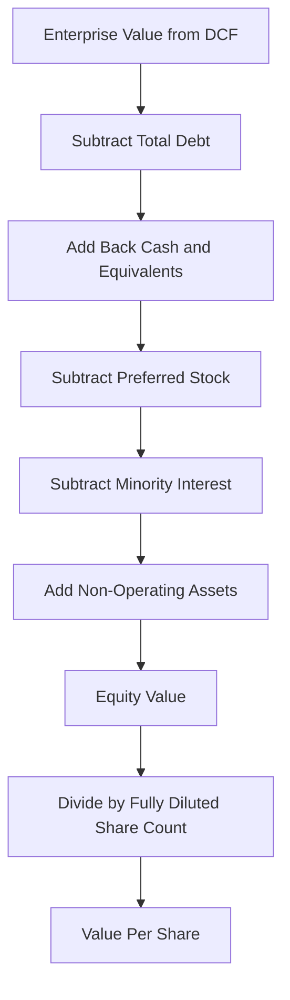

## The Enterprise-to-Equity Value Bridge

### Conceptual Overview

Enterprise value (EV) represents the value of a company's core operating business, attributable to all capital providers (debt and equity holders alike), independent of how that business happens to be financed. Equity value represents the residual value attributable specifically to common shareholders. The "bridge" is the set of adjustments that reconciles the two, and it is arguably as important to get right as the DCF forecast itself — a well-built cash flow model can still produce a materially wrong per-share price if the bridge is constructed incorrectly.

**Key Points**

- $$\text{Equity Value} = \text{Enterprise Value} - \text{Net Debt} - \text{Other Claims Senior to Equity} + \text{Non-Operating Assets}$$
- The bridge must use **balance sheet items as of the valuation date**, not the last reported period, when precision matters (e.g., in M&A contexts).
- Every adjustment should be evaluated for whether it is (a) already captured in the projected free cash flows, and (b) a claim that ranks ahead of or alongside common equity.

### The Core Bridge Formula

$$\text{Equity Value} = EV - \text{Total Debt} - \text{Preferred Stock} - \text{Minority Interest} + \text{Cash \& Equivalents} + \text{Other Non-Operating Assets}$$

This is commonly compressed to:

$$\text{Equity Value} = EV - \text{Net Debt} - \text{Preferred Stock} - \text{Minority Interest} + \text{Non-Operating Assets}$$

where $\text{Net Debt} = \text{Total Debt} - \text{Cash \& Equivalents}$.

### Standard Bridge Components

**Key Points**

| Item | Treatment | Rationale |
| --- | --- | --- |
| Total Debt | Subtract | Debt is a senior claim on EV before equity |
| Cash & Equivalents | Add back | Cash is not needed to fund operations captured in FCF; it belongs to equity holders |
| Short-term Investments | Add back | Non-operating, liquid, equity-attributable |
| Preferred Stock | Subtract | Senior claim to common equity, even if not classified as "debt" |
| Minority (Non-Controlling) Interest | Subtract | Represents the portion of a consolidated subsidiary's equity value not owned by the parent |
| Equity Investments / Associates (non-consolidated) | Add | Value of stakes in other companies not reflected in consolidated operating cash flows |
| Operating Leases (post-ASC 842 / IFRS 16) | Context-dependent | Treatment depends on whether lease liabilities are treated as debt-like in the EV definition used |
| Underfunded Pension Obligations | Subtract | Debt-like claim representing a legal obligation senior to equity |
| Litigation Reserves / Contingent Liabilities | Subtract (if material and probable) | Represents a claim reducing value available to equity |

### Detailed Treatment of Each Adjustment

**Cash and Cash Equivalents**

Only cash genuinely surplus to operating needs should be added back at full value. Some practitioners distinguish between "operating cash" (required for day-to-day liquidity, sometimes estimated as a percentage of revenue) and "excess cash" (freely distributable), adding back only the latter at full value while treating operating cash as embedded in the business. In most standard DCF bridges, however, all cash and equivalents are added back in full for simplicity, with the operating-cash distinction reserved for more granular or private-company analyses [Inference: practice varies by firm and by whether cash is genuinely excess vs. required for working capital].

**Debt**

All interest-bearing obligations are included: revolvers, term loans, senior notes, subordinated debt, and capital lease obligations. Debt should be valued at **fair value**, not book value, when a material difference exists (e.g., debt trading significantly below par due to credit deterioration, or fixed-rate debt whose market value has diverged from book value due to interest rate movements). In practice, book value is commonly used as a reasonable proxy absent evidence of material divergence.

**Minority Interest (Non-Controlling Interest, NCI)**

When a company consolidates a subsidiary in which it owns less than 100%, 100% of that subsidiary's cash flows and EBITDA typically flow into the consolidated financials and therefore into the EV/DCF valuation. Since the projected free cash flows already capture the minority shareholders' share of value, that share must be subtracted from EV to isolate value attributable to the parent's common shareholders. Minority interest is typically valued at fair value (implied by an EV/EBITDA multiple applied to the subsidiary) rather than book value, since book value can significantly understate fair value for growing subsidiaries.

**Preferred Stock**

Preferred equity ranks senior to common equity in both dividends and liquidation, so it is subtracted from EV before arriving at common equity value. Preferred stock should be valued at:

- **Redemption/liquidation value** if callable near-term or mandatorily redeemable.
- **Market value** if publicly traded.
- **Present value of preferred dividends plus redemption value**, discounted at the preferred's required yield, if neither of the above applies.

**Non-Operating Assets**

Any asset not reflected in the projected operating free cash flows must be added separately, since the DCF would otherwise omit its value entirely. Common examples include unconsolidated equity investments/associates, excess real estate not used in operations, and net operating loss (NOL) carryforwards (valued as the present value of the tax shield they provide).

### Worked Example

Assume a DCF produces:

- Enterprise Value = $3,150M

Balance sheet as of the valuation date:

- Total Debt = $620M
- Cash & Equivalents = $180M
- Preferred Stock (liquidation value) = $75M
- Minority Interest (fair value) = $110M
- Equity Investment in a non-consolidated JV = $40M

Step 1 — Net debt:

$$\text{Net Debt} = 620 - 180 = 440$$

Step 2 — Equity value:

$$\text{Equity Value} = 3{,}150 - 440 - 75 - 110 + 40 = 2{,}565$$

Step 3 — Per-share value (assuming 100M diluted shares outstanding):

$$\dfrac{2{,}565}{100} = \$25.65 \text{ per share}$$

### Diluted Share Count Considerations

**Key Points**

- Equity value must be divided by a **fully diluted share count**, not basic shares outstanding, to arrive at per-share value.
- The Treasury Stock Method (TSM) is the standard approach for in-the-money stock options and warrants: proceeds from assumed option exercise are used to repurchase shares at the current market price, and only the net incremental shares are added to the share count.
- Convertible debt/preferred is included on an as-converted basis if in-the-money (conversion value exceeds the value of holding the instrument as debt/preferred); otherwise, it remains in the debt/preferred bridge line as-is (the "if-converted method," applied on a security-by-security basis, comparing as-converted value against as-is value).
- Restricted stock units (RSUs) are generally added to the share count in full (no proceeds assumption), since they typically have no exercise price.

**Example (TSM)**

Assume:

- Options outstanding: 5M, weighted-average strike price = $18
- Current share price: $25.65 (from the bridge above)

Step 1 — Proceeds from exercise:

$$5M \times \$18 = \$90M$$

Step 2 — Shares repurchased at current price:

$$\dfrac{\$90M}{\$25.65} = 3.51M$$

Step 3 — Net incremental dilutive shares:

$$5M - 3.51M = 1.49M$$

This circularity (share price depends on diluted count, which depends on share price) is typically resolved iteratively or via a closed-form TSM formula in practice; spreadsheet models often use iterative calculation settings or a direct algebraic solve.

### Bridge Direction: Equity-to-Enterprise (Reverse Bridge)

The same logic runs in reverse when starting from a known equity value (e.g., a public company's market capitalization) to derive implied EV — commonly used when computing trading multiples for comparable company analysis:

$$EV = \text{Market Cap} + \text{Net Debt} + \text{Preferred Stock} + \text{Minority Interest} - \text{Non-Operating Assets}$$

This reverse bridge is the standard mechanism for converting observed equity market capitalization into EV for calculating EV/EBITDA, EV/EBIT, and similar multiples used in comparable company analysis and precedent transactions.

### Process Flow

### Visual: Bridge Waterfall

<svg xmlns="http://www.w3.org/2000/svg" viewBox="0 0 750 380" font-family="Arial, sans-serif">
<text x="375" y="25" font-size="16" font-weight="bold" text-anchor="middle">Enterprise Value to Equity Value Bridge (svg_diagram)</text>
<line x1="50" y1="330" x2="720" y2="330" stroke="#333" stroke-width="1" />
<rect x="60" y="80" width="80" height="250" fill="#4a6fa5" />
<text x="100" y="345" font-size="11" text-anchor="middle">EV</text>
<text x="100" y="70" font-size="11" text-anchor="middle">3,150</text>
<rect x="160" y="255" width="80" height="75" fill="#c0504d" />
<text x="200" y="345" font-size="10" text-anchor="middle">- Debt</text>
<text x="200" y="245" font-size="10" text-anchor="middle">(620)</text>
<rect x="260" y="180" width="80" height="75" fill="#70a54a" />
<text x="300" y="345" font-size="10" text-anchor="middle">+ Cash</text>
<text x="300" y="170" font-size="10" text-anchor="middle">180</text>
<rect x="360" y="205" width="80" height="30" fill="#c0504d" />
<text x="400" y="345" font-size="10" text-anchor="middle">- Pref.</text>
<text x="400" y="195" font-size="10" text-anchor="middle">(75)</text>
<rect x="460" y="150" width="80" height="55" fill="#c0504d" />
<text x="500" y="345" font-size="10" text-anchor="middle">- NCI</text>
<text x="500" y="140" font-size="10" text-anchor="middle">(110)</text>
<rect x="560" y="130" width="80" height="20" fill="#70a54a" />
<text x="600" y="345" font-size="10" text-anchor="middle">+ Equity Inv.</text>
<text x="600" y="120" font-size="10" text-anchor="middle">40</text>
<rect x="660" y="60" width="80" height="270" fill="#e0a030" />
<text x="700" y="345" font-size="11" text-anchor="middle">Equity Value</text>
<text x="700" y="50" font-size="11" text-anchor="middle">2,565</text>
</svg>

### Common Pitfalls

- Using **book value of debt** without checking for material fair value divergence in distressed or high-rate-sensitivity scenarios.
- Forgetting to subtract **minority interest** when a subsidiary is consolidated at 100% of cash flows but not 100% owned — this is one of the most common bridge errors and materially overstates equity value.
- Applying the **basic share count** instead of fully diluted shares, overstating per-share value.
- Double-counting or omitting items already embedded in the FCF forecast — e.g., adding back an asset whose income is already reflected in projected EBITDA.
- Using **stale balance sheet data** (e.g., prior fiscal year-end) in an M&A or transaction context where debt and cash may have moved materially by the valuation/closing date.
- Ignoring **operating lease liabilities** as debt-like items when the EV definition used elsewhere in the analysis (e.g., in comparable company multiples) treats them as debt.

### Next Steps

- **Treasury Stock Method and Diluted Share Count Mechanics**
- **Valuing Convertible Securities (As-Converted vs. As-Is)**
- **Net Debt vs. Adjusted Net Debt (Operating Leases, Pensions)**
- **From Equity Value to Per-Share Value: Circularity and Iterative Solves**
- **Comparable Company Analysis: Converting Market Cap to EV**