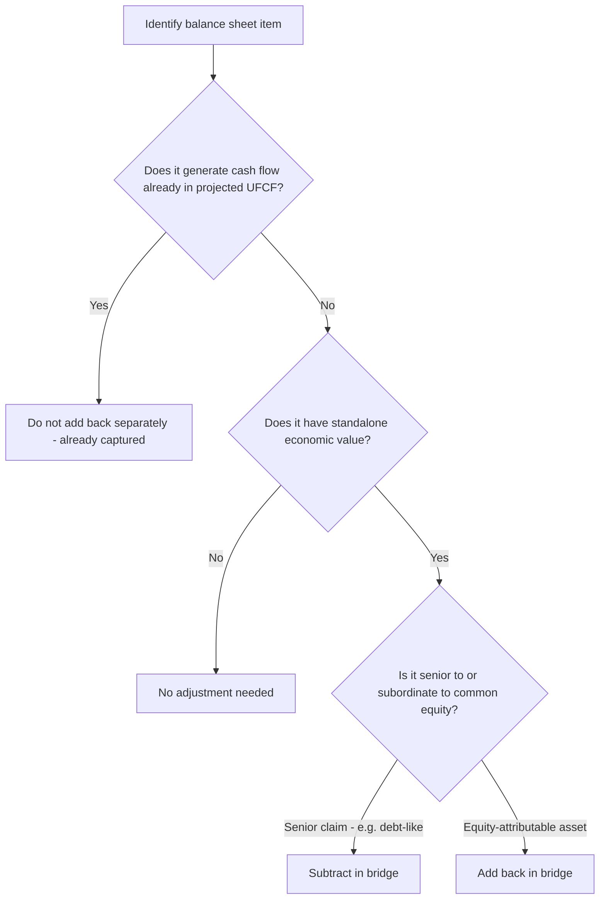

## Treatment of Cash and Non-Operating Assets

### Conceptual Foundation

The unlevered free cash flow (UFCF) projected in a DCF captures only the cash generated by **core operating activities**. Any asset that sits on the balance sheet but does not contribute to those projected operating cash flows is, by construction, invisible to the DCF's enterprise value output. If such an asset has value, it must be added back separately in the enterprise-to-equity bridge — otherwise the valuation understates what shareholders actually own.

**Key Points**

- The governing test for any balance sheet item: *is its value already reflected in the projected UFCF?* If no, and it has value, add it back. If yes, do not double-count it.
- Cash is the most common and most consequential non-operating asset adjustment, but it is far from the only one.
- Non-operating assets are added **after** arriving at enterprise value, as part of the bridge to equity value — never embedded into the DCF's discount rate or growth assumptions.

### Cash and Cash Equivalents

**Operating Cash vs. Excess Cash**

Not all cash is created equal for valuation purposes:

- **Operating (minimum) cash**: the cash balance a business needs on hand to fund day-to-day operations, meet payroll, and manage working capital timing gaps. This is genuinely "tied up" in the business.
- **Excess (non-operating) cash**: cash beyond what is operationally necessary, freely available for distribution, debt paydown, or reinvestment without disrupting operations.

**Key Points**

- The simplified, most common approach in standard DCF practice: add back **100% of cash and equivalents** at full value, treating all cash as non-operating. This is defensible when the analysis is not seeking sub-dollar precision.
- The more refined approach: estimate operating cash as a percentage of revenue (commonly cited heuristics range from 1–5% of revenue depending on industry working-capital intensity [Unverified: firm- and sector-specific]) and treat only the residual as excess cash added at full value.
- The refined approach matters most in **leveraged buyout analysis, credit analysis, or industries with large cash balances relative to operations** (e.g., technology companies with large net cash positions), where the distinction can meaningfully affect equity value per share.

**Example**

A company holds $500M in cash and equivalents. Analysts estimate operating cash needs at 2% of $4,000M revenue = $80M.

- Simplified approach: add back full $500M.
- Refined approach: add back $500M, but flag $80M as operationally required (relevant mainly for liquidity/covenant analysis rather than changing the equity bridge add-back itself, since even "operating" cash still legally belongs to shareholders — the distinction is more relevant for LBO debt capacity analysis than for standard DCF equity value).

**Restricted Cash**

Cash restricted by covenant, escrow, or regulatory requirement (e.g., cash held against insurance reserves, or cash in an escrow account tied to litigation) should be evaluated separately — if genuinely unavailable to equity holders in the near term, some practitioners discount it or exclude it from the straightforward add-back, treating it more like a claim-encumbered asset than free cash. [Inference: treatment varies by the specific restriction terms and how binding/permanent they are.]

**Cash in Foreign Subsidiaries**

Cash held in foreign subsidiaries may be subject to repatriation taxes, capital controls, or minority shareholder claims (if the subsidiary is not wholly owned) before it can be distributed to the parent's equity holders. In precise valuations, this cash may be added back net of estimated repatriation tax cost rather than at full gross value.

### Non-Operating Investments and Assets

**Equity Investments in Non-Consolidated Entities**

When a company owns a minority stake (typically 20–50% ownership under the equity method, or under 20% as an available-for-sale/fair-value investment) in another company, that stake's income (equity method) or dividends (cost/fair-value method) do not fully flow through the parent's consolidated operating cash flows in the same way a controlled subsidiary's would. This investment should be valued and added back separately.

**Key Points**

- **Equity method investments**: valued using peer trading multiples applied to the investee's financials, or based on the carrying value if a market value proxy is unavailable, or (if the investee is publicly traded) at market value of the parent's ownership stake.
- **Fair value/cost method investments**: valued at market price (if a public security) or estimated fair value (if private).

**Example**: A company owns a 30% stake in a joint venture accounted for under the equity method. The JV is valued at $300M based on comparable multiples. The parent's stake is added to the bridge at:

$$300M \times 30\% = \$90M$$

**Excess Real Estate and Non-Core Fixed Assets**

Real estate, equipment, or other fixed assets not used in generating the projected operating cash flows (e.g., a vacant former headquarters building held for sale, or land banked for future development not reflected in current-period forecasts) should be valued at estimated fair market value (often via appraisal, comparable sales, or a cap-rate-based approach for income-producing real estate) and added to the bridge.

**Net Operating Loss (NOL) Carryforwards**

NOLs represent a real economic asset: the ability to shield future taxable income from tax, reducing future cash tax payments. If the DCF's tax expense line does not already reflect the NOL's shielding benefit (i.e., if the projection assumes a full statutory tax rate throughout), the NOL's value should be added separately as the present value of the tax shield it is expected to generate.

**Key Points**

- Value formula (simplified, ignoring expiration limits): $$PV(\text{NOL Tax Shield}) = \sum_{t=1}^{n} \dfrac{NOL_t \times \text{Tax Rate}}{(1+r)^t}$$
- Must account for **usage limitations** (e.g., Section 382 limitations in the U.S. restricting the annual usable amount of NOLs following an ownership change) and **expiration dates** where applicable under local tax law.
- Should not be double-counted if the DCF's projected tax expense already reflects a reduced effective rate due to NOL utilization — in that case, the benefit is already embedded in UFCF and no separate add-back is needed.

**Example**: A company has $200M in NOLs, a 25% statutory tax rate, expected full utilization over the next 4 years ($50M/year), and WACC of 9%.

$$PV = \dfrac{50 \times 0.25}{1.09^1} + \dfrac{50 \times 0.25}{1.09^2} + \dfrac{50 \times 0.25}{1.09^3} + \dfrac{50 \times 0.25}{1.09^4}$$

$$PV = 11.47 + 10.52 + 9.66 + 8.86 = \$40.5M$$

### Overfunded Pension Assets

Where a defined benefit pension plan holds assets in excess of its projected benefit obligation (a rare but real scenario, particularly after long bull markets in plan assets), the surplus is economically an asset to the sponsoring company (subject to reversion tax and regulatory constraints on accessing the surplus). This is treated as a non-operating asset add-back, mirroring the treatment of underfunded pensions as a debt-like subtraction in the standard bridge.

### Items Frequently Misclassified

**Key Points**

| Item | Correct Treatment | Common Mistake |
| --- | --- | --- |
| Cash | Add back (full or net of operating minimum) | Leaving it in EV without adjustment, or double-subtracting |
| Equity method investments | Add back at fair value | Ignoring entirely, since income appears as one line ("equity in earnings") easy to overlook |
| NOLs | Add back PV of tax shield, if not embedded in UFCF | Double-counting if UFCF tax rate already reflects NOL usage |
| Investment securities (trading/AFS) | Add back at market value | Treating as part of core working capital |
| Restricted cash | Evaluate case-by-case; may not be a clean full add-back | Treating identically to unrestricted cash |

### Worked Example: Full Non-Operating Asset Schedule

Building on a prior enterprise value of $3,150M:

| Item | Value ($M) |
| --- | --- |
| Enterprise Value (from DCF) | 3,150 |
| (–) Total Debt | (620) |
| (+) Cash & Equivalents | 180 |
| (+) Equity Investment in JV (30% stake) | 90 |
| (+) PV of NOL Tax Shield | 40.5 |
| (+) Excess Real Estate (appraised) | 25 |
| (–) Preferred Stock | (75) |
| (–) Minority Interest | (110) |
| **Equity Value** | **2,680.5** |

This is materially higher than the $2,565M equity value computed in the prior bridge example that omitted the JV stake, NOL shield, and excess real estate — illustrating how overlooking non-operating assets can meaningfully understate equity value, particularly for companies with diversified holdings or unused tax attributes.

### Decision Flow for Classifying an Asset

### Visual: Non-Operating Asset Categories

<svg xmlns="http://www.w3.org/2000/svg" viewBox="0 0 700 300" font-family="Arial, sans-serif">
<text x="350" y="25" font-size="16" font-weight="bold" text-anchor="middle">Non-Operating Asset Categories (svg_diagram)</text>
<circle cx="180" cy="150" r="90" fill="#e8f0fe" stroke="#4a6fa5" stroke-width="1.5" opacity="0.85" />
<text x="180" y="140" font-size="13" font-weight="bold" text-anchor="middle">Financial Assets</text>
<text x="180" y="160" font-size="11" text-anchor="middle">Cash, Securities,</text>
<text x="180" y="176" font-size="11" text-anchor="middle">Equity Investments</text>
<circle cx="370" cy="150" r="90" fill="#eef7ea" stroke="#5a8a4a" stroke-width="1.5" opacity="0.85" />
<text x="370" y="140" font-size="13" font-weight="bold" text-anchor="middle">Tax Attributes</text>
<text x="370" y="160" font-size="11" text-anchor="middle">NOLs, Tax Credits,</text>
<text x="370" y="176" font-size="11" text-anchor="middle">Deferred Tax Assets</text>
<circle cx="560" cy="150" r="90" fill="#fdece8" stroke="#a5624a" stroke-width="1.5" opacity="0.85" />
<text x="560" y="140" font-size="13" font-weight="bold" text-anchor="middle">Physical Assets</text>
<text x="560" y="160" font-size="11" text-anchor="middle">Excess Real Estate,</text>
<text x="560" y="176" font-size="11" text-anchor="middle">Idle Equipment</text>

<text x="350" y="270" font-size="11" text-anchor="middle" fill="#555">All added to the Enterprise-to-Equity bridge if not already reflected in projected UFCF</text>

</svg>

### Common Pitfalls

- Adding back cash at gross value in an LBO or credit context where operating minimum cash is genuinely unavailable to service acquisition debt.
- Double-counting NOL benefits by both reducing the projected effective tax rate in UFCF *and* separately adding a PV of tax shield.
- Overlooking small equity-method investment line items on the balance sheet because their income appears buried within a single "equity in earnings of affiliates" line rather than being obviously separable.
- Valuing non-operating real estate or investments at **book/carrying value** rather than fair value, understating their true contribution when substantial appreciation exists.
- Treating restricted or foreign-subsidiary cash identically to freely available domestic cash without considering repatriation costs or legal restrictions.

### Next Steps

- **The Enterprise-to-Equity Value Bridge** (parent framework)
- **Net Debt vs. Adjusted Net Debt (Operating Leases, Pensions)**
- **Valuing Minority Interest and Non-Controlling Interests**
- **Deferred Tax Assets and Liabilities in Valuation**
- **LBO Analysis: Cash Sweep and Minimum Cash Requirements**